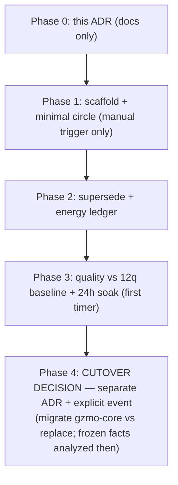

# ADR-0010 — Clean-Sheet One-Box Living Memory Prototype

**Historical status:** Proposed (2026-08-22, gated)
**Decision status:** Superseded
**Implementation status:** Not started
**Superseded by:** [ADR-0011](./ADR-0011-self-developing-living-database.md), [ADR-0012](./ADR-0012-hardware-adaptive-immutable-appliance.md), [ADR-0013](./ADR-0013-authoritative-full-stack-data-plane.md), [ADR-0014](./ADR-0014-constitutional-evolution.md) (phases move to implementation plan)
**Related:** [ADR-0003](./ADR-0003-one-instance-metabolism.md), [ADR-0004](./ADR-0004-airgap-living-usp.md), [ADR-0007](./ADR-0007-one-product-living.md), [ADR-0008](./ADR-0008-edge-ssm-memory.md), [ADR-0009](./ADR-0009-pgvector-vault.md), [SOTA_FIXES_BACKLOG.md](./SOTA_FIXES_BACKLOG.md)
**Decision date / owner:** Max, per phase (Phase 1 kickoff requires explicit GO)

---

## Context

### 2026-08-22 decisions (operator session)

1. **Facts frozen.** The entire current fact base was backed up on 2026-08-22 ~20:12 CEST to `ct101:/opt/gzmo/backup/facts-20260822T2010/` (SQLite `.backup`, WAL-safe): `vault.db` 37 MB (`semantic_vault` 1881, `quarantine_vault` 1143, `honeypot` 1785 / 487 `is_latest=1`, `evidence` 1758), `knowledge_core.db`, `gzmo.toml`, `DREAMS.md`, `data-dirs.tar.gz`. `PRAGMA integrity_check` = ok, SHA-256 checksums recorded, **live daemon untouched**. The 1881 facts are now a frozen archive — analyzable later, **not a migration constraint** on the new design.
2. **Old stack stays live.** CT101 production (daemon, Qdrant, Neo4j, Redis, LiteLLM) continues unchanged until a cutover event that this ADR does *not* perform.
3. **Prototype location fixed:** Workstation, directory `/home/gzmo/gzmo-prototype/`, Postgres on port `:5433`, **zero contact with CT101 production**.

### SOTA position (2026-08-22 analysis)

GZMO's design conceptually covers all five convergent patterns of current agentic-memory backends (Mem0, Zep/Graphiti, Letta, LangGraph, Generative Agents): two-level hot/cold memory, LLM-curation-before-memory, hybrid retrieval, supersede-not-delete, plus two differentiators no SOTA player has (RAPL energy-aware routing, airgap-first sovereignty).

The honest weakness is **architectural weight, not concept**: three state stores (SQLite + Qdrant + Neo4j) plus four sidecars and a sync cron for ~1.9k facts. SOTA backends solve the same problem with one store. At 478 active vectors, vector search is computationally trivial (flat scan < 1 ms); the multi-store split buys nothing at this scale except operational complexity and the documented drift failure mode (ADR-0009, 45 points measured live).

### Evidence gathered today (both gated spikes landed)

| Evidence | Result |
|---|---|
| ADR-0009 spike `spikes/pgvector/` (CT101) | **GO** — recall@10 8/12 (parity with 3-way RRF), in-SQL p50 5.2 ms, lossless import, clean teardown |
| ADR-0008 Option A `spikes/pre-cog-mamba/` (VM200) | Mechanism **reproduces** (88.1× TTFT, cold control airtight); quality **HOLD** (4/5 parity); TENNs-LLM license + custom_code still blocked |
| ADR-0008 Option B `spikes/memoryarena-baseline/` | Real embed path **8/12** — current system is stronger than naive baseline; MemoryLake adoption not yet justified |

---

## Decision (proposed, gated)

Build a **clean-sheet one-box prototype** of the living memory stack: one state store, one writer, one surface, local inference only. It is a *new, isolated box* — not a refactor of `gzmo-core`, not a cutover. If it fails its gates, it is discarded and the old stack is untouched; that is the point.

### Architecture (target of the prototype)

```
                 ┌────────────────────────────────────────────┐
 takeaway/drop/  │  ingest_queue (append-only, single writer) │
 session ───────►│                                            │
                 └──────────────┬─────────────────────────────┘
                                │ claim (flock mutex)
                 ┌──────────────▼─────────────────────────────┐
                 │ distill --once: extract → verify (LLM      │
                 │ quality gate) → promote (ACID transaction) │
                 └──────────────┬─────────────────────────────┘
                                │ single transaction
                 ┌──────────────▼─────────────────────────────┐
                 │ PostgreSQL 16 + pgvector  (SOLE STORE)     │
                 │ facts · evidence · entities/relations ·    │
                 │ energy_log                                 │
                 │ retrieval: vector + FTS + recency, RRF in  │
                 │ one SQL query                              │
                 └──────────────┬─────────────────────────────┘
                                │ MCP (sole query surface)
                 ┌──────────────▼─────────────────────────────┐
                 │ MCP server: search / recall / status       │
                 └────────────────────────────────────────────┘
```

1. **One store: PostgreSQL 16 + pgvector.** Sole source of truth. Drift is eliminated by construction (no mirror). Supersede is ACID-atomic with a Zep-style bi-temporal-lite: `valid_from` / `valid_to` + `superseded_by` + `is_latest` in one row-set update. Graph tier becomes **SQL projections** (`entities`, `relations`) traversed with CTEs — no Neo4j.
2. **Inference: llama.cpp only.** Reuse existing local llama.cpp endpoints (workstation `:8000` for heavy extract/verify, local embedding endpoint, dim 1024). **No Ollama, no LiteLLM, no Phoenix/OTel, no new inference infrastructure.**
3. **One writer.** A single distill process consumes `ingest_queue` under a `flock` mutex. Operator-facing scripts (takeaway equivalent) **append to the queue only** — file/CLI handoff, never direct fact writes. No dual-writer, ever (ADR-0003 doctrine, carried over).
4. **One surface: MCP.** `search` / `recall` / `status` — the `gzmo-living` equivalent for the prototype. No raw DB access from operators or tools.
5. **Energy as first-class data.** RAPL dual metering (pattern already proven in C4/ops-health) writes `energy_log` (joules per operation). Routing *on* energy stays gated (C4 backlog item) — the prototype only measures.

### Schema sketch (prototype)

```sql
CREATE EXTENSION vector;

CREATE TABLE facts (
  id              TEXT PRIMARY KEY,
  content         TEXT NOT NULL,
  content_norm    TEXT NOT NULL,
  embedding       vector(1024),
  fts             tsvector,
  decay_class     TEXT NOT NULL DEFAULT 'Episodic',
  half_life_days  REAL NOT NULL DEFAULT 30.0,
  confidence      REAL NOT NULL DEFAULT 1.0,
  confirmations   INT  NOT NULL DEFAULT 0,
  source_file     TEXT,
  ingested_at     timestamptz NOT NULL DEFAULT now(),
  valid_from      timestamptz NOT NULL DEFAULT now(),
  valid_to        timestamptz,               -- set on supersede
  superseded_by   TEXT REFERENCES facts(id),
  is_latest       BOOLEAN NOT NULL DEFAULT TRUE
);
CREATE INDEX facts_embed_idx ON facts USING hnsw (embedding vector_cosine_ops);
CREATE INDEX facts_fts_idx   ON facts USING gin (fts);

CREATE TABLE evidence (
  id            TEXT PRIMARY KEY,
  fact_id       TEXT REFERENCES facts(id),
  quote         TEXT NOT NULL,               -- quotable span
  source_file   TEXT,
  source_range  TEXT,
  ingested_at   timestamptz NOT NULL DEFAULT now()
);

-- graph as SQL projection (replaces Neo4j tier)
CREATE TABLE entities  (id TEXT PRIMARY KEY, name TEXT NOT NULL UNIQUE, kind TEXT);
CREATE TABLE relations (
  id TEXT PRIMARY KEY,
  from_id TEXT REFERENCES entities(id),
  to_id   TEXT REFERENCES entities(id),
  rel     TEXT NOT NULL,
  fact_id TEXT REFERENCES facts(id),
  valid_from timestamptz, valid_to timestamptz
);

-- single-writer queue (replaces Redis queue + file handoff chain)
CREATE TABLE ingest_queue (
  id         BIGSERIAL PRIMARY KEY,
  payload    TEXT NOT NULL,
  origin     TEXT NOT NULL,                  -- takeaway | drop | session
  status     TEXT NOT NULL DEFAULT 'pending',-- pending|claimed|done|quarantined
  claimed_at timestamptz,
  run_id     TEXT,
  created_at timestamptz NOT NULL DEFAULT now()
);

-- energy ledger (routing input later; measurement now)
CREATE TABLE energy_log (
  id         BIGSERIAL PRIMARY KEY,
  op         TEXT NOT NULL,
  started_at timestamptz,
  ended_at   timestamptz,
  energy_uj  BIGINT,
  notes      TEXT
);
```

### Hard gates (per phase)

| Phase | Gate | Criterion |
|---|---|---|
| **P1** scaffold | G1 | Box stands up (Postgres container `:5433` + schema + MCP skeleton reachable); `ops-health` GREEN before and after; **zero** CT101/production touch |
| **P1** | G2 | Minimal circle: `enqueue 'X'` → distill `--once` → X in `facts` → MCP `search` returns X |
| **P2** supersede | G1 | Contradiction test: enqueue conflicting fact → old row `is_latest=0`, `valid_to` set, chain intact, in one transaction |
| **P2** energy | G2 | `energy_log` populated with joules for extract/verify/search operations |
| **P3** quality | G1 | `memoryarena-12q` ≥ **8/12** (parity with current-system baseline) via the single hybrid query |
| **P3** soak | G2 | ≥24 h unattended (single timer, mutex) without drift, quarantine escape, or production impact |

### Phasing



- **Phase 1–2: manual trigger only** (`distill --once`). No cron, no timer, no unattended runs.
- **Phase 3:** first and only timer (single writer), 24 h soak.
- **Phase 4:** cutover is a separate, explicit decision — this ADR does not contain it.

### Out of Scope / Non-Goals

- No cutover, no daemon/service/systemd/cron changes on CT101 or workstation production.
- No changes to Qdrant, Neo4j, Redis, LiteLLM, or the live vault.
- **No migration of the 1881 frozen facts** — analysis and import path are Phase 4 topics.
- No MemoryLake adoption (ADR-0008 Option B stays HOLD).
- No TENNs-LLM / SSM backbone (ADR-0008 Option A stays HOLD: license block + quality HOLD).
- No new cloud dependencies, no pip installs beyond the prototype box, no new inference infrastructure.

## Relation to ADR-0009

ADR-0009 (pgvector consolidation) remains the **evidence base** for the single-store decision and stays valid. This ADR **refines its roadmap**: instead of migrating the existing Rust codebase in place (ADR-0009 Phase 2/3: dual-write → cutover), the clean sheet first proves the one-box target in isolation. ADR-0009's Phase 2/3 becomes moot or a re-run depending on the Phase 4 cutover decision (migrate existing `gzmo-core` vs. adopt the one-box as the product).

## Risks & Mitigations

1. **Second overnight writer.** *Mitigation:* old stack stays the only production writer; prototype runs manual-only until P3, then a single mutex-guarded timer on the workstation; CT101 and prototype never share a writer.
2. **Resource contention with production `:8000` (27B).** *Mitigation:* prototype reuses existing endpoints at low volume; no new GPU servers; P3 soak checks `ops-health` continuously.
3. **Scope creep (prototype accreting features).** *Mitigation:* the non-goals list is binding; new features wait for Phase 4.
4. **Prototype quietly becoming "the new stack".** *Mitigation:* cutover requires its own ADR + explicit event; until then the old stack is the only production truth.

## Consequences (if phase GOs are granted)

- A second, isolated codebase exists during the prototype lifetime (`/home/gzmo/gzmo-prototype/`) — acceptable, bounded, discarded on gate failure.
- The SOTA convergence (one store, curation-first, supersede-not-delete) becomes the product's *actual* architecture, with energy-awareness and airgap as the retained differentiators.
- A cutover ADR (Phase 4) will be required before any production change; the frozen 1881 facts get their analysis slot there.

---

*Proposed: GZMO operator surface (OpenClaw) · 2026-08-22 · Documentation only · No runtime code, services, or production config changed · Backup reference: `ct101:/opt/gzmo/backup/facts-20260822T2010/`*
