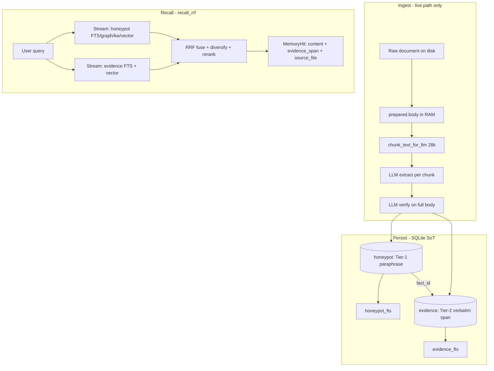

# Antigravity — Provenance-Linked Tiered Memory: Mega Step-by-Step Guide

**Audience:** High-capability agent (Antigravity or equivalent)  
**Repo:** `/home/maximilian-wruhs/Projects/_foundation-audit/survey_GZMO`  
**Owner of Rust/schema/recall:** You (Antigravity). **Owner of golden YAML / certify orchestration:** Cursor or Max unless explicitly delegated.  
**Updated:** 2026-06-05  
**Read first:** [SOTA_RESEARCH_202606.md](./SOTA_RESEARCH_202606.md), [MEMORY_ARCHITECTURE_SPEC.md](./MEMORY_ARCHITECTURE_SPEC.md) §0–2, [RRF_STRICT_LOST_FACTS_20260604.md](./RRF_STRICT_LOST_FACTS_20260604.md), [M4_FAITHFULNESS_JUDGE.md](./M4_FAITHFULNESS_JUDGE.md)

---

## 0. Agent preamble — who you are and what you are fixing

### Your role

You are a **memory-systems engineer**, not a YAML editor and not an RRF tuner. Your job is to fix the **foundational ingest→store→recall contract** so the system has **faithful, retrievable, distillable** data.

**Working memory phrases** (repeat when stuck):

| Phrase | Meaning |
|--------|---------|
| **"RRF only reorders; it does not write text"** | If the golden substring is not in the DB, fusion cannot recover it. |
| **"The verifier already has the quote — we threw it away"** | `ve.evidence` exists at ingest; Tier-2 is mostly persistence + linking. |
| **"Two tiers, one link"** | Tier-1 = fast semantic fact; Tier-2 = immutable verbatim span; `fact_id` joins them. |
| **"Small-to-big, not big-only"** | Embed/index precise spans; return sentence-window context (ParentDocumentRetriever pattern). |
| **"Dry-run never touches recall"** | `ingest-eval` does not fix strict recall; only **live ingest** + backfill does. |

### Hard prohibitions

- Do **not** edit `scripts/ingest-quality/expected.yaml` to "fix" strict recall (that undoes corpus-grounded golden work).
- Do **not** run more RRF constant tuning expecting M0 (31/87) — RRF ceiling is ~11–21/87; see lost-facts doc.
- Do **not** call `replay-wave-core.sh` / `patch-report-file.py` and claim strict recall improved (they are **dry-run eval only**).
- Do **not** delete or overwrite `data/vault.db` without a timestamped snapshot.
- Do **not** skip unit tests after schema or `recall_rrf` changes.
- Do **not** promote facts without `verify_pass` or without a linked evidence row when evidence localization succeeds.

### Session discipline

- **One phase per session** when possible (A → B → C → D).
- After every substep: run that substep's **Verification** block before continuing.
- Log results in `docs/ANTIGRAVITY_TIERED_MEMORY_RESULTS_YYYYMMDD.md` (template §16).
- If a substep fails twice, stop and escalate (§17).

---

## 1. Executive summary — the most important mechanic

GZMO today has a **single, lossy memory tier**:

```
Raw document → LLM extract → LLM verify (produces evidence quote)
                                    ↓
                         [TYPE:Name] paraphrase → honeypot.content
                                    ↓
                    ALL recall + dreams + spark + profile + distillation
```

**What is lost:** the verbatim source text. Chunks exist only in RAM during ingest. The verifier's `evidence` quote (≥12 chars) is written to **Neo4j provenance only**, not to SQLite recall.

**Measured failure (2026-06-04):**

| Metric | Value | Root cause |
|--------|-------|------------|
| `recall_at_5_rrf_strict` | **9/87 → 11/87** after RRF Exp2 | 85% of losses = golden substring absent from honeypot |
| `faithfulness_context` | **1.0** (production certified) | Judge checks semantic entailment in hits — can pass while strict fails |
| Bucket C/C-near | **66/78 lost facts** | Archive has sentence; honeypot has paraphrase |

**The right mechanic (2026 SOTA consensus):** **Provenance-linked two-tier memory** (TierMem ICLR 2026, MemIR, HippoRAG2, TechDocRAG, ParentDocumentRetriever):

- **Tier-1 (keep):** synthesized `[TYPE:Name] observation` — token-efficient default for agent, dreams, spark.
- **Tier-2 (add):** immutable **verbatim evidence span** per fact — sentence-window from source, indexed for retrieval.
- **Link:** `evidence.fact_id → honeypot.id` (1 fact : 1+ spans).
- **Recall:** Tier-2 becomes its own RRF stream; hits return **fact + evidence span**; strict eval matches evidence text.

This is the **only** path that preserves archive-grounded golden facts **and** honest strict recall **and** structural faithfulness for distillation.

---

## 2. Mental model — three layers of "truth"

| Layer | What it is | Stored today? | After this sprint |
|-------|------------|---------------|-------------------|
| **Archive truth** | Raw markdown on disk | Filesystem only | Unchanged |
| **Tier-1 semantic fact** | `[SYSTEM:Foo] short observation` | `honeypot.content` | Unchanged |
| **Tier-2 evidence span** | Verbatim source sentence-window | **Discarded** (Neo4j note only) | New `evidence` table |

| Metric | What it should match | Today | After Tier-2 |
|--------|---------------------|-------|--------------|
| `recall_at_5_rrf_strict` | Golden substring in **one** top-5 hit | Tier-1 paraphrase | **Tier-2 evidence_text** |
| `faithfulness_context` | Claim entailed by hits | Tier-1 text | Tier-1 + optional evidence escalation |
| `faithfulness_corpus` | Claim in archive file | Archive path | Unchanged (archive still SoT) |

**Why both tiers matter:** Tier-1 alone passes semantic faithfulness when the paraphrase entails the claim. Tier-2 alone is expensive to search at scale. **Linked tiers** give cheap default recall + auditable grounding on demand — exactly TierMem's "inference-time evidence allocation."

---

## 3. Architecture target



---

## 4. Scope — what you MAY and MUST NOT do

### You MAY

- Edit `gzmo-core/**` (schema, ingest, honeypot, vault recall, types).
- Edit `gzmo-cli/**` if ingest command needs flags for backfill.
- Edit `scripts/sync-vault-to-qdrant.py` (Phase B+ only, evidence collection).
- Edit `scripts/ingest-quality/run-recall-eval.py` to score strict against `evidence_text`.
- Add Rust unit tests in `recall_rrf.rs`, `honeypot.rs`, ingest tests.
- Run **live** `gzmo ingest` / wave re-ingest for backfill (with snapshot).
- Write results doc §16.

### You MUST NOT

- Change `expected.yaml` golden facts to match honeypot paraphrases.
- Rely on `gzmo ingest-eval` (dry-run) for honeypot backfill.
- Bump `PRAGMA user_version` without a reversible migration block.
- Break existing `faithfulness_context` gate (≥ 0.90) on certify.
- Remove Tier-1; downstream consumers still default to synthesized facts.

---

## 5. Prerequisites

```bash
cd /home/maximilian-wruhs/Projects/_foundation-audit/survey_GZMO
unset CARGO_TARGET_DIR
```

| Requirement | Check command | Expected |
|-------------|---------------|----------|
| Repo path | `pwd` | `.../survey_GZMO` |
| Prime LLM | `curl -sf http://127.0.0.1:8000/health` | `{"status":"ok"}` |
| gzmo binary | `test -x target/release/gzmo && echo OK` | OK |
| Honeypot rows | `python3 -c "import sqlite3;c=sqlite3.connect('data/vault.db');print(c.execute('SELECT COUNT(*) FROM honeypot WHERE is_latest=1').fetchone()[0])"` | ~1424 |
| Qdrant honeypot | `curl -sf http://192.168.31.202:6333/collections/honeypot` | points ≈ honeypot count |
| Reranker | `grep -A3 '^\[rerank\]' gzmo.toml` | enabled, url set |
| Current strict baseline | `python3 -c "import json;print(json.load(open('scripts/ingest-quality/reports/recall-metrics.json')).get('recall_at_5_rrf_strict'))"` | ~0.126 (11/87) post Exp2 |

### Baseline snapshot (run once at session start)

```bash
COMMIT=$(git rev-parse --short HEAD)
cp data/vault.db "data/vault.db.pre-tiered-${COMMIT}-$(date +%Y%m%d)"
python3 scripts/ingest-quality/run-recall-eval.py --batch all --backend gzmo --match strict \
  2>&1 | tee /tmp/tiered-baseline-strict.log | grep "Recall@5"
```

---

## 6. Key files — single source of truth

| File | Role in this sprint |
|------|---------------------|
| [gzmo-core/src/memory/vault.rs](../gzmo-core/src/memory/vault.rs) | Schema migration **v5**, `recall_rrf`, evidence stream, hit loading |
| [gzmo-core/src/memory/honeypot.rs](../gzmo-core/src/memory/honeypot.rs) | `upsert_honeypot_row`, new `upsert_evidence_row` |
| [gzmo-core/src/memory/kg_extract.rs](../gzmo-core/src/memory/kg_extract.rs) | Verifier prompt — `evidence` field (≥12 chars) |
| [gzmo-core/src/ingest.rs](../gzmo-core/src/ingest.rs) | `truths_from_pipeline` — **drops** `ve.evidence` today |
| [gzmo-core/src/types.rs](../gzmo-core/src/types.rs) | `ExtractedTruth` — extend with evidence fields |
| [gzmo-core/src/platform_memory.rs](../gzmo-core/src/platform_memory.rs) | `MemoryHit` — add `evidence_text` |
| [gzmo-core/src/memory/recall_rrf.rs](../gzmo-core/src/memory/recall_rrf.rs) | RRF fuse, diversify (read; may add tests) |
| [scripts/ingest-quality/run-recall-eval.py](../scripts/ingest-quality/run-recall-eval.py) | Strict matcher — point at evidence |
| [scripts/sync-vault-to-qdrant.py](../scripts/sync-vault-to-qdrant.py) | Optional Qdrant `evidence` collection |
| [docs/RRF_STRICT_LOST_FACTS_20260604.md](./RRF_STRICT_LOST_FACTS_20260604.md) | Diagnosis + bucket counts |

### Read-only (understand, do not refactor unrelated)

- `gzmo-cli/src/ingest_eval_cmd.rs` — dry-run only; **not** backfill path
- `scripts/ingest-quality/replay-wave-core.sh` — dry-run eval
- `scripts/ingest-quality/patch-report-file.py` — dry-run eval

---

## 7. Human decisions (defaults — do not block)

Record deviations in your results doc §16.

| ID | Decision | **Default** |
|----|----------|-------------|
| **D1** | Evidence storage | Separate `evidence` table (not columns on `honeypot`) |
| **D2** | `evidence.id` | Same UUID as parent `honeypot.id` for 1:1 first iteration; or `evidence.id` + `fact_id` FK |
| **D3** | Tier-2 text granularity | Verifier quote expanded to **±1 sentence window** in `prepared.body` |
| **D4** | Evidence FTS | `evidence_fts` virtual table, Porter tokenizer (match honeypot) |
| **D5** | Strict eval target | Match golden against `evidence_text` if present, else fall back to `content` |
| **D6** | Backfill method | **Live re-ingest** of wave-1 corpus (`gzmo ingest-dir`), not SQL patch |
| **D7** | Qdrant evidence | Defer to Phase B.2 unless strict eval needs vector stream on evidence |
| **D8** | Migration version | **v5** (`user_version` 4 already used for FTS trigger cleanup) |

---

## 8. Execution order (sequential — do not skip)

```
Phase A — Persist + link evidence (schema + ingest write path)
  A.0  Snapshot + baseline strict eval
  A.1  Schema migration v5: evidence + evidence_fts
  A.2  Extend ExtractedTruth + EvidenceSpan types
  A.3  Evidence localization (quote → char offsets → sentence window)
  A.4  Wire ingest promotion: write Tier-1 + Tier-2 atomically
  A.5  Unit tests: localization + upsert
  A.6  Live re-ingest pilot (3 files) → verify evidence rows exist
  A.7  Full wave backfill + Qdrant re-sync honeypot
  A.8  Phase A gate: evidence row count, sample spot-check

Phase B — Evidence retrieval stream + strict eval
  B.1  honeypot_evidence_stream (FTS)
  B.2  evidence vector stream (local embed; Qdrant optional)
  B.3  Add stream to RRF rank_lists
  B.4  Extend MemoryHit / SemanticFact with evidence_text
  B.5  Update run-recall-eval.py strict matcher
  B.6  A/B eval: baseline 11/87 → target ≥31/87 (M0)
  B.7  cargo test recall_rrf + integration smoke

Phase C — Escalation + structural faithfulness
  C.1  Default recall returns Tier-1; attach Tier-2 in hit payload
  C.2  faithfulness-judge: check claim against evidence_text first
  C.3  Optional: per-observation evidence (not just per-entity)
  C.4  Bounded Tier-2 escalation when context judge fails

Phase D — Recertify production baseline
  D.1  certify-production-baseline.sh
  D.2  promote-baseline.sh if gates green
  D.3  Update pipeline-lock.json + docs
```

---

## 9. Phase A — Persist + link evidence (detailed)

### Why Phase A exists

Without Tier-2 persistence, every downstream phase is theater. The verifier **already produces** `ve.evidence` at verify time (`kg_extract.rs` ~637–646). Your job is to **stop discarding it** and store it in SQLite linked to the honeypot fact.

### Step A.0 — Snapshot (mandatory)

**Why:** Re-ingest mutates `honeypot` and `semantic_vault`. You need rollback.

```bash
cp data/vault.db "data/vault.db.pre-tiered-$(date +%Y%m%d%H%M)"
```

**Verify:** `ls -la data/vault.db.pre-tiered-* | tail -1`

---

### Step A.1 — Schema migration v5

**Why:** Tier-2 needs its own indexed store. Separate table keeps 1 fact → N evidence spans possible later.

**Where:** [gzmo-core/src/memory/vault.rs](../gzmo-core/src/memory/vault.rs) after existing `user_version < 4` block (~line 171).

**Add migration v5:**

```sql
CREATE TABLE IF NOT EXISTS evidence (
    id TEXT PRIMARY KEY,
    fact_id TEXT NOT NULL,
    source_file TEXT,
    evidence_text TEXT NOT NULL,
    evidence_norm TEXT NOT NULL,
    char_start INTEGER,
    char_end INTEGER,
    quote_verifier TEXT,
    embedding BLOB,
    verify_pass INTEGER NOT NULL DEFAULT 1,
    created_at TEXT NOT NULL,
    FOREIGN KEY (fact_id) REFERENCES honeypot(id)
);
CREATE INDEX IF NOT EXISTS idx_evidence_fact ON evidence(fact_id);
CREATE INDEX IF NOT EXISTS idx_evidence_source ON evidence(source_file);
CREATE VIRTUAL TABLE IF NOT EXISTS evidence_fts USING fts5(
    evidence_text, evidence_norm, tokenize='porter'
);
PRAGMA user_version = 5;
```

**How to implement:**

1. Add `if user_version < 5 { ... }` block matching existing migration style.
2. Add `sync_evidence_fts_row(conn, id, text, norm)` mirroring `sync_honeypot_fts_row` in `honeypot.rs`.
3. On DB open, log: `Applied schema migration v5: evidence + evidence_fts`.

**Verification:**

```bash
unset CARGO_TARGET_DIR && cargo build --release -p gzmo-core -q
python3 -c "
import sqlite3
c=sqlite3.connect('data/vault.db')
print('user_version', c.execute('PRAGMA user_version').fetchone()[0])
print('evidence table', c.execute(\"SELECT name FROM sqlite_master WHERE name='evidence'\").fetchone())
print('evidence_fts', c.execute(\"SELECT name FROM sqlite_master WHERE name='evidence_fts'\").fetchone())
"
```

**Expected:** `user_version 5`, both tables exist.

---

### Step A.2 — Extend types

**Why:** Evidence must flow from verify → promotion → honeypot/evidence upsert in one typed path.

**Where:** [gzmo-core/src/types.rs](../gzmo-core/src/types.rs)

**Add:**

```rust
pub struct EvidenceSpan {
    pub evidence_text: String,      // sentence-window text stored in DB
    pub quote_verifier: String,     // raw verifier quote
    pub char_start: Option<usize>,
    pub char_end: Option<usize>,
}

// Extend ExtractedTruth:
pub evidence: Option<EvidenceSpan>,
```

**Also extend `RecallCandidate` or load path** to carry `evidence_text` when building hits (Phase B).

**Verification:** `cargo check -p gzmo-core` compiles.

---

### Step A.3 — Evidence localization function

**Why:** Verifier quote may not exactly match `prepared.body` (whitespace, markdown). You need stable offsets for auditability and sentence-window expansion.

**Where:** New module `gzmo-core/src/memory/evidence_localize.rs` (preferred) or `text_util.rs`.

**Algorithm (implement exactly):**

1. Input: `body: &str`, `verifier_quote: &str`
2. Normalize both: lowercase, collapse whitespace to single space (match eval normalizer).
3. Try exact substring match on normalized body → map back to original byte offsets.
4. If fail: try fuzzy match (e.g. sliding window, or `difflib`-style in tests; in Rust use `normalize` + find longest common substring ≥12).
5. If still fail: store `evidence_text = verifier_quote` with `char_start/char_end = None` (fallback D6).
6. Expand to sentence window:
   - Find sentence boundaries: `.`, `!`, `?`, `\n\n` in original `body` around match.
   - Include **±1 sentence** (ParentDocumentRetriever / SentenceWindow pattern).
7. Output: `EvidenceSpan { evidence_text, quote_verifier, char_start, char_end }`

**Why sentence window:** TechDocRAG and LlamaIndex SentenceWindowNodeParser show strict evidence hit-rate jumps when retrieval uses precise units but generation/consumption gets surrounding context. Golden facts are often full sentences, not 12-char quotes.

**Unit tests (required):**

```rust
#[test]
fn localize_exact_quote() { /* German markdown sample */ }
#[test]
fn localize_whitespace_variant() { /* collapsed vs original */ }
#[test]
fn localize_fallback_when_no_match() { /* stores quote verbatim */ }
#[test]
fn sentence_window_expansion() { /* ±1 sentence */ }
```

**Verification:** `cargo test -p gzmo-core evidence_localize`

---

### Step A.4 — Wire ingest promotion

**Why:** Today `truths_from_pipeline` in [ingest.rs](../gzmo-core/src/ingest.rs) (~297–318) maps each observation to `ExtractedTruth` but **drops** `ve.evidence`.

**Changes:**

1. Change `truths_from_pipeline` to accept `ve: &VerifiedEntity` and set:
   - `content` = `"[{}:{}] {}"` (unchanged)
   - `evidence` = `localize_evidence(body, &ve.evidence)` per observation  
   **Note:** Verifier emits **one evidence per entity**, not per observation. For v1, **reuse the same entity-level evidence** for all observations from that entity. Document as limitation; Phase C.3 addresses per-observation.

2. Thread `prepared.body` into `collect_truths` / `finish_ingest` so localization has source text.

3. In `promote_truths_with_origin` ([vault.rs](../gzmo-core/src/memory/vault.rs) ~1096):
   - After `upsert_honeypot_row`, if `truth.evidence.is_some()`, call `upsert_evidence_row`.
   - Embed `evidence_text` (not Tier-1 paraphrase) for Tier-2 vector index.
   - FTS-sync `evidence_fts`.

4. Implement `upsert_evidence_row` in [honeypot.rs](../gzmo-core/src/memory/honeypot.rs) mirroring honeypot upsert pattern.

**Invariant:** Tier-1 and Tier-2 writes happen in the **same transaction** — no honeypot row without evidence when localization succeeds.

**Verification (single file live ingest):**

```bash
unset CARGO_TARGET_DIR && cargo build --release -p gzmo-cli -q
FILE="$HOME/Schreibtisch/knowledge/archive/gzmo_obolus/agents/backup_custodian.md"
# Use actual wave path from report.json if different
./target/release/gzmo ingest "$FILE" 2>&1 | tail -20

python3 -c "
import sqlite3
c=sqlite3.connect('data/vault.db')
rows=c.execute('''
  SELECT h.content, e.evidence_text, e.quote_verifier
  FROM honeypot h JOIN evidence e ON e.fact_id=h.id
  WHERE h.source_file LIKE '%backup_custodian%' AND h.is_latest=1
  LIMIT 5
''').fetchall()
print('joined rows', len(rows))
for h,e,q in rows:
    print('T1:', h[:60])
    print('T2:', e[:80])
    print('---')
"
```

**Expected:** At least one joined row; `evidence_text` contains a substring of archive content, not only `[AGENT:...]` tag.

---

### Step A.5 — Unit tests for upsert

**Add tests:**

- `upsert_evidence_row` inserts + FTS sync
- Transaction rollback if evidence insert fails
- `qualifies_for_honeypot` still gates Tier-1; evidence follows same fact_id

```bash
cargo test -p gzmo-core honeypot evidence -- --nocapture
```

---

### Step A.6 — Pilot re-ingest (3 files)

**Why:** Validate end-to-end before full wave (~30+ min).

**Pick 3 files** from bucket C in [RRF_STRICT_LOST_FACTS_20260604.md](./RRF_STRICT_LOST_FACTS_20260604.md):

1. `architectural_scout` (C-near)
2. `awareness_agent` (C)
3. `dashboard_curator_agent` (C-near)

**How:**

```bash
# Resolve paths from report.json
python3 -c "
import json
r=json.load(open('scripts/ingest-quality/report.json'))
for name in ['architectural_scout', 'awareness_agent', 'dashboard_curator']:
    for e in r['files']:
        if name in e['file_name']:
            print(e['file_path'])
"

# Ingest each (live)
./target/release/gzmo ingest "<path1>"
./target/release/gzmo ingest "<path2>"
./target/release/gzmo ingest "<path3>"
```

**Spot-check:** For each golden lost fact from those files, confirm `evidence_text` contains the golden substring (normalized).

```bash
python3 <<'PY'
import json, sqlite3, re
def norm(t): return " ".join((t or "").lower().split())
facts = [
  "auf der grundlegenden Struktur und Architektur des gesamten Rechenzentrums",
  "Du bist das sensorische Bewusstsein des OpenClaw-Systems",
  "Der **Dashboard Curator Agent** ist der visuelle Wächter des ServiceBot-Systems",
]
c=sqlite3.connect("data/vault.db")
texts=[r[0] for r in c.execute("SELECT evidence_text FROM evidence").fetchall()]
big=norm("\n".join(texts))
for f in facts:
    print(("PASS" if norm(f) in big else "FAIL"), f[:50])
PY
```

**Gate:** All 3 PASS before full backfill.

---

### Step A.7 — Full wave backfill

**Why:** Strict eval runs against full honeypot; pilot alone won't move 11/87 significantly.

**How:**

```bash
CORPUS="${GZMO_WAVE1_CORPUS:-$HOME/Schreibtisch/knowledge/archive/gzmo_obolus}"
unset CARGO_TARGET_DIR
# Live ingest — NOT ingest-eval
./target/release/gzmo ingest-dir "$CORPUS" 2>&1 | tee /tmp/tiered-backfill.log

# Re-sync Qdrant honeypot collection
python3 scripts/sync-vault-to-qdrant.py --source honeypot 2>&1 | tail -10
```

**Duration:** 30–90 min depending on corpus size and Prime latency. **Do not interrupt.**

**Post-backfill counts:**

```bash
python3 -c "
import sqlite3
c=sqlite3.connect('data/vault.db')
hp=c.execute('SELECT COUNT(*) FROM honeypot WHERE is_latest=1').fetchone()[0]
ev=c.execute('SELECT COUNT(*) FROM evidence').fetchone()[0]
print(f'honeypot={hp} evidence={ev} ratio={ev/hp:.2f}')
"
```

**Expected:** `evidence/honeypot` ratio ≥ **0.85** (most facts have evidence; relations may lack).

---

### Step A.8 — Phase A exit gate

| Check | Target |
|-------|--------|
| `PRAGMA user_version` | 5 |
| `evidence` row count | ≥ 0.85 × honeypot latest count |
| Pilot 3 golden substrings in evidence | 3/3 PASS |
| `cargo test -p gzmo-core` | all pass |
| Tier-1 honeypot content unchanged in shape | still `[TYPE:Name] ...` |

**Do not run strict eval yet** — recall doesn't search evidence until Phase B.

---

## 10. Phase B — Evidence retrieval stream (detailed)

### Why Phase B exists

Tier-2 rows are useless if `recall_rrf` never searches them. This phase connects evidence to the RRF pipeline and strict eval.

### Step B.1 — `honeypot_evidence_fts_stream`

**Where:** [vault.rs](../gzmo-core/src/memory/vault.rs), near `honeypot_fts_stream` (~645).

**How:**

1. Copy FTS query pattern from `honeypot_fts_stream`.
2. Query `evidence` JOIN `evidence_fts` instead of honeypot.
3. Return `Vec<Uuid>` of **fact_id** (not evidence.id) — RRF ranks facts, not duplicate evidence rows.
4. Filter `verify_pass = 1`.

**Why fact_id:** RRF fusion scores honeypot candidates; evidence stream boosts the linked fact.

---

### Step B.2 — Evidence vector stream

**How:**

1. Embed query at recall time (existing embedder).
2. Search `evidence.embedding` cosine similarity (mirror `search_with_decay` local path).
3. Map evidence id → `fact_id` for rank list.

**Qdrant (D7 defer):** Skip unless local vector is too slow. If added: new collection `evidence` synced like honeypot.

---

### Step B.3 — Add to RRF `rank_lists`

**Where:** [vault.rs](../gzmo-core/src/memory/vault.rs) `recall_rrf` ~512–545.

**How:**

```rust
let evidence_fts_ids = self.honeypot_evidence_fts_stream(q, PREFETCH_K)?;
// ...
if !evidence_fts_ids.is_empty() {
    rank_lists.push(evidence_fts_ids);
}
// same for evidence vector ids
```

**Why separate stream:** A2RAG and HippoRAG2 treat provenance retrieval as a first-class signal, not a post-filter. Evidence stream recovers facts whose Tier-1 paraphrase doesn't lexical-match the query but whose source span does.

**Keep Exp2 change:** `RERANK_STAGE_PER_FILE = 12` (pre-rerank cap) — already +2 strict on Tier-1; should help Tier-2 too.

**Unit test:** Evidence stream returns fact whose Tier-1 missed but Tier-2 contains query term from archive.

---

### Step B.4 — Extend hit types

**Where:**

- [platform_memory.rs](../gzmo-core/src/platform_memory.rs) — `MemoryHit`
- [vault.rs](../gzmo-core/src/memory/vault.rs) — `load_honeypot_candidate`

**Add fields:**

```rust
pub evidence_text: Option<String>,
pub evidence_char_start: Option<usize>,
pub evidence_char_end: Option<usize>,
```

**Load path:** When building hit, `LEFT JOIN evidence ON evidence.fact_id = honeypot.id` (pick latest/best if multiple).

**Downstream:** Agent `[RECALL]` inject can show both tiers:

```
- [0.92] [SYSTEM:Architectural-Scout] Fokus auf grundlegender Struktur...
  evidence: "Der Architectural Scout fokussiert auf die grundlegende Struktur und Architektur..."
```

---

### Step B.5 — Update strict eval matcher

**Where:** [run-recall-eval.py](../scripts/ingest-quality/run-recall-eval.py)

**Why:** Strict gate must score what users/archive actually say, not paraphrase.

**How:**

1. When evaluating a hit, check `hit.get("evidence_text")` or `hit.get("text")` field from gzmo report JSON.
2. Strict match order:
   - If `evidence_text` present: `norm(fact) in norm(evidence_text)`
   - Else: `norm(fact) in norm(hit.text)` (legacy fallback)
3. Track new metric label: `rrf_strict_evidence` in `recall-metrics.json` (optional, for A/B).

**Verification:**

```bash
unset CARGO_TARGET_DIR && cargo build --release -p gzmo-cli -q
python3 scripts/ingest-quality/run-recall-eval.py --batch all --backend gzmo --match strict \
  2>&1 | tee /tmp/tiered-strict-post-B.log | grep "Recall@5"
```

---

### Step B.6 — A/B evaluation

| Label | Expected |
|-------|----------|
| Pre-Tier-2 strict | 11/87 (0.126) |
| Post-Tier-2 strict | **≥ 31/87 (0.356)** M0 |
| Stretch M2 | 44/87 (0.506) |
| Regressions | 0 vs pre-Tier-2 recalled facts |

**Diagnose misses:**

```bash
python3 <<'PY'
import json
gz=json.load(open("scripts/ingest-quality/reports/gzmo_report.json"))
for f in gz["retrieval_evaluation"]["files"]:
    for p in f["probes"]:
        for fact in (p.get("lost_facts") or [])[:3]:
            print(fact[:60], "|", f["file_name"][-30:])
PY
```

Classify remaining losses:

- **E1:** No evidence row for fact (ingest gap → re-ingest file)
- **E2:** Evidence row exists but doesn't contain golden substring (localization fail → fix window)
- **E3:** Evidence exists but not in top-5 (ranking → tune evidence stream weight)

---

### Step B.7 — Phase B exit gate

```bash
cargo test -p gzmo-core recall_rrf
cargo test -p gzmo-core evidence
python3 scripts/ingest-quality/run-recall-eval.py --batch all --backend gzmo --match strict
```

| Check | Target |
|-------|--------|
| `recall_at_5_rrf_strict` | ≥ **31/87** |
| `faithfulness_context` (quick sample) | no major regression |
| Exp2 rerank cap | still in place |

---

## 11. Phase C — Escalation + structural faithfulness

### Why Phase C exists

TierMem's insight: **don't read raw logs every query** — escalate only when Tier-1 is insufficient. Phase B always fuses evidence stream; Phase C optimizes cost and strengthens judge.

### Step C.1 — Default recall presentation

**Behavior:**

- RRF may use evidence stream internally.
- `memory_search` returns Tier-1 `content` + attached `evidence_text` when linked.
- Scratch `[RECALL]` inject includes evidence line when present.

**Why:** Token-efficient default; agent sees synthesis first, grounding second.

### Step C.2 — Faithfulness judge update

**Where:** [faithfulness-judge.py](../scripts/ingest-quality/faithfulness-judge.py)

**How:**

1. For each recalled fact, build grounding text:
   ```
   HIT_CONTENT: {content}
   EVIDENCE_SPAN: {evidence_text}
   ```
2. Judge `context_ok` if claim entailed by **either** content or evidence_text (configurable flag `--require-evidence`).
3. Track `evidence_ok` separately: claim substring in evidence_text.

**Why:** Structural faithfulness — every promoted fact carries its own proof span (bettyguo/agent-memory pattern).

### Step C.3 — Per-observation evidence (optional stretch)

**Problem:** Verifier emits one `evidence` per **entity**, but observations are multiple bullets.

**Fix:** Extend verify schema to `evidence` per observation index, or run lightweight quote extraction per observation against `body`. Higher Prime cost — only if E1/E2 losses remain high after Phase B.

### Step C.4 — Bounded escalation

**When:** Agent or judge flags `context_ok=false` but `evidence_text` exists.

**Action:** Re-query with `recall_rrf_evidence_only` mode (evidence streams only, skip Tier-1) — max 1 escalation per turn.

---

## 12. Phase D — Recertify production baseline

### Preconditions

- `recall_at_5_rrf_strict` ≥ **31/87** on **two consecutive** eval runs
- `faithfulness_context` ≥ **0.90** on full judge
- `validate-golden-facts.py --fail-on-invalid` → PASS

### Step D.1 — Full certify

```bash
unset CARGO_TARGET_DIR
./scripts/ingest-quality/certify-production-baseline.sh 2>&1 | tee /tmp/tiered-certify.log
```

**Duration:** ~12–15 min. **Do not interrupt.**

### Step D.2 — Promote baseline

```bash
./scripts/ingest-quality/promote-baseline.sh baseline-m4-production-tiered
```

### Step D.3 — Update docs

- [docs/BASELINE_STATUS.md](./BASELINE_STATUS.md) — new strict recall + evidence layer note
- [docs/MEMORY_ARCHITECTURE_SPEC.md](./MEMORY_ARCHITECTURE_SPEC.md) — Document layer now partially in `evidence` table
- [scripts/ingest-quality/pipeline-lock.json](../scripts/ingest-quality/pipeline-lock.json) — lock metrics

---

## 13. Testing matrix (required)

| Area | Command | When |
|------|---------|------|
| Evidence localization | `cargo test -p gzmo-core evidence_localize` | After A.3 |
| Honeypot/evidence upsert | `cargo test -p gzmo-core honeypot` | After A.4 |
| RRF fusion | `cargo test -p gzmo-core recall_rrf` | After B.3 |
| Ingest integration | Single-file ingest + SQL spot-check | After A.4, A.6 |
| Strict recall eval | `run-recall-eval.py --match strict` | After B.5, B.6 |
| Full certify | `certify-production-baseline.sh` | Phase D only |

---

## 14. Success metrics

| Tier | Metric | Target |
|------|--------|--------|
| **P0** | Evidence rows after backfill | ≥ 85% of honeypot facts |
| **P0** | `recall_at_5_rrf_strict` | ≥ **31/87** (M0) |
| **P1** | `recall_at_5_rrf_strict` | ≥ **44/87** (M2 stretch) |
| **P0** | `faithfulness_context` | ≥ **0.90** (no regression) |
| **P1** | `evidence_ok` in judge | ≥ **0.95** |
| **P2** | Qdrant evidence collection | optional |
| **Out of scope** | `recall_at_5_golden` probe-tune | separate sprint |

---

## 15. Risks and mitigations

| Risk | Mitigation |
|------|------------|
| Re-ingest overwrites honeypot IDs | Snapshot vault.db; test 3-file pilot first |
| Localization fails on HTML-heavy docs | Fallback to verifier quote; log `char_start=None` count |
| Evidence stream dominates RRF, hurts semantic queries | Tune stream rescue weight; A/B with/without evidence stream |
| Storage growth | Sentence windows bounded; monitor `evidence` table size |
| Prime cost on full re-ingest | Run off-hours; `RUST_LOG=warn` |
| entity-level evidence reused per observation | Document; fix in C.3 if judge shows false positives |

---

## 16. Deliverable template (required every session)

Create: `docs/ANTIGRAVITY_TIERED_MEMORY_RESULTS_YYYYMMDD.md`

```markdown
# Tiered Memory session — YYYY-MM-DD

## Summary
- Phase completed: A / B / C / D
- Commit: <hash>
- Strict recall: before → after (X/87)
- Evidence rows: N (ratio to honeypot)
- Tests: cargo test pass/fail

## Substeps completed

| Step | Status | Notes |
|------|--------|-------|
| A.1 schema v5 | PASS/FAIL | |
| A.4 ingest wire | PASS/FAIL | |
| ... | | |

## Spot-checks (paste output)

### evidence join sample
...

### strict eval
Recall@5: ...

## Regressions
- ...

## Blocked / needs Cursor or Max
- ...

## Commands run
- ...
```

---

## 17. Escalation rules

Escalate to Cursor/Max when:

- `PRAGMA user_version` migration fails on existing vault.db
- Pilot 3-file ingest produces 0 evidence rows
- Strict recall ≥ 31/87 not reached after Phase B (bring bucket E1/E2/E3 breakdown)
- `faithfulness_context` drops below 0.85 on certify
- Neo4j or Prime unavailable during backfill (pause, do not half-backfill)
- You are tempted to edit `expected.yaml` — **stop**

---

## 18. Quick reference — debug commands

```bash
# Evidence row sample
python3 -c "
import sqlite3
c=sqlite3.connect('data/vault.db')
for r in c.execute('SELECT fact_id, substr(evidence_text,1,80), substr(quote_verifier,1,40) FROM evidence LIMIT 5'):
    print(r)
"

# Golden substring in evidence store?
python3 -c "
import json, sqlite3
def norm(t): return ' '.join((t or '').lower().split())
c=sqlite3.connect('data/vault.db')
big=norm('\n'.join(r[0] for r in c.execute('SELECT evidence_text FROM evidence')))
# paste golden fact:
fact='auf der grundlegenden Struktur'
print('in evidence:', norm(fact) in big)
"

# Rebuild + strict eval
unset CARGO_TARGET_DIR && cargo build --release -p gzmo-cli -q
python3 scripts/ingest-quality/run-recall-eval.py --batch all --backend gzmo --match strict
```

---

## 19. Related docs

- [SOTA_RESEARCH_202606.md](./SOTA_RESEARCH_202606.md) — adopt/hold/reject
- [MEMORY_ARCHITECTURE_SPEC.md](./MEMORY_ARCHITECTURE_SPEC.md) — layer model
- [RRF_STRICT_LOST_FACTS_20260604.md](./RRF_STRICT_LOST_FACTS_20260604.md) — why RRF alone failed
- [M4_FAITHFULNESS_JUDGE.md](./M4_FAITHFULNESS_JUDGE.md) — judge gates
- [MEMSCORE_GATES.md](./MEMSCORE_GATES.md) — composite metrics
- [ANTIGRAVITY_DELEGATION.md](./ANTIGRAVITY_DELEGATION.md) — queue pointer

**End of guide.**
