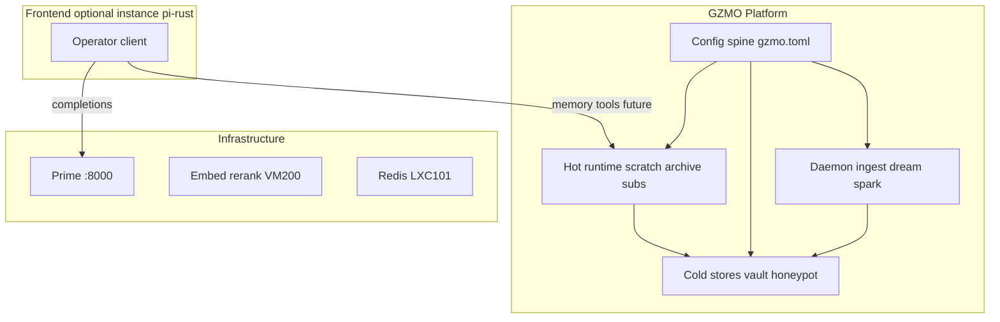

# GZMO Platform architecture

**Status:** Accepted (2026-06-04)  
**Supersedes for operator UX:** [INFRASTRUCTURE_OVERVIEW.md](./INFRASTRUCTURE_OVERVIEW.md) §10.1 multi-UI “Hindsight target” — for Max’s stack, one daily frontend only.

---

## 1. One sentence

**GZMO Platform** = `gzmo.toml` spine + hot/cold memory + daemon jobs. **One frontend** does daily work (today: **pi-rust**). `gzmo chat` / `gzmo tui` are **legacy harnesses**, not product surfaces.

---

## 2. Layers



---

## 3. Config spine (`gzmo.toml`)

Single authority for all clients and the daemon.

| Section | Role |
|---------|------|
| `[engine]` / `[engine.local]` / `[engine.cloud]` | Cognition routing — Prime URL, model, mode |
| `[routing]` | `TaskKind` → engine profile (dream, distill, chat, …) |
| `[memory]` | Vault paths, episodic directory |
| `[embeddings]` / `[rerank]` | Semantic recall |
| `[redis]` | Scratch + distill queue |
| `[context_memory]` | Archive @ 90%, hot budget |
| `[subagent]` | `delegate_task` governor (max 2, summary cap) |
| `[agent]` | Tool iteration limits |

Frontends **read** this file; they do not fork parallel engine/memory config.

---

## 4. Hot vs cold

| Mode | Mechanism | Lifetime |
|------|-----------|----------|
| **Hot** | `ScratchService`, `prune_with_archive`, `[RECALL]`, distill enqueue | Per turn / session |
| **Cold** | Vault → honeypot → Qdrant; daemon promote/dream/spark | Days+ |

Implementation: [`agent_session.rs`](../gzmo-core/src/agent_session.rs), [`agent_loop.rs`](../gzmo-core/src/agent_loop.rs), [`scratch.rs`](../gzmo-core/src/memory/scratch.rs).

---

## 5. `AgentSession` (platform API)

Any frontend binds hot memory through:

| Method | When |
|--------|------|
| `AgentSession::new_main` | Session start |
| `turn_start()` | New user message — clear scratch, cancel subs |
| `loop_config(...)` | Before `run_agent_loop` |
| `set_session_id` | `/new`, `/resume`, `/load` |

Legacy harness: [`chat.rs`](../gzmo-cli/src/chat.rs) calls `AgentSession`; chaos/skills/slash stay in the harness only.

**P1 (2026-06-04):** CLI + tool names for frontends:

```bash
gzmo memory turn-start              # new operator turn — clear scratch
gzmo memory search "<query>"        # gzmo_memory_search
gzmo memory recall                  # gzmo_memory_recall_pull → [RECALL] block
gzmo memory status [--json]
export GZMO_SESSION_ID=<id>         # stable session across commands
```

Rust: [`platform_memory.rs`](../gzmo-core/src/platform_memory.rs) — `GzmoMemorySearchTool`, `GzmoMemoryStatusTool`, `GzmoMemoryRecallPullTool` for in-process agents.

---

## 6. Legacy clients (no product investment)

| Binary | Role today |
|--------|------------|
| `gzmo chat` | Debug/smoke harness; first integrator for `AgentSession` |
| `gzmo tui` | Unused; `memory: None` — do not wire for parity |
| Orchestrator | Pipeline steps — P2 hot scope + `from_memory_config` ✅ |

---

## 7. Concrete frontend instance

**Current operator client:** pi-rust (workstation, Prime `:8000`, shared vault/honeypot).

**Pi onboarding (canonical):** [PI_OPERATOR_GUIDE.md](./PI_OPERATOR_GUIDE.md) — topology, can/can't, memory workflow.

Pi must not invent a parallel Redis protocol — use platform tools reading `gzmo.toml`.

---

## 8. Roadmap

| Phase | Deliverable |
|-------|-------------|
| **P0** ✅ | `AgentSession` + arch doc (this file) |
| **P1** ✅ | `gzmo memory *` CLI + `gzmo_memory_*` tool types |
| **P2** ✅ | Orchestrator hot scope `orch:{job}:{step}` + `from_memory_config` |
| **P3** ✅ | `scripts/pi-gzmo-memory.sh` + [PI_GZMO_MEMORY_INTEGRATION.md](./PI_GZMO_MEMORY_INTEGRATION.md) |
| **P4** | Optional: hide or rename `gzmo chat` → `gzmo debug-chat` |

---

## 9. References

| Doc | Role |
|-----|------|
| [MEMORY_ARCHITECTURE_SPEC.md](./MEMORY_ARCHITECTURE_SPEC.md) | Cold layers, tool names |
| [SCRATCH_MEMORY_VERIFY.md](./SCRATCH_MEMORY_VERIFY.md) | Static verify (Handover I) |
| [SCRATCH_TUI_GAP.md](./SCRATCH_TUI_GAP.md) | Why TUI is not wired |
| [INFRASTRUCTURE_OVERVIEW.md](./INFRASTRUCTURE_OVERVIEW.md) | Ops canonical |
| [PLATFORM_BASELINE_STATUS.md](./PLATFORM_BASELINE_STATUS.md) | Green gate + label |
| [MACHINE.md](../MACHINE.md) | Identity |

---

*End.*
