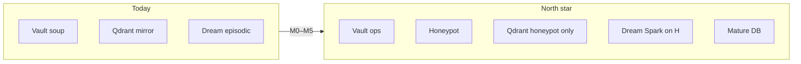

# GZMO Ceiling Roadmap

**Status:** living document (2026-06-03)  
**Scope:** architecture north star after ingest-quality overhaul  
**Companion plan:** Ingest Quality Overhaul (author-local plan; not in this repo) (execution gate for M0→M1)  
**Design spec (Supermemory + agentmemory → GZMO):** [MEMORY_ARCHITECTURE_SPEC.md](./MEMORY_ARCHITECTURE_SPEC.md)  
**Stable M1 eval scaffold:** [EVAL_SCAFFOLD.md](./EVAL_SCAFFOLD.md)

---

## Nordstern (Endzustand)

| Store | Role |
|-------|------|
| **SQLite vault** | Operational long-term memory: all facts, decay, purge, ops |
| **Honeypot** | Only last **promoted, coherent** contexts (curated, eval-gated) |
| **Qdrant** | Semantic **association field** indexed **only from honeypot** (dream, spark, RAG) |
| **Neo4j** | Explicit graph with provenance |
| **Mature DB** | Exported, dense “our knowledge” core (few entries, high trust) |
| **Episodic** | Raw day log (provenance), not primary dream substrate |

**Contract:** core queries pass measurable faithfulness + recall before `ingest enabled` and before waves 2/3.



---

## Milestone map

| ID | Name | Depends on | Primary exit |
|----|------|------------|--------------|
| **M0** | Foundation | — | Pipeline + harness exist; wave-1 live ingest gated by eval |
| **M1** | Quality contract | M0 | `replay-wave.sh` exit 0; wave-1 re-ingest |
| **M2** | Honeypot layer | M1 | Qdrant ≠ full vault mirror |
| **M3** | Cognition on honeypot | M2 | Dream/spark read association field, not soup |
| **M4** | Continuous eval | M2 | Regression gate before ingest on |
| **M5** | Mature DB | M2–M4 + time | Exportable dense knowledge core |

Logical progress (not calendar):

```
M0 ██████████  (done)
M1 ██████████  (done)
M2 ██████████  (done)
M3 █░░░░░░░░░
M4 ██░░░░░░░░  (can start parallel after M2)
M5 ░░░░░░░░░░
```

---

## M0 — Foundation (current)

**Goal:** Trust the skeleton; quality is the bottleneck.

### Done (2026-06-02 → updated 2026-06-05)

- **2026-06-02:** `[ingest] enabled = false`, `inbox_ingest` watcher disabled (eval-first posture)
- **2026-06-05 (live):** `[ingest]`, `[dreams]`, `[spark]`, `[session_distill]` **`enabled = true`** — daemon runs full cognition + knowledge watcher; waves 2/3 corpus still blocked by operator policy ([`DREAMS.md`](../DREAMS.md))
- `scripts/ingest-quality/`: `expected.yaml`, `gzmo ingest-eval`, `replay-wave.sh`, `retrieval-probes.py`
- Pipeline: `ingest_prep.rs`, verify-on-merged, `IngestVerify`, vault v2 (`source_file`, `content_norm`), relation truths, post-ingest Qdrant hook
- `scripts/purge-wave-ingest.sh` (not executed)
- Baseline: `scripts/ingest-quality/baseline-2026-06-02.json`

### Still open

- Full 57-file dry-run **after** relation/agent tuning → `report.json` + gate
- Wave-1 footprint still in vault / Neo4j / Qdrant until purge

### Key paths

| Path | Role |
|------|------|
| `gzmo-core/src/ingest.rs` | Ingest engine, truth collection |
| `gzmo-core/src/ingest_prep.rs` | Prep, doc class |
| `gzmo-core/src/memory/kg_extract.rs` | Merged extract + verify |
| `gzmo-core/src/memory/vault.rs` | Promote, quarantine, dedup |
| `scripts/sync-vault-to-qdrant.py` | **Today:** mirrors all embedded vault rows |
| `gzmo-core/src/dreams.rs` | **Today:** reads episodic `memory/YYYY-MM-DD.md` |

---

## M1 — Quality contract (Wave 1 golden gate)

**Goal:** Promotion layer is reliable enough to **feed** honeypot later.

### Automated gate (`scripts/ingest-quality/replay-wave.sh`)

| Metric | Target |
|--------|--------|
| Files with 0 entities | `0` |
| Rich NotebookLM docs with ≤ 2 entities | `0` |
| Relation promotion rate | ≥ **80%** |
| Zero-relation files (of 57) | ≤ **5** |
| Golden must-entity recall (15 files) | ≥ **90%** |
| Anti-pattern entities | **0** |
| Golden must-fact recall | INFO (tune `expected.yaml`) |

### Operational sequence

1. Prime + embed up (`localhost:8000`, VM200 `:8081` / Qdrant)
2. `scripts/ingest-quality/replay-wave.sh` (or `gzmo ingest-eval` → `report.json`)
3. Iterate verify policy, agent entity inject, JSON/HTML prep, golden aliases
4. `scripts/purge-wave-ingest.sh --dry-run` → `--confirm PURGE`
5. Enable ingest → `gzmo ingest-dir` on `~/Schreibtisch/knowledge/archive/gzmo_obolus`
6. `scripts/ingest-quality/retrieval-probes.py` → **3/3**

### M1 bridge to M2 (optional early)

Filter Qdrant sync to **curated** rows only (`confidence >= 0.85`, non-quarantine) before a dedicated honeypot table — reduces mirror soup without full M2 schema.

**Exit:** Ingest can be re-enabled for wave 1 only; waves 2/3 stay blocked per migration README.

---

## M2 — Honeypot as its own layer

**Goal:** Clear split **soup vs crystal**.

### Schema / write path

- SQLite: `honeypot` table or strict view (rules TBD), e.g.:
  - `origin` ∈ {ingest, session_distill, verified_dream}
  - `verify_pass = true`, `confidence >= 0.85`
  - optional `golden_approved` flag
- `finish_ingest` / `session_distill`: write vault **and** honeypot when rules match (not every vault row)
- Purge: wave-scoped on vault **and** honeypot **and** Qdrant payloads

### Qdrant

- Collection `honeypot` (or rename `knowledge` with filter policy)
- Replace `SELECT * FROM semantic_vault` in `sync-vault-to-qdrant.py` with honeypot-only upsert
- Deprecate full vault mirror as default

### Exit metrics

- Honeypot row count ≪ vault (order of magnitude: **10–30%** of promoted facts, not 100%)
- Agent/RAG policy: **facts** from vault optional; **association** from Qdrant honeypot

---

## M3 — Cognition uses honeypot

**Goal:** Dream and spark reason over **distillate field**, not episodic janitor soup.

| Today | Target |
|-------|--------|
| `DreamEngine` → episodic daily md | REM / association → **Qdrant honeypot** (+ compressed episodic only for prose context) |
| `SparkEngine` → stale/recent vault pools | Spark anchors → **honeypot vectors** |
| New hypotheses → vault + Neo4j | Verify against source → promote on pass → optional honeypot upsert |

### Target loop

1. Pick anchor distill/fact from honeypot  
2. Qdrant top-k similar distillates  
3. LLM: link / conclusion  
4. Verify against transcript or distill text  
5. Promote only on pass → long-term stores  

**Exit:** Dream/spark output without `[ingest]` / `sys_janitor` noise; Synapse shows `source=honeypot`.

---

## M4 — Continuous eval (not one-shot)

**Goal:** Every pipeline change is regression-safe.

| Piece | Content |
|-------|---------|
| Golden set | 15 → 50+ representative A/B/C docs |
| Probes | `retrieval-probes.py` + graph probes after re-ingest / nightly |
| Faithfulness | LLM judge with exemplars (beyond substring `must_fact`) |
| Gate | `replay-wave.sh` + probes before `[ingest] enabled = true` |

### Ceiling-near thresholds (local/private)

- Core queries: Recall@5 ≥ **85%**, faithfulness ≥ **0.9**
- Anti-entities: **0**
- Honeypot ↔ Qdrant point count drift ≤ **5%**

---

## M5 — Mature DB

**Goal:** Honeypot **seed** becomes a standalone **tree** — exportable core knowledge.

| Phase | Action |
|-------|--------|
| Collect | Months of honeypot + human/nightly review |
| Ripen | Global dedup, contradiction resolution, concept cards |
| Export | `knowledge_core.db` or dedicated collection/repo |
| Index | Qdrant `knowledge_core` only on mature export |
| Optional | QLoRA / adapter on mature labels only |

**Exit:** “This is **our** knowledge” — separate from ops vault and raw archives.

---

## What we keep (moat)

- Local Prime for extract/verify  
- SQLite vault as ops SoT  
- Neo4j for graph  
- Sovereign daemon, Synapse, episodic as raw trail  
- Wave gating before waves 2/3  

Ceiling builds **on** this stack; it does not replace it.

---

## How you know you are ceiling-near

- Obulus-style question → relevant facts from honeypot/Qdrant, not janitor lines  
- Nightly dream → **2–3 verified** cross-links, not episodic ops summary  
- After ~1 month → mature export possible; wave 2 feeds **core** only  
- Eval **green** before ingest is turned back on  

---

## One-line journey

**From “everything lands in vault soup with a vector mirror” to “curated honeypot that the AI associates over and that matures into our own knowledge bank” — with wave 1 as the first hard quality proof.**

---

## Related commands

```bash
# M1 gate (from repo root)
scripts/ingest-quality/replay-wave.sh

# Dry-run only (writes report.json)
RUST_LOG=warn ./target/release/gzmo ingest-eval ~/Schreibtisch/knowledge/archive/gzmo_obolus

# M1 purge (when gate green)
scripts/purge-wave-ingest.sh --dry-run
# scripts/purge-wave-ingest.sh --confirm PURGE
```
