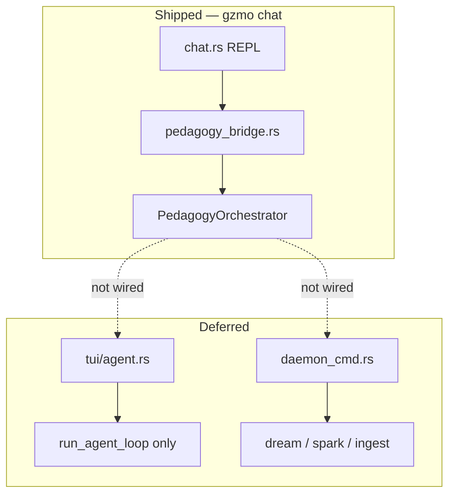

> **Recovered 2026-07-19** from `origin/feat/context-compress-headroom`. See [LOST_KNOWLEDGE_INVENTORY.md](./LOST_KNOWLEDGE_INVENTORY.md).

# Deferred Work Handoff — Pedagogy & Tooling Expansion

**Status:** Open backlog (2026-06-11)  
**Repo:** `~/Projects/_foundation-audit/survey_GZMO`  
**Shipped context:** [`OPEN_WORK_IMPLEMENTATION_PLAN.md`](./OPEN_WORK_IMPLEMENTATION_PLAN.md) (Phases A–C complete)  
**Prior session:** [`SESSION_HANDOFF_TRANSFORM_PERSONALITY_PEDAGOGY.md`](./SESSION_HANDOFF_TRANSFORM_PERSONALITY_PEDAGOGY.md)  
**Pedagogy detail:** [`PEDAGOGY_PERSONALITY_ALIGNMENT_HANDOFF.md`](./PEDAGOGY_PERSONALITY_ALIGNMENT_HANDOFF.md)

This document is the **complete handoff** for four deferred items. Each section includes current state, gap analysis, recommended approach, file touchpoints, acceptance criteria, and suggested next-session prompts.

---

## 0. What is already shipped (do not re-implement)

| Area | Status | Key files |
|------|--------|-----------|
| Agentic Teacher stack | Shipped | `gzmo-core/src/pedagogy/*` |
| Chat REPL mentor path | Shipped | `gzmo-cli/src/chat.rs`, `pedagogy_bridge.rs` |
| Cheaper internal routing | Shipped | `TaskKind::PedagogyInternal`, `orchestrator.rs` |
| Solution leakage retry | Shipped | `orchestrator.rs`, `edf.rs` |
| Teachback (v1) | Shipped | `session.rs`, `learner.rs`, `config.teachback_interval` |
| Definitive Dozen `/transform` | Shipped | `skills/characters.toml`, `skills/persona.rs`, `transform.rs` |
| `/ops`, `/learn` Rust skills | Shipped | `skills/ops.rs`, `skills/learn.rs`, `registry.rs` |

**Single integration surface today:** `gzmo chat` (stderr REPL). TUI and daemon do **not** call `maybe_teach()`.

---

## 1. TUI + daemon pedagogy parity

### Problem

Pedagogy is mentor-first in `gzmo chat`, but **every other interactive path** goes straight to `run_agent_loop()` — full tool agent, no Diagnoser→Planner→Affective→Tutor chain.

| Surface | Pedagogy orchestrator | `/ops` `/learn` skills | Learner tools | Learner suffix in system prompt |
|---------|----------------------|------------------------|---------------|--------------------------------|
| `gzmo chat` (`chat.rs`) | ✅ `maybe_teach` | ✅ + session sync | ✅ | ✅ |
| `gzmo tui` (`tui/runner.rs` → `agent.rs`) | ❌ | ✅ slash only | ❌ | ❌ |
| `gzmo daemon` (`daemon_cmd.rs`) | ❌ | N/A (no chat loop) | ❌ | N/A |

### Current behavior (verified)

**Chat REPL** (`gzmo-cli/src/chat.rs`):

1. Boots `PedagogyRuntime::boot()` and injects `learner_prompt_suffix()` into system prompt.
2. Registers `LearnerRecallTool` / `LearnerUpdateTool` when `[pedagogy] enabled`.
3. On each user turn (non-slash): calls `maybe_teach(&config, &router, tutor_gateway, input, messages)` **before** `run_agent_loop`.
4. After `/ops`, `/learn`, etc.: reloads `PedagogySession` + learner profile from disk.

**TUI** (`gzmo-cli/src/tui/components/agent.rs`):

1. `SubmitInput` → inject chaos → **spawn `run_agent_loop` directly** (L303–351). No pedagogy branch.
2. Slash commands via `dispatch_skill` / `chaos_skills` — `/ops` and `/learn` **do** mutate `data/learner/session.json`, but the TUI never reads that state back into a `PedagogyRuntime`.
3. System prompt built in `runner.rs` L186–204 — **no** learner block, no mentor footer from `chat.rs`.

**Daemon** (`gzmo-cli/src/daemon_cmd.rs`):

- Uses `GatewayRouter` for dream/spark/ingest background tasks only.
- No chat loop, no `PedagogyRuntime`, no pedagogy imports.

### Gap diagram



### Recommended implementation

#### Phase 1 — TUI parity (highest user impact)

**Goal:** TUI matches `chat.rs` mentor vs ops routing.

1. **Extract shared hook** (optional but reduces duplication):
   - Move turn-routing logic from `chat.rs` L543–576 into e.g. `pedagogy_bridge::try_mentor_response()` returning `Option<String>`.
   - Both `chat.rs` and TUI call the same function.

2. **`tui/runner.rs` boot** (mirror `chat.rs` L192–301):
   - `let router = GatewayRouter::new(&config);`
   - `let mut pedagogy_runtime = PedagogyRuntime::boot(&config).await?;`
   - Append `pedagogy_runtime.learner_prompt_suffix()` to `system_prompt`.
   - Register learner tools on `ToolRegistry` if pedagogy enabled.
   - Pass `Arc<Mutex<PedagogyRuntime>>` or channel into `AgentComponent`.

3. **`tui/components/agent.rs` `SubmitInput` branch** (before L303 spawn):
   - If `config.pedagogy.enabled` && input does not start with `/`:
     - Call `maybe_teach` with `GatewayRouter` + hot-swap gateway.
     - On `Ok(Some(response))`: push assistant message, episodic log, **return early** (no agent loop).
     - On `Ok(None)`: fall through to ops agent loop.
   - After slash handling: reload session/profile like `chat.rs` L452–461.

4. **UI feedback:** emit `Action::AgentResponse` with dim `pedagogy orchestrator | mentor mode` line (TUI equivalent of chat stderr).

**Files to modify:**

| File | Change |
|------|--------|
| `gzmo-cli/src/tui/runner.rs` | Boot `PedagogyRuntime`, router, learner tools, learner suffix |
| `gzmo-cli/src/tui/components/agent.rs` | `maybe_teach` before agent loop; session sync after slash |
| `gzmo-cli/src/pedagogy_bridge.rs` | Optional: extract shared helper |
| `gzmo-cli/src/chat.rs` | Optional: call shared helper |

#### Phase 2 — Daemon parity (lower priority)

The daemon has **no conversational stdin loop**. “Parity” here means one of:

| Option | Scope | When to pick |
|--------|-------|--------------|
| **A — Document only** | State daemon does not teach; use `gzmo chat` / TUI for mentor | Default; zero code |
| **B — IPC mentor endpoint** | Daemon exposes JSON-RPC/Unix socket: `teach(message)` → orchestrator response | Pi / external clients need headless mentor |
| **C — Daemon chat mode** | New subcommand `gzmo daemon chat` sharing `PedagogyRuntime` | Long-running service with attached REPL |

Unless product requires headless mentor API, **defer daemon to Option A** and document in README.

### Acceptance criteria (TUI)

```bash
cargo run -p gzmo-cli -- tui
# Default mentor (no /ops):
#   User: "what is a symlink?" → Socratic response, NO tool calls
#   Status shows pedagogy path (not full agent loop)
/ops
#   User: "list files in /tmp" → agent loop with tools
/learn systemd
#   Prep notes generated; Socratic sync on follow-up questions
```

- `data/pedagogy/edf_log.jsonl` gains records from TUI teaching turns.
- `data/learner/session.json` reflects `/ops` toggles from TUI.
- Teachback fires after `teachback_interval` teaching turns in TUI.

### Risks

- `AgentComponent` spawns async tasks; pedagogy must **block agent loop spawn** on mentor hits (race with streaming).
- TUI `GatewayRouter` not currently constructed in `runner.rs` — must add (chat already has it).
- `/learn` prep in TUI uses skill gateway only (`learn.rs` L58); chat REPL uses `PedagogyInternal` for prep via `pedagogy_bridge`. Align learn skill or accept divergence until fixed.

### Suggested prompts

- “Wire `PedagogyRuntime` and `maybe_teach` into TUI `AgentComponent` before `run_agent_loop`”
- “Extract shared pedagogy turn routing from `chat.rs` into `pedagogy_bridge`”

---

## 2. Multi-learner profiles

### Problem

All learner memory is keyed to a **single hardcoded ID**:

```rust
// gzmo-core/src/pedagogy/learner.rs
learner_id: "operator"  // LearnerProfile::default_operator()
```

`LearnerStore` always reads/writes:

| Path | Contents |
|------|----------|
| `data/learner/profile.json` | Single tripartite profile |
| `data/learner/session.json` | ops_mode, learn prep, teachback counters |
| `data/learner/episodes/*.md` | Episodic markdown log |

Tools (`learner_recall`, `learner_update`) and orchestrator assume **one human** = the machine operator.

### When this matters

- GZMO serves **multiple humans** (family, students, team) from one install.
- Remote/cloud agent with per-user auth.
- Separating **your** learning profile from a **guest** profile.

### Design decisions required (pick before coding)

| Question | Options |
|----------|---------|
| **Who is the learner?** | (A) CLI flag `--learner <id>` (B) env `GZMO_LEARNER_ID` (C) OS user (`$USER`) (D) auth token → ID |
| **Storage layout** | (A) `data/learner/<id>/profile.json` (B) single DB with `learner_id` column |
| **Default** | Keep `"operator"` for backward compat when unset |
| **Session scope** | Per-learner `session.json` or global ops mode? **Recommend per-learner.** |

### Recommended implementation

#### Schema (minimal migration)

```
data/learner/
  operator/                    # migrated from flat files
    profile.json
    session.json
    episodes/
  <learner_id>/
    profile.json
    session.json
    episodes/
```

#### Code changes

| File | Change |
|------|--------|
| `gzmo-core/src/config.rs` | `PedagogyConfig::active_learner_id: Option<String>` or resolve from env |
| `gzmo-core/src/pedagogy/learner.rs` | `LearnerStore::load(id)`, `profile_path(id)`, `session_path(id)` |
| `gzmo-cli/src/pedagogy_bridge.rs` | Pass resolved ID into store boot |
| `gzmo-core/src/tools/learner.rs` | Tool descriptions: “active learner” not “operator” |
| `gzmo-cli/src/main.rs` | Optional `--learner` flag on `chat` / `tui` |
| Migration script or boot logic | If `data/learner/profile.json` exists at legacy path → move to `operator/` |

#### Migration (one-time)

```bash
# Pseudocode — implement in LearnerStore::ensure_layout()
mkdir -p data/learner/operator
mv data/learner/profile.json data/learner/operator/ 2>/dev/null || true
mv data/learner/session.json data/learner/operator/ 2>/dev/null || true
mv data/learner/episodes data/learner/operator/ 2>/dev/null || true
```

### Acceptance criteria

```bash
GZMO_LEARNER_ID=alice cargo run -p gzmo-cli -- chat
# data/learner/alice/profile.json created; operator profile untouched

GZMO_LEARNER_ID=bob cargo run -p gzmo-cli -- chat
# separate mastery_vectors, separate teachback counters
```

### Out of scope (unless requested)

- Full auth / login UI
- Server-side multi-tenancy
- Learner profile encryption

### Suggested prompts

- “Add `GZMO_LEARNER_ID` and per-learner directories under `data/learner/<id>/`”
- “Migrate legacy flat `data/learner/profile.json` to `operator/` on boot”

---

## 3. GeoGebra / prerequisite graph editor / cognitive offloading

### Problem

Phase 6 **tooling expansion** from the Agentic Teacher research stack. Wiki and NotebookLM describe capabilities that **have no Rust implementation**:

| Concept | Wiki / research | Runtime |
|---------|-----------------|---------|
| **Prerequisite graph** | Curriculum Planner maps concepts | ✅ **Read-only** YAML loader — `data/pedagogy/graphs/linux-basics.yaml` |
| **Graph editor** | Expand domains, ingest from wiki | ❌ No UI, no CLI, no ingest pipeline |
| **GeoGebra** | Tutor tool for spatial visualizations | ❌ Entity only — `wiki/entities/geogebra.md` |
| **Cognitive offloading** | Python sandbox, diagrams via Tutor | ❌ Not wired to orchestrator |

### Research references

- `wiki/entities/geogebra.md` — TOOL for interactive 3D visualizations, externalized computation
- `wiki/sources/drive-research-ai-agentic-teacher.md` — Agentic Teacher → USES → GeoGebra
- `gzmo-core/src/pedagogy/graph.rs` — `PrerequisiteGraph::load`, `planner_context()`, `unmastered_prerequisites()`

### Recommended phasing

#### 3A — Prerequisite graph expansion (no UI, high value)

**Lowest effort, extends shipped planner.**

1. Add graphs: `data/pedagogy/graphs/networking.yaml`, `rust-basics.yaml`, etc.
2. Optional CLI: `gzmo pedagogy graph validate <file>` — schema check, cycle detection.
3. Optional wiki ingest: script to emit YAML from `wiki/entities/*` curriculum nodes.

**Files:** `data/pedagogy/graphs/*`, new `gzmo-cli/src/pedagogy_graph_cmd.rs` (optional).

#### 3B — Graph editor (medium effort)

Pick **one**:

| Approach | Pros | Cons |
|----------|------|------|
| **TUI forms** | Stays in Rust | Poor UX for graph DAG |
| **Web UI stub** | Rich editing | New frontend dep |
| **YAML + `$EDITOR`** | Zero UI code | Power-user only |
| **Wiki as source of truth** | Matches GZMO distillation story | Needs ingest discipline |

**Recommend:** YAML + validate CLI first; defer visual editor.

#### 3C — GeoGebra integration (high effort, external dep)

Research intent: Tutor agent invokes GeoGebra for **spatial reasoning** (geometry, plots).

| Step | Work |
|------|------|
| 1 | Decide interface: GeoGebra Classic CLI, **API**, or embedded web iframe |
| 2 | Add `tools/geogebra.rs` or MCP server wrapping GeoGebra commands |
| 3 | Gate tool to **ops mode** or Tutor-delegated subagent only (not mentor leak) |
| 4 | Stub: `geogebra_plot` tool returns markdown link to pre-built worksheet URL |

**Blockers:** GeoGebra licensing, headless server availability, sandbox security.

#### 3D — Cognitive offloading (Python sandbox)

Notebook: Tutor offloads heavy computation to sandbox rather than leaking answers in prose.

| Step | Work |
|------|------|
| 1 | Reuse existing `ShellExecTool` with **restricted** pedagogy profile OR dedicated `PythonSandboxTool` |
| 2 | Orchestrator policy: ops mode only, or Tutor requests sandbox via tool in `/ops` |
| 3 | Zero solution leakage: sandbox returns **intermediate** values, Tutor still Socratic |

**Files:** `gzmo-core/src/tools/`, `pedagogy/orchestrator.rs` policy, `SOUL.md` / tutor prompt updates.

### Acceptance criteria (minimal slice)

- [ ] At least **one** new prerequisite graph YAML loaded by planner
- [ ] `cargo run -p gzmo-cli -- pedagogy graph validate data/pedagogy/graphs/linux-basics.yaml` exits 0
- [ ] GeoGebra: document **stub decision** in wiki entity → `stable` or `deferred` with link to issue
- [ ] Cognitive offloading: explicit “not in mentor mode” rule in docs

### Suggested prompts

- “Add `networking.yaml` prerequisite graph and graph validate CLI”
- “Design GeoGebra stub tool for ops-mode spatial plots”
- “Wire restricted Python exec as cognitive offloading in ops mode only”

---

## 4. `skill_ops.sh` / `skill_learn.sh` dead references

### Problem

`skills/skills.toml` declares shell handlers that **do not exist**:

```toml
[commands.ops]
handler = "skill_ops.sh"    # file missing

[commands.learn]
handler = "skill_learn.sh"  # file missing
```

Rust dispatch **always wins** when registry has the skill:

```rust
// gzmo-core/src/skills/dispatch.rs
if registry.has(cmd) {
    return registry.get(cmd).unwrap().execute(ctx).await;
}
// shell_bridge only if NOT in registry
```

So missing shell scripts are **never executed** in normal `gzmo chat` / TUI paths. They are misleading for:

- Humans reading `skills.toml` as documentation
- Legacy shell-only dispatch paths (if registry build fails)
- External tooling that invokes `skills/skill_*.sh` directly

### Rust implementations (already shipped)

| Skill | Module | Behavior |
|-------|--------|----------|
| `/ops` | `gzmo-core/src/skills/ops.rs` | Toggles `PedagogySession.ops_mode` |
| `/learn` | `gzmo-core/src/skills/learn.rs` | Flipped-classroom prep via orchestrator |

### Resolution options

| Option | Action | Effort | Recommend |
|--------|--------|--------|-----------|
| **A — Remove dead handlers** | Set `handler = ""` or remove key; document “Rust only” in `skills.toml` comments | 5 min | ✅ if no shell consumers |
| **B — No-op shell stubs** | Add `skill_ops.sh` / `skill_learn.sh` that `echo` “handled by Rust registry” and exit 0 | 15 min | ✅ if external scripts grep for files |
| **C — Full shell parity** | Implement shell scripts mirroring Rust | High | ❌ duplicates logic |
| **D — Drop `skills.toml` handlers entirely** | Metadata-only TOML for `/help` generation future | Medium | Later |

### Recommended fix (Option B)

Create minimal stubs for discoverability:

**`skills/skill_ops.sh`**
```bash
#!/usr/bin/env bash
# Legacy stub — /ops is implemented in gzmo-core/src/skills/ops.rs
echo "⚙️ /ops is handled by the Rust skill registry. Use: gzmo chat, then /ops"
exit 0
```

**`skills/skill_learn.sh`**
```bash
#!/usr/bin/env bash
# Legacy stub — /learn is implemented in gzmo-core/src/skills/learn.rs
echo "📚 /learn is handled by the Rust skill registry. Use: gzmo chat, then /learn <topic>"
exit 0
```

```bash
chmod +x skills/skill_ops.sh skills/skill_learn.sh
```

Alternatively update `skills.toml`:

```toml
[commands.ops]
# handler omitted — Rust registry authoritative (ops.rs)
```

### Acceptance criteria

- `test -x skills/skill_ops.sh` OR `skills.toml` has no false handler paths
- `grep -r skill_ops.sh` returns only stubs or comments, no 404 execution paths
- README / BRIDGE.md states: `/ops` and `/learn` are **Rust-first**

### Suggested prompts

- “Add no-op `skill_ops.sh` and `skill_learn.sh` stubs”
- “Remove dead handler keys from `skills.toml` and document Rust registry”

---

## 5. Priority matrix (recommended order)

| Priority | Item | Effort | User impact |
|----------|------|--------|-------------|
| **P0** | Shell script stubs (§4) | S | Docs hygiene |
| **P1** | TUI pedagogy parity (§1) | L | Parity with `gzmo chat` |
| **P2** | Multi-learner profiles (§2) | M | Multi-user installs |
| **P3** | Graph YAML expansion + validate CLI (§3A) | S–M | Richer planner |
| **P4** | GeoGebra / sandbox (§3C–3D) | XL | Research-complete Agentic Teacher |
| **—** | Daemon mentor API (§1 Phase 2) | L–XL | Only if headless required |

---

## 6. Document index

| Doc | Role |
|-----|------|
| [`DEFERRED_WORK_HANDOFF.md`](./DEFERRED_WORK_HANDOFF.md) | **This file** — deferred backlog |
| [`OPEN_WORK_IMPLEMENTATION_PLAN.md`](./OPEN_WORK_IMPLEMENTATION_PLAN.md) | Shipped Phases A–C |
| [`PANTHEON_FINAL_PACK.md`](./PANTHEON_FINAL_PACK.md) | Locked 12-persona `/transform` set |
| [`PEDAGOGY_PERSONALITY_ALIGNMENT_HANDOFF.md`](./PEDAGOGY_PERSONALITY_ALIGNMENT_HANDOFF.md) | Phases 1–5 implementation detail |
| [`SESSION_HANDOFF_TRANSFORM_PERSONALITY_PEDAGOGY.md`](./SESSION_HANDOFF_TRANSFORM_PERSONALITY_PEDAGOGY.md) | Full session arc + notebooks |
| [`~/gzmo_skills/BRIDGE.md`](../../../gzmo_skills/BRIDGE.md) | Slash-command routing bridge |

---

## 7. Verify baseline (before starting deferred work)

```bash
cd ~/Projects/_foundation-audit/survey_GZMO
cargo build -p gzmo-core -p gzmo-cli
cargo test -p gzmo-core pedagogy persona

# Shipped path — chat REPL
cargo run -p gzmo-cli -- chat
# ★ you › what is a symlink?     → mentor orchestrator
# /ops                           → ops mode
# /learn systemd units           → flipped classroom

# Deferred — TUI should NOT mentor yet (until §1 fixed)
cargo run -p gzmo-cli -- tui
# Same question → currently uses agent loop with tools
```

---

## 8. One-line summary for next agent

**Wire `PedagogyRuntime::maybe_teach` into TUI before `run_agent_loop`; add per-learner `data/learner/<id>/` stores; expand prerequisite YAML + validate CLI; stub or remove `skill_ops.sh` / `skill_learn.sh`; treat GeoGebra/sandbox as Phase 6 research tools, not mentor-mode defaults.**
