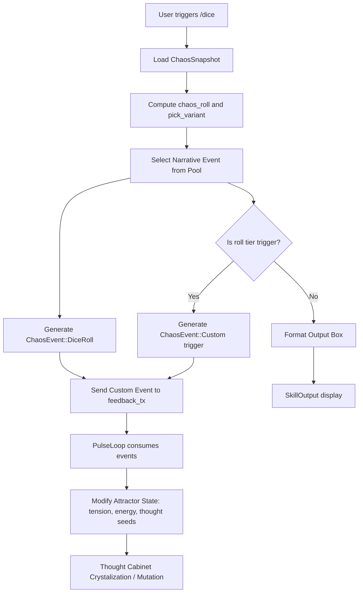

# Dice Events and Tier Mechanical Effects — Implementation Handoff

This document details the architecture, mathematical model, event pools, and mechanical effects of the chaos-driven **`/dice`** skill (registered at **CCL-3: Coupled**).

---

## 1. The Autopoietic Loop

Unlike purely cosmetic randomizers, the `/dice` skill participates in a closed-loop system of feedback. Every roll consumes the current state of the Lorenz attractor and outputs events that mutate that same attractor state downstream.



---

## 2. Mathematical Model

The dice rolls and pool variants are deterministically derived from the coordinates of the Lorenz attractor (`x`, `y`, `z`), the `chaos_val`, and the active `tick`. This ensures that consecutive rolls reflect the attractor's exact state in phase space.

### 2.1 Chaos Roll Calculation
The function `chaos_roll` combines variables to create a high-frequency fractional component:

$$\text{combined} = \text{fract}(\text{chaos\_val} \times 10000.0 + |x| \times 100.0 + |y| \times 10.0 + |z|)$$
$$\text{roll} = \lfloor \text{combined} \times \text{max\_sides} \rfloor + 1$$

### 2.2 Variant Selection
To ensure narrative diversity (e.g., rolling a `20` does not always output the same description), one of **5 narrative variants (0–4)** is chosen based on:

$$\text{variant} = (\lfloor |x| \times 1000.0 \rfloor \oplus \lfloor |y| \times 1000.0 \rfloor \oplus \text{tick}) \pmod 5$$

---

## 3. Mechanical Tier Triggers

Specific rolls trigger downstream feedback events that alter the system's `tension` ($\tau$), `energy` ($\epsilon$), or crystallize specific `ThoughtSeed` objects in the Thought Cabinet:

### 3.1 D20 Mechanical Effects
| Roll | Tier | Tension Delta ($\Delta \tau$) | Energy Delta ($\Delta \epsilon$) | Thought Seed Category | Thought Seed Text / Crystallization Effect |
| :--- | :--- | :--- | :--- | :--- | :--- |
| **1** | Catastrophic Fail | $+10.0$ | $-5.0$ | `dice_catastrophe` | *"The Lorenz attractor collapsed into a fixed point."* |
| **2** | Dire | $+5.0$ | $-3.0$ | - | - |
| **3** | Harsh | $+3.0$ | $-2.0$ | - | - |
| **4** | Bad | $+2.0$ | $-1.0$ | - | - |
| **5** | Misty | $+1.0$ | $-2.0$ | - | - |
| **6** | Minor Setback | $+1.0$ | $-3.0$ | - | - |
| **7** | Turbulent | $+2.0$ | $0.0$ | - | - |
| **8** | Gentle | $-2.0$ | $+5.0$ | - | - |
| **9** | Oracle | $-1.0$ | $0.0$ | `dice_oracle` | *"The chaos oracle whispered from the noise floor."* |
| **10** | Equilibrium | $-1.0$ | $0.0$ | - | - |
| **11** | Clearing | $-3.0$ | $+10.0$ | - | - |
| **12** | Static | $+4.0$ | $-1.0$ | - | - |
| **13** | Magnetic | $+2.0$ | $-1.0$ | - | - |
| **14** | Spark | $+3.0$ | $+2.0$ | `dice_spark` | *"A spark ignited in the chaos field. Creativity amplifies."* |
| **15** | Cascade | $+5.0$ | $+3.0$ | `dice_resonance` | *"Lorenz and Logistic coupled violently. A forbidden harmony."* |
| **16** | Lock-on | $-4.0$ | $+1.0$ | - | - |
| **17** | Crystallize | $0.0$ | $0.0$ | `dice_crystallize` | *"A new thought seed crystallizes spontaneously. Gravity mod shifts -0.1."* |
| **18** | Bifurcation | $-2.0$ | $+2.0$ | `dice_bifurcation` | *"The bifurcation diagram reveals a hidden period-3 window."* |
| **19** | Hyperdrive | $+8.0$ | $+5.0$ | - | - |
| **20** | Legendary Success | $-5.0$ | $+15.0$ | `dice_legendary` | *"CRITICAL SUCCESS — A perfect crystallization! Thought Cabinet gains ρ +1.0."* |

### 3.2 D6 Mechanical Effects (Halved D20 Mirror)
| Roll | Tier | Tension Delta ($\Delta \tau$) | Energy Delta ($\Delta \epsilon$) | Thought Seed Category | Thought Seed Text / Crystallization Effect |
| :--- | :--- | :--- | :--- | :--- | :--- |
| **1** | Catastrophic / Snake Eyes | $+5.0$ | $-3.0$ | `dice_catastrophe` | *"Snake eyes — the entropy well deepens."* |
| **2** | Low | $+3.0$ | $-1.0$ | - | - |
| **3** | Low-Mid | $-1.0$ | $0.0$ | - | - |
| **4** | Mid-High | $-1.0$ | $+2.0$ | - | - |
| **5** | High | $-2.0$ | $+3.0$ | - | - |
| **6** | Perfect D6 / Critical | $-3.0$ | $+8.0$ | `dice_legendary` | *"Perfect D6 — the attractor sings in resonance."* |


---

## 4. Narrative Event Pools

The event pools map mathematical occurrences to metaphors of dynamic systems, chaos theory, and thermodynamics.

*   **D20 Event Pools:** 20 rolls $\times$ 5 variants = 100 narrative outcomes.
*   **D6 Event Pools:** 6 rolls $\times$ 3 variants = 18 narrative outcomes.

### Examples of Variants

> [!TIP]
> **Roll 1 (Catastrophic) Variant 0:**
> `💀 The Lorenz attractor collapses into a fixed point. All chaos ceases for 3 ticks.`
>
> **Roll 20 (Legendary Success) Variant 0:**
> `💎 CRITICAL SUCCESS — A perfect crystallization! Thought Cabinet gains ρ +1.0.`

---

## 5. Verification

To verify that the `/dice` mechanical loop is functional:

1. Execute the CLI command to trigger a D20 roll:
   ```bash
   ./target/release/gzmo chaos skill dice d20
   ```
2. Verify that:
   - Output contains a rendered D20 ASCII triangle frame.
   - Output lists the current `tick`, `chaos`, `energy`, and `tension` values from the snapshot.
   - The roll matches the corresponding narrative description.
   - Feedback events are appended to the feedback channel (verify via unit tests).

Run the automated tests:
```bash
unset CARGO_TARGET_DIR
cargo test -p gzmo-core skill_ccl::tests::dice_is_ccl3
```
