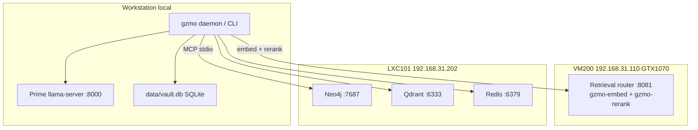

# GZMO System Architecture — Ingest Reference

**Document role:** Self-contained architecture, configuration, and entanglement map for live memory ingest.  
**Repo:** `/home/maximilian-wruhs/Projects/_foundation-audit/survey_GZMO`  
**Config authority:** `gzmo.toml`  
**Port layout (locked):** [`docs/PORTS.md`](PORTS.md) — steady state 2026-06-09  
**Version:** 1.1 — locked port topology, post takeout migration

---

## 1. System identity

GZMO is a **local-first sovereign agent** whose memory is a **distillation pipeline**, not a chatbot with an attached vector store.

**Pipeline (one line):**

```text
Any input → ingest_prep (doc_class) → Prime extract (:8000) → verify-on-merged → promote → semantic_vault → qualifies_for_honeypot → honeypot (Tier-1) + evidence (Tier-2) → Qdrant honeypot sync → recall_rrf
```

**Core identity (two sentences):**

1. **Honeypot + verify + promote = GZMO.**
2. **GZMO = Destillations-Pipeline** — the LLM thinks (extract, verify, dream); the pipeline remembers (vault, honeypot, evidence, graph).

**What GZMO is:**

- A gated promotion system: facts must pass Prime verification with quotable evidence (≥12 characters) and confidence ≥0.85 to enter honeypot.
- A hybrid recall engine: RRF fuses honeypot FTS, evidence FTS, graph/keyword, vector (Qdrant + local), and evidence-vector streams, then reranks on VM200.
- A daemon-orchestrated cognition stack: DreamEngine (01:00 UTC), Qdrant sync (01:45), SessionDistill (02:15), SparkEngine (03:30 / 22:30 UTC), sys_janitor (every 30 min).

**What GZMO is not:**

- Not a dry-run eval system — `gzmo ingest-eval` never writes vault, honeypot, evidence, or Neo4j.
- Not a single-vector RAG mirror — Qdrant collection `honeypot` mirrors curated Tier-1 only; legacy `knowledge` collection is deprecated.
- Not Mem0/Zep reimplemented — GZMO moat is verify-on-merged + domain golden eval gates.

---

## 2. Physical topology

GZMO runs on a **Ryzen workstation** (2× RTX 5070 Ti) with retrieval and persistence on the homelab LAN (`192.168.31.0/24`).



| Node | Address | Compute | Production role |
|------|---------|---------|-----------------|
| Workstation | local | 2× RTX 5070 Ti, Ryzen 9950X | Prime **Gemma 4 26B-A4B** on `:8000` (256K ctx); `gzmo` daemon/CLI; SQLite vault SoT |
| PVE | `192.168.31.200` | i7-6770HQ | Hypervisor for VM200 + LXC containers |
| VM200 `ollamagpu` | `192.168.31.110` | GTX 1070 8 GB eGPU | Unified retrieval router `:8081` — embed + rerank (librarian retired) |
| LXC101 | `192.168.31.202` | Docker | Neo4j knowledge graph; Qdrant vectors; Redis scratch/distill queue |
| LXC100 | `192.168.31.201` | — | Samba — not on hot path |
| LXC102 | `192.168.31.203` | — | Optional MCP hub (Pi era) |

**PCIe note:** No NVLink. Prime uses layer-split across both workstation GPUs (`-sm layer -dev CUDA0,CUDA1`).

**SSH ops:** `ssh -i ~/.ssh/id_sidecar_proxmox maximilian@192.168.31.110`

---

## 3. Service ports and endpoints

> **Locked steady-state map:** [`docs/PORTS.md`](PORTS.md). Do not reassign ports without updating that file and `gzmo.toml` URLs together.

### 3.1 Workstation (cognition)

| Port / process | Service | Start command |
|----------------|---------|---------------|
| **:8000** | Prime `llama-server` — **Gemma 4 26B-A4B-it** QAT (ctx 262144) | `~/Projects/llama.cpp/prime-bench/start-prime-gemma4-26b-a4b-256k.sh` or `gzmo-prime.service` |
| **:8002** | Local Pi KB embed (**opt-in**, `ENABLE_PI_EMBED=1`) | `scripts/start-embed.sh` or `gzmo-embed.service` |
| **`gzmo`** | Daemon or REPL | `scripts/start-production.sh --daemon` |
| **:8010** | Sovereign FrankenMoE | **Parked** — broken MoE output |

Prime typical: ctx **262144**, ngram-mod speculative decoding, CUDA graphs on (Gemma QAT profile), dual 5070 Ti layer-split.

### 3.2 VM200 (retrieval layer)

Single `llama-server --models-preset` router; both presets share `:8081`.

| Port | Preset / Model | `gzmo.toml` section |
|------|----------------|---------------------|
| **:8081** | `gzmo-embed` — Qwen3-Embedding-0.6B Q8 (1024-dim) | `[embeddings]` |
| **:8081** | `gzmo-rerank` — Qwen3-Reranker-0.6B | `[rerank]` |
| ~~:8082~~ | bge-reranker-v2-m3 Q8 | **Retired** |
| ~~:8083~~ | Qwen2.5-Coder-1.5B librarian | **Retired** (distill on Prime `:8000`) |

Deploy: `scripts/vm200/deploy-retrieval-router.sh` → `llama-retrieval-router.service`

### 3.3 LXC101 (persistence)

| Port | Service | GZMO usage |
|------|---------|------------|
| **:7687** | Neo4j | KG via MCP `mcp-neo4j-memory` stdio → `mcp__memory__create_entities` / `create_relations` |
| **:6333** | Qdrant | Collection **`honeypot`** (production RAG); **`knowledge`** legacy read-only |
| **:6379** | Redis | Scratch cache + `gzmo:distill:pending` queue — wired via `[redis]` |

---

## 4. Config spine (`gzmo.toml`)

Single runtime authority. All clients and daemon read this file.

### 4.1 Memory and paths

| Section | Key | Production value |
|---------|-----|------------------|
| `[memory]` | `directory` | `memory` |
| `[memory]` | `vault_db` | `data/vault.db` |
| `[memory]` | `vault_backend` | `sqlite` |
| `[identity]` | `soul_path` | `SOUL.md` |
| `[skills]` | `dreams_path` | `DREAMS.md` |

### 4.2 Engine profiles

| Section | Key | Value |
|---------|-----|-------|
| `[engine]` | `active_mode` | `local` |
| `[engine.local]` | `url` | `http://localhost:8000/v1` |
| `[engine.local]` | `model` | `gemma-4-26b-a4b-it` |
| `[engine.local]` | `temperature` | `0.3` |
| `[engine.local]` | `max_tokens` | `24576` |
| `[routing.profiles.local_deterministic]` | `temperature` | `0.1` (ingest extract) |

### 4.3 Retrieval services

| Section | Key | Value |
|---------|-----|-------|
| `[embeddings]` | `enabled` | **`true`** (VM200 `:8081`) |
| `[embeddings]` | `url` | `http://192.168.31.110:8081/v1` |
| `[embeddings]` | `model` | `gzmo-embed` (Qwen3-Embedding-0.6B-Q8_0.gguf) |
| `[rerank]` | `enabled` | **`true`** (VM200 `:8081` router) |
| `[rerank]` | `url` | `http://192.168.31.110:8081/v1` |
| `[rerank]` | `model` | `gzmo-rerank` (Qwen3-Reranker-0.6B) |
| `[rerank]` | `prefetch_multiplier` | `4` |
| `[librarian]` | `enabled` | **`false`** (retired; distill on Prime) |
| `[qdrant]` | `url` | `http://192.168.31.202:6333` |
| `[qdrant]` | `collection` | **`honeypot`** |
| `[qdrant]` | `sync_cron_hour/minute` | **1 / 45** UTC |

### 4.4 Cognition engines (enable flags)

| Section | `enabled` | Notable gates |
|---------|-----------|---------------|
| `[dreams]` | `true` | `min_confidence=0.85`, `require_evidence=true`, `strict_kg=true`, `cron_hour=1`, `cron_minute=0`, `min_consolidation_chars=400`, `honeypot_rem_enabled=true` |
| `[session_distill]` | `true` | `daemon_scheduled=true`, `cron_hour=2`, `cron_minute=15`, `use_librarian=false` (distill on Prime) |
| `[spark]` | `true` | `schedule_mode=cron`, `cron_hours=[3,22]`, `cron_minute=30`, `quarantine_confidence=0.6`, `anchor_decay_classes=["CuratedVault","SessionDistill"]` |
| `[ingest]` | `true` | `min_confidence=0.85`, `require_evidence=true`, `strict_kg=true`, `max_source_chars=120000`, `chunk_chars=28000` |

### 4.5 Hot memory (scratch / archive)

| Section | Key | Value |
|---------|-----|-------|
| `[redis]` | `url` | `redis://192.168.31.202:6379` |
| `[redis]` | `distill_queue` | `gzmo:distill:pending` |
| `[context_memory]` | `archive_threshold` | `0.90` |
| `[context_memory]` | `scratch_max_tokens` | `2000` |
| `[context_memory]` | `context_length` | `262144` |
| `[subagent]` | `max_concurrent` | `2` |

### 4.6 MCP Neo4j

| Key | Value |
|-----|-------|
| `[[mcp_servers]] name` | `memory` |
| `command` | `/home/maximilian-wruhs/.local/bin/uvx` |
| `args` | `mcp-neo4j-memory@0.4.5` |
| `NEO4J_URL` | `bolt://192.168.31.202:7687` (credentials in `.env` / `[mcp_servers.env]`) |

### 4.7 Orchestration

| Job | Cron (UTC) | Status |
|-----|------------|--------|
| `sys_janitor` | `0 */30 * * * *` | **Active** — orchestrator headless, can write vault via tools |
| `auto_dream` | `0 0 3 * * *` | **disabled** — replaced by DreamEngine |
| `spark` (legacy) | `0 17 9,14,21 * * *` | **disabled** — replaced by SparkEngine |
| `inbox_ingest` watcher | reactive | **disabled** — `[ingest].enabled` gates IngestEngine when enabled |

---

## 5. Gateway routing matrix

`GatewayRouter` resolves `TaskKind` → profile name → URL/model from `[routing.mappings]` + `[routing.profiles.*]`.

**Cloud-first background routing (optional):** when `[routing] cloud_first_background = true`,
every background `TaskKind` (all except `Chat`) is wrapped as
`FallbackGateway(cloud → legacy)`. The cloud profile (`[engine.cloud]`,
OpenRouter) is tried first; the profile in the table below is the automatic
fallback used only when the cloud endpoint is unreachable. Fallback `local`/`prime`
is pinned to `[engine.local]` (Prime) regardless of `active_mode`, so a cloud-first
fallback never loops back to the cloud engine. `Chat` is excluded so interactive
subagents stay on the active engine.

| TaskKind | Fallback profile | URL | Model | Temp | Used by |
|----------|---------|-----|-------|------|---------|
| `IngestExtract` | `local_deterministic` | `http://localhost:8000/v1` | `gemma-4-26b-a4b-it` | **0.1** | IngestEngine live + `gzmo ingest` |
| `IngestVerify` | `local` | `:8000` | `gemma-4-26b-a4b-it` | 0.3 | IngestEngine verify pass |
| `DreamExtract` | `local` | `:8000` | `gemma-4-26b-a4b-it` | 0.3 | DreamEngine REM consolidation |
| `DreamVerify` | `local` | `:8000` | `gemma-4-26b-a4b-it` | 0.3 | DreamEngine fact-check |
| `SparkHypothesis` | `local` | `:8000` | `gemma-4-26b-a4b-it` | 0.3 | SparkEngine serendipity |
| `SparkVerify` | `local` | `:8000` | `gemma-4-26b-a4b-it` | 0.3 | SparkEngine citation verify |
| `DistillExtract` | `local` | `:8000` | `gemma-4-26b-a4b-it` | 0.1 | SessionDistill transcript extract |
| `DistillVerify` | `local` | `:8000` | `gemma-4-26b-a4b-it` | 0.3 | SessionDistill verify |
| `DistillSummary` | `local` | `:8000` | `gemma-4-26b-a4b-it` | 0.3 | SessionDistill summary |
| Chat / default | `local` | `:8000` | `gemma-4-26b-a4b-it` | 0.3 | `gzmo chat`, daemon |

**Routing mappings in `gzmo.toml`:**

```toml
[routing.mappings]
dream_extract = "local"
dream_verify = "local"
spark_hypothesis = "local"
spark_verify = "local"
ingest_extract = "local_deterministic"
ingest_verify = "local"
distill_extract = "local"
distill_verify = "local"
distill_summary = "local"
```

---

## 6. Memory stores and tiers

### 6.1 Four-layer model

| Layer | SQLite / file | Role | Recall default |
|-------|---------------|------|----------------|
| **Document** | Archive files on disk | Raw input + provenance | Not directly recalled |
| **Vault (ops)** | `semantic_vault` + `quarantine_vault` | All promoted facts; decay, purge, ops history | Keyword fallback in RRF |
| **Honeypot (Tier-1)** | `honeypot` + `honeypot_fts` | Curated paraphrase `[TYPE:Name] observation` | Primary RRF + Qdrant |
| **Evidence (Tier-2)** | `evidence` + `evidence_fts` | Archive span `evidence_text`; 1:1 `evidence.id == fact_id` | Evidence FTS + evidence-vector streams; strict eval + scratch `source_span` |
| **Graph** | Neo4j via MCP | Entity observations with `[provenance]` quotes | Graph stream in RRF |
| **Vectors** | Qdrant `honeypot` | Mirrors `honeypot` embeddings (`is_latest=1`) | Vector stream (Qdrant ⨝ local interleave) |

**Three truths (never conflate):**

1. **Golden archive** — substring in source document (`expected.yaml`)
2. **Tier-1 honeypot** — verified paraphrase in `honeypot.content`
3. **Tier-2 evidence** — localized archive span in `evidence.evidence_text`

### 6.2 Schema version

Live vault opens at **`PRAGMA user_version = 6`** including `distill_dedup` table for cross-path session distill deduplication.

### 6.3 Honeypot qualification (`qualifies_for_honeypot`)

A promoted truth enters honeypot when:

- `confidence >= 0.85` (`HONEYPOT_MIN_CONFIDENCE`)
- `source_file` is present and non-empty
- Content does **not** start with `[relation:` (case-insensitive)
- Path does **not** match excluded patterns: `sources`, `quelltext`, `chat_history`, `chat_session` in path/content checks
- Not blocked by `is_unverified_derived(origin)` unless evidence + high confidence

**Relation truths** `[RELATION:*]` promote to vault + Neo4j but **never** honeypot.

### 6.4 Evidence localization

- Verifier must supply evidence quote ≥ **12 characters** (`MIN_EVIDENCE_CHARS`).
- Per-observation localization via `localize_observation_evidence(body, obs, entity_quote, obs_count)` — not shared entity-level clone.
- `char_start` / `char_end` anchor span in source body when match found.

---

## 7. Write paths (what each engine writes)

| Write path | Entry | `origin` string | Writes vault | Writes honeypot | Writes evidence | Writes Neo4j | Writes episodic |
|------------|-------|-----------------|--------------|-----------------|-----------------|--------------|-----------------|
| **Live ingest** | `gzmo ingest` / IngestEngine | `ingest` | Yes | If qualifies | Yes if localized | Yes via MCP | Yes `[ingest:…]` receipt |
| **Dry ingest-eval** | `gzmo ingest-eval` | — | **No** | **No** | **No** | **No** | **No** |
| **DreamEngine** | daemon 01:00 UTC | `verified_dream` | Yes | If qualifies (`memory/YYYY-MM-DD.md`) | Yes | Yes (strict_kg) | Reads yesterday episodic |
| **SessionDistill cron** | daemon 02:15 UTC | `session_distill` | Yes | If qualifies (`sessions/<id>.md`) | Yes | Yes | `### 📓 SESSION` block |
| **SessionDistill worker** | archive queue BRPOP | `session_distill` | Yes | If qualifies | Yes | Yes | **No** (SubArchive) |
| **SparkEngine L3** | daemon 03:30/22:30 | — | Episodic audit stub only | **No** | **No** | **Relations only** (`HYPOTHESIZED_LINK`) | Spark section |
| **sys_janitor** | orchestrator */30 | tool-dependent | Via `memory_record` | Unlikely | No | Optional | Janitor section (filtered from dream) |

**Shared pipeline:** `ingest_prep` → `chunk_text_for_llm` → Prime extract → verify-on-merged → `promote_truths_with_origin` → optional `promote_to_kg`.

**Entanglement:** All live write paths share `KgPromoter` verify schema but differ in `origin`, `source_file`, and gateway TaskKind routing.

---

## 8. Read paths (recall and consumers)

### 8.1 `recall_rrf` pipeline order

1. Build rank lists: honeypot FTS → evidence FTS → graph (or keyword fallback) → vector (Qdrant ⨝ local interleave) → evidence vector
2. `rrf_fuse` all lists (IDs = honeypot fact UUIDs; evidence streams use `fact_id`)
3. `STREAM_TOP_RESCUE` — top 5 per stream, boost 0.025/rank
4. Sort by fused score
5. `diversify_by_source_file` — cap per `source_file` (`RERANK_STAGE_PER_FILE=12`)
6. `apply_rerank` — document = Tier-1 `content` + appended Tier-2 `evidence_text`
7. `truncate(limit)`

### 8.2 Runtime consumers

| Consumer | Reads | Uses `evidence_text`? | Notes |
|----------|-------|----------------------|-------|
| **Eval strict** | `MemoryHit` via `gzmo memory search --json` | **Yes** — `evidence_text or text` | Ground truth for recall@5 strict |
| **Chat scratch `[RECALL]`** | `RecallSnippet` | **Yes** — `source_span:` line + `fact_id` | Agent sees Tier-1 + Tier-2 on next turn |
| **`memory_search` tool return** | Tier-1 content | No in tool string | Evidence on next turn via scratch inject |
| **Spark anchor pool** | `honeypot.content` | No | `anchor_decay_classes` includes SessionDistill |
| **Dream REM** | honeypot neighbors + episodic | No | `honeypot_rem_enabled` gate |
| **Profile API** | `honeypot.content` | No | Static/dynamic inject |
| **Orchestrator headless** | scratch-backed search | Inject next iteration only | No auto-recall before each turn |

**Eval vs prod gap (resolved in code):** Strict eval measures `evidence_text`; scratch now injects `source_span` — deploy + re-ingest required for live agent grounding.

---

## 9. Nightly daemon schedule (UTC)

| Time UTC | Engine | Action | Same-night Qdrant? |
|----------|--------|--------|-------------------|
| **01:00** | DreamEngine | Consolidate **yesterday** episodic → vault + Neo4j + honeypot | **Yes** (before 01:45) |
| **01:45** | Qdrant sync | Upsert `honeypot` collection from SQLite (`is_latest=1`) | — |
| **02:15** | SessionDistill cron | `data/sessions/*.json` → vault + honeypot | **No** — misses until next 01:45 |
| **03:30, 22:30** | SparkEngine | Hypothesis + verify + Neo4j relations | **No** if after 01:45 |
| ***/30** | sys_janitor | Orchestrator maintenance prompt | N/A |
| **Continuous** | Distill worker | BRPOP `gzmo:distill:pending` from archive queue | **No** if after 01:45 |

**F15 entanglement:** Post-01:45 writes (distill, spark@03:30, live ingest, archive worker) are invisible to Qdrant until the **next** night's sync unless manual `./scripts/sync-vault-to-qdrant.sh` runs.

**Legacy jobs removed:** `auto_dream` and orchestrator `spark` disabled in `gzmo.toml` and stripped in `daemon_cmd.rs` before orchestrator start.

---

## 10. Eval vs production entanglements

### 10.1 Dry-run is not recall

| Path | Writes honeypot? | Writes evidence? | Writes Neo4j? | Used by |
|------|------------------|------------------|---------------|---------|
| `gzmo ingest` (live) | Yes | Yes | Yes | Production recall |
| `gzmo ingest-eval` (dry) | **No** | **No** | **No** | `report.json`, `check-contract.sh` |

**F2 entanglement:** Ingest contract PASS on frozen `report.json` does **not** imply recall store is current.

### 10.2 Three gate families (F20)

| Script | Question | Blocks M4? |
|--------|----------|------------|
| `./scripts/verify-production.sh` | Is infra up (Prime, embed, Neo4j MCP, vault, FTS)? | **No** — explicitly "NOT an M4 eval gate" |
| `scripts/ingest-quality/eval-quick.sh` | Does frozen dry-run contract + probes pass? | Partial (STRICT=1) |
| `scripts/ingest-quality/certify-production-baseline.sh` | Full sign-off: strict recall floor + faithfulness_context ≥0.90? | **Yes** |

### 10.3 Eval tiers

| Tier | Command | Writes live store? |
|------|---------|------------------|
| 0 | `eval-quick.sh` | No |
| 1 | `replay-wave-core.sh` (15 files dry) | No — merges `report.json` only |
| 3 | `replay-wave.sh` (57 files dry) | No |
| Live | `run-recall-eval.py --match strict` | Reads live vault/honeypot/evidence |

### 10.4 Golden scope mismatch (F3)

17 of 50 golden files match honeypot exclusion patterns (`Sources`, `Chat_History`, `Quelltext`). Strict recall on those probes is structurally unachievable without ingesting excluded paths or splitting golden tracks.

**Migration scope (wave-1 curated):** 33 honeypot-eligible files + this architecture doc; 24 excluded files skipped.

---

## 11. Entanglement register

High-risk edges — silent failure if broken (no error, wrong data, false green gate):

| Edge | Systems | Silent failure mode |
|------|---------|---------------------|
| verify → evidence | ingest, Prime, evidence_localize | Tier-2 empty → strict recall collapses |
| evidence.fact_id → honeypot.id | SQLite FK, recall candidate loader | Orphan spans; wrong fact attribution |
| qualifies_for_honeypot → golden scope | honeypot.rs, expected.yaml | Metrics promise recall on unreachable files |
| ingest-eval dry-run → report.json | ingest_eval_cmd, certify | Contract green while live store stale |
| strict eval evidence_text vs scratch Tier-1 only | platform_memory, scratch | Eval success ≠ agent grounding (fixed: `source_span`) |
| Qdrant mirrors honeypot only | sync-vault-to-qdrant.py | Evidence vectors local SQLite only — by design |
| Qdrant upsert without supersede delete | lifecycle, qdrant sync | Stale `is_latest=0` points linger in Qdrant |
| Qdrant sync before distill/spark | daemon cron 01:45 vs 02:15/03:30 | Same-night vector mirror gap |
| Neo4j MCP provenance vs SQLite evidence | kg_extract, vault promote | Split-brain: graph quote without evidence row |
| Rerank Tier-1 only after evidence fusion | vault recall_rrf | Evidence-ranked facts drop post-rerank (fixed) |
| Entity-level evidence shared | ingest truths_from_pipeline | Wrong Tier-2 windows (fixed: per-obs localization) |
| Dream episodic filter ≠ vault writes | dreams.rs filter vs ingest/janitor | REM skips ops noise; vault facts still searchable |
| Dual distill schedulers | cron + archive worker | Duplicate content if transcript strings differ (v6 dedup) |
| Gateway routing drift | gzmo.toml vs code comments | Wrong model/URL silently changes extract quality |
| pipeline-lock.json vs live report | certify, mem-score | Stale baseline metrics in lock file |
| mem-score mixed timestamps | recall-metrics.json + judge report | Composite from different sessions |

---

## 12. Software map and operational commands

### 12.1 Repo layout

| Component | Path | Role |
|-----------|------|------|
| Config | `gzmo.toml` | Single runtime config spine |
| CLI | `target/release/gzmo` | `chat`, `daemon`, `ingest`, `ingest-eval`, `dream`, `spark`, `distill`, `health`, `memory` |
| Core | `gzmo-core/` | Engines, gateway, vault, honeypot, evidence, ingest, qdrant_sync |
| Vault DB | `data/vault.db` | SQLite source of truth |
| Episodic | `memory/YYYY-MM-DD.md` | Daily logs; dream substrate |
| Sessions | `data/sessions/` | Session distill JSON input |
| Wave-1 corpus | `~/Schreibtisch/knowledge/archive/gzmo_obolus` | 57 migration files (eval golden) |
| Eval harness | `scripts/ingest-quality/` | Gates, golden YAML, recall eval |

### 12.2 Daily ops commands

```bash
cd ~/Projects/_foundation-audit/survey_GZMO
./scripts/verify-production.sh      # after reboot or infra change
./scripts/memory-status.sh          # vault / honeypot / Qdrant counts
./target/release/gzmo ingest <path> # live write: vault + honeypot + evidence + Neo4j
./scripts/sync-vault-to-qdrant.sh   # manual Qdrant honeypot mirror
```

### 12.3 Migration ingest (post-purge rebuild)

```bash
# Step 0: architecture doc (this file)
./target/release/gzmo ingest docs/GZMO_SYSTEM_ARCHITECTURE_INGEST.md

# Steps 1–33: curated wave-1 at 5 min cadence
./scripts/run-migration-ingest.sh --interval 300
# or resume:
./scripts/slow-reingest-migration.sh --interval 300 --start N
```

### 12.4 Post-migration checkpoint

```bash
./scripts/sync-vault-to-qdrant.sh
scripts/ingest-quality/run-recall-eval.py --match strict
scripts/ingest-quality/faithfulness-judge.py --gate
./scripts/start-production.sh --daemon
```

See `docs/MIGRATION_INGEST_RUNBOOK.md` for full Phase 4 checklist.

---

## Appendix A — Context prune → distill chain

1. `context.rs` `prune_with_archive` at **90%** hot budget (`archive_threshold=0.90`)
2. `agent_loop.rs` `enqueue_distill` → Redis `gzmo:distill:pending`
3. `session_distill.rs` `run_distill_worker` BRPOP → `SessionDistillEngine`
4. Promoted truths: vault + honeypot (if qualifies) + evidence; origin `session_distill`, synthetic `source_file=sessions/<id>.md`

Archive worker path does **not** append episodic — only nightly cron distill logs `### 📓 SESSION`.

---

## Appendix B — Spark and Dream contracts (summary)

**DreamEngine:** Reads yesterday `memory/YYYY-MM-DD.md`; filters `exclude_episodic_substrings` (janitor, spark, ingest echoes); skips if filtered body < 400 chars; REM uses honeypot anchors when `honeypot_rem_enabled && cognition_uses_honeypot()`; under `strict_kg=true` Neo4j failure aborts KG but vault still promotes.

**SparkEngine:** L3 promotes **Neo4j relations only** (`HYPOTHESIZED_LINK`); writes Episodic quarantine audit at confidence 0.6; reads honeypot anchor pool filtered by `anchor_decay_classes`; never writes honeypot facts directly.

---

*End of GZMO System Architecture Ingest Reference v1.0*
