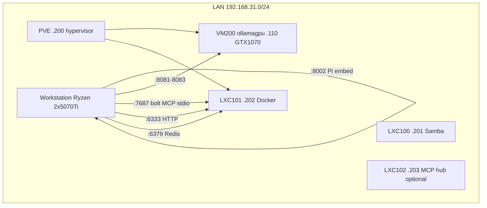
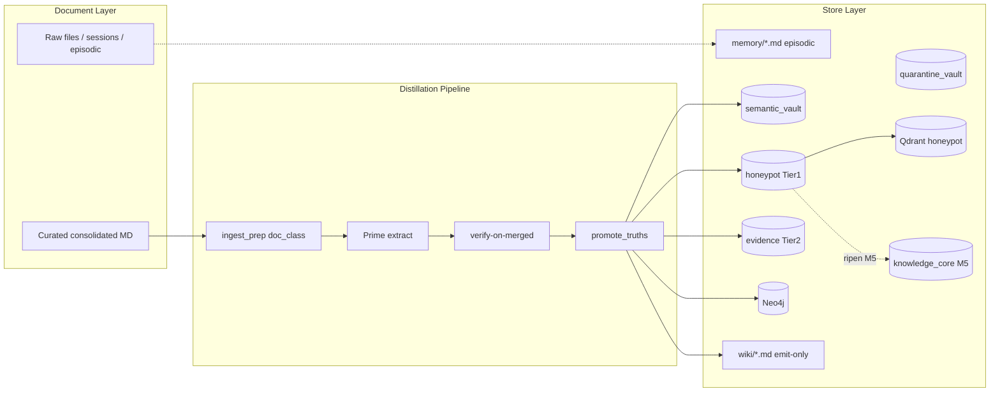
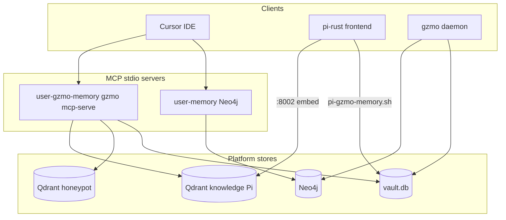

# GZMO — Infrastructure Map (full system reference)

**Status:** 2026-06-07
**Repo:** `/home/maximilian-wruhs/Projects/_foundation-audit/survey_GZMO`
**Role:** Single, self-contained map of the whole GZMO stack — every node, service, store, pipeline, schedule, and the entanglement edges that connect them. This is the top-level "where does everything live and how is it wired" document.
**Authority chain:** Live `gzmo.toml` → [`INFRASTRUCTURE_OVERVIEW.md`](./INFRASTRUCTURE_OVERVIEW.md) (ops runbook) → this map (full picture) → `./scripts/verify-production.sh` (truth check).

> Companion docs: [`MEMORY_ARCHITECTURE_SPEC.md`](./MEMORY_ARCHITECTURE_SPEC.md) (memory-layer design), [`GZMO_SYSTEM_ARCHITECTURE_INGEST.md`](./GZMO_SYSTEM_ARCHITECTURE_INGEST.md) (ingest internals), [`MIGRATION_INGEST_RUNBOOK.md`](./MIGRATION_INGEST_RUNBOOK.md) (curation-first migration).

---

## 0. One-paragraph summary

GZMO is a **local-first sovereign agent** whose memory is a **distillation pipeline**, not a chatbot with an attached vector store. Cognition (the LLM "Prime") runs on a Ryzen workstation; retrieval models (embed, rerank, librarian) run on VM200; persistence (Neo4j, Qdrant, Redis) runs on LXC101. The SQLite `vault.db` is the source of truth: facts are extracted by Prime, verified against quotable evidence, promoted into the vault, and only the curated, high-confidence subset is mirrored into the `honeypot` table and synced to Qdrant for RAG. Everything is gated — nothing enters memory without passing verify-on-merged plus, for migration corpora, an operator curation step.

---

## 1. Physical and network topology



| Node | IP | Compute | Role |
|------|-----|---------|------|
| Workstation | local | 2x RTX 5070 Ti, Ryzen 9950X | Prime `:8000`, gzmo daemon/CLI, SQLite SoT, Pi frontend, Pi embed `:8002` |
| VM200 `ollamagpu` | `192.168.31.110` | GTX 1070 8 GB eGPU | Embeddings `:8081`, rerank `:8082`, librarian `:8083` |
| LXC101 | `192.168.31.202` | Docker | Neo4j `:7687`, Qdrant `:6333`, Redis `:6379` |
| PVE | `192.168.31.200` | i7-6770HQ | Hypervisor for VM200 + LXC containers |
| LXC100 | `192.168.31.201` | — | Samba — not on hot path |
| LXC102 | `192.168.31.203` | — | Optional MCP hub (Pi era) |

**PCIe note:** No NVLink. Prime uses layer-split across both workstation GPUs (`-sm layer -dev CUDA0,CUDA1`), with `GGML_CUDA_DISABLE_GRAPHS=1`.

**SSH ops:** `ssh -i ~/.ssh/id_sidecar_proxmox maximilian@192.168.31.110`

**Parked (documented, excluded from hot path):** Sovereign FrankenMoE `:8010` (broken MoE output), VM200 brain `:8080` (retired 7B), vLLM lore in `~/Projects/swap/docs/` (stale ports — do not trust).

---

## 2. Service inventory and config spine

All runtime authority flows from a single file: [`gzmo.toml`](../gzmo.toml). Every client and the daemon read it.

### 2.1 Routing matrix (`gzmo.toml` → endpoint → consumer)

| Section | Endpoint | Used for |
|---------|----------|----------|
| `[engine.local]` | `http://localhost:8000/v1` | Chat, ingest extract/verify, dream, spark |
| `[engine.cloud]` | OpenRouter (opt-in `/mode cloud`) | Fallback cognition |
| `[embeddings]` | `http://192.168.31.110:8081/v1` | Vault/honeypot vectors, similarity |
| `[rerank]` | `http://192.168.31.110:8082/v1` | `memory_search` post-filter |
| `[librarian]` | `http://192.168.31.110:8083/v1` | Session distill extract/summary |
| `[qdrant]` | `http://192.168.31.202:6333`, collection `honeypot` | Nightly honeypot vector sync (01:45 UTC) |
| `[redis]` | `redis://192.168.31.202:6379` | Scratch cache + `gzmo:distill:pending` queue |
| `[[mcp_servers]] memory` | stdio → `mcp-neo4j-memory@0.4.5` | Neo4j KG writes (ingest, dream, spark) |
| `[platform_search]` | reads Qdrant `knowledge` | Cross-search honeypot + Pi knowledge |
| `[wiki]` | `wiki/` | Emit-only markdown synthesis |

### 2.2 Workstation services

| Port / process | Service | Start |
|----------------|---------|-------|
| `:8000` | Prime `llama-server` (Qwen3.6-35B-A3B Q4_K_XL, ctx 131072) | `~/Projects/llama.cpp/prime-bench/start-prime.sh` or [`scripts/systemd/gzmo-prime.service`](../scripts/systemd/gzmo-prime.service) |
| `:8002` | Local embed (Pi KB / fallback) | [`scripts/start-embed.sh`](../scripts/start-embed.sh) or `gzmo-embed.service` |
| `gzmo` | Daemon or REPL | [`scripts/start-production.sh`](../scripts/start-production.sh) `--daemon` |
| `:8010` | Sovereign FrankenMoE | **Parked** |

### 2.3 VM200 retrieval layer

| Port | Model | `gzmo.toml` |
|------|-------|-------------|
| `:8081` | Qwen3-Embedding-0.6B Q8 | `[embeddings]` |
| `:8082` | bge-reranker-v2-m3 Q8 | `[rerank]` |
| `:8083` | Qwen2.5-1.5B librarian | `[librarian]` |

Deploy: `scripts/vm200/deploy-retrieval-layer.sh`, `deploy-rerank.sh`, `deploy-librarian.sh`

### 2.4 LXC101 data plane

| Port | Service | GZMO usage |
|------|---------|------------|
| `:7687` | Neo4j | KG via MCP `mcp-neo4j-memory` stdio (`mcp__memory__*`) |
| `:6333` | Qdrant | Collections `honeypot` (prod RAG), `knowledge` (Pi raw-doc), `knowledge_core` (M5) |
| `:6379` | Redis | Scratch cache + `gzmo:distill:pending` distill queue |

### 2.5 Systemd / orchestration

- Units: [`scripts/systemd/gzmo-prime.service`](../scripts/systemd/gzmo-prime.service), `gzmo-daemon.service`, `gzmo-embed.service`
- Installer: `scripts/install-daemon-systemd.sh`
- Start spine: [`scripts/start-production.sh`](../scripts/start-production.sh)
- MCP merge: [`scripts/install-shared-mcp.sh`](../scripts/install-shared-mcp.sh) → `~/.cursor/mcp.json`, `~/.pi/agent/mcp.json`, `~/.config/mcp/mcp.json`

---

## 3. Memory tier architecture (four layers)

North star (from [`CEILING_ROADMAP.md`](./CEILING_ROADMAP.md)): **vault = ops soup**, **honeypot = curated crystal**, **Qdrant honeypot = association field**, **knowledge_core = ripened "our knowledge"**.



| Tier | Store | Schema / code | Recall role |
|------|-------|---------------|-------------|
| Hot | Redis scratch | `[redis]` + `[context_memory]` | Per-turn `[RECALL]` block |
| Vault (ops) | `semantic_vault`, `quarantine_vault` | [`gzmo-core/src/memory/vault.rs`](../gzmo-core/src/memory/vault.rs) | All verified facts; keyword fallback in RRF |
| Honeypot (Tier-1) | `honeypot`, `honeypot_fts` | `memory/vault.rs`, `honeypot.rs` | Primary RAG; Qdrant mirror source |
| Evidence (Tier-2) | `evidence`, `evidence_fts` | `memory/vault.rs` | Strict grounding; char spans 1:1 with honeypot |
| Graph | Neo4j via MCP | `gzmo-core/src/memory/kg_extract.rs` | Entity/relation stream in RRF |
| Mature core (M5) | `data/knowledge_core.db` | `scripts/ripen-knowledge-core.py` | Long-horizon concept cards |
| Wiki | `wiki/*.md` | `WikiEngine` | Emit-only grep; never re-ingested |
| Episodic | `memory/YYYY-MM-DD.md` | filesystem | Dream substrate; provenance receipts |

**SQLite `vault.db` tables (schema v7):** `semantic_vault`, `quarantine_vault`, `memory_index`, `honeypot`, `honeypot_fts`, `evidence`, `evidence_fts`, `distill_dedup`, `ingest_dedup`.

**Honeypot qualification** (`qualifies_for_honeypot`): confidence >= 0.85, non-empty `source_file`, not a `[relation:...]` row, and source path not under excluded patterns (`Sources/`, `Chat_History/`, `Quelltext/`).

---

## 4. Ingestion entry points (the "tangle")

Every path that can write into live memory. Under the curation-first policy (Part 7 + [`MIGRATION_INGEST_RUNBOOK.md`](./MIGRATION_INGEST_RUNBOOK.md)), the bulk/reactive paths are disabled for migration corpora.

| Path | Mechanism | Writes live? | Risk / policy |
|------|-----------|--------------|---------------|
| A | `gzmo ingest <file>` | Yes | Controlled (single file) |
| B | `gzmo ingest-dir <dir>` | Yes | **High** — bulk one MCP session; blocked on uncurated paths |
| C | Daemon `inbox_ingest` watcher on `~/Schreibtisch/knowledge` | Yes when enabled | **High** — reactive; kept disabled during migration |
| D | `sidecar-migration/scripts/trigger-wave-ingest.sh` | Yes | **Forbidden** — hard-disabled under new policy |
| E | `run-migration-ingest.sh` → `slow-reingest-migration.sh` | Yes | Legacy curated-manifest path (superseded by `run-curated-ingest.sh`) |
| F | `slow-reingest-wave.sh` (57 files) | Yes | Legacy semi-gated |
| G | `gzmo ingest-eval` / `replay-wave.sh` | **No** | Safe dry-run (contract only) |
| H | DreamEngine 01:00 UTC | Yes | Episodic → vault + honeypot + Neo4j |
| I | SessionDistill 02:15 UTC | Yes | `data/sessions/*.json` → vault + honeypot |
| J | SparkEngine 03:30 / 22:30 UTC | Neo4j relations only | Serendipity hypotheses |
| K | Context prune → Redis distill worker | Yes | Archived chat → vault |
| L | `scripts/seed-cognition-stack.py` | Yes | Manual ops seeding |
| M | `scripts/pi-kb-reindex.sh` | Qdrant `knowledge` only | Parallel Pi raw-doc index (not honeypot) |
| N | `scripts/run-curated-ingest.sh` | Yes | **Preferred** — manifest-only curated inject |

**Core pipeline** ([`gzmo-core/src/ingest.rs`](../gzmo-core/src/ingest.rs)):

```text
file -> ingest_prep (strip frontmatter, doc_class) -> Prime extract (:8000, temp=0.1)
     -> verify-on-merged -> promote_truths -> semantic_vault
     -> qualifies_for_honeypot? -> honeypot + evidence (Tier-2 localize)
     -> Neo4j MCP (create_entities / create_relations)
     -> episodic receipt [ingest:...] in memory/YYYY-MM-DD.md
     -> optional WikiEngine emit (emit_on_ingest=true)
     -> Qdrant sync (daemon 01:45 or manual sync-vault-to-qdrant.sh)
```

---

## 5. Daemon cron schedule (UTC)

| Time | Engine | Writes | Notes |
|------|--------|--------|-------|
| 01:00 | DreamEngine | vault + honeypot + Neo4j | Consolidate yesterday's episodic; runs before sync |
| 01:45 | Qdrant sync | honeypot collection upsert | Mirror point |
| 02:15 | SessionDistill | vault + honeypot | **Same-night Qdrant gap until next 01:45** |
| 02:45 | Synapse pull | episodic append only | Pi events → episodic |
| 03:30, 22:30 | SparkEngine | Neo4j relations + episodic audit | No honeypot writes |
| 04:00 | KG reconcile | dry_run=true default | No writes unless enabled |
| 05:30 | Wiki sync | wiki index | Emit-only |
| 06:00 Sun | Wiki lint | structural lint | Weekly |
| */30 | sys_janitor | can write vault via tools | Orchestrator maintenance |
| Continuous | Distill worker | BRPOP Redis queue | Same Qdrant gap as 02:15 |

Schedules live in `gzmo.toml`: `[dreams].cron_*`, `[qdrant].sync_cron_*`, `[session_distill].cron_*`, `[spark].cron_*`, `[synapse_pull].cron_*`, `[kg_reconcile].cron_*`, `[wiki].sync_cron_* / lint_cron_*`. Legacy headless prompt jobs under `[orchestration.jobs.*]` are kept `disabled = true` to avoid duplicating the dedicated daemon loops.

---

## 6. MCP and client integration



| MCP | Transport / command | Tools | Role |
|-----|---------------------|-------|------|
| `memory` | stdio → `uvx mcp-neo4j-memory@0.4.5` | `create_entities`, `create_relations`, `search_memories`, `read_graph` | Neo4j KG writes |
| `gzmo-memory` | stdio → `gzmo mcp-serve` | `gzmo_memory_search`, `gzmo_memory_recall_pull`, `gzmo_memory_status`, `gzmo_wiki_search` | Honeypot RAG + Pi cross-search + wiki grep |

**Cross-search:** `[platform_search]` merges honeypot vault recall with the Pi `knowledge` Qdrant collection ([`gzmo-core/src/platform_search.rs`](../gzmo-core/src/platform_search.rs)). Pi never touches Redis or vault SQL directly — it goes through `scripts/pi-gzmo-memory.sh` (see [`PI_GZMO_MEMORY_INTEGRATION.md`](./ops/PI_GZMO_MEMORY_INTEGRATION.md)).

---

## 7. Migration staging (sidecar-migration) — curation-first

**Location:** `~/Schreibtisch/sidecar-migration` (temporary — delete after all waves verified). Not a git repo.


| Wave | Staging dir | Source files | Status |
|------|-------------|--------------|--------|
| 1 | `wave_01_gzmo_obolus` | 57 | source material for re-consolidation |
| 2 | `wave_02_notebooklm` | 313 | ready, **blocked** until curated |
| 3 | `wave_03_drive_docs` | 22 | ready, not promoted |

**Forbidden zones (never ingest directly):** `00_inbox/`, `03_hold/`, raw Takeout, and uncurated `01_ingest_ready/`. Only `02_curated/<wave>/consolidated/` promoted into `~/Schreibtisch/knowledge/curated/<wave>/` is ingest-eligible. Full procedure: [`MIGRATION_INGEST_RUNBOOK.md`](./MIGRATION_INGEST_RUNBOOK.md).

---

## 8. Eval and gate system

| Gate | Script | Question | Blocks M4? |
|------|--------|----------|------------|
| Infra health | `scripts/verify-production.sh` | Prime/embed/Neo4j/vault/FTS up? | No (explicitly not an M4 gate) |
| Dry-run contract | `scripts/ingest-quality/replay-wave.sh` | Extraction quality on golden YAML? | Partial |
| Strict recall | `scripts/ingest-quality/run-recall-eval.py --match strict` | Live honeypot recall floor? | Yes |
| Faithfulness | `scripts/ingest-quality/faithfulness-judge.py --gate` | Context grounding >= 0.90? | Yes |
| Full sign-off | `scripts/ingest-quality/certify-production-baseline.sh` | M4 complete? | Yes |

Golden contract: `scripts/ingest-quality/expected.yaml` + `gate-config.yaml`.

---

## 9. Entanglement register (high-risk edges)

Silent-failure edges — no error, wrong data, or a false-green gate (from [`GZMO_SYSTEM_ARCHITECTURE_INGEST.md` section 11](./GZMO_SYSTEM_ARCHITECTURE_INGEST.md)):

| Edge | Systems | Silent failure mode |
|------|---------|---------------------|
| ingest-eval dry-run → report.json | ingest_eval, certify | Contract green while live store stale (F2) |
| verify → evidence | ingest, Prime, evidence_localize | Tier-2 empty → strict recall collapses |
| evidence.fact_id → honeypot.id | SQLite FK, recall loader | Orphan spans; wrong fact attribution |
| qualifies_for_honeypot → golden scope | honeypot.rs, expected.yaml | Metrics promise recall on unreachable files (F3: 17/50 excluded) |
| Qdrant sync 01:45 vs distill/spark 02:15+ | daemon cron | Same-night vector mirror gap (F15) |
| Qdrant upsert without supersede delete | qdrant sync | Stale `is_latest=0` points linger |
| Neo4j MCP provenance vs SQLite evidence | kg_extract, vault | Split-brain: graph quote without evidence row |
| Dream episodic filter != vault writes | dreams.rs filter | REM skips ops noise; vault facts still searchable |
| Dual distill schedulers | cron + archive worker | Duplicate content (v6 `distill_dedup` mitigates) |
| Gateway routing drift | gzmo.toml vs code comments | Wrong model/URL silently degrades extract quality |

---

## 10. Filesystem map (all storage paths)

| Path | Owner | Mutable by ingest? |
|------|-------|-------------------|
| `data/vault.db` | GZMO | Yes (source of truth) |
| `data/knowledge_core.db` | M5 ripen | No (derived) |
| `data/knowledge_core.candidates.json` | M5 ripen | No (derived) |
| `data/sessions/` | SessionDistill | Yes (input) |
| `data/Synapse/events.jsonl` | Pi/GZMO bus | Append-only; never consumed for state |
| `data/backups/` | purge scripts | Snapshots |
| `memory/*.md` | episodic/dream | Append |
| `DREAMS.md` | DreamEngine | Append |
| `wiki/` | WikiEngine | Emit only (never re-ingested) |
| `logs/` | daemon/scripts | Runtime logs + ingest progress |
| `~/Schreibtisch/knowledge/` | watcher target | Yes when watcher enabled |
| `~/Schreibtisch/knowledge/archive/` | legacy migration promote | **Frozen** — source material only |
| `~/Schreibtisch/knowledge/curated/` | curated promote target | Yes (the only ingest-eligible migration path) |
| `~/Schreibtisch/sidecar-migration/` | migration staging | Never ingest raw |
| `~/.pi/agent/knowledge-base.json` | Pi KB config | Config only |
| `~/.pi/agent/knowledge-state.json` | Pi reindex fingerprints | Reset on Qdrant wipe |

---

## 11. Clean-slate and rebuild

- **Wave-scoped purge:** `scripts/purge-wave-ingest.sh <wave> --confirm PURGE`
- **Full reset:** `scripts/purge-all-memory.sh --confirm FULL_PURGE`
- **Nuclear reset:** `scripts/purge-all-memory.sh --confirm NUCLEAR_PURGE` — full Neo4j graph wipe, all Qdrant collections (`honeypot`, `knowledge`, `knowledge_core`), `knowledge_core.db`, `DREAMS.md`/`wiki` archive, Redis distill queue flush, Pi `knowledge-state.json` reset. See Part 2 of the clean-slate plan and [`MIGRATION_INGEST_RUNBOOK.md`](./MIGRATION_INGEST_RUNBOOK.md).

Always stop the daemon first (`pkill -TERM -f 'target/release/gzmo daemon'`), dry-run, then confirm. Rebuild only from curated, consolidated documents.

---

*End of GZMO Infrastructure Map.*
