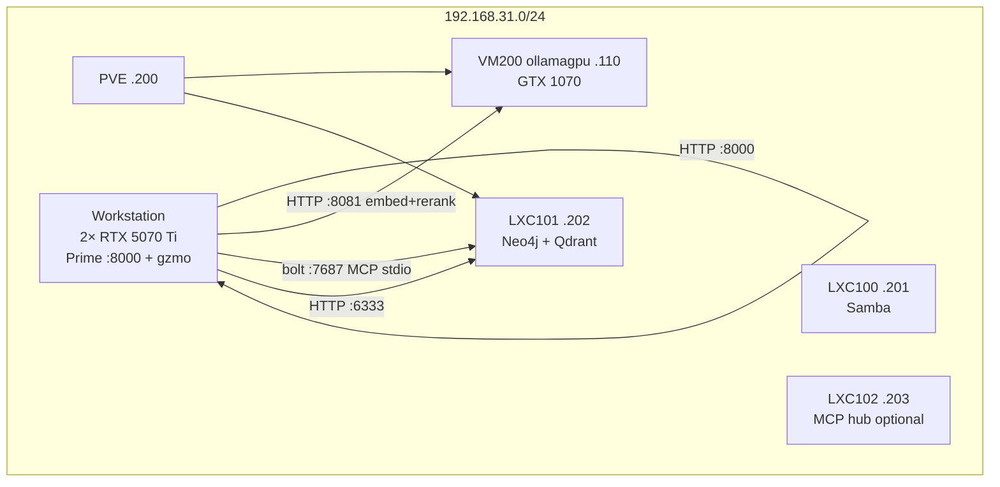
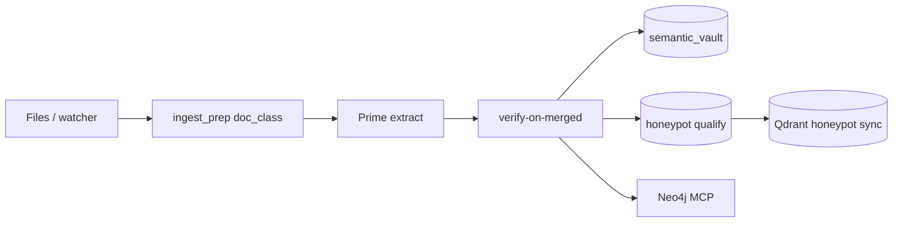

# GZMO — Infrastructure Overview (canonical)

**Status:** 2026-06-09  
**Repo:** `/home/maximilian-wruhs/Projects/_foundation-audit/survey_GZMO`  
**Authority:** Live `gzmo.toml` → **[`docs/PORTS.md`](PORTS.md)** (locked port map) → this document → `./scripts/verify-production.sh`  
**Supersedes:** [`gzmo_placement_architecture.md`](./gzmo_placement_architecture.md), [`INFRASTRUCTURE_REVIEW.md`](./INFRASTRUCTURE_REVIEW.md) as **entry points** (those files remain as historical detail).

**Refresh after any infra change:**

```bash
cd ~/Projects/_foundation-audit/survey_GZMO
./scripts/verify-production.sh
./scripts/memory-status.sh
scripts/ingest-quality/check-contract.sh
```

---

## 1. Executive summary

GZMO is a **local-first, air-gapped agent** on a Ryzen workstation with retrieval and persistence on the homelab LAN.

| Tier | Host | Role |
|------|------|------|
| **Cognition** | Workstation (2× RTX 5070 Ti) | Prime **Gemma 4 26B-A4B** on `:8000` (256K ctx) — chat, dreams, spark, ingest |
| **Retrieval** | VM200 `192.168.31.110` (GTX 1070) | Unified router `:8081` — embed (`gzmo-embed`) + rerank (`gzmo-rerank`); librarian retired |
| **Persistence** | LXC101 `192.168.31.202` | Neo4j `:7687`, Qdrant `:6333` |
| **Orchestration** | Workstation | Rust `gzmo` daemon — cron engines, watchers, MCP stdio |

**Production inference path:** `[engine.local]` → `http://localhost:8000/v1`  
**Production vectors:** Qdrant collection **`honeypot`** (682 points, synced from SQLite honeypot)  
**Legacy vectors:** Qdrant **`knowledge`** (~3245) — **read-only** until cutover checklist + operator approval ([`M2_HONEYPOT_REPORT.md`](./M2_HONEYPOT_REPORT.md) § Cutover)

**Quality sign-off (eval):** **`baseline-m4-post-sprint`** (end-gate 2026-06-03, ~18 min) — strict + layered + contract + probes PASS. Log: `scripts/ingest-quality/replay-wave-end-gate.log`. See [`BASELINE_STATUS.md`](./BASELINE_STATUS.md).

**Parked (do not block on):** Sovereign FrankenMoE `:8010`, VM200 brain `:8080` 7B, vLLM on workstation.

---

## 2. Topology



| Node | Address | Compute | Production role |
|------|---------|---------|-----------------|
| Workstation | local | 2× 16 GB RTX 5070 Ti, Ryzen 9950X | Prime, GZMO daemon/CLI, knowledge-dir ingest |
| PVE | `192.168.31.200` | i7-6770HQ | Hypervisor |
| VM200 `ollamagpu` | `192.168.31.110` | GTX 1070 8 GB (eGPU) | Unified retrieval router `:8081` (embed + rerank) |
| LXC101 | `192.168.31.202` | Docker | Neo4j, Qdrant, Redis (Redis not wired to GZMO) |
| LXC100 | `192.168.31.201` | — | Samba — not on hot path |
| LXC102 | `192.168.31.203` | — | Optional MCP hub / Pi era |

**PCIe:** No NVLink. Prime uses **layer-split** across both workstation GPUs (`-sm layer -dev CUDA0,CUDA1`).

**SSH (ops):** `ssh -i ~/.ssh/id_sidecar_proxmox maximilian@192.168.31.110`

---

## 3. Service inventory (ports)

> **Locked steady-state map:** [`PORTS.md`](PORTS.md). Section below is operational detail; port assignments must match that file.

### 3.1 Workstation — live

| Port / process | Service | Start |
|----------------|---------|-------|
| **:8000** | `llama-server` Prime (Gemma 4 26B-A4B-it QAT, ctx 262144) | `~/Projects/llama.cpp/prime-bench/start-prime-gemma4-26b-a4b-256k.sh` or `gzmo-prime.service` |
| **:8002** | Local Pi KB embed (**opt-in**, `ENABLE_PI_EMBED=1`) | `scripts/start-embed.sh` or `gzmo-embed.service` |
| **`gzmo`** | Daemon or REPL | `scripts/start-production.sh --daemon` |
| **:8010** | Sovereign FrankenMoE | **Parked** — `start-sovereign.sh` |

Prime (typical): ctx **262144**, ngram-mod speculative decoding, CUDA graphs **on** (Gemma QAT profile), dual 5070 Ti layer-split.

### 3.2 VM200 — retrieval layer

Single `llama-server --models-preset` router; two presets share one port.

| Port | Preset / Model | GZMO `gzmo.toml` |
|------|----------------|------------------|
| **:8081** | `gzmo-embed` — Qwen3-Embedding-0.6B Q8 (1024-dim) | `[embeddings]` |
| **:8081** | `gzmo-rerank` — Qwen3-Reranker-0.6B | `[rerank]` |
| ~~:8080~~ | Qwen2.5-Coder 7B | **Retired** |
| ~~:8082~~ | bge-reranker-v2-m3 Q8 | **Retired** (now `gzmo-rerank` on `:8081`) |
| ~~:8083~~ | Qwen2.5-1.5B librarian | **Retired** (distill on Prime `:8000`) |

Deploy: `scripts/vm200/deploy-retrieval-router.sh` → `llama-retrieval-router.service`

### 3.3 LXC101 — data plane

| Port | Service | GZMO usage |
|------|---------|------------|
| **:7687** | Neo4j | KG via MCP `mcp-neo4j-memory` (stdio from workstation) |
| **:6333** | Qdrant | Collection **`honeypot`** (production RAG); **`knowledge`** (legacy mirror) |
| **:6379** | Redis | Running; **not wired** to GZMO |

---

## 4. GZMO software map

| Component | Path / binary | Role |
|-----------|---------------|------|
| Root | `~/Projects/_foundation-audit/survey_GZMO` | Production tree |
| Config | `gzmo.toml` | Single source of runtime config |
| CLI | `target/release/gzmo` | `chat`, `daemon`, `dream`, `spark`, `distill`, `health`, `ingest`, `ingest-eval`, … |
| Core | `gzmo-core/` | Engines, gateway, vault, honeypot, ingest, qdrant_sync |
| Chaos | `gzmo-chaos/` | Chat/TUI only — not daemon |
| Vault DB | `data/vault.db` | SQLite SoT |
| Episodic | `memory/YYYY-MM-DD.md` | Daily logs |
| Sessions | `data/sessions/` | Session distill input |
| Corpus (eval) | `~/Schreibtisch/knowledge/archive/gzmo_obolus` | Wave-1 golden dry-run (57 files) |
| Knowledge (live) | `~/Schreibtisch/knowledge` | Watcher ingest target |

### 4.1 `gzmo.toml` routing (logical)

| Section | Endpoint | Used for |
|---------|----------|----------|
| `[engine.local]` | `http://localhost:8000/v1` | Chat, dreams, spark, ingest verify |
| `[embeddings]` | `http://192.168.31.110:8081/v1` (`gzmo-embed`) | Vault/honeypot vectors, similarity |
| `[rerank]` | `http://192.168.31.110:8081/v1` (`gzmo-rerank`) | `memory_search` post-filter |
| `[librarian]` | disabled — distill on Prime `:8000` via `[routing.mappings]` | Session distill extract/summary/verify |
| `[qdrant]` | `http://192.168.31.202:6333`, `collection = "honeypot"` | Nightly sync from honeypot |
| `[[mcp_servers]]` memory | stdio → Neo4j | KG writes (dream, spark, ingest) |

**Secrets:** Prefer `.env` for Neo4j and cloud keys; do not commit credentials. Rotate keys referenced in config.

**Structured JSON on Prime:** Use `enable_thinking: false` for schema paths; do not combine `reasoning_format: "none"` with `json_schema` (HTTP 400 on current llama-server).

---

## 5. Memory & data plane

North star: **vault = ops soup**, **honeypot = curated crystal**, **Qdrant honeypot = association field**. Deep design: [`MEMORY_ARCHITECTURE_SPEC.md`](./MEMORY_ARCHITECTURE_SPEC.md).

### 5.1 Store layers (production counts, 2026-06-03)

| Layer | Store | Count | Notes |
|-------|--------|-------|--------|
| Episodic | `memory/*.md` | — | Dream substrate; filter drops ops/meta noise |
| Vault (ops) | `semantic_vault` | ~2809 | All promoted/quarantine facts |
| Honeypot | `honeypot` (`is_latest=1`) | **682** | Curated; ~24% of vault rows |
| Evidence (Tier-2) | `evidence` | varies | 1:1 with honeypot facts; strict recall + evidence FTS/vector streams |
| Honeypot FTS | `honeypot_fts` | **682** | No `trg_honeypot_*` triggers |
| Vectors (prod) | Qdrant `honeypot` | **682** | 0% drift vs SQLite honeypot |
| Vectors (legacy) | Qdrant `knowledge` | **~3245** | Full-vault-era mirror — deprecate per checklist |
| Graph | Neo4j | — | Provenance + relations via MCP |

### 5.2 Promotion pipeline (ingest)



- **M2:** `honeypot.rs`, `backfill-honeypot.py`, `sync-vault-to-qdrant.py --source honeypot`
- **Tier-2 evidence:** `evidence` table + `evidence_fts` + local evidence-vector stream (see [MEMORY_ARCHITECTURE_SPEC.md](./MEMORY_ARCHITECTURE_SPEC.md) §2.3.1)
- **Eval (dry-run):** `gzmo ingest-eval` → `scripts/ingest-quality/report.json` — **no vault/honeypot/evidence/Neo4j writes** (extraction contract only)
- **Live write path:** `gzmo ingest` / daemon watcher — MCP-connected; optional `live-ingest-smoke.sh` in certify when `LIVE_INGEST_SMOKE=1`

**Production config (2026-06-05):** `[ingest]`, `[dreams]`, `[spark]`, `[session_distill]` all **`enabled = true`** in `gzmo.toml`. Wave 2/3 corpus expansion remains human-gated; the daemon actively runs cognition + watcher ingest on configured paths.

### 5.3 Cognition (M3)

| Engine | Reads | Writes on pass |
|--------|--------|----------------|
| Spark | Honeypot pools (anchor/recent) | Vault quarantine audit; optional KG; `DREAMS.md` |
| Dream | Episodic md → REM chunks | Vault + Neo4j (`verified_dream`) |

**Episodic filter note (F16):** DreamEngine drops `### 🧠 INTERNAL` sections matching `exclude_episodic_substrings` (janitor/spark/ingest echoes) before REM. Vault writes from ingest, session_distill, and spark bypass this filter — only the **dream substrate** is filtered, not the store.

**Smoke (2026-06-03):** `gzmo health` OK; `gzmo spark` selects anchor, abstains promote at conf 0; `gzmo dream` skips when filtered episodic &lt; 400 chars. See [`POST_M3_RESULTS.md`](./POST_M3_RESULTS.md) § Cognition smoke.

**Config note:** `anchor_min_age_hours = 0` in `gzmo.toml` allows same-day anchors after backfill; use `6` for production cadence.

---

## 6. Data flows

### 6.1 Interactive chat

```
User → gzmo chat → Prime :8000 → tools (fs, shell, web, memory_*, mcp__memory__*)
                  → SQLite vault (embed + rerank on VM200 :8081 router during search)
                  → episodic markdown append
```

### 6.2 Nightly loop (UTC, daemon)

| Time | Job | Output |
|------|-----|--------|
| **01:00** | DreamEngine | Episodic → vault + Neo4j |
| **01:45** | Qdrant sync | `honeypot` collection on LXC101 |
| **02:15** | Session distill | Prime :8000 (extract/summary/verify) → vault (+ honeypot when `source_file` qualifies) |
| **03:30, 22:30** | SparkEngine | Serendipity hypothesis + verify |
| ***/30** | sys_janitor | Orchestrator maintenance |
| Continuous | Ingest watcher | `~/Schreibtisch/knowledge` |

Legacy orchestrator `auto_dream` / `spark` jobs are **disabled** — replaced by dedicated engines.

### 6.3 Ingest eval (quality gate, no production write)

```
gzmo_obolus corpus (57 files) → ingest-eval → report.json
  → check-contract.sh / gate-report.sh / promote-baseline.sh
```

**Important:** `ingest-eval` proves extraction quality against `expected.yaml`; it does **not** refresh the live recall store. Strict recall and faithfulness judge read the live vault/honeypot/evidence DB.

### 6.4 Gate independence (F20)

Three scripts answer different questions — **green on one does not imply green on another**:

| Script | Question | Writes store? | Typical duration |
|--------|----------|---------------|------------------|
| `./scripts/verify-production.sh` | Is infra up (Prime, embed, Neo4j MCP, daemon, vault, FTS sanity)? | No | ~30 s |
| `scripts/ingest-quality/eval-quick.sh` | Does frozen `report.json` + offline gates + probes still pass? | No | ~30 s |
| `scripts/ingest-quality/certify-production-baseline.sh` | Full M4 sign-off (build, contract, strict recall floor, faithfulness, eval-quick STRICT=1)? | No* | ~15–25 min |

\* Set `LIVE_INGEST_SMOKE=1` to opt into one-file live ingest (vault + Neo4j MCP) at the end of certify.

**Operational rule:** Run `verify-production.sh` after reboot; run `eval-quick.sh` after prompt/gate edits; run `certify-production-baseline.sh` before baseline promotion only.

---

## 7. Quality & evaluation tier

| Tier | Commands | Duration | When |
|------|----------|----------|------|
| **Fast** | `eval-quick.sh` (Tier 0) | ~30 s | **Default** after most changes |
| **Core** | `replay-wave-core.sh` (15 files) | ~5–8 min | After ingest/prompt changes |
| **Medium** | `pre-ingest-gate.sh`, `gate-wave1-before-ingest.sh` | minutes | Before live ingest |
| **Heavy** | `replay-wave.sh` + `PROMOTE_BASELINE=1` | ~18–45 min | Baseline / release only |

See [`EVAL_TIERS.md`](./EVAL_TIERS.md).

| Artifact | Purpose |
|----------|---------|
| `expected.yaml` | Golden contract (50 files + stubs) |
| `baseline-m4-current.json` | Frozen eval SoT |
| `pipeline-lock.json` | Summary lock |
| `gate-config.yaml` | Strict/layered thresholds + rel-prom waivers |

**MemScore:** `faithfulness` / `noise_ratio` informational; `recall@5` spec in [`M4_MEMSCORE_RECALL5.md`](./M4_MEMSCORE_RECALL5.md) — `null` does not block gates today.

**Antigravity delivery log:** [`walkthrough.md`](./walkthrough.md) (S1–S6). **Handoff queue:** [`ANTIGRAVITY_TODO.md`](./ANTIGRAVITY_TODO.md).

---

## 8. Operations runbook

### 8.1 After reboot

```bash
cd ~/Projects/_foundation-audit/survey_GZMO
./scripts/start-production.sh --daemon
./scripts/verify-production.sh    # must exit 0
```

### 8.2 Status & health

```bash
./scripts/memory-status.sh
./target/release/gzmo health
scripts/check-fts-sanity.sh
```

### 8.3 VM200 retrieval

```bash
./scripts/vm200/deploy-retrieval-layer.sh
./scripts/vm200/deploy-rerank.sh
./scripts/vm200/deploy-librarian.sh
```

### 8.4 Wave-1 ingest (human-gated)

```bash
PRE_INGEST_STAGE2_SAMPLE=0 scripts/gate-wave1-before-ingest.sh
# Manifest: scripts/ingest-quality/wave1-ingest-ready.manifest (57 paths)
# Live ingest only after review — not part of default daemon loop for full corpus re-run
```

### 8.5 Do not run without explicit approval

- `scripts/purge-wave-ingest.sh --confirm`
- Delete Qdrant collection `knowledge`
- Full `ingest-dir` on wave-1 after baseline sign-off without plan

### 8.6 Logs

| Log | Path |
|-----|------|
| Daemon | `logs/daemon.log` |
| End-gate replay | `scripts/ingest-quality/replay-wave-end-gate.log` |
| Antigravity smoke | `logs/antigravity-{health,spark,dream}-*.log` |
| Prime (systemd) | `journalctl --user -u gzmo-prime -f` |

Daemon PID: `/tmp/gzmo_daemon.pid`

### 8.7 Full regression

```bash
./scripts/stack-closure-test.sh
./scripts/p1-readiness-test.sh
```

---

## 9. Verification matrix

### 9.1 Production E2E (`verify-production.sh`)

| Check | Expected |
|-------|----------|
| Prime `:8000` | OK |
| Embed `:8081` (`gzmo-embed`) | OK, 1024-dim |
| Rerank `:8081` (`gzmo-rerank`) | OK, top score > 0 |
| Librarian | disabled in config |
| Neo4j + MCP | OK |
| Qdrant sync dry-run | OK |
| `vault.db` | Present |
| honeypot FTS sanity | PASS (if script present) |
| Sovereign `:8010` | FAIL OK (optional) |

*Re-run after changes; record date in changelog below.*

### 9.2 Memory & eval (`baseline-m4-post-sprint`)

| Check | Target | End-gate 2026-06-03 |
|-------|--------|---------------------|
| Golden entity recall (report) | ≥ 90% | **100%** |
| Golden fact recall (report) | INFO | **~70%** on frozen baseline report; offline contract via `sharpen --only-missing` can reach **~99%** on same `report.json` |
| Scoped relation prom | ≥ 80% | **93.7%** |
| Zero-entity / zero-rel | 0 / ≤5 | **0** / **1** |
| Retrieval probes | 3/3 | PASS on `honeypot` |
| Strict + layered gate | PASS | **PASS** |

---

## 10. Security & multi-consumer alignment

| Topic | Guidance |
|-------|----------|
| Neo4j on LAN | Restrict to workstation IPs; rotate password; use `.env` |
| Cloud keys | `[api_keys]` — prefer env vars `GZMO_*` |
| `sys_janitor` | Can kill processes — tight tool boundaries |
| Local-only prod | No required cloud for core path |

| Consumer | Prime | Embed | Neo4j |
|----------|-------|-------|-------|
| GZMO daemon | `:8000` | VM200 `:8081` | LXC101 bolt |
| Cursor MCP | — | — | Same via `install-shared-mcp.sh` |
| Pi agent | WS `:8000` | WS `:8002` or VM200 fallback | Shared MCP config |

### 10.1 GZMO vs Pi vs MCP (who talks to what)

| Surface | Role | MCP? | Notes |
|---------|------|------|-------|
| **`gzmo daemon`** | Production spine — ingest, dream, spark, cron | **Client** (stdio to Neo4j MCP on workstation) | Canonical path for Vault → Honeypot → Qdrant `honeypot` |
| **`gzmo` / `gzmo --repl` (TUI)** | Optional human UI | Same client pattern as daemon | Not an MCP server; does not replace daemon for batch ingest |
| **Cursor / Antigravity** | Docs, eval scripts, ops prompts | Neo4j via `install-shared-mcp.sh` | No Rust edits, no purge, no Qdrant delete |
| **Pi agent** | Separate coding agent on workstation | Prime `:8000` + shared Neo4j MCP | Not routed through GZMO TUI |

**Hindsight target (not built):** stable **Layer A+B** (daemon + stores); all clients use **Prime + platform MCP** for cognition and graph — one API surface, multiple UIs.

---

## 11. Parked, stale docs & debt

| Item | Status |
|------|--------|
| Delete Qdrant `knowledge` | 4-point checklist in `M2_HONEYPOT_REPORT.md` |
| Implement `recall@5` in harness | Spec ready (`M4_MEMSCORE_RECALL5.md`) |
| Redis embed cache | Optional |
| QdrantVault in Rust | Deferred; Python sync + cron canonical |
| Sovereign `:8010` | Parked |
| **`swap/docs/*`** | **Stale ports (8001, vLLM on 8002) — ignore** |
| VM200 SPOF for embed/rerank | Fallback to local `:8002` if down |

**Trust order:** §1 of this file → `gzmo.toml` → `verify-production.sh` → linked deep dives.

---

## 12. Deep dives (links only)

| Topic | Document |
|-------|----------|
| **Architecture ingest reference** | [`GZMO_SYSTEM_ARCHITECTURE_INGEST.md`](./GZMO_SYSTEM_ARCHITECTURE_INGEST.md) |
| **Wave-1 migration runbook** | [`MIGRATION_INGEST_RUNBOOK.md`](./MIGRATION_INGEST_RUNBOOK.md) |
| **GZMO identity** | [`MACHINE.md`](../MACHINE.md) |
| **Roadmap (local → M5)** | [`ROADMAP_TO_M5.md`](./ROADMAP_TO_M5.md) |
| **Antigravity handover** | [`ANTIGRAVITY_HANDOVER.md`](./ANTIGRAVITY_HANDOVER.md) |
| Memory design | [`MEMORY_ARCHITECTURE_SPEC.md`](./MEMORY_ARCHITECTURE_SPEC.md) |
| Milestones M0–M5 | [`CEILING_ROADMAP.md`](./CEILING_ROADMAP.md) |
| Baseline / end-gate | [`BASELINE_STATUS.md`](./BASELINE_STATUS.md), [`END_GATE_PROMPT.md`](./END_GATE_PROMPT.md) |
| Honeypot ops | [`M2_HONEYPOT_REPORT.md`](./M2_HONEYPOT_REPORT.md) |
| M3 cognition | [`M3_IMPLEMENTATION.md`](./M3_IMPLEMENTATION.md), [`POST_M3_RESULTS.md`](./POST_M3_RESULTS.md) |
| Eval harness | [`EVAL_SCAFFOLD.md`](./EVAL_SCAFFOLD.md), [`scripts/ingest-quality/README.md`](../scripts/ingest-quality/README.md) |
| Production checklist | [`PRODUCTION_READINESS.md`](./PRODUCTION_READINESS.md) |
| VM200 deploy detail | [`VM200_MAXIMUM.md`](./VM200_MAXIMUM.md) |
| App user guide | [`README.md`](../README.md) |
| Historical infra review | [`INFRASTRUCTURE_REVIEW.md`](./INFRASTRUCTURE_REVIEW.md) (2026-06-01) |

---

## Changelog

| Date | Change |
|------|--------|
| 2026-06-03 | **Initial canonical overview** — merges placement + review + M2/M3/M4 baseline state |
| 2026-06-03 | Qdrant production = `honeypot`; `knowledge` legacy read-only |
| 2026-06-03 | Eval tier documented |
| 2026-06-03 | End-gate → `baseline-m4-post-sprint` (93.7% scoped rel-prom) |
| 2026-06-04 | Added [`MACHINE.md`](../MACHINE.md), [`ROADMAP_TO_M5.md`](./ROADMAP_TO_M5.md) — local-first execution path |

---

*Update §5.1 counts via `./scripts/memory-status.sh` after live changes. Update §9.2 after end-gate promote.*
