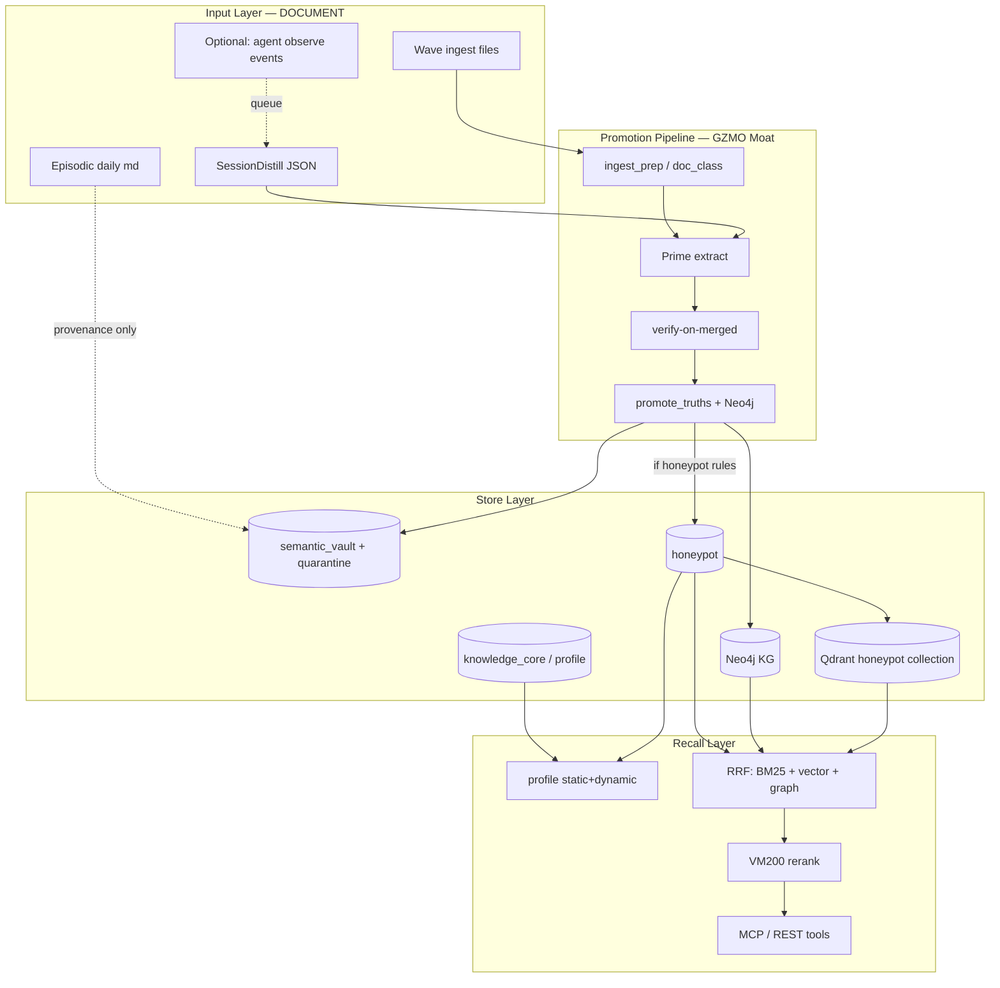

# GZMO Memory Architecture Spec

**Version:** 0.2  
**Date:** 2026-06-02 (updated 2026-06-05 — evidence tier + distill dedup)  
**Status:** Design reference — **M2 honeypot + M3 cognition implemented**; live ops in [INFRASTRUCTURE_OVERVIEW.md](./INFRASTRUCTURE_OVERVIEW.md) §5  
**Basis:** [CEILING_ROADMAP.md](./CEILING_ROADMAP.md) + learnings from [Supermemory](https://github.com/supermemoryai/supermemory) and [agentmemory](https://github.com/rohitg00/agentmemory)  
**Purpose:** Deep memory-layer design; eval and agent integration.

**Related docs:**

| Doc | Role |
|-----|------|
| [INFRASTRUCTURE_OVERVIEW.md](./INFRASTRUCTURE_OVERVIEW.md) | **Canonical** stack + stores + flows |
| [CEILING_ROADMAP.md](./CEILING_ROADMAP.md) | Milestone map M0–M5 |
| [scripts/ingest-quality/README.md](../scripts/ingest-quality/README.md) | Wave-1 eval gate |

---

## 0. Executive summary

GZMO moves from **“vault soup with Qdrant mirror”** to **four explicit layers**:

| Layer | Role | Supermemory analogy | agentmemory analogy |
|-------|------|---------------------|---------------------|
| **Document** | Raw input + provenance | Documents | Working / raw observations |
| **Vault (ops)** | All promoted + quarantined | — (internal) | Episodic + Semantic (unfiltered) |
| **Honeypot** | Curated memories | Memories | Semantic (filtered) |
| **Mature DB / Profile** | Ripened core | User Profile (static/dynamic) | Procedural + pinned slots |

**Moat preserved:** Prime extract → verify-on-merged → domain eval gate.  
**Borrowed patterns:** Layering, graph lifecycle, RRF recall, profile API, MCP surface, MemScore eval.

---

## 1. Reference architecture



### 1.1 Contracts between layers

| From → To | Rule |
|-----------|------|
| Document → Vault | `verify_pass = true` OR confidence ≥ 0.85 (existing) |
| Vault → Honeypot | Additionally: allowed `origin`, no anti-entity match, optional golden-approved |
| Honeypot → Qdrant | Honeypot rows only; no `SELECT * FROM semantic_vault` |
| Honeypot → Mature DB | Time + dedup + contradiction resolution + optional human review |
| Episodic → Dream | **Not** primary substrate from M3; context snippet only |
| Vault → Profile.dynamic | Last N days SessionDistill + recent honeypot |
| Structural → Profile.static | `DecayClass::Structural`, Agent-Specs, SOUL |

---

## 2. Concept 1 — Four-layer model (Document / Vault / Honeypot / Core)

### 2.1 Problem today

- `semantic_vault` mixes ingest facts, dream truths, SessionDistill
- Qdrant mirrors roughly the entire vault
- No clear “this is RAG” vs “this is memory”

### 2.2 Target state

**Document** — immutable-ish raw artifact with metadata:

```yaml
document:
  id: uuid
  uri: "file:///.../firewall_agentmd.md"
  doc_class: AgentSpec | Reference | ChatExport | NotebookLM
  sha256: ...
  ingested_at: ...
  wave: 1
  status: queued | extracted | verified | promoted | failed
```

**Vault** — operational SoT (existing, extended):

- All promoted truths + quarantine
- Full history, decay, ops queries, purge

**Honeypot** — searchable memory layer:

- Subset of vault with higher trust contract
- Default for agent recall, Dream/Spark, Qdrant

**Mature DB / Core** — exportable kernel:

- Few, dense concept cards
- Static profile + long-term identity

### 2.3 Schema sketch: `honeypot`

```sql
CREATE TABLE honeypot (
  id              TEXT PRIMARY KEY,
  vault_id        TEXT NOT NULL REFERENCES semantic_vault(id),
  content         TEXT NOT NULL,
  content_norm    TEXT NOT NULL,
  embedding       BLOB,
  origin          TEXT NOT NULL,             -- ingest | session_distill | verified_dream | manual
  memory_type     TEXT NOT NULL DEFAULT 'fact',  -- fact | preference | episode | procedure
  graph_rel       TEXT,                      -- update | extends | derives | null
  supersedes_id   TEXT,
  is_latest       INTEGER NOT NULL DEFAULT 1,
  verify_pass     INTEGER NOT NULL DEFAULT 1,
  confidence      REAL NOT NULL,
  decay_class     TEXT NOT NULL,
  source_file     TEXT,
  container_tag   TEXT NOT NULL DEFAULT 'obolus',
  promoted_at     TEXT NOT NULL,
  last_recalled_at TEXT,
  recall_count    INTEGER NOT NULL DEFAULT 0
);

CREATE INDEX idx_honeypot_latest ON honeypot(is_latest, container_tag);
CREATE INDEX idx_honeypot_norm ON honeypot(content_norm);
CREATE VIRTUAL TABLE honeypot_fts USING fts5(content, content_norm, tokenize='porter');
```

### 2.3.1 Evidence tier (Tier-2) — schema v5+

**Tier-1 (honeypot `content`):** agent-facing paraphrase / tagged fact — what scratch inject and rerank default to.  
**Tier-2 (`evidence`):** quotable source span localized against the document body — what strict recall eval credits.

```sql
CREATE TABLE evidence (
  id              TEXT PRIMARY KEY,       -- same as fact_id (1:1 with honeypot row)
  fact_id         TEXT NOT NULL REFERENCES honeypot(id),
  source_file     TEXT,
  evidence_text   TEXT NOT NULL,          -- localized quote window (≥12 chars)
  evidence_norm   TEXT NOT NULL,
  char_start      INTEGER,                -- offset in source body when localized
  char_end        INTEGER,
  quote_verifier  TEXT,                   -- raw verifier quote before localization
  embedding       BLOB,                   -- Tier-2 vector (local cosine stream)
  verify_pass     INTEGER NOT NULL DEFAULT 1,
  created_at      TEXT NOT NULL
);

CREATE VIRTUAL TABLE evidence_fts USING fts5(evidence_text, evidence_norm, tokenize='porter');
```

| Consumer | Tier used | Notes |
|----------|-----------|-------|
| Strict recall eval (`run-recall-eval.py --match strict`) | **Tier-2** | `evidence_text` per hit |
| Agent scratch `[RECALL]` inject | **Tier-1 + Tier-2** | `source_span:` line when evidence present (2026-06-05) |
| RRF rerank stage | **Tier-1 + Tier-2** | evidence appended to rerank doc when present |
| Qdrant sync | **Tier-1 only** | evidence vectors stay in SQLite full-scan stream |
| Dream / Spark substrate | **Tier-1** | honeypot anchors, not evidence table |

**Localization:** `evidence_localize.rs` — exact normalized match → ±1 sentence window; LCS≥12 fuzzy fallback. Ingest/dream/distill localize **per observation** (not entity-level clone).

**Schema v6:** `distill_dedup` table dedupes overlapping nightly vs archive-worker distill runs.

### 2.4 Promotion rules (Vault → Honeypot)

```rust
fn qualifies_for_honeypot(truth: &ExtractedTruth, ctx: &PromoteContext) -> bool {
    truth.confidence >= 0.85
        && ctx.verify_pass
        && !ctx.anti_entity_match
        && matches!(ctx.origin, Origin::Ingest | Origin::SessionDistill | Origin::VerifiedDream)
        && !ctx.content_is_boilerplate()
}
```

**M1 bridge (no full schema required):**  
Qdrant sync filters `confidence >= 0.85 AND source_file IS NOT NULL AND decay_class != Episodic`.

### 2.5 Acceptance criteria

| Milestone | Criterion |
|-----------|-----------|
| M2 | Honeypot rows ≤ 30% of semantic_vault (wave-1) |
| M2 | Qdrant point count ≈ honeypot count (±5%) |
| M3 | Dream/Spark reads honeypot IDs only |
| M5 | `knowledge_core.db` exportable, ≤ 10% of honeypot rows |

---

## 3. Concept 2 — Graph lifecycle (update / extends / derives + is_latest)

### 3.1 Supermemory pattern

- **update:** contradiction → new fact, old `isLatest=false`
- **extends:** enrichment, both remain valid
- **derives:** inference (Dream), promote only after verify

### 3.2 Problem today

`promote_truths` on duplicate `content_norm` match only **corroborates** (confirmation_count++), does not supersede on contradiction.

See `gzmo-core/src/memory/vault.rs` — corroboration branch in `promote_truths`.

### 3.3 Target logic: contradiction vs corroboration

```text
New fact F_new vs existing F_old (same entity/topic cluster):

1. LLM or rule-based: CONTRADICTS | EXTENDS | UNRELATED | DUPLICATE

2. DUPLICATE     → confirmation_count++, keep F_old
3. EXTENDS       → insert F_new (is_latest=1), link EXTENDS→F_old, both searchable
4. CONTRADICTS   → insert F_new (is_latest=1), F_old.is_latest=0,
                   link UPDATES→F_old, search default: latest only
5. DERIVES       → quarantine until verify against source text
```

### 3.4 Neo4j edges (additive)

Existing: `USES`, `MANAGES`, `DEPENDS_ON`, `RELATED_TO`, `AUTHORED_BY`

New (memory lifecycle):

| Relation | Meaning |
|----------|---------|
| `UPDATES` | temporal replacement |
| `EXTENDS` | enrichment |
| `DERIVES` | inferred, with `verified=true` flag |

Properties: `is_latest`, `superseded_at`, `source_file`, `verify_pass`.

### 3.5 API behavior

```text
recall(query, { include_history: false })  → default: is_latest=1 only
recall(query, { include_history: true })   → + superseded chain
get_memory_chain(fact_id)                  → Supermemory "list with history"
```

### 3.6 Acceptance criteria

- Two contradictory agent-role facts → search returns latest only
- History available via `include_history`
- Dream-derived facts without verify do **not** enter honeypot

---

## 4. Concept 3 — Hybrid recall (RRF: BM25 + vector + graph)

### 4.1 agentmemory pattern

Reciprocal Rank Fusion over three streams (k=60), session-diversified (max 3 per session).

GZMO already has:

- `keyword_search` (BM25-style) in `vault.rs`
- `search_with_decay` (vector + decay)
- VM200 rerank
- Neo4j for explicit edges

**Missing:** fusion on **honeypot-only**, graph stream, unified `recall()` entry point.

### 4.2 Recall pipeline (target)

```text
recall(query, scope, budget_tokens=2000):

  prefetch_k = 30

  Stream A — BM25 (SQLite FTS on honeypot_fts)
  Stream B — Vector (Qdrant honeypot collection OR local embedding)
  Stream C — Graph (Neo4j: entity match in query → 1-hop neighbors → honeypot facts)

  RRF score:
    score(d) = Σ 1/(k + rank_i(d))   for i in {bm25, vec, graph}

  Session diversify: max 3 results per source_file / session_id

  Top 15 → VM200 rerank → top 5

  Apply token budget (truncate by char estimate ~4 chars/token)

  Attach provenance bundle per result
```

### 4.3 Query routing (Memory vs RAG)

| Intent | Route |
|--------|-------|
| “What is Firewall-Agent?” | honeypot recall + graph |
| “What did we decide yesterday?” | profile.dynamic + session_distill honeypot |
| Full NotebookLM text | document layer (file read / chunk RAG) — not honeypot-only |
| Obolus infra question | profile.static + honeypot + graph |

### 4.4 Implementation hook

Extend or wrap `SqliteVault::search_recall` → `HoneypotStore::recall_rrf` with `store=honeypot` filter.

### 4.5 Acceptance criteria (M4)

| Metric | Target |
|--------|--------|
| retrieval-probes.py | 3/3 (post live-ingest) |
| Recall@5 on golden set | ≥ 85% |
| p50 recall latency | ≤ 200ms local (no Prime) |
| Keyword-only queries (entity names) | Top-5 hit ≥ 90% |

---

## 5. Concept 4 — Profile API (static + dynamic)

### 5.1 Supermemory pattern

One call instead of 3–5 searches: `profile()` returns static + dynamic (~50–100ms).

### 5.2 GZMO profile model

```yaml
profile:
  container_tag: obolus
  generated_at: ISO8601
  static:
    - "Operator runs GZMO on Prime + VM200 + LXC101 Qdrant"
    - "Wave-1 corpus: gzmo_obolus, 57 files, ingest frozen until M1 green"
    - "Firewall-Agent spec governs LXC firewall rules"
  dynamic:
    - "M1 tuning: relation relink, golden YAML aligned to corpus"
    - "replay-wave gate: relation prom ≥80%, golden ≥90%"
  preferences:
    - "Prefer verified facts over episodic janitor lines"
  procedures:
    - "Before re-ingest: replay-wave.sh exit 0, then purge-wave-ingest.sh"
  token_estimate: 1847
```

### 5.3 Generation logic

```text
build_profile(scope):

  static  ← knowledge_core OR honeypot
            WHERE decay_class IN ('Structural','FlexibleIdentity')
            AND is_latest=1
            ORDER BY recall_count DESC LIMIT 20

  dynamic ← honeypot
            WHERE promoted_at > now()-14d
            AND origin IN ('session_distill','verified_dream')
            AND is_latest=1
            ORDER BY promoted_at DESC LIMIT 15

  preferences ← memory_type='preference', top by confirmation
  procedures  ← memory_type='procedure', manual + distilled workflows

  Cache: TTL 5 min, invalidate on honeypot write
```

### 5.4 Injection points

| Consumer | When | Budget |
|----------|------|--------|
| Agent session start | before first user message | 1500–2000 tokens |
| Spark anchor pick | before Qdrant query | 500 tokens static only |
| Dream REM phase | context, not extraction source | 3000 tokens max |

### 5.5 CLI / API

```bash
gzmo profile --scope obolus [--format yaml|json|md]
gzmo profile --scope obolus --dynamic-only
```

### 5.6 Acceptance criteria

- Obolus question without extra search: agent has static context (Firewall, Prime, Qdrant)
- Profile rebuild < 100ms at ≤5k honeypot rows (cached)

---

## 6. Concept 5 — Token budget + provenance on every recall result

### 6.1 agentmemory pattern

- `TOKEN_BUDGET=2000` on session-start injection
- `memory_verify` — trace back to source observation

### 6.2 Provenance bundle (required)

```json
{
  "content": "Firewall-Agent manages rules on LXC101",
  "score": 0.87,
  "provenance": {
    "fact_id": "...",
    "vault_id": "...",
    "source_file": "firewall_agentmd.md",
    "origin": "ingest",
    "verify_pass": true,
    "confidence": 0.92,
    "is_latest": true,
    "graph_rel": "extends",
    "supersedes_id": null,
    "synapse_trace_id": "optional",
    "recalled_via": ["bm25", "graph"]
  }
}
```

### 6.3 Token budget algorithm

```text
budget = 2000 tokens
reserved_for_profile = 400   # if profile injected separately, recall gets 1600

sort results by rerank score
accumulate until sum(estimate_tokens(content)) >= budget
```

### 6.4 Privacy filter (from agentmemory)

Before every persist (SessionDistill, observe queue):

- Strip API keys, bearer tokens, `.env` patterns
- Respect `<private>` tags in transcripts
- SHA-256 dedup window 5 min for identical observations

### 6.5 Acceptance criteria

- Every MCP `memory_search` response includes `provenance`
- Agent context injection ≤ configured budget
- Zero secrets in honeypot (spot-check grep in eval)

---

## 7. Concept 6 — Memory types (fact / preference / episode / procedure)

| Type | DecayClass (default) | In honeypot? | Example |
|------|----------------------|--------------|---------|
| fact | CuratedVault / FlexibleIdentity | yes | “LXC101 hosts Qdrant :6333” |
| preference | FlexibleIdentity | yes | “Prefer Rust for core daemons” |
| episode | Episodic | **no** (provenance only) | “2026-06-02: ran replay-wave-4” |
| procedure | Structural / CuratedVault | yes | “M1 gate before purge” |

Classification:

- **Rule-based:** doc_class AgentSpec → often fact+procedure
- **LLM tag** at SessionDistill: add `memory_type` to `ExtractedTruth`
- **Episodic** stays in `memory/YYYY-MM-DD.md`, not honeypot-indexed

---

## 8. Concept 7 — Session capture (agentmemory pattern, GZMO-conformant)

### 8.1 Principle

**Do not** use agentmemory as a second source of truth. Optional path:

```text
Cursor/agent hooks → gzmo observe (REST) → raw observation queue
  → nightly SessionDistill (existing KgPromoter + verify)
  → vault → honeypot (if rules pass)
```

### 8.2 Observe event (minimal)

```json
{
  "event": "tool_use",
  "agent_id": "cursor",
  "project": "survey_GZMO",
  "tool": "edit",
  "path": "gzmo-core/src/ingest.rs",
  "summary_hash": "sha256...",
  "timestamp": "..."
}
```

No full tool output in observe — reference + hash only; full text from session JSON when distill runs.

### 8.3 Existing integration point

`SessionDistillEngine` in `gzmo-core/src/session_distill.rs` already uses `KgPromoter` + verify gateway — same pipeline as ingest. Observe extends input; does **not** replace verify gate.

---

## 9. Concept 8 — MCP tool set (GZMO-native)

Eight core tools (not 53):

| Tool | Description |
|------|-------------|
| `gzmo_memory_search` | RRF recall on honeypot (scope, limit, include_history) |
| `gzmo_memory_profile` | static + dynamic profile |
| `gzmo_memory_graph` | Neo4j 1–2 hop from entity |
| `gzmo_memory_provenance` | fact_id → full chain |
| `gzmo_memory_remember` | manual promote (explicit human/agent) |
| `gzmo_memory_forget` | soft-delete / is_latest=0 + audit |
| `gzmo_memory_status` | counts: vault, honeypot, qdrant, last eval |
| `gzmo_memory_document` | document metadata / chunk (RAG path) |

**Cursor config:** merge into `~/.cursor/mcp.json`, local server.  
**Scope:** `container_tag` = `obolus` | `gzmo-dev` | `personal`.

---

## 10. Concept 9 — Eval / MemScore (M4)

### 10.1 GZMO MemScore (local)

```text
MemScore = 0.5 * Recall@5_golden
         + 0.3 * Faithfulness_judge
         + 0.1 * (1 - latency_p50_norm)
         + 0.1 * (1 - tokens_per_recall_norm)
```

### 10.2 Eval suites

| Suite | File | Gate? |
|-------|------|-------|
| Wave ingest | `replay-wave.sh` | **hard** (M1) |
| Retrieval | `retrieval-probes.py` | **hard** (post re-ingest) |
| Session golden | `expected-sessions.yaml` (new, 5 transcripts) | soft (M4) |
| Regression | `baseline-*.json` vs current | hard (M4) |

### 10.3 Extended gate report JSON

```json
{
  "summary": {},
  "memscore": 0.82,
  "recall_at_5": 0.91,
  "faithfulness": 0.88,
  "p50_recall_ms": 142,
  "tokens_per_recall": 380,
  "honeypot_ratio": 0.24,
  "anti_entities": 0
}
```

---

## 11. Milestone implementation order

```text
M1 (NOW) — Quality Contract
├── golden YAML ↔ corpus aligned
├── relation relink, fuzzy endpoints
├── M1-bridge: Qdrant sync confidence filter
└── exit: replay-wave.sh green

M2 — Honeypot Layer
├── honeypot table + FTS
├── promote path: vault AND honeypot
├── is_latest + supersedes (basic: duplicate vs contradict)
├── Qdrant honeypot-only collection
└── exit: honeypot ≤30% vault, qdrant drift ≤5%

M3 — Cognition + Profile
├── Dream/Spark read honeypot only
├── profile API (static/dynamic)
├── recall_rrf unified entry
└── exit: Synapse source=honeypot, dream without janitor noise

M4 — Continuous Eval
├── MemScore in report.json
├── session golden set
├── pre-ingest regression gate
└── exit: Recall@5 ≥85%, faithfulness ≥0.9

M5 — Mature DB
├── ripen job: dedup, contradiction, concept cards
├── export knowledge_core.db
├── profile.static primarily from core
└── exit: exportable core, wave 2 feeds core only
```

---

## 12. What we deliberately do not adopt

| Source | Do not adopt | Why |
|--------|--------------|-----|
| Supermemory | Cloud API as SoT | Sovereignty |
| Supermemory | Blackbox extract | Verify gate |
| agentmemory | 12 hooks without verify | Raw capture ok; promotion is not |
| agentmemory | iii-engine dependency | GZMO stack is Rust/SQLite/Neo4j |
| Both | Public benchmark as M1 substitute | Domain wave-1 is our gate |

---

## 13. Open decisions (resolve before M2)

| # | Question | Options | Recommendation |
|---|----------|---------|----------------|
| D1 | honeypot.id = vault.id? | same / separate | **same id** |
| D2 | Contradiction detection | LLM / rules / hybrid | **hybrid** |
| D3 | BM25 engine | FTS5 / keyword_search | **FTS5** on honeypot |
| D4 | agentmemory parallel? | yes / no | **no** as SoT; optional observe later |
| D5 | container_tag default | obolus / cwd | **obolus** for wave-1 |

---

## 14. Glossary

| Term | Definition |
|------|------------|
| Document | Raw file + metadata before/at extract |
| Vault | Ops SoT, all promoted + quarantine |
| Honeypot | Curated memories, recall default |
| Mature DB | Ripened export core |
| Profile | Cached static+dynamic view for agents |
| update / extends / derives | Memory graph lifecycle (Supermemory) |
| RRF | Reciprocal rank fusion (agentmemory) |
| MemScore | Composite eval (MemoryBench-inspired) |

---

## 15. Next steps (operational)

1. **Finish M1** — `replay-wave.sh` green
2. **M1 bridge** — Qdrant sync on `confidence >= 0.85`
3. **M2 spike** — honeypot table + promote hook in `finish_ingest` / `promote_truths`
4. **MCP draft** — 8 tools against local REST

---

## Appendix A — File mapping

| Concept | Existing file | Change |
|---------|---------------|--------|
| Ingest → vault | `gzmo-core/src/ingest.rs` | + honeypot promote |
| Verify pipeline | `gzmo-core/src/memory/kg_extract.rs` | + memory_type, contradict |
| Vault schema | `gzmo-core/src/memory/vault.rs` | + optional vault columns |
| Honeypot store | **new** `honeypot.rs` | recall_rrf, FTS |
| Session → memory | `gzmo-core/src/session_distill.rs` | + honeypot path |
| Dream substrate | `gzmo-core/src/dreams.rs` | honeypot not episodic |
| Qdrant sync | `scripts/sync-vault-to-qdrant.py` | honeypot-only |
| Eval | `scripts/ingest-quality/` | MemScore, session golden |
| Roadmap | `docs/CEILING_ROADMAP.md` | links this spec |

---

## Appendix B — Capability comparison

| Capability | Supermemory | agentmemory | GZMO target |
|------------|-------------|-------------|-------------|
| Document / Memory split | yes | partial | yes (M2) |
| is_latest chain | yes | versioning | yes (M2) |
| Profile API | yes | slots | yes (M3) |
| RRF hybrid | yes | yes | yes (M3) |
| Auto session capture | connectors | hooks | optional (M4) |
| Verify gate | no | no | **moat** |
| Domain eval | benchmarks | coding-life | **wave gate** |
| Neo4j explicit graph | partial | optional | **moat** |
| Self-hosted | optional | default | **default** |

---

## Appendix C — External references

- [Supermemory — Graph Memory](https://supermemory.ai/docs/concepts/graph-memory)
- [Supermemory — User Profiles](https://supermemory.ai/docs/concepts/user-profiles)
- [Supermemory — MemoryBench](https://supermemory.ai/docs/memorybench/overview)
- [agentmemory README](https://github.com/rohitg00/agentmemory)
