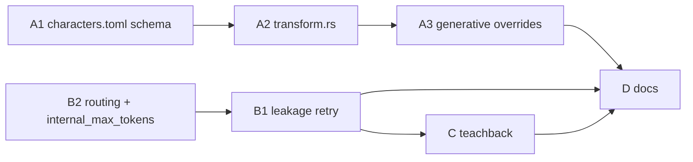

# Open Work — `/transform` Pantheon + Pedagogy Hardening + Dialogic Soul

**Status:** Phases A–C shipped (2026-06-11); Phase D partial (BRIDGE.md updated)  
**Pantheon decision:** [`PANTHEON_FINAL_PACK.md`](./PANTHEON_FINAL_PACK.md) — **Definitive Dozen** (12 personas)  
**Authority:** [`SESSION_HANDOFF_TRANSFORM_PERSONALITY_PEDAGOGY.md`](./SESSION_HANDOFF_TRANSFORM_PERSONALITY_PEDAGOGY.md) §6  
**Detail:** [`PEDAGOGY_PERSONALITY_ALIGNMENT_HANDOFF.md`](./PEDAGOGY_PERSONALITY_ALIGNMENT_HANDOFF.md) §5–6  
**Repo:** `~/Projects/_foundation-audit/survey_GZMO`

---

## Review verdict

The prior plan is **directionally correct** and maps cleanly to all 13 §6 backlog items. This revision fixes **integration inaccuracies** found in code review, adds **missing file touchpoints**, and tightens **acceptance criteria**.

### Verified against codebase

| Claim | Status |
|-------|--------|
| `characters.toml` has 10 superhero personas; notebook has 10 additional research personas | ✅ |
| Rust `transform.rs` — exact name match only, no LLM fallback, no per-persona params | ✅ |
| Shell `skill_transform.sh` — substring match, LLM custom profile, in-character intro | ✅ |
| `generative.rs` reads only `SYSTEM_PROMPT:` from `.transform_persona` | ✅ |
| `solution_leakage_penalty` in config, **unused** in orchestrator | ✅ |
| `internal_max_tokens` in config, **unused** in `agent_call()` | ✅ |
| No `pedagogy_internal` `TaskKind`; `GatewayRouter` exists | ✅ |
| Pedagogy wired only in `chat.rs` REPL; TUI has `/ops`/`/learn` skills but no `maybe_teach` | ✅ |
| Daemon has no pedagogy path | ✅ |
| `BRIDGE.md` stale (15 skills, no `/ops` `/learn`) | ✅ |
| Registry ships **17** handler skills + dynamic `/help` = **18** slash commands | ⚠️ see note |

**Skill-count note:** `build_chaos_skill_registry()` registers 17 skills before `/help` is rebuilt from that list. BRIDGE “15 → 17” refers to adding `/ops` and `/learn` to the pre-pedagogy pantheon; document **17 core + help** for accuracy.

---

## Deferred → see full handoff

**[`DEFERRED_WORK_HANDOFF.md`](./DEFERRED_WORK_HANDOFF.md)** — complete specs for TUI/daemon parity, multi-learner profiles, GeoGebra/graph editor, and shell script stubs.

---

## Open questions

1. **All 10 Pantheon additions?** Brings total to 20 personas (10 hero + 10 research). Subset OK — recommend shipping **Sherlock + Heaviside + Rick** first as smoke, then batch the rest.
2. **Cheaper orchestrator routing — Option B (recommended):** Single `pedagogy_internal` `TaskKind` for Diagnoser + Planner + Affective (+ `run_learn_prep`); Tutor stays on chat gateway.
3. **Teachback scope:** Notebook “Dialogic Soul” = student explains back in own words. Wiki `teachback-gates.md` = human validation before architectural shifts — **out of scope** for Phase C.

---

## Phase A — `/transform` Pantheon + Rust parity

### A1 — Schema + content (`characters.toml`)

Add 10 research personas from notebook `36ef9e7e`:

| # | Name | Category | Temp | Top-p |
|---|------|----------|------|-------|
| 1 | Oliver Heaviside | polymath | 0.70 | 0.90 |
| 2 | Margaret Cavendish | polymath | 0.70 | 0.90 |
| 3 | Viktor Schauberger | polymath | 0.70 | 0.90 |
| 4 | Alexander Grothendieck | polymath | 0.65 | 0.90 |
| 5 | Sherlock Holmes (BBC) | comedic | 0.65 | 0.85 |
| 6 | Rick Sanchez | comedic | 0.88 | 0.95 |
| 7 | Sterling Archer | comedic | 0.58 | 0.85 |
| 8 | Eric Cartman | comedic | 0.75 | 0.90 |
| 9 | Professor Farnsworth | comedic | 0.88 | 0.95 |
| 10 | Avery Bullock | comedic | 0.58 | 0.85 |

**New optional fields per entry:**

```toml
category = "polymath"          # superhero | polymath | comedic
temperature = 0.70
top_p = 0.90
structural_constraints = "..." # machine-readable rules
banned_expressions = ["quite", "indeed"]
mandatory_vocabulary = ["vector", "operator"]
```

Backfill existing heroes with `category = "superhero"`; omit temp/top_p to inherit engine defaults.

Also deserialize existing `catchphrases` (already in TOML, ignored by Rust today).

### A2 — `transform.rs`

| Change | Detail |
|--------|--------|
| Expand `CharacterEntry` | All new TOML fields + `catchphrases` |
| Match algorithm | **Substring contains** (match shell), then optional `strsim::jaro_winkler` ≥ 0.85 for typos — add `strsim` to `gzmo-core` if using |
| LLM fallback | Port `skill_transform.sh` L120–170: generate NAME/SPEECH/PERSONALITY/SYSTEM_PROMPT when no match + gateway present |
| In-character intro | Port shell L185–196: one-line intro after activation (optional `SkillOutput` append) |
| State file | Extend `.transform_persona` with `TEMPERATURE:`, `TOP_P:`, `CONSTRAINTS:`, `BANNED:`, `MANDATORY:` lines |
| List UX | `/transform` with no args → group by `category` |

### A3 — `generative.rs`

| Change | Detail |
|--------|--------|
| `read_persona_overrides()` | Parse temp/top_p from state file |
| `read_persona_constraints()` | Parse banned/mandatory/structural blocks |
| `build_system_prompt()` | Append constraint block after persona |
| Per-call sampling | **Do not** use `set_chaos_overrides` alone — it has no `top_p` and fights chaos bridge on the REPL gateway |

**Recommended approach:** Add `llm_complete_with_profile(gateway, skills_dir, system, user, PersonaOverrides)` that builds a **one-shot** `TurboQuantGateway` from `engine.active_engine()` cloned with persona `temperature`/`top_p`, or extend `LlmGateway` with `complete_with_params(CompletionParams)`. Avoid mutating the shared hot-swap gateway.

| Post-gen gate | For personas with `banned_expressions`, add retry loop (max 2) like existing quality gates |

### A4 — Tests (new)

`gzmo-core/src/skills/transform.rs` — `#[cfg(test)]` for: TOML parse with new fields, substring match, state file round-trip. No `skills::transform` test module exists today.

---

## Phase B — Pedagogy hardening

### B1 — Solution leakage enforcement (`orchestrator.rs`)

After Tutor `agent_call`:

1. **Heuristic scorer** (fast, no extra LLM):
   - Fenced code block with shell one-liner
   - Lines matching `^(sudo |chmod |systemctl |curl |wget |rm -rf )`
   - Answer starts with imperative verb + full command when `ZPD: you_do`
2. If score > 0 and `solution_leakage_penalty > 0`, retry Tutor with appended user block: *"Previous response leaked the solution. Rewrite with questions and graduated hints only."*
3. Max **2** retries; log warning if still leaky
4. Extend `EdfRecord` with `#[serde(default)] leakage_detected: bool`, `leakage_retries: u8`

### B2 — Cheaper routing (Option B)

#### `config.rs` — new `TaskKind`

```rust
PedagogyInternal,  // Display => "pedagogy_internal"
```

**Critical:** Override `is_background()` so `PedagogyInternal` returns **`false`** (same as `Chat`). Otherwise `[routing] cloud_first_background` will cloud-route internal agents during interactive mentor turns.

Add `default_engine()` → `"local"` and example mapping:

```toml
[routing.mappings]
pedagogy_internal = "librarian"   # or smaller local profile on :8001
```

#### `orchestrator.rs`

```rust
pub async fn run(
    &self,
    tutor_gateway: &dyn LlmGateway,
    internal_gateway: &dyn LlmGateway,
    input: OrchestratorInput<'_>,
) -> Result<OrchestratorOutput>
```

- Diagnoser, Planner, Affective, `run_learn_prep` → `internal_gateway`
- Tutor → `tutor_gateway`
- `agent_call(..., gateway, ...)` — pass `self.config.internal_max_tokens` via `set_chaos_overrides(0.0, internal_max_tokens)` on a **dedicated** internal gateway leaf (not the REPL hot-swap gateway)

#### `pedagogy_bridge.rs` + `chat.rs`

`chat.rs` already builds `GatewayRouter` (L192). Change `maybe_teach` signature:

```rust
maybe_teach(&config, router, &hot_swap_gateway, input, messages)
```

- Tutor: `hot_swap_gateway` (chaos-aware, user-selected engine) — **current behavior**
- Internal: `router.gateway(TaskKind::PedagogyInternal)`

Do **not** create a second router in `boot()`; use the existing one.

---

## Phase C — Dialogic Soul (teachback)

Lightweight v1 — not full tripartite Task/Context/Coordination prompt layers.

### `config.rs`

`teachback_interval: u32` (default **8**, `0` = disabled)

### `session.rs`

`turns_since_teachback: u32` — persisted in `data/learner/session.json`

### `pedagogy_bridge.rs`

Increment counter after each successful `maybe_teach` teach path; reset when teachback fires.

### `orchestrator.rs`

When `turns_since_teachback >= teachback_interval`:

1. Append to Tutor user block: *"Teachback checkpoint. Before continuing, ask the student to explain what they've learned in their own words."*
2. On the **following** turn, if user message looks like an explanation (length > N, not a question), run Diagnoser with `TEACHBACK_MODE` prefix and boost stealth weighting in EDF `evidence` field

### `learner.rs`

Add `record_teachback(summary: &str)` → push distilled concept into `semantic.mastery_vectors` (dedupe, cap list length).

**Clarification:** This is student teachback per notebook 36ef9e7e, not wiki ACP architectural validation gates.

---

## Phase D — Documentation parity

### `~/gzmo_skills/BRIDGE.md`

- Skill count → **17** (+ `/help` rebuilt dynamically = 18 commands)
- Add rows: `/ops` (mutation), `/learn` (mutation)
- Note pedagogy orchestrator is **chat REPL only** until TUI/daemon parity ships

### `docs/OPEN_WORK_COMPLETION.md` (after implementation)

Session record of what shipped vs remains.

### Optional cleanup

- `skills.toml`: remove `handler = "skill_ops.sh"` / `skill_learn.sh` or add no-op shell stubs that echo "handled by Rust registry"

---

## Implementation order (recommended)



**Rationale:** B2 is highest ops value (4×27B cost). Phase A content is large but independent. B1 + C touch orchestrator — sequence to avoid merge conflicts.

---

## Verification

### Automated

```bash
cd ~/Projects/_foundation-audit/survey_GZMO
cargo build -p gzmo-core -p gzmo-cli
cargo test -p gzmo-core pedagogy:: identity::
cargo test -p gzmo-core transform   # after A4 tests added
cargo clippy -p gzmo-core -p gzmo-cli -- -D warnings
```

### Manual

```bash
cargo run -p gzmo-cli -- chat

# Phase A
/transform                         # categorized list
/transform Sherlock                # BBC persona + constraints
/transform CustomObscureName       # LLM fallback if gateway up
/joke                              # persona temp/constraints visible in tone

# Phase B
# gzmo.toml: pedagogy_internal = librarian (smaller model)
★ you › what does chmod 755 do?    # Socratic, no full command
★ you › just give me the command   # ops intent or max hints, not leakage

# Phase C
# ~8 teaching turns → teachback prompt
```

### Regression

- `/ops`, `/learn`, mentor default path still work
- Chaos persona shift events unchanged
- Existing `edf_log.jsonl` lines still parse (`#[serde(default)]` on new fields)

---

## File touchpoint summary

| File | Phases |
|------|--------|
| `skills/characters.toml` | A1 |
| `gzmo-core/src/skills/transform.rs` | A2, A4 |
| `gzmo-core/src/skills/generative.rs` | A3 |
| `gzmo-core/src/config.rs` | B2, C |
| `gzmo-core/src/pedagogy/orchestrator.rs` | B1, B2, C |
| `gzmo-core/src/pedagogy/edf.rs` | B1 |
| `gzmo-core/src/pedagogy/session.rs` | C |
| `gzmo-core/src/pedagogy/learner.rs` | C |
| `gzmo-core/src/gateway.rs` | A3 (optional `complete_with_params`) |
| `gzmo-cli/src/pedagogy_bridge.rs` | B2, C |
| `gzmo-cli/src/chat.rs` | B2 |
| `~/gzmo_skills/BRIDGE.md` | D |
| `gzmo.toml` (example mappings) | B2 |
