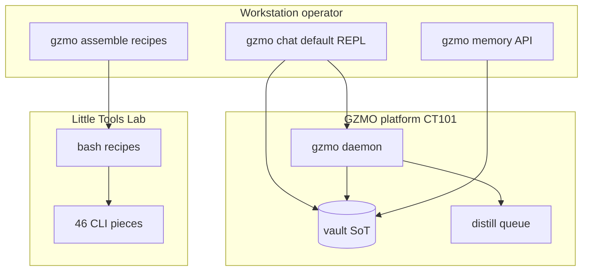

# Operator frontend decision — `gzmo_cli` (canonical)

**Status:** Accepted (2026-07-10)  
**Supersedes for operator UX:** [ARCHITECTURE_GZMO_PLATFORM.md](./ARCHITECTURE_GZMO_PLATFORM.md) §1 / §7 (pi-rust as daily frontend), [PI_OPERATOR_GUIDE.md](./PI_OPERATOR_GUIDE.md) “canonical for pi-rust” claim.

---

## Context

Little Tools Lab ships **46 puzzle pieces** wired by bash recipes (`gzmo assemble`, `gzmo-handoff`). The GZMO **daemon** runs headless on CT101; something on the workstation must be the **operator socket**.

Prior decision (2026-06): **Pi** (`~/.pi/agent/`) as the one daily frontend; `gzmo chat` / `gzmo tui` labeled legacy harnesses.

That split hurt:

- Two incomplete stacks (Pi MCP graphs vs gzmo-core inline loops)
- Session lifecycle hooks documented but not closed on the Pi side
- `gzmo chat` already owns `AgentSession`, hot memory, chaos skills, gateway — but was deprioritized

---

## Decision

**`gzmo_cli` is the main operator frontend.**

| Surface | Role |
|---------|------|
| **`gzmo`** (default) / **`gzmo chat`** | Primary interactive REPL — cognition + tools + `AgentSession` |
| **`gzmo assemble <recipe>`** | Run Little Tools Lab assembly recipes |
| **`gzmo memory *`** | Platform memory API (turn-start, search, recall, status) |
| **`gzmo daemon`** | Headless platform (unchanged; CT101) |
| **Pi** (`~/.pi/agent/`) | **Optional auxiliary** — not the product UI; no parallel memory paths |

**One spine:** all operator paths read `gzmo.toml` and use gzmo-core memory — no inventing parallel Redis/vault protocols.

---

## Architecture

---

## Pi policy (demoted, not deleted)

Pi may remain installed for experiments **only if**:

1. It calls **`gzmo memory *`** or **`gzmo assemble`** — never direct Redis/vault SQL
2. It does **not** own session distill authority (daemon + `session_end` → queue wins)
3. Synapse `session_end` events are optional telemetry, not the primary lifecycle

Do **not** invest in Pi MCP parity audits as a product requirement.

---

## Maturation roadmap (`gzmo_cli`)

| Priority | Work |
|----------|------|
| **P1** ✅ | Session end → enqueue distill from **chat** (not only synapse pull) |
| **P2** ✅ | Wire `gzmo assemble` into chat slash commands (`/calibrate`, `/cognition-smoke`, `/ops-smoke`) |
| **P3** | Promote default entry: `gzmo` = chat; optional `gzmo debug-chat` alias for harness parity |
| **P4** | TUI: wire `PlatformMemory` or deprecate `--repl` explicitly |
| **P5** | Emit `EventSource::GzmoCli` synapse events on session end from chat |

Lab recipes are the **incubator**; chat is the **runner**. CT101 is **not** grafted loop-by-loop — see [LAB_TREATMENT.md](../../little-tools-lab/docs/LAB_TREATMENT.md).

---

## Consequences

**Positive**

- Closed loop: operator → `AgentSession` → daemon distill queue → vault
- Puzzle pieces invoked via `gzmo assemble`, not ad-hoc Pi scripts
- Single config spine (`gzmo.toml`)

**Negative / migration**

- Pi docs and skills become historical; update cards when touched
- Workstation Synapse path to CT101 less critical if chat runs distill locally
- `PI_FRONTEND_SPLIT.md` placement table still valid for **daemon on CT101**, not for **who operates**

---

## References

| Doc | Role |
|-----|------|
| [ARCHITECTURE_GZMO_PLATFORM.md](./ARCHITECTURE_GZMO_PLATFORM.md) | Platform layers (update §7 to point here) |
| [catalog/ASSEMBLIES.md](../../little-tools-lab/catalog/ASSEMBLIES.md) | Recipe catalog |
| [LAB_TREATMENT.md](../../little-tools-lab/docs/LAB_TREATMENT.md) | Lab builds GZMO-next; CT101 boundary |
| [CT101_BOUNDARY.md](./CT101_BOUNDARY.md) | No per-loop CT101 swap |
| [PI_FRONTEND_SPLIT.md](./PI_FRONTEND_SPLIT.md) | Topology (daemon CT101); operator row superseded |

---

*End.*
