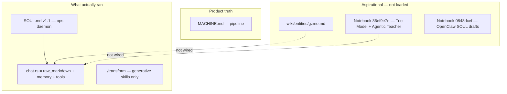
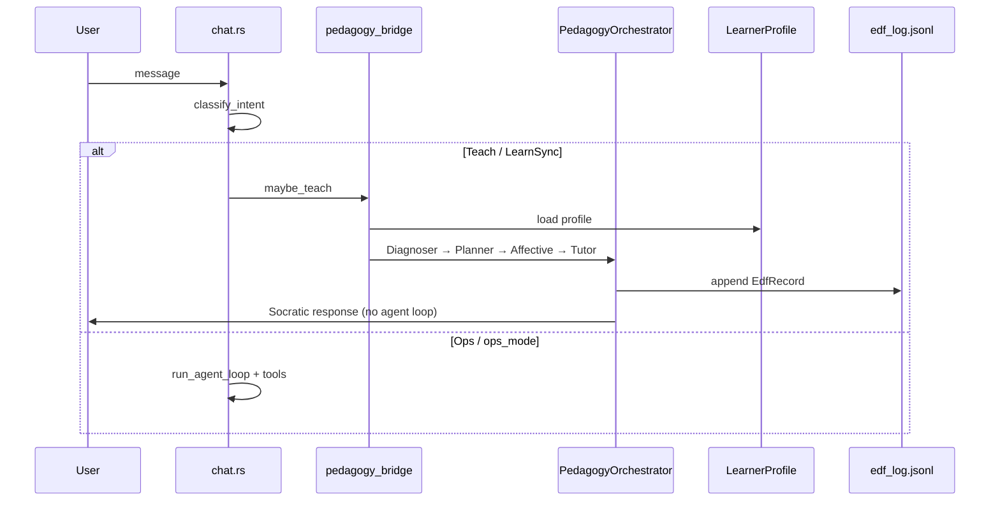

# Handoff — GZMO Personality & Pedagogical Vision Alignment (implementation detail)

**Status:** Phases 1–5 shipped (2026-06-11); Phase 6 tooling expansion remains optional  
**Repo:** `~/Projects/_foundation-audit/survey_GZMO`  
**Full session handoff (start here):** [`SESSION_HANDOFF_TRANSFORM_PERSONALITY_PEDAGOGY.md`](./SESSION_HANDOFF_TRANSFORM_PERSONALITY_PEDAGOGY.md) — covers `/transform`, four NotebookLM notebooks, personality audit, plan decisions, and this implementation  
**Planning artifact:** `.cursor/plans/gzmo_personality_alignment_8acb33df.plan.md` (do not edit — reference only)

---

## 0. Mission

Align **runtime GZMO personality** with the **Friendly Linux Mentor + Agentic Teacher** vision documented in wiki and NotebookLM research — without breaking ops/pipeline identity in `MACHINE.md`.

**User decisions locked in during planning:**

| Decision | Choice |
|----------|--------|
| Default identity | **Mentor-first** (Socratic), not ops-dump |
| Implementation depth | **Full Agentic Teacher stack** (not SOUL-only rewrite) |
| `/transform` | Stays **separate** — costume for generative slash skills, not core soul |
| `MACHINE.md` | **Unchanged** — product = distillation pipeline; mentor *operates* it |

---

## 1. Problem diagnosis (pre-implementation)

GZMO had **three identity layers that disagreed**:



### Three material gaps

1. **Persona drift** — Live `SOUL.md` v1.1 was a terse Chief of Staff / ops daemon ("execution over simulation", zero pleasantries). Wiki and notebooks described **Friendly Linux Mentor** with Socratic scaffolding, Gear Philosophy, language mirroring.

2. **Teaching Moment conflict** — Wiki entity `teaching-moment.md` said "solution first, then explain flags." Agentic Teacher Rule 1 says **zero solution leakage / productive struggle**. Resolved by **ZPD-aware delivery** in SOUL v2: model → guide → challenge; full solutions only in `/ops` mode.

3. **Research not runtime** — Agentic Teacher, Learner Profile, EDF, Trio Model, Dialogic Soul existed only as wiki entities and NotebookLM sources. No Rust modules, no learner schema, no orchestrator.

### Secondary finding: `identity.rs` parser mismatch

YAML frontmatter used `persona_name`; parser expected `persona`. Only `raw_markdown` body mattered at runtime. Fixed to accept both keys.

---

## 2. Source documents used

### NotebookLM notebooks (queried via MCP during planning)

| Notebook | ID | Role in alignment |
|----------|-----|-------------------|
| **Pedagogy + Pantheon** | [36ef9e7e-1111-473d-908c-7f8533c9a67c](https://notebooklm.google.com/notebook/36ef9e7e-1111-473d-908c-7f8533c9a67c) | **Primary pedagogy source** — Trio Model, flipped classroom, student-centered pedagogy, Agentic Teacher 4-agent architecture, ZPD, productive struggle, stealth assessment |
| **GZMO OpenClaw SOUL** | [0848dcef-79d1-4945-b564-16cfa7c20404](https://notebooklm.google.com/notebook/0848dcef-79d1-4945-b564-16cfa7c20404) | GZMO persona drafts, SOUL.md evolution, Chief of Staff + Gear, security guardrails, dreams protocol |
| **GZMO agent architecture** | [a99842e0-a656-4a39-ae99-190f5fe884d9](https://notebooklm.google.com/notebook/a99842e0-a656-4a39-ae99-190f5fe884d9) | Multi-agent topology, prompt caching, sub-agent delegation vs runtime persona overlay |
| **Humor / aphorisms / quotes** | [db7e56dc-cbb9-47c1-951b-84f7e03d7ff3](https://notebooklm.google.com/notebook/db7e56dc-cbb9-47c1-951b-84f7e03d7ff3) | Indirect — linguistic compression; informs `/transform` Pantheon research, not core mentor identity |

**Note:** None of the notebooks documented `/transform` as a slash command. The link to Pantheon is via `skills/characters.toml` header citing notebook `36ef9e7e`.

### Wiki entities (ingested research → knowledge graph)

| Entity | Path | Used for |
|--------|------|----------|
| GZMO persona synthesis | `wiki/entities/gzmo.md` | Friendly Linux Mentor, Action > Performance, Gear Philosophy, language mirroring |
| AI Agentic Teacher | `wiki/entities/ai-agentic-teacher.md` | Think–Plan–Act, 4-agent orchestration → **status: stable** |
| Learner Profile | `wiki/entities/learner-profile.md` | Tripartite memory schema → **status: stable** |
| EDF framework | `wiki/entities/evidence-decision-feedback-edf-framework.md` | Evidence → Decision → Feedback → **status: stable** |
| Teaching Moment | `wiki/entities/teaching-moment.md` | Superseded by ZPD-aware rule in SOUL v2 |
| Friendly Linux Mentor | `wiki/entities/friendly-linux-mentor.md` | Role definition |
| Tutor/Socratic Agent | `wiki/entities/tutor-socratic-agent-pedagogical-engine.md` | Tutor agent behavior |
| Diagnoser, Curriculum Planner, Affective | `wiki/entities/diagnoser-evaluator-agent.md`, etc. | Internal agent roles |
| Dialogic Soul / ACP | `wiki/sources/drive-research-redefining-agentic-soulmd-to-dialog-micro0*.md`, `wiki/entities/active-conversation-protocol-acp.md` | **Not implemented** — Phase 6 stretch (teachback, context dilution) |

### Primary wiki source reports

- `wiki/sources/drive-research-ai-agentic-teacher.md`
- `wiki/sources/drive-research-ai-agentic-teacher-research-report.md`

### Runtime / product docs (codebase)

| Document | Role |
|----------|------|
| `SOUL.md` | **Only file injected into every chat turn** (via `IdentityEngine` → `chat.rs`) |
| `MACHINE.md` | Product identity — pipeline, not persona |
| `docs/MEMORY_ARCHITECTURE_SPEC.md` | Agent memory layers; learner profile is a **parallel** store under `data/learner/` |
| `README.md` | Updated with pedagogy section and new slash commands |
| `gzmo.toml` `[pedagogy]` | Runtime config |
| `skills/characters.toml` | `/transform` Pantheon (separate from core identity) |
| `gzmo_skills/BRIDGE.md` | Slash-command routing architecture (15→17 skills with `/ops`, `/learn`) |

---

## 3. What was implemented

### Architecture (shipped)



### Phase checklist

| Phase | Status | Deliverable |
|-------|--------|-------------|
| **1 — SOUL v2** | Done | `SOUL.md` v2.0 mentor-first; `identity.rs` `persona_name` fix |
| **2 — Learner Profile** | Done | `gzmo-core/src/pedagogy/learner.rs`, `data/learner/profile.json`, tools `learner_recall` / `learner_update` |
| **3 — Orchestrator** | Done | `gzmo-core/src/pedagogy/orchestrator.rs` — 4 sequential LLM calls |
| **4 — EDF + stealth** | Done | `pedagogy/edf.rs`, `data/pedagogy/edf_log.jsonl`, stealth metrics in Diagnoser output |
| **5 — Trio + ops + /learn** | Done | `session.rs`, `trio.rs`, `intent.rs`, `/ops`, `/learn` Rust skills |
| **6 — Tooling expansion** | **Not done** | Graph editor, GeoGebra, cognitive offloading, Dialogic Soul layers |

### Key files (read order for next agent)

| File | Role |
|------|------|
| `SOUL.md` | Canonical runtime persona (hot-reload) |
| `gzmo-core/src/pedagogy/mod.rs` | Module exports |
| `gzmo-core/src/pedagogy/orchestrator.rs` | 4-agent loop + agent system prompts |
| `gzmo-core/src/pedagogy/intent.rs` | Mentor vs ops routing heuristics |
| `gzmo-core/src/pedagogy/learner.rs` | Tripartite learner memory |
| `gzmo-core/src/pedagogy/edf.rs` | EDF records + stealth metrics |
| `gzmo-core/src/pedagogy/graph.rs` | Prerequisite graph loader |
| `gzmo-core/src/pedagogy/session.rs` | `ops_mode`, learn prep state |
| `gzmo-cli/src/pedagogy_bridge.rs` | Chat boot + `maybe_teach()` |
| `gzmo-cli/src/chat.rs` | System prompt assembly, pedagogy path before agent loop |
| `gzmo-core/src/config.rs` | `PedagogyConfig`, `PedagogyDefaultMode` |
| `gzmo-core/src/skills/ops.rs`, `learn.rs` | `/ops`, `/learn` slash skills |
| `gzmo-core/src/tools/learner.rs` | Agent-callable learner memory tools |
| `data/pedagogy/graphs/linux-basics.yaml` | Seed curriculum graph |
| `data/learner/profile.json` | Seed learner profile |
| `data/learner/session.json` | Created at runtime (ops mode, learn prep) |

### Config (`gzmo.toml`)

```toml
[pedagogy]
enabled = true
default_mode = "mentor"   # or "ops"
learner_data_dir = "data/learner"
prerequisite_graphs_dir = "data/pedagogy/graphs"
edf_log_path = "data/pedagogy/edf_log.jsonl"
max_hint_level = 5
solution_leakage_penalty = 1.0
internal_max_tokens = 512
```

### User-facing commands

| Command | Behavior |
|---------|----------|
| *(default)* | Teaching turns → 4-agent orchestrator → Socratic response |
| `/ops` | Toggle execution-first mode; bypasses orchestrator |
| `/learn <topic>` | Flipped-classroom prep notes, then Socratic sync |
| `/transform <name>` | **Unchanged** — persona overlay for generative slash skills only |

Phrases like "just run it", "execute now" also route to ops agent loop.

---

## 4. Key insights (for continuity)

### Identity is layered — do not collapse it

- **`SOUL.md`** = who GZMO *is* when speaking (mentor orchestrator)
- **`MACHINE.md`** = what the platform *does* (distillation pipeline)
- **`data/learner/`** = who the *operator-as-student* is (pedagogical memory)
- **`/transform`** = temporary voice costume for `/joke`, `/poem`, etc. — not soul

Notebook `a99842e0` argues against mutating main prompt for persona (prompt-cache discipline). Our design respects that: static SOUL prefix + dynamic learner suffix + internal orchestrator scratchpad (never shown to user).

### Mentor-first does not mean no tools

In **ops mode**, GZMO uses the full agent loop (file read/write, shell, vault, subagents). In **mentor mode**, the orchestrator returns text directly — **4 extra LLM calls per teaching turn**. This is expensive on local 27B; see open decisions below.

### Teaching Moment was the wrong bridge

"Code first, then explain" conflicts with productive struggle. SOUL v2 replaces it with explicit ZPD phases (I Do / We Do / You Do) and reserves full solutions for `/ops`.

### Wiki was ahead of runtime; now partially closed

These wiki entities moved from `draft` → **`stable`** because Rust modules exist:

- `ai-agentic-teacher.md`
- `learner-profile.md`
- `evidence-decision-feedback-edf-framework.md`

Many related entities (prerequisite graph nodes, stealth assessment detail, Dialogic Soul) remain draft-only.

### `/transform` vs mentor identity (from earlier conversation)

| | `/transform` | Core GZMO (SOUL v2) |
|--|-------------|---------------------|
| Scope | Generative slash skills | All chat + orchestrator |
| Persistence | `skills/.transform_persona` | `SOUL.md` + hot-reload |
| Pantheon | 10 comic heroes in `characters.toml` | Notebook 36ef9e7e has richer Pantheon (Sherlock, Heaviside, etc.) — **not expanded yet** |
| Chaos | `PersonaShift` event | N/A |

Expanding `characters.toml` from Pantheon notebook is independent future work.

---

## 5. Open decisions (unresolved — pick up here)

1. **Single learner vs multi-user** — `LearnerProfile.learner_id` is hardcoded `"operator"`. Key by user ID if GZMO serves multiple humans.

2. **Orchestrator cost** — 4 sequential LLM calls per teaching turn on Prime 27B. Consider:
   - Smaller model on separate port for Diagnoser + Affective
   - Combine Diagnoser + Planner into one call
   - Cache orchestrator outputs for similar inputs

3. **Prerequisite graph coverage** — Only `linux-basics.yaml` seeded. Expand domains or ingest from wiki entities.

4. **Dialogic Soul / teachback** — Notebook + wiki describe tripartite Task/Context/Coordination layers and teachback gates to fight context dilution over long sessions. **Not implemented** — SOUL still monolithic markdown body.

5. **Daemon / TUI parity** — Pedagogy orchestrator wired in `gzmo chat` REPL. **TUI runner** got `/ops`/`/learn` skills in registry but not full `pedagogy_bridge` integration.

6. **Shell fallback scripts** — `skills.toml` references `skill_ops.sh` / `skill_learn.sh` which do not exist; Rust registry handles these first, so shell is never invoked.

7. **`solution_leakage_penalty` config** — Present in `gzmo.toml` but not yet used to score/retry Tutor output.

---

## 6. Phase 6 backlog (from plan)

- Prerequisite graph editor / wiki ingest
- Cognitive offloading (Python sandbox, diagrams) through Tutor agent
- GeoGebra / visualization stub
- Promote hot orchestrator paths to `SubagentRunner` parallel agents
- Expand Pantheon in `characters.toml` from notebook 36ef9e7e
- Per-persona temperature/top-p from Pantheon research
- RL / productive struggle enforcement beyond prompting (research says prompting alone is insufficient)

---

## 7. Verify

```bash
cd ~/Projects/_foundation-audit/survey_GZMO

# Build + unit tests
cargo build -p gzmo-core -p gzmo-cli
cargo test -p gzmo-core pedagogy::
cargo test -p gzmo-core identity::

# Interactive smoke
cargo run -p gzmo-cli -- chat
# Default mentor path (needs LLM at :8000):
#   ★ you › what is a symlink?
# Ops escape:
#   /ops
#   ★ you › show disk usage
# Flipped classroom:
#   /learn systemd units
#   ★ you › why does systemctl enable matter?

# Inspect artifacts
cat data/learner/profile.json
tail data/pedagogy/edf_log.jsonl
cat data/learner/session.json   # after /ops or /learn
```

---

## 8. Relationship to `gzmo_skills` workspace

The workspace at `~/gzmo_skills` contains only `BRIDGE.md` (slash-command routing notes). **All implementation lives in `survey_GZMO`.** Update `BRIDGE.md` separately if documenting `/ops` and `/learn` in the 17-skill pantheon table.

---

## 9. Suggested next session prompts

- "Wire pedagogy orchestrator into TUI runner and daemon chat paths"
- "Implement Dialogic Soul tripartite prompt layers in orchestrator"
- "Expand characters.toml from Pantheon notebook — Sherlock, Heaviside, Rick Sanchez"
- "Add smaller-model routing for Diagnoser/Affective in `[routing.mappings]`"
- "Enforce solution_leakage_penalty with Tutor retry loop"
