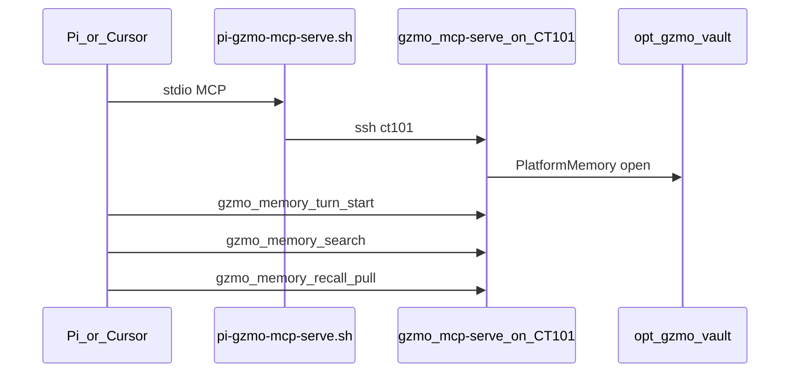

# Pi ↔ GZMO living memory (CT101)

**Status:** Living attach (2026-07-17)  
**Related:** [CT101_DEPLOY.md](./CT101_DEPLOY.md), [CT101_BOUNDARY.md](./CT101_BOUNDARY.md), [CT101_RESTORE_LIVING.md](./CT101_RESTORE_LIVING.md)

Pi is the **fast operator hands**. CT101 holds the **living vault** (~60k facts). Do not point Pi at workstation `data-next/` or a local empty `data/vault.db`.

---

## Preferred path — MCP on CT101



### Install (workstation)

```bash
cd /home/gzmo/github-clone/GZMO
# NEO4J_PASSWORD from env or pulled from CT101 /opt/gzmo/.env
bash scripts/install-shared-mcp.sh
```

This merges into `~/.pi/agent/mcp.json` and `~/.cursor/mcp.json`:

| Server | Role |
|--------|------|
| `gzmo-living` | `scripts/pi-gzmo-mcp-serve.sh` → CT101 `gzmo mcp-serve` with `/opt/gzmo/gzmo.toml` |
| `memory` | Neo4j MCP (`bolt://192.168.31.202:7687`) — password not committed |

Product laptop attach stays on **`gzmo-memory`** (`~/.gzmo`) — do not overwrite it with the living bridge.

### Habitual ops glance (session start / “is the stack ok?”)

On CT101 Pi (`~/.pi/agent/system.md`) and whenever attach/health is in doubt:

1. `gzmo_memory_status` — vault under `/opt/gzmo/`, ~60k facts  
2. `gzmo_ops_health` — living probes (LLM, Qdrant, honeypot drift, Redis, Neo4j)  
3. `gzmo_discovery_status` — discovery `state.json` + last cycle `bash_calls` / `probe_required_failed`  

One-line summary: `OPS: vault=<facts> health=<ok|warn|fail> discovery=<…> bash_calls=<n>`.

### Per-turn memory tool use

1. `gzmo_memory_turn_start` — clear scratch  
2. `gzmo_memory_search` — honeypot/vault RAG (+ scratch)  
3. `gzmo_memory_recall_pull` — `[RECALL]` block  
4. Optional: `gzmo_memory_chain` — provenance for a fact id  

Wrong attach: MCP refuses vaults below the living floor (≥500 curated facts, post 2026-07-24 data migration) unless `GZMO_ALLOW_LAB_VAULT=1`.

---

## Shell bridge (optional)

Still valid for scripts; must hit CT101:

```bash
ssh ct101 'cd /opt/gzmo && GZMO_CONFIG=/opt/gzmo/gzmo.toml \
  /opt/gzmo/current/target/release/gzmo memory status'
```

Workstation `./scripts/pi-gzmo-memory.sh` against a local clone vault is **lab only** (`GZMO_ALLOW_LAB_VAULT=1`).

---

## Prerequisites

- `ssh ct101` works (ProxyJump pve; sidecar key authorized)  
- CT101 `gzmo-daemon` living; binary at `/opt/gzmo/current/target/release/gzmo`  
- Product gate: `bash scripts/ct101-living-smoke.sh`

---

## Anti-patterns

- Running local `gzmo mcp-serve` with workstation `gzmo.toml` while Qdrant points at `.202` (wrong SQLite)  
- Treating Observatory / inactive `gzmo-serve` as production health  
- Importing `data-next/` into CT101 vault without an explicit migrate decision  
