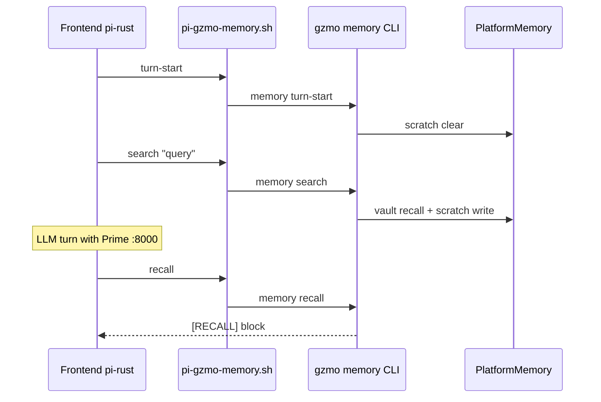

# Pi (frontend) ↔ GZMO Platform memory

**Status:** P3 (2026-06-04)  
**Architecture:** [ARCHITECTURE_GZMO_PLATFORM.md](./ARCHITECTURE_GZMO_PLATFORM.md)

Pi-rust is the **operator frontend**; GZMO is the **memory platform**. Pi must not talk to Redis or vault directly — use the bridge below.

---

## Per-turn workflow



| Step | When | Command |
|------|------|---------|
| 1 | New user message | `./scripts/pi-gzmo-memory.sh turn-start` |
| 2 | Need prior facts | `./scripts/pi-gzmo-memory.sh search "your query" [--limit 5]` |
| 3 | Build LLM context | `./scripts/pi-gzmo-memory.sh recall` → paste `[RECALL]` into context |
| 4 | New conversation | `./scripts/pi-gzmo-memory.sh session-new` |

Shortcut: `./scripts/pi-gzmo-memory.sh prep "query"` = turn-start + search.

**Tiered memory (Phase 3):** Append local infra context after recall when needed:

```bash
./scripts/pi-gzmo-memory.sh recall --with-context
./scripts/pi-gzmo-memory.sh prep "query" --with-context
./scripts/pi-gzmo-memory.sh recall --with-context --with-reference
```

Reads `~/.pi/agent/MEMORY_CONTEXT.md` (override: `PI_MEMORY_CONTEXT`).

---

## Session id

Stable id file: `data/pi-frontend-session.id`  
Override: `GZMO_SESSION_FILE`  
Env passed to gzmo: `GZMO_SESSION_ID`

```bash
./scripts/pi-gzmo-memory.sh session      # show id
./scripts/pi-gzmo-memory.sh session-new  # rotate
```

---

## Prerequisites

```bash
cd ~/Projects/_foundation-audit/survey_GZMO
cargo build --release -p gzmo-cli
./scripts/verify-production.sh   # optional
```

`GZMO_CONFIG` defaults to repo `gzmo.toml` (`[engine]`, `[context_memory]`, `[redis]`).

---

## Pi agent instructions (copy into session)

When working in `survey_GZMO` and you need GZMO honeypot/vault memory:

1. Run `./scripts/pi-gzmo-memory.sh turn-start` at the start of each new user task.
2. Run `./scripts/pi-gzmo-memory.sh search "<topic>"` before claiming missing context.
3. Run `./scripts/pi-gzmo-memory.sh recall` and treat the `[RECALL]` block as authoritative for this turn.
4. Do **not** use `gzmo chat` as the product UI — it is a legacy harness only.

---

## In-process alternative

Rust tools in `gzmo-core`: `GzmoMemorySearchTool`, `GzmoMemoryRecallPullTool`, `GzmoMemoryStatusTool` — for embedding in a native binary later.

---

## Verify bridge

```bash
chmod +x ./scripts/pi-gzmo-memory.sh   # once
./scripts/pi-gzmo-memory.sh status
./scripts/pi-gzmo-memory.sh prep "GZMO identity" --limit 3
./scripts/pi-gzmo-memory.sh recall   # expect [RECALL] block
```

**Smoke (2026-06-04):** `turn-start`, `search`, `recall` OK; embedding/rerank hosts may warn offline — vault still returns keyword hits.

---

## References

| Item | Path |
|------|------|
| CLI implementation | `gzmo-cli/src/memory_cmd.rs` |
| Platform API | `gzmo-core/src/platform_memory.rs` |
| Pi working memory | `.pi/WORKING_MEMORY.md` |
