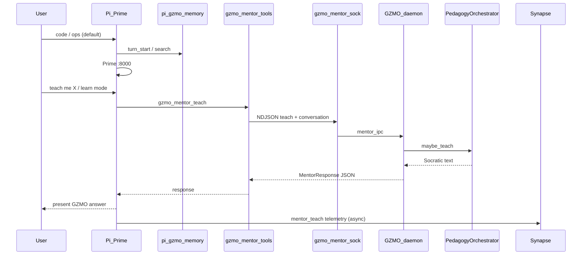

# Pi ↔ GZMO Mentor Dialog — Implementation Handoff

> **Superseded for ops and next steps by** [`PI_GZMO_PLATFORM_IMPLEMENTATION_HANDOFF.md`](./PI_GZMO_PLATFORM_IMPLEMENTATION_HANDOFF.md)  
> (mentor + synapse + session_end distill — comprehensive step-by-step).  
> This file is kept for historical phase specs and plan traceability.

**Status:** Shipped (2026-06-11) — mentor bridge + session_end distill  
**Repo:** `~/Projects/_foundation-audit/survey_GZMO`  
**Plan authority:** `.cursor/plans/pi_gzmo_mentor_dialog_03feb791.plan.md` (do not edit)  
**Foundation:** Mentor Unix-socket API + Pi `gzmo_mentor_*` tools + `session_end` → `gzmo distill pi`

This document is the **complete handoff** for the next implementation agent. It states what is already live, what remains, locked product decisions, file touchpoints, acceptance criteria, and known bugs.

---

## 1. Executive summary

**Goal:** Pi acts as the front-end (voice/UI); GZMO daemon runs the Socratic mentor stack over the existing Unix socket. Prime stays the default brain for coding and ops; GZMO mentor is invoked for teaching (one-off or learn-mode session).

**Shipped:** Pi `gzmo_mentor_*` tools (`~/.pi/agent/skills/gzmo-integration/`), `scripts/pi/mentor.sh`, learn mode, Synapse `mentor_teach` / `mentor_learn_*`, and `session_end` → `gzmo distill pi` (Pi notifier + daemon `[synapse_pull]`).

**Remaining (optional):** MCP `gzmo_mentor_*` on `mcp-serve`; topic-shift embedding distill trigger (phase 2).

---

## 2. Locked product decisions (do not re-litigate)

| Decision | Choice | Rationale |
|----------|--------|-----------|
| **Default cognition** | Pi + Prime `:8000` | User needs Prime intelligence for coding/ops |
| **Mentor invoke** | Both: one-off tool + learn-mode session | Flexibility without replacing Prime |
| **Learner profile** | Shared `operator` | Unified teachback/history with `gzmo chat` / TUI |
| **Learner ID env** | `GZMO_LEARNER_ID=operator` on daemon + Pi mentor calls | Matches multi-learner wiring already shipped |
| **Dialog transport** | Unix socket NDJSON (`data/gzmo_mentor.sock`) | Shipped; not Synapse, not HTTP |
| **Synapse role** | Telemetry only (Pi → bus → daemon pull → episodic) | Not request/response dialog |
| **Ops execution** | Out of scope for mentor API | Ops stays Pi+Prime or `gzmo chat` agent loop |

---

## 3. What is already shipped (do not re-implement)

### 3.1 Pedagogy + deferred work (prior sessions)

| Area | Status | Key files |
|------|--------|-----------|
| Definitive Dozen `/transform` | Shipped | `skills/characters.toml`, `transform.rs` |
| Chat/TUI mentor path | Shipped | `chat.rs`, `tui/runner.rs`, `tui/components/agent.rs` |
| Multi-learner `data/learner/<id>/` | Shipped | `config.rs`, `learner.rs`, `--learner` / `GZMO_LEARNER_ID` |
| Prerequisite graphs + validate CLI | Shipped | `graph.rs`, `pedagogy_graph_cmd.rs`, `graphs/*.yaml` |
| Shell stubs `skill_ops.sh` / `skill_learn.sh` | Shipped | `skills/` |

See [`DEFERRED_WORK_HANDOFF.md`](./DEFERRED_WORK_HANDOFF.md) §0 and [`OPEN_WORK_IMPLEMENTATION_PLAN.md`](./OPEN_WORK_IMPLEMENTATION_PLAN.md).

### 3.2 Headless mentor API (prior session)

| Component | Path | Notes |
|-----------|------|-------|
| Socket server | `gzmo-cli/src/mentor_ipc.rs` | Methods: `ping`, `status`, `teach` |
| CLI client | `gzmo-cli/src/mentor_cmd.rs` | `gzmo mentor ping\|status\|teach` |
| Daemon wiring | `gzmo-cli/src/daemon_cmd.rs` | Spawns mentor server when `mentor_api_enabled` |
| Config | `gzmo.toml` `[pedagogy]` | `mentor_api_enabled = true`, `mentor_socket = "data/gzmo_mentor.sock"` |
| Bridge doc | `~/gzmo_skills/BRIDGE.md` | Protocol + verify commands |

**Protocol (one line per connection):**

```json
{"method":"teach","message":"what is a symlink?","conversation":[{"role":"user","content":"..."},{"role":"assistant","content":"..."}]}
{"method":"ping"}
{"method":"status"}
```

**Response fields:** `ok`, `response`, `mentor`, `ops_mode`, `learner_id`, `error`.

### 3.3 Pi integration (shipped)

| Piece | Path | Role |
|-------|------|------|
| GZMO skill tools | `~/.pi/agent/skills/gzmo-integration/index.ts` | `gzmo_mentor_*`, `gzmo_health`, `gzmo_dream`, `gzmo_chaos`, … |
| Mentor bridge | `scripts/pi/mentor.sh` | NDJSON → `data/gzmo_mentor.sock` |
| Chaos bridge | `scripts/pi/chaos_skill.sh` | `gzmo chaos skill` |
| Memory bridge | `scripts/pi-gzmo-memory.sh` | Hot memory per turn |
| Synapse notifier | `~/.pi/agent/extensions/synapse-notifier.ts` | Pi → bus; `session_end` → `gzmo distill pi` |
| MCP | `~/.pi/agent/mcp.json` | `gzmo mcp-serve` (memory/wiki only; mentor not on MCP) |
| Operator guide | `docs/PI_OPERATOR_GUIDE.md` | §4.3a mentor + session_end distill |
| Smoke | `scripts/pi/smoke.sh` | mentor + distill parser tests |

---

## 4. Target architecture



---

## 5. Implementation backlog (plan todos)

| ID | Phase | Task | Status |
|----|-------|------|--------|
| `phase-0-reload` | 0A | `reload_from_disk()` on socket `teach`/`status`; optional `reload` method | **Done** |
| `phase-0-synapse` | 0B | Add `[synapse_pull]` to live `gzmo.toml` | **Done** |
| `phase-1-shell` | 1A | `scripts/pi/mentor.sh` | **Done** |
| `phase-1-pi-tool` | 1B | `gzmo_mentor_*` in `gzmo-integration/index.ts` | **Done** |
| `phase-1-docs` | 1C | `SKILL.md`, `PI_OPERATOR_GUIDE.md`, `BRIDGE.md` | **Done** |
| `phase-1-synapse` | 1D | Synapse events on `gzmo_mentor_*` | **Done** |
| `phase-2-learn` | 2 | Learn-mode session buffer + routing + `/learn` | **Done** |
| `phase-3-harden` | 3 | Timeouts, CLI JSON stdin, test script, optional MCP | **Partial** (MCP mentor optional) |
| `session-end-distill` | — | `gzmo distill pi` + daemon poll + Pi notifier | **Done** |

**Recommended order:** 0A → 0B → 1A → 1B → 1C → 1D → 2 → 3.

---

## 6. Phase specifications

### Phase 0A — Daemon session reload (critical bug)

**Problem:** `mentor_ipc.rs` holds `PedagogyRuntime` in memory from daemon boot. `/ops` or `/learn` from `gzmo chat` writes `data/learner/operator/session.json`, but the daemon mentor server **does not reload** — stale `ops_mode` and learn-prep state.

**Fix in** `gzmo-cli/src/mentor_ipc.rs`:

1. Before `teach` and `status`, inside the mutex:
   ```rust
   pedagogy.reload_from_disk().await?;
   ```
   (`reload_from_disk` exists in `pedagogy_bridge.rs` L170.)

2. Optional **0D:** Add method `"reload"` → calls `reload_from_disk()`, returns `ok: true`.

**Acceptance:** Toggle `/ops` in chat while daemon runs; `gzmo mentor status` must reflect new `ops_mode` without daemon restart.

---

### Phase 0B — Enable Synapse pull

**Problem:** Live `gzmo.toml` has **no** `[synapse_pull]` block → `SynapsePullConfig::default().enabled == false` → daemon never tails Pi bus into episodic.

**Fix:** Append to `gzmo.toml` (from `gzmo.toml.example` L124–129):

```toml
[synapse_pull]
enabled = true
cron_hour = 2
cron_minute = 45
max_events = 50
bus_path = "data/Synapse/events.jsonl"
```

**Acceptance:** After daemon runs past 02:45 UTC (or lower cron for test), episodic gains Pi event summaries from `synapse_reader`.

---

### Phase 0C — CLI full JSON teach (Phase 3 overlap)

**File:** `gzmo-cli/src/mentor_cmd.rs`

Today stdin JSON only extracts `message`; `conversation` is dropped. Extend `teach` subcommand:

- `gzmo mentor teach --json-file req.json`
- Or: if stdin is JSON with `conversation`, pass full `MentorRequest` to `call_or_local`

---

### Phase 1A — Shell bridge

**New file:** `scripts/pi/mentor.sh` (mirror `scripts/pi/chaos_skill.sh`)

```bash
#!/usr/bin/env bash
# Usage: mentor.sh ping | status | teach "message"
#        MENTOR_JSON=/path/to/request.json mentor.sh teach
export GZMO_LEARNER_ID="${GZMO_LEARNER_ID:-operator}"
exec "$GZMO_BIN" mentor "$@"
```

Support `MENTOR_JSON` for multi-turn shell automation.

`chmod +x scripts/pi/mentor.sh`

---

### Phase 1B — Pi tools (Unix socket client)

**File:** `~/.pi/agent/skills/gzmo-integration/index.ts`

Add module-level socket client (prefer `node:net` over CLI for `conversation[]`):

```typescript
const MENTOR_SOCKET = `${GZMO_ROOT}/data/gzmo_mentor.sock`;
const MENTOR_TIMEOUT_MS = 120_000;

async function mentorRequest(req: MentorRequest): Promise<MentorResponse>
```

**Register tools:**

| Tool | Parameters | Behavior |
|------|------------|----------|
| `gzmo_mentor_ping` | — | `{"method":"ping"}` |
| `gzmo_mentor_status` | — | `{"method":"status"}` |
| `gzmo_mentor_teach` | `message`, optional `conversation[]` | `{"method":"teach",...}` |

**Fallback:** If socket missing or daemon down, shell out to `gzmo mentor teach` (local one-shot) and surface `pong (local)` vs `pong` in ping.

**Constants:** Reuse `GZMO_ROOT`, `GZMO_BIN` at top of file (L7–9).

---

### Phase 1C — Documentation

| File | Add |
|------|-----|
| `~/.pi/agent/skills/gzmo-integration/SKILL.md` | `gzmo_mentor_*` tools; when mentor vs Prime |
| `docs/PI_OPERATOR_GUIDE.md` | §4.x Mentor dialog workflow |
| `~/gzmo_skills/BRIDGE.md` | Pi row in pedagogy surfaces table |

**Routing rules to document:**

- **Prime:** implement, fix CI, refactor, run commands, grep repo
- **Mentor:** "teach me", "how/why/what is", learn mode active, user asks "ask GZMO"
- **Present GZMO text faithfully** in learn mode; paraphrase only when needed

---

### Phase 1D — Synapse telemetry

**File:** `~/.pi/agent/extensions/synapse-notifier.ts`

Add to `TOOL_EVENT_MAP`:

```typescript
gzmo_mentor_ping:   EVT.healthTick,  // or new type
gzmo_mentor_teach:  "mentor_teach",   // see below
gzmo_mentor_status: EVT.healthTick,
```

**Rust side (if new event type):** Add `MentorTeach` to `EventType` in `gzmo-core/src/synapse.rs` and handle in `synapse_reader.rs` summary (optional for v1 — can use `quest_complete` with `toolName` in data for minimal change).

**Minimal v1:** Emit custom string `mentor_teach` in JSONL; reader may ignore unknown types until Rust enum extended.

---

### Phase 2 — Learn-mode session

**File:** `~/.pi/agent/skills/gzmo-integration/index.ts` (or small `learn-session.ts` imported by skill)

```typescript
interface LearnSession {
  active: boolean;
  topic?: string;
  turns: Array<{ role: string; content: string }>; // cap at 8
}
```

**Tools or commands:**

| Action | Behavior |
|--------|----------|
| `gzmo_mentor_learn_start` | Optional `gzmo_chaos({ command: "learn", args: topic })`; set `learnSession.active = true` |
| `gzmo_mentor_teach` (in learn mode) | Auto-append `conversation` from buffer |
| `gzmo_mentor_learn_end` | Clear buffer; `active = false` |

**Triggers:** User says "teach me systemd", "done learning", "/learn systemd".

---

### Phase 3 — Hardening

| Item | File | Detail |
|------|------|--------|
| Socket timeout | `index.ts` | 120s; user-visible "asking GZMO mentor…" |
| CLI JSON | `mentor_cmd.rs` | Full `MentorRequest` from stdin/`--json-file` |
| Test script | `scripts/pi/test_mentor_dialog.sh` | ping, status, teach (daemon up/down) |
| MCP (optional) | `gzmo-core/src/mcp/serve.rs` | `gzmo_mentor_teach` — only if non-Pi clients need it |
| Architecture doc | `docs/PI_GZMO_MENTOR_ARCHITECTURE.md` | Optional one-pager with mermaid |

---

## 7. Known bugs and caveats

| Issue | Impact | Mitigation |
|-------|--------|------------|
| No `reload_from_disk` in mentor socket | Stale ops/learn state | Phase 0A |
| `[synapse_pull]` disabled in live toml | Pi events don't feed Dream | Phase 0B |
| `gzmo mentor teach` drops `conversation` | Shell can't do multi-turn | Phase 0C / Pi socket client |
| Mentor latency 10–30s (4 LLM calls) | Pi UX | 120s timeout + status message |
| Shared `operator` profile | Pi + chat share teachback | Accept v1; use `pi` learner later if needed |
| Socket is local-only | Pi on same host as daemon | HTTP bridge = Phase 4 future |

---

## 8. Verification checklist

### Platform (after Phase 0)

```bash
cd ~/Projects/_foundation-audit/survey_GZMO
cargo build -p gzmo-cli
gzmo daemon &   # or use existing daemon

# In another terminal:
gzmo mentor ping          # expect: pong (not "pong (local)")
gzmo mentor status        # mentor=true ops_mode=false learner=operator

# Toggle ops in chat, then without daemon restart:
gzmo mentor status        # must show ops_mode=true after 0A fix
```

### Pi bridge (after Phase 1)

```bash
# Pi session — agent should call:
gzmo_mentor_teach({ message: "what is a symlink?" })
# User sees Socratic reply from GZMO, not Prime improvisation
```

### Learn mode (after Phase 2)

```
User: teach me systemd units
Pi: gzmo_mentor_learn_start + optional gzmo_chaos learn
User: what's the difference between service and socket?
Pi: gzmo_mentor_teach with conversation history
# data/learner/operator/session.json teachback counters advance
```

### Automated (after Phase 3)

```bash
./scripts/pi/test_mentor_dialog.sh
```

---

## 9. File index

| Purpose | Path |
|---------|------|
| **This handoff** | `docs/PI_GZMO_MENTOR_DIALOG_HANDOFF.md` |
| Plan (read-only) | `.cursor/plans/pi_gzmo_mentor_dialog_03feb791.plan.md` |
| Mentor socket server | `gzmo-cli/src/mentor_ipc.rs` |
| Mentor CLI | `gzmo-cli/src/mentor_cmd.rs` |
| Pedagogy runtime | `gzmo-cli/src/pedagogy_bridge.rs` |
| Daemon | `gzmo-cli/src/daemon_cmd.rs` |
| Config | `gzmo.toml` |
| Pi skill (implement here) | `~/.pi/agent/skills/gzmo-integration/index.ts` |
| Pi skill docs | `~/.pi/agent/skills/gzmo-integration/SKILL.md` |
| Synapse notifier | `~/.pi/agent/extensions/synapse-notifier.ts` |
| Pi operator guide | `docs/PI_OPERATOR_GUIDE.md` |
| Bridge summary | `~/gzmo_skills/BRIDGE.md` |
| Prior deferred work | `docs/DEFERRED_WORK_HANDOFF.md` |
| Synapse Rust types | `gzmo-core/src/synapse.rs` |
| Synapse pull reader | `gzmo-core/src/synapse_reader.rs` |

---

## 10. Suggested prompts for next agent

**MVP (one session):**

> Implement Phase 0A and 0B, then `scripts/pi/mentor.sh` and `gzmo_mentor_ping` / `gzmo_mentor_status` / `gzmo_mentor_teach` in `gzmo-integration/index.ts` using Unix socket NDJSON. Update SKILL.md and PI_OPERATOR_GUIDE.md. Verify with daemon running.

**Learn mode (second session):**

> Add LearnSession state to gzmo-integration skill, `gzmo_mentor_learn_start` / `gzmo_mentor_learn_end`, wire conversation buffer into `gzmo_mentor_teach`, emit Synapse events on mentor tool calls.

**Hardening (third session):**

> Add `reload` socket method, full JSON stdin for `gzmo mentor teach`, `scripts/pi/test_mentor_dialog.sh`, 120s timeouts in Pi tools.

---

## 11. One-line summary

**Wire Pi `gzmo_mentor_*` tools to the shipped daemon Unix socket (`data/gzmo_mentor.sock`), fix mentor session reload + synapse_pull config first, use shared `operator` learner, Prime stays default brain — learn-mode session is Phase 2.**
