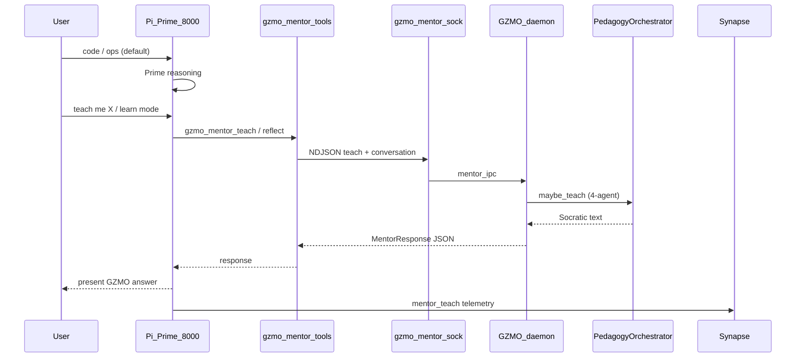
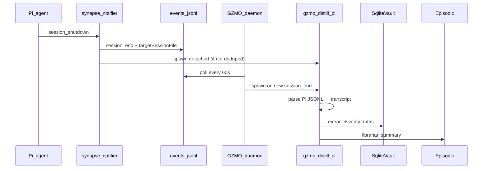

# Pi ↔ GZMO Platform — Comprehensive Implementation Handoff

**Status:** Shipped core (2026-06-11) · Remaining work documented below  
**Repo:** `~/Projects/_foundation-audit/survey_GZMO`  
**Pi agent:** `~/.pi/agent/`  
**Bridge summary:** `~/gzmo_skills/BRIDGE.md`  
**Prior mentor-only handoff:** `docs/PI_GZMO_MENTOR_DIALOG_HANDOFF.md` (superseded by this doc for ops)  
**Remaining tasks (step-by-step):** [`PI_GZMO_REMAINING_TASKS_IMPLEMENTATION_GUIDE.md`](./PI_GZMO_REMAINING_TASKS_IMPLEMENTATION_GUIDE.md)

This document is the **single authoritative handoff** for what is shipped. Use the **remaining tasks guide** for what to do next. It covers:

1. Pi ↔ GZMO **mentor dialog** (Socratic teaching over Unix socket)
2. **Synapse telemetry** (Pi → bus → daemon → episodic)
3. **Session-end distillation** (Pi JSONL → vault facts + episodic → Dream)
4. What is **done**, what is **optional next**, and **exact verification steps**

---

## Table of contents

1. [Executive summary](#1-executive-summary)
2. [Locked product decisions](#2-locked-product-decisions)
3. [Memory architecture (three layers)](#3-memory-architecture-three-layers)
4. [End-to-end architecture](#4-end-to-end-architecture)
5. [Implementation phases — status matrix](#5-implementation-phases--status-matrix)
6. [Step-by-step: what was built](#6-step-by-step-what-was-built)
7. [Step-by-step: session_end → distill pipeline](#7-step-by-step-session_end--distill-pipeline)
8. [Configuration reference](#8-configuration-reference)
9. [Pi agent wiring checklist](#9-pi-agent-wiring-checklist)
10. [GZMO daemon & CLI wiring](#10-gzmo-daemon--cli-wiring)
11. [Verification runbook (copy-paste)](#11-verification-runbook-copy-paste)
12. [Known bugs, caveats, and footguns](#12-known-bugs-caveats-and-footguns)
13. [Remaining work — prioritized](#13-remaining-work--prioritized)
14. [Step-by-step: optional next implementations](#14-step-by-step-optional-next-implementations)
15. [File index](#15-file-index)
16. [Suggested prompts for next agent](#16-suggested-prompts-for-next-agent)

---

## 1. Executive summary

**Goal:** Pi is the daily operator UI (Prime `:8000` for coding/ops). GZMO daemon runs pedagogy, memory consolidation, and episodic ingestion. Pi invokes GZMO for **teaching** (`gzmo_mentor_*`) and **platform memory** (MCP `gzmo-memory`). When a Pi session ends, durable facts are **distilled** into the vault for honeypot recall and Dream.

**Shipped:**

| Capability | Mechanism |
|------------|-----------|
| Socratic mentor | Pi tools → `data/gzmo_mentor.sock` → daemon `PedagogyOrchestrator` |
| Learn mode | Pi-side turn buffer + `gzmo_mentor_learn_start/end` |
| Synapse telemetry | `synapse-notifier.ts` → `data/Synapse/events.jsonl` |
| Episodic batching | Daemon polls bus every 60s → `FileEpisodicStore` |
| Session distill | `session_end` → `gzmo distill pi <jsonl>` → vault + episodic |
| Anti-loop guard | `gzmo_mentor_reflect` once per decision; no `bash gzmo mentor_*` loops |
| MCP Socratic mentor | `gzmo_mentor_ping` and `gzmo_mentor_teach` on `mcp-serve` |

**Also shipped (2026-06-11):**

- Shared socket client: `gzmo-core/src/mentor_client.rs`

**Not shipped (optional):**

- Topic-shift embedding as distill trigger (phase 2)
- HTTP mentor bridge for remote Pi

---

## 2. Locked product decisions

| Decision | Choice | Do not change without explicit user approval |
|----------|--------|-----------------------------------------------|
| Default cognition | Pi + Prime `http://localhost:8000/v1` | Mentor is not the default brain |
| Mentor transport | Unix socket NDJSON (`data/gzmo_mentor.sock`) | Not Synapse, not HTTP (v1) |
| Synapse role | Telemetry only | Not request/response dialog |
| Learner profile | Shared `operator` (`GZMO_LEARNER_ID`) | Unified with `gzmo chat` / TUI |
| Mentor vs Prime routing | Prime = implement/fix/grep; Mentor = teach/how/why/learn | See `SKILL.md` |
| Distill trigger v1 | `session_end` only | Topic-shift = phase 2 |
| Pi session format | `~/.pi/agent/sessions/.../*.jsonl` (Pi v3) | Not `data/sessions/*.json` (GZMO chat) |
| Build output | `./target/release/gzmo` | Cursor sandbox may write elsewhere — use `scripts/build-gzmo.sh` |

---

## 3. Memory architecture (three layers)

Agreed in mentor dialog (2026-06-11):

| Layer | What it holds | How Pi/GZMO populates it |
|-------|---------------|---------------------------|
| **Working** | Current task context | Pi `tiered-memory`, `WORKING_MEMORY.md`, turn-start recall |
| **Episodic** | Time-stamped narrative blobs | Synapse pull → episodic; distill summaries; Dream input |
| **Semantic** | Durable facts (vault) | `gzmo distill` / `gzmo distill pi` → `SessionDistill` vault truths |

**Distillation triggers (v1 vs v2):**

| Trigger | Status | Owner |
|---------|--------|-------|
| Pi `session_shutdown` | **Shipped** | Pi notifier + daemon synapse poll |
| GZMO chat session cron | **Shipped** | Daemon `session_distill` cron 02:15 UTC |
| On-demand `gzmo distill` | **Shipped** | Operator |
| Topic-shift embedding | **Not started** | Phase 2 — detect topic change mid-session |
| Mentor Socratic thread | **N/A** | Mentor explains *why*; subagents handle *how* |

---

## 4. End-to-end architecture

### 4.1 Mentor dialog



### 4.2 Session end → distill



### 4.3 Data flow summary

```
Pi turn ──► MCP gzmo-memory (search/recall)     ──► scratch + vault recall
Pi teach ─► gzmo_mentor_* ─► mentor.sock        ──► pedagogy + chaos pulse
Pi life ──► synapse-notifier ─► events.jsonl    ──► episodic batch (daemon)
Pi exit ──► session_end ──► gzmo distill pi     ──► vault SessionDistill facts
Dream cron ─────────────────────────────────────► reads episodic + vault
```

---

## 5. Implementation phases — status matrix

| Phase | ID | Task | Status | Key paths |
|-------|-----|------|--------|-----------|
| 0A | reload | `reload_from_disk()` on mentor socket teach/status/reload | **Done** | `mentor_ipc.rs`, `pedagogy_bridge.rs` |
| 0B | synapse_pull | `[synapse_pull]` in live `gzmo.toml` | **Done** | `gzmo.toml` |
| 0C | cli-json | `gzmo mentor teach --json-file` + stdin JSON | **Done** | `mentor_cmd.rs` |
| 1A | shell | `scripts/pi/mentor.sh` | **Done** | `scripts/pi/mentor.sh` |
| 1B | pi-tools | `gzmo_mentor_*` in Pi skill | **Done** | `gzmo-integration/index.ts`, `mentor-client.ts` |
| 1C | docs | SKILL, PI_OPERATOR_GUIDE, BRIDGE | **Done** | see §15 |
| 1D | synapse-mentor | `mentor_teach` / `mentor_learn_*` events | **Done** | `synapse.rs`, `synapse-notifier.ts` |
| 2 | learn-mode | Learn session buffer + learn_start/end | **Done** | `mentor-client.ts` |
| 3 | harden | Timeouts, test scripts, build helper | **Done** | `scripts/pi/smoke.sh`, `build-gzmo.sh` |
| 3b | mcp-mentor | Mentor on `mcp-serve` | **Done** | `gzmo-core/src/mcp/serve.rs` |
| 4 | distill-pi | Pi JSONL parser + `gzmo distill pi` | **Done** | `pi_session.rs`, `distill_cmd.rs` |
| 4b | distill-trigger | Daemon poll + Pi notifier on `session_end` | **Done** | `synapse_reader.rs`, `daemon_cmd.rs` |
| 5 | topic-shift | Embedding-based mid-session distill | **Not started** | TBD |
| ops | daemon-restart | `scripts/restart-daemon.sh` | **Done** | `scripts/restart-daemon.sh` |

---

## 6. Step-by-step: what was built

### Step 1 — Mentor Unix socket API (Rust)

**Purpose:** Headless Socratic API for Pi and shell without opening `gzmo chat`.

1. **Server** (`gzmo-cli/src/mentor_ipc.rs`):
   - Binds `config.pedagogy.mentor_socket_path()` (default `data/gzmo_mentor.sock`)
   - Methods: `ping`, `status`, `reload`, `teach`
   - One NDJSON line per connection; one JSON response line
   - Before `teach` / `status`: `pedagogy.reload_from_disk()` (fixes stale ops/learn state)
   - On successful teach: `emit_mentor_chaos_feedback()` → chaos inbox

2. **CLI client** (`gzmo-cli/src/mentor_cmd.rs`):
   - `gzmo mentor ping|status|reload|teach`
   - `teach --json-file path` for multi-turn automation
   - Falls back to local `PedagogyRuntime` if socket missing → prints `pong (local)`

3. **Daemon wiring** (`gzmo-cli/src/daemon_cmd.rs`):
   - Spawns `run_mentor_server` when `[pedagogy] mentor_api_enabled = true`

**Verify:**

```bash
cd ~/Projects/_foundation-audit/survey_GZMO
./scripts/build-gzmo.sh
./scripts/restart-daemon.sh
gzmo mentor ping    # expect: pong  (NOT pong (local))
gzmo mentor status  # mentor=true ops_mode=false learner=operator
```

---

## 7. Step-by-step: session_end → distill pipeline

### 7.1 Event emission (Pi side)

1. User ends Pi session (`/exit`, quit, new session).
2. Pi runtime fires `session_shutdown` with `targetSessionFile` path.
3. `synapse-notifier.ts`:
   - Writes to bus:

     ```json
     {"event_type":"session_end","source":"pi_agent","data":{"reason":"...","targetSessionFile":"/home/.../session.jsonl"}}
     ```

   - If `distillOnSessionEnd` and file exists and not in dedup state:
     - `spawn(gzmo, ['distill','pi', targetSessionFile], { detached: true })`

### 7.2 Daemon tail (GZMO side)

1. Daemon task wakes every 60s (`daemon_cmd.rs`).
2. `poll_pi_synapse()`:
   - Reads new lines from `bus_path` since `data/synapse-reader.state.json` offset
   - Filters `source == pi_agent`
   - If any events: append episodic summary blob
   - Returns `session_end_files` from `session_end_distill_targets()`
3. For each path where `should_distill_pi_session()`:
   - `tokio::process::Command::new(gzmo_exe).args(["distill","pi", path]).spawn()`
   - `mark_pi_session_distilled(path)`

### 7.3 Distill execution

1. `distill_cmd::run_pi()` builds `SessionDistillEngine` (MCP + gateways).
2. `pi_session::parse_pi_jsonl_transcript(path)` → transcript string.
3. `distill_transcript(session_id, transcript, MainArchive)`:
   - Skip if transcript < 80 chars
   - Skip if vault dedup key seen (safe for double-spawn Pi + daemon)
   - LLM extract → verify → promote to vault
   - Optional librarian summary → episodic

### 7.4 Downstream (Dream)

- Episodic entries from synapse pull + distill summaries feed `DreamEngine` on next dream cron.
- Vault `SessionDistill` facts use source path `sessions/pi-<uuid>.md` for honeypot recall (not excluded as raw chat).

---

## 8. Configuration reference

### 8.1 `gzmo.toml` (survey_GZMO)

```toml
[pedagogy]
enabled = true
mentor_api_enabled = true
mentor_socket = "data/gzmo_mentor.sock"

[synapse_pull]
enabled = true
cron_hour = 2          # legacy fields; poll is every 60s when enabled
cron_minute = 45
max_events = 50
bus_path = "data/Synapse/events.jsonl"
distill_on_session_end = true

[session_distill]
enabled = true
sessions_dir = "data/sessions"   # GZMO chat sessions only
daemon_scheduled = true
cron_hour = 2
cron_minute = 15
```

### 8.2 `~/.pi/agent/settings.json`

```json
{
  "extensions": [
    "~/.pi/agent/skills/gzmo-integration/index.ts",
    "~/.pi/agent/extensions/synapse-notifier.ts"
  ],
  "synapseNotifier": {
    "busPath": "/home/.../survey_GZMO/data/Synapse/events.jsonl",
    "enabled": true,
    "distillOnSessionEnd": true
  }
}
```

### 8.3 Environment variables

| Variable | Default | Used by |
|----------|---------|---------|
| `GZMO_CONFIG` | auto-discover | `gzmo`, bridges |
| `GZMO_LEARNER_ID` | `operator` | mentor, pedagogy |
| `GZMO_BIN` | `target/release/gzmo` | Pi skill, scripts |
| `GZMO_ROOT` | survey_GZMO path | synapse-notifier |
| `GZMO_DISTILL_SMOKE` | `0` | test_distill_pi.sh live path |
| `PI_SESSION` | latest jsonl | test_distill_pi.sh |

### 8.4 State files (do not delete casually)

| File | Purpose |
|------|---------|
| `data/synapse-reader.state.json` | Bus byte offset |
| `data/synapse-pi-distill.state.json` | Distilled Pi session paths (dedup) |
| `data/learner/operator/session.json` | Pedagogy ops/learn mode |
| `data/gzmo_mentor.sock` | Mentor API (daemon creates) |
| `/tmp/gzmo_daemon.pid` | Canonical daemon singleton lock (main.rs + scripts) |
| `/tmp/gzmo_rust.pid` | Legacy lock (still checked by `daemon_running()`) |

---

## 9. Pi agent wiring checklist

Use this when setting up a **new machine** or debugging "tools missing":

- [ ] `~/.pi/agent/skills/gzmo-integration/index.ts` exists
- [ ] `settings.json` lists `gzmo-integration/index.ts` under **`extensions`** (not just packages)
- [ ] `synapse-notifier.ts` in extensions; `busPath` points to survey_GZMO bus
- [ ] `GZMO_ROOT` / paths in `index.ts` match actual repo location
- [ ] `target/release/gzmo` built (`./scripts/build-gzmo.sh`)
- [ ] Daemon running (`gzmo mentor ping` → `pong`)
- [ ] Prime `:8000` up for coding (mentor teach also uses Prime gateways when local fallback)
- [ ] New Pi session after settings change (extensions load at session start)
- [ ] `MEMORY_ACTIVE.md` loaded via `appendSystemPrompt`

---

## 10. GZMO daemon & CLI wiring

### Build (always use project target)

```bash
cd ~/Projects/_foundation-audit/survey_GZMO
./scripts/build-gzmo.sh
```

**Footgun:** `cargo build` inside Cursor may write to `/tmp/cursor-sandbox-cache/.../cargo-target`. Scripts and Pi use `survey_GZMO/target/release/gzmo`.

### Start / restart

```bash
./scripts/start-production.sh          # Prime + health
./scripts/restart-daemon.sh --build    # rebuild + restart daemon
```

### CLI surface (relevant commands)

```bash
gzmo --help
gzmo mentor ping|status|reload|teach
gzmo distill [session_id]              # GZMO chat sessions in data/sessions/
gzmo distill pi <path.jsonl>           # Pi agent sessions
gzmo health
gzmo daemon
```

---

## 11. Verification runbook (copy-paste)

### 11.1 Platform health

```bash
cd ~/Projects/_foundation-audit/survey_GZMO
./scripts/build-gzmo.sh
./scripts/restart-daemon.sh
./target/release/gzmo health
./target/release/gzmo mentor ping
```

**Pass criteria:**

- `health`: engine `http://localhost:8000/v1`
- `mentor ping`: `pong` (daemon) — `pong (local)` means daemon down or socket missing

### 11.2 Pi integration smoke

```bash
./scripts/pi/smoke.sh
```

**Pass criteria:** mentor script runs; pi_session + session_end unit tests pass.

### 11.3 Live distill smoke (optional, uses Prime)

```bash
GZMO_DISTILL_SMOKE=1 ./scripts/pi/test_distill_pi.sh
```

### 11.4 End-to-end Pi session

1. Start new Pi session.
2. Confirm tools: `gzmo_mentor_ping`, `gzmo_mentor_reflect`.
3. User: "teach me what episodic memory means in GZMO"
4. Pi calls `gzmo_mentor_learn_start` → `gzmo_mentor_teach` (not bash loop).
5. End session.
6. Check:

   ```bash
   tail -3 data/Synapse/events.jsonl   # session_end present
   ls -la data/synapse-pi-distill.state.json
   # optional: watch logs/distill in daemon.log
   ```

### 11.5 Ops mode reload (regression)

1. `gzmo chat` → `/ops` (or toggle ops in TUI).
2. Without daemon restart: `gzmo mentor status` → `ops_mode=true`.

---

## 12. Known bugs, caveats, and footguns

| Issue | Symptom | Mitigation |
|-------|---------|------------|
| Stale `gzmo` binary | `gzmo mentor` opens chat banner | `./scripts/build-gzmo.sh` |
| Extension not in settings | Mentor tools missing in Pi | Add to `settings.json` extensions |
| Daemon not restarted | Old synapse cron-only behavior | `./scripts/restart-daemon.sh --build` |
| `pong (local)` | Mentor works but no chaos coupling | Start daemon |
| Pi bash mentor loop | SPIRAL / chat mode | SKILL.md: use tools only |
| Double distill on exit | Pi + daemon both spawn | Vault dedup; Pi checks state file |
| Two PID files | Restart misses process | `restart-daemon.sh` checks both |
| Mentor latency 10–30s | 4 LLM calls | 120s timeout; set user expectation |
| `mcp({ search: "mentor" })` loop in Pi | Wrong path | Use `gzmo_mentor_*` Pi tools (not MCP search) |
| Prime down | teach fails on local fallback | Start Prime `:8000` |

---

### Infrastructure stages (2026-06-15) — **SHIPPED locally**

| Stage | Deliverable | Docs |
|-------|-------------|------|
| 0 | `session_id` on Pi events, ownership matrix | `docs/SYNAPSE_EVENT_OWNERSHIP.md` |
| 1 | `/calculate` v2 steps + German interpretation | `docs/CALCULATE_V2_FORMATTER_CONTRACT.md` |
| 2 | `skill.invoke` / `skill.complete` / `skill.error` | `scripts/pi/synapse-notifier.reference.ts` |
| 3 | Forum Romanum envelope + agent/proposal types | `docs/FORUM_ROMANUM_SCHEMA.md` |
| 4 | Obolus routing doc + example mappings | `docs/OBOLUS_ROUTING.md` |
| 5 | Kurator monitor + `spawn.recommended` + `gzmo kurator status` | `gzmo-core/src/kurator_monitor.rs` |
| 6 | `wuerfel-cron` synapse tag + Bibliothek dream gate | `[bibliothek]` in `gzmo.toml` |
| 7 | Synapse Writer gate + Kurator approve + Forum Romanum emitters | `synapse_writer.rs`, `forum-romanum-bridge.reference.ts` |

Pi live extensions:
- `scripts/pi/synapse-notifier.reference.ts` -> `~/.pi/agent/extensions/synapse-notifier.ts`
- `scripts/pi/forum-romanum-bridge.reference.ts` -> `~/.pi/agent/extensions/forum-romanum-bridge.ts` (optional, requires pi-crew)

---

## 13. Remaining work — prioritized

### Low hanging (do first)

| # | Task | Effort | Files | Status |
|---|------|--------|-------|--------|
| L1 | Run `restart-daemon.sh --build` on operator machine | -- | ops | **Done** |
| L2 | Git commit + push mentor/distill branch | -- | git | **Done** (locally committed, push pending auth) |
| L3 | Add `distillOnSessionEnd` to Pi `settings.json` explicitly | -- | settings.json | **Done** |

### Medium (next sprint)

| # | Task | Effort | Notes |
|---|------|--------|-------|
| M1 | MCP `gzmo_mentor_ping/teach` on `mcp-serve` | -- | **Done** (shipped 2026-06-12) |
| M2 | `scripts/pi/test_session_end_distill.sh` | -- | **Done** (shipped 2026-06-12) |
| M3 | Unify PID files (`gzmo_rust.pid` vs `gzmo_daemon.pid`) | -- | **Done** (shipped 2026-06-12) |
| M4 | Mark distill complete in state only after subprocess exit | -- | **Done** (shipped 2026-06-12) |

### Phase 2 (product)

| # | Task | Effort | Notes |
|---|------|--------|-------|
| P1 | Topic-shift embedding distill trigger | **Stub** | `topic_shift_enabled` in config (default false); hook TBD |
| P2 | On-demand `gzmo_distill` Pi path in skill | -- | **Done** |
| P3 | HTTP mentor bridge for remote Pi | 2+ days | Out of scope v1 |

---

## 14. Step-by-step: optional next implementations

### 14.1 MCP mentor tools (M1) — **SHIPPED**

Implemented 2026-06-11:

- `gzmo-core/src/mentor_client.rs` — `client_request()`, shared types
- `gzmo-cli/src/mentor_ipc.rs` — re-exports from `mentor_client`
- `gzmo-core/src/mcp/serve.rs` — `gzmo_mentor_ping`, `gzmo_mentor_teach`
- `scripts/pi/test_mcp_mentor.py` — stdio MCP integration test (requires daemon socket)

**Verify:** `python3 scripts/pi/test_mcp_mentor.py` (daemon must be up → `pong` on ping).

**Pi routing unchanged:** Pi still uses `gzmo-integration` tools, not MCP search, for mentor dialog.

---

### 14.2 Topic-shift distill trigger (P1)

**Goal:** Distill mid-session when embedding distance exceeds threshold (phase 2).

1. Pi extension or turn_end hook: compute embedding of last N user messages.
2. Compare to session baseline; if cosine distance > threshold:
   - Emit `distill_requested` synapse event OR call `gzmo distill pi` on partial export.
3. Daemon handler or Pi direct spawn (same as session_end).
4. Config: `[session_distill] topic_shift_threshold = 0.35` (example).

**Prerequisite:** Stable embed endpoint (VM200 `:8081` per `gzmo.toml`).

---

### 14.3 Session-end integration test (M2)

1. Create fixture `tests/fixtures/pi_session_minimal.jsonl` (3 lines).
2. Append synthetic `session_end` to test bus file.
3. Run `poll_pi_synapse` in unit test; assert `session_end_files` contains path.
4. Optional: mock subprocess spawn.

---

## 15. File index

### Rust (survey_GZMO)

| Purpose | Path |
|---------|------|
| Mentor socket server | `gzmo-cli/src/mentor_ipc.rs` |
| Mentor CLI | `gzmo-cli/src/mentor_cmd.rs` |
| Pedagogy runtime bridge | `gzmo-cli/src/pedagogy_bridge.rs` |
| Daemon (mentor + synapse + distill cron) | `gzmo-cli/src/daemon_cmd.rs` |
| Pi JSONL parser | `gzmo-core/src/pi_session.rs` |
| Session distill engine | `gzmo-core/src/session_distill.rs` |
| Distill CLI | `gzmo-cli/src/distill_cmd.rs` |
| Synapse types | `gzmo-core/src/synapse.rs` |
| Synapse reader / poll | `gzmo-core/src/synapse_reader.rs` |
| Config + discover | `gzmo-core/src/config.rs` |
| Shared mentor socket client | `gzmo-core/src/mentor_client.rs` |
| MCP memory server | `gzmo-core/src/mcp/serve.rs` |
| Live config | `gzmo.toml` |

### Pi agent (~/.pi/agent)

| Purpose | Path |
|---------|------|
| GZMO tools + mentor | `skills/gzmo-integration/index.ts` |
| Mentor socket client | `skills/gzmo-integration/mentor-client.ts` |
| Skill routing docs | `skills/gzmo-integration/SKILL.md` |
| Synapse + distill spawn | `extensions/synapse-notifier.ts` |
| Operator memory | `MEMORY_ACTIVE.md`, `MEMORY_CORE.md` |
| Extension registration | `settings.json` |

### Scripts & docs

| Purpose | Path |
|---------|------|
| **This handoff** | `docs/PI_GZMO_PLATFORM_IMPLEMENTATION_HANDOFF.md` |
| Mentor-only handoff (legacy) | `docs/PI_GZMO_MENTOR_DIALOG_HANDOFF.md` |
| Pi operator guide | `docs/PI_OPERATOR_GUIDE.md` |
| Bridge summary | `~/gzmo_skills/BRIDGE.md` |
| Build | `scripts/build-gzmo.sh` |
| Restart daemon | `scripts/restart-daemon.sh` |
| Pi smoke | `scripts/pi/smoke.sh` |
| MCP mentor test | `scripts/pi/test_mcp_mentor.py` |
| Mentor test | `scripts/pi/test_mentor_dialog.sh` |
| Distill test | `scripts/pi/test_distill_pi.sh` |
| Mentor shell bridge | `scripts/pi/mentor.sh` |
| MCP mentor test | `scripts/pi/test_mcp_mentor.py` |
| Mentor socket client | `gzmo-core/src/mentor_client.rs` |

---

## 16. Suggested prompts for next agent

**Ops only (5 min):**

> Read `docs/PI_GZMO_PLATFORM_IMPLEMENTATION_HANDOFF.md` §11. Run `./scripts/restart-daemon.sh --build` and `./scripts/pi/smoke.sh`. Report pass/fail.

**MCP mentor (medium):**

> Implement §14.1: `gzmo-core/src/mentor_client.rs` + `gzmo_mentor_ping` and `gzmo_mentor_teach` on `mcp-serve`. Do not break existing memory tools. Add a smoke test.

**Topic-shift distill (phase 2):**

> Implement §14.2 per mentor-agreed architecture. Start with Pi turn_end embedding hook and config threshold; reuse `gzmo distill pi` path.

**Git hygiene:**

> On `feat/context-compress-headroom`, create focused commits: (1) mentor API + Pi bridge, (2) session_end distill. Open PR with test plan from §11.

---

## One-line summary

**Pi uses Prime for ops and `gzmo_mentor_*` tools for Socratic teaching over the daemon Unix socket; Pi lifecycle feeds Synapse; `session_end` triggers `gzmo distill pi` to promote durable facts into the vault — restart the daemon after Rust builds, and never bash-loop `gzmo mentor`.**
