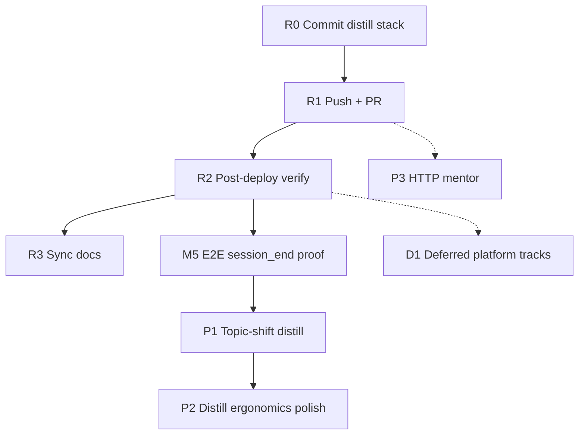
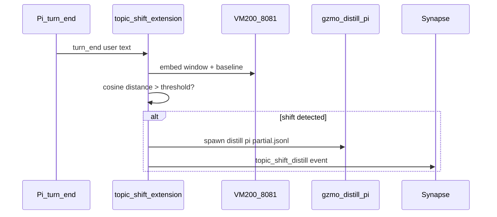

# Pi ↔ GZMO Platform — Remaining Tasks Implementation Guide

**Created:** 2026-06-11  
**Last updated:** 2026-06-11 (post R0–P1 local commits)  
**Branch:** `feat/context-compress-headroom`  
**Status snapshot:** R0–R3, M5, P1-A/B/C **done locally** · R1 push/PR **blocked** (GitHub HTTPS auth) · P1 live test needs `topic_shift_enabled = true`

### Quick status (what's left)

| ID | Task | Status |
|----|------|--------|
| R0 | Commit distill stack | **Done** (`781bc26` + follow-ups) |
| R1 | Push + PR | **You** — `git push origin feat/context-compress-headroom` |
| R2 | Post-deploy verify | **Done** — `pong`, `smoke.sh` pass |
| R3 | Doc sync | **Partial** — platform handoff updated; this guide §2 needs periodic refresh |
| M5 | E2E session_end distill | **Done** — state file + daemon poll verified |
| P1 | Topic-shift distill | **Done + enabled** — `topic_shift_enabled = true` in `gzmo.toml`; new Pi session to test |
| P2 | Distill ergonomics | **Partial** — `gzmo_distill` accepts `.jsonl`; dedicated tool optional |
| P3 | HTTP mentor bridge | Not started |
| D1 / F1 | Deferred / future | Not started |

**Companion docs:**
- Shipped baseline: [`PI_GZMO_PLATFORM_IMPLEMENTATION_HANDOFF.md`](./PI_GZMO_PLATFORM_IMPLEMENTATION_HANDOFF.md)
- Bridge summary: `~/gzmo_skills/BRIDGE.md`
- Broader deferred backlog: [`DEFERRED_WORK_HANDOFF.md`](./DEFERRED_WORK_HANDOFF.md)

This document is the **step-by-step implementation guide for everything not yet landed on the remote branch**. Read §2 first so you do not re-implement work that exists locally but is uncommitted.

---

## Table of contents

1. [How to use this guide](#1-how-to-use-this-guide)
2. [Current baseline (2026-06-11)](#2-current-baseline-2026-06-11)
3. [Priority order and dependencies](#3-priority-order-and-dependencies)
4. [R0 — Commit session_end distill stack](#4-r0--commit-session_end-distill-stack)
5. [R1 — Push branch and open PR](#5-r1--push-branch-and-open-pr)
6. [R2 — Post-deploy operator verification](#6-r2--post-deploy-operator-verification)
7. [R3 — Sync documentation status](#7-r3--sync-documentation-status)
8. [P1 — Topic-shift embedding distill (phase 2)](#8-p1--topic-shift-embedding-distill-phase-2)
9. [P2 — On-demand distill ergonomics](#9-p2--on-demand-distill-ergonomics)
10. [P3 — HTTP mentor bridge (remote Pi)](#10-p3--http-mentor-bridge-remote-pi)
11. [M5 — End-to-end session_end distill proof](#11-m5--end-to-end-session_end-distill-proof)
12. [D1 — Deferred platform work (separate tracks)](#12-d1--deferred-platform-work-separate-tracks)
13. [F1 — Future / research items](#13-f1--future--research-items)
14. [Verification matrix](#14-verification-matrix)
15. [Suggested agent prompts](#15-suggested-agent-prompts)
16. [File checklist by task](#16-file-checklist-by-task)

---

## 1. How to use this guide

Each task section follows the same shape:

| Block | Purpose |
|-------|---------|
| **Status** | Done / local-only / not started |
| **Goal** | One sentence outcome |
| **Prerequisites** | What must exist first |
| **Steps** | Numbered, copy-paste friendly |
| **Acceptance** | Objective pass/fail checks |
| **Pitfalls** | Known footguns |

**Rule:** **R1 (push + PR)** is the only platform blocker for remote review. P1 is shipped but **off by default**.

---

## 2. Current baseline (2026-06-11, updated)

### 2.1 Commits on branch (local — push pending)

| Commit | Contents |
|--------|----------|
| `e89da44` | `TopicShiftDistill` synapse event + reader counts |
| `77011b8` | `topic_shift_enabled/threshold` in `gzmo.toml` |
| `e4a8c7c` | Partial Pi JSONL range + `--from-turn` / `--max-turns` CLI |
| `ee66ab8` | Platform handoff §13 status update |
| `781bc26` | **session_end distill pipeline** + synapse poll + ops scripts |
| `d6ba21d` | MCP mentor on `mcp-serve` (M1) |
| `3ac39fb` | Headless mentor API + Pi bridge |
| Earlier | Context-compress, pedagogy pantheon, etc. |

### 2.2 Pi-side (outside `survey_GZMO` git — verify manually)

| Path | Shipped feature |
|------|-----------------|
| `~/.pi/agent/extensions/synapse-notifier.ts` | `session_end` distill spawn, `checkTopicShift()` embed hook |
| `~/.pi/agent/skills/gzmo-integration/index.ts` | `gzmo_distill` accepts `.jsonl` paths |
| `~/.pi/agent/settings.json` | `distillOnSessionEnd: true` |

### 2.3 Verified on operator machine

| Check | Status |
|-------|--------|
| `systemctl --user restart gzmo-daemon` | Done |
| `gzmo mentor ping` → `pong` | Done |
| `./scripts/pi/smoke.sh` | Pass |
| `gzmo distill pi … --from-turn 1 --max-turns 1` | Done (fixture) |
| M5 session_end → distill state | Done |
| `git push origin feat/context-compress-headroom` | **Fails** — HTTPS auth |

### 2.4 Not started / optional

| ID | Task |
|----|------|
| R1 | Push + PR (operator action) |
| P1 live | Enable `topic_shift_enabled = true` and test mid-session shift |
| P2 | Dedicated `gzmo_distill_pi` tool + `distill_latest_pi_session.sh` |
| P3 | HTTP mentor bridge for remote Pi |
| D1 | TUI `maybe_teach` parity, multi-learner split, GeoGebra, etc. |
| F1 | Unified `/help` from `skills.toml`, cognitive sandbox |

---

## 3. Priority order and dependencies



| Order | Task | Effort | Blocker for |
|-------|------|--------|-------------|
| 1 | **R0** Commit distill | 30 min | Everything else on remote |
| 2 | **R1** Push + PR | 20 min | Team review / merge |
| 3 | **R2** Verify after merge/restart | 10 min | Production confidence |
| 4 | **R3** Doc sync | 15 min | Next agent clarity |
| 5 | **M5** E2E distill proof | 30 min | Validates R0 in prod |
| 6 | **P1** Topic-shift | 1–2 days | Phase 2 episodic |
| 7 | **P2** Distill polish | 2–4 h | UX |
| 8 | **P3** HTTP mentor | 2+ days | Remote Pi |
| 9 | **D1** Deferred tracks | multi-sprint | Platform parity |

---

## 4. R0 — Commit session_end distill stack

**Status:** Local only — **do this first**  
**Goal:** Land Pi `session_end` → `gzmo distill pi` on the branch in one focused commit (separate from M1).

### Prerequisites

- M1 already committed (`d6ba21d`)
- `./scripts/build-gzmo.sh` succeeds
- `./scripts/pi/smoke.sh` passes

### Step 1 — Review diff scope

```bash
cd ~/Projects/_foundation-audit/survey_GZMO
git status -uno
```

**Include in this commit (distill + synapse + ops only):**

```text
gzmo-core/src/pi_session.rs          # NEW
gzmo-core/src/lib.rs                 # pub mod pi_session
gzmo-core/src/session_distill.rs     # distill_pi_jsonl
gzmo-core/src/synapse_reader.rs      # poll_pi_synapse, session_end targets, dedup
gzmo-core/src/daemon.rs              # DAEMON_PID_FILE, daemon_running
gzmo-core/src/config.rs              # synapse_pull distill_on_session_end, topic_shift stub
gzmo-cli/src/daemon_cmd.rs           # 60s poll, distill spawn + wait
gzmo-cli/src/distill_cmd.rs          # run_pi, build_distill_engine
gzmo-cli/src/main.rs                 # DistillPi, --help
gzmo.toml                            # [synapse_pull] distill_on_session_end
scripts/build-gzmo.sh                # NEW
scripts/restart-daemon.sh            # NEW
scripts/pi/smoke.sh                  # NEW
scripts/pi/test_distill_pi.sh        # NEW
scripts/pi/test_session_end_distill.sh  # NEW
tests/fixtures/pi_session_minimal.jsonl  # NEW
docs/PI_GZMO_PLATFORM_IMPLEMENTATION_HANDOFF.md  # §13 status updates
docs/PI_OPERATOR_GUIDE.md            # session_end distill note (if modified)
scripts/start-production.sh          # PID wait fix (if in diff)
gzmo-core/src/skills/dispatch.rs     # daemon_running → daemon.rs (if in diff)
```

**Exclude from this commit (separate commits or WIP):**

- Unrelated chaos/context-compress edits across `chat.rs`, `gateway.rs`, `README.md`, etc.
- `data/*` runtime state (`synapse-pi-distill.state.json`, learner episodes)
- `wiki/` bulk changes
- Log files

### Step 2 — Stage selectively

```bash
git add \
  gzmo-core/src/pi_session.rs \
  gzmo-core/src/lib.rs \
  gzmo-core/src/session_distill.rs \
  gzmo-core/src/synapse_reader.rs \
  gzmo-core/src/daemon.rs \
  gzmo-core/src/config.rs \
  gzmo-cli/src/daemon_cmd.rs \
  gzmo-cli/src/distill_cmd.rs \
  gzmo-cli/src/main.rs \
  gzmo.toml \
  scripts/build-gzmo.sh \
  scripts/restart-daemon.sh \
  scripts/pi/smoke.sh \
  scripts/pi/test_distill_pi.sh \
  scripts/pi/test_session_end_distill.sh \
  tests/fixtures/pi_session_minimal.jsonl \
  docs/PI_GZMO_PLATFORM_IMPLEMENTATION_HANDOFF.md
```

Add `scripts/start-production.sh` and `gzmo-core/src/skills/dispatch.rs` only if they appear in `git diff --cached`.

### Step 3 — Verify staged set

```bash
git diff --cached --stat
cargo test -p gzmo-core pi_session poll_pi_synapse --quiet
./scripts/build-gzmo.sh
```

### Step 4 — Commit

```bash
git commit -m "$(cat <<'EOF'
feat: Pi session_end distill pipeline and synapse poll

Parse Pi v3 JSONL sessions, expose `gzmo distill pi`, and tail synapse
session_end events from the daemon every 60s. Distill dedup marks only
after subprocess success. Adds ops scripts and smoke tests.
EOF
)"
```

### Step 5 — Pi-side files (outside git repo)

Manually verify these exist on the operator machine (not in `survey_GZMO` git):

| Path | Check |
|------|-------|
| `~/.pi/agent/extensions/synapse-notifier.ts` | `spawnPiSessionDistill` + dedup |
| `~/.pi/agent/skills/gzmo-integration/index.ts` | `gzmo_distill` accepts `.jsonl` |
| `~/.pi/agent/settings.json` | `distillOnSessionEnd: true` |
| `~/gzmo_skills/BRIDGE.md` | session_end → distill section |

Consider a **dotfiles commit** or backup note if Pi config is not versioned.

### Acceptance

- [ ] `git log -1` shows distill commit on `feat/context-compress-headroom`
- [ ] `git diff --cached` empty after commit
- [ ] `cargo test -p gzmo-core pi_session` passes
- [ ] Commit does **not** include unrelated WIP files

### Pitfalls

| Pitfall | Mitigation |
|---------|------------|
| `git add -A` pulls in 11k wiki/runtime files | Stage paths explicitly (Step 2) |
| Cursor `cargo build` writes to sandbox cache | Always `scripts/build-gzmo.sh` |
| Pi tools not registered | `settings.json` must list `gzmo-integration/index.ts` under `extensions` |

---

## 5. R1 — Push branch and open PR

**Status:** Push may have failed earlier (auth); PR not opened  
**Goal:** Remote branch + reviewable PR with test plan.

### Prerequisites

- R0 committed
- `gh auth status` OK

### Step 1 — Preflight

```bash
cd ~/Projects/_foundation-audit/survey_GZMO
git status -uno
git log origin/feat/context-compress-headroom..HEAD --oneline 2>/dev/null || git log -5 --oneline
```

### Step 2 — Push

```bash
git push -u origin feat/context-compress-headroom
```

If auth fails: fix `gh auth login` or SSH remote; do not force-push `main`.

### Step 3 — Open PR

Base branch: confirm with repo (likely `main` or `master`).

```bash
gh pr create --title "Pi mentor dialog + session_end distill + MCP mentor" --body "$(cat <<'EOF'
## Summary
- Headless mentor Unix socket API and Pi `gzmo_mentor_*` tools
- Pi `session_end` → `gzmo distill pi` (notifier + daemon synapse poll)
- MCP `gzmo_mentor_ping` / `gzmo_mentor_teach` on `mcp-serve`
- Ops scripts: build-gzmo, restart-daemon, pi/smoke.sh

## Test plan
- [ ] `./scripts/build-gzmo.sh`
- [ ] `systemctl --user restart gzmo-daemon`
- [ ] `./target/release/gzmo mentor ping` → `pong`
- [ ] `./scripts/pi/smoke.sh`
- [ ] `python3 scripts/pi/test_mcp_mentor.py`
- [ ] `GZMO_DISTILL_SMOKE=1 ./scripts/pi/test_distill_pi.sh` (optional, uses Prime)
- [ ] End Pi session → check `data/Synapse/events.jsonl` for `session_end`

## Docs
- `docs/PI_GZMO_PLATFORM_IMPLEMENTATION_HANDOFF.md`
- `docs/PI_GZMO_REMAINING_TASKS_IMPLEMENTATION_GUIDE.md`
EOF
)"
```

### Acceptance

- [ ] PR URL returned
- [ ] CI (if any) triggered
- [ ] PR body lists smoke commands

---

## 6. R2 — Post-deploy operator verification

**Status:** Partially done (daemon restarted locally)  
**Goal:** Confirm production stack after R0/R1 merge or local rebuild.

### Steps

```bash
cd ~/Projects/_foundation-audit/survey_GZMO
./scripts/build-gzmo.sh
systemctl --user restart gzmo-daemon
sleep 3
./target/release/gzmo mentor ping          # pong (not pong local)
./target/release/gzmo health               # Prime :8000
./scripts/pi/smoke.sh
ls -la data/gzmo_mentor.sock
```

### Acceptance

| Check | Expected |
|-------|----------|
| `mentor ping` | `pong` |
| `health` | `engine_url=http://localhost:8000/v1` |
| `smoke.sh` | exit 0 |
| Socket | `data/gzmo_mentor.sock` exists |
| Daemon PID | `/tmp/gzmo_daemon.pid` matches live process |

### Pitfalls

- **systemd vs manual daemon:** Only one instance; `restart-daemon.sh` stops both PID files.
- **Stale binary:** Rebuild before restart.

---

## 7. R3 — Sync documentation status

**Status:** §13 in platform handoff partially stale  
**Goal:** Docs match git reality after R0/R1.

### Step 1 — Update `PI_GZMO_PLATFORM_IMPLEMENTATION_HANDOFF.md` §13

Mark **Done** for:

| ID | Task |
|----|------|
| L1 | restart-daemon / systemd restart |
| L2 | git commit distill (after R0) |
| L3 | `distillOnSessionEnd` in settings |
| M1 | MCP mentor |
| M2 | test_session_end_distill + unit test |
| M3 | PID unification |
| M4 | distill mark after success |
| P2 | gzmo_distill `.jsonl` path |

Leave **Not started / Stub** for P1, P3, D1, F1.

### Step 2 — Update `BRIDGE.md`

- Verify table includes `gzmo mcp-serve` mentor row
- Verify verify section lists `smoke.sh`, `restart-daemon.sh`

### Step 3 — Cross-link this guide

Add to `PI_OPERATOR_GUIDE.md` header:

```markdown
**Remaining tasks:** [PI_GZMO_REMAINING_TASKS_IMPLEMENTATION_GUIDE.md](./PI_GZMO_REMAINING_TASKS_IMPLEMENTATION_GUIDE.md)
```

### Acceptance

- [ ] No task marked "Pending" that is actually shipped
- [ ] This guide linked from operator guide + platform handoff

---

## 8. P1 — Topic-shift embedding distill (phase 2)

**Status:** **Shipped (default off)** — commits `e4a8c7c`, `77011b8`, `e89da44` + `synapse-notifier.ts` `checkTopicShift`  
**Goal:** Mid-session distill when user topic drifts (mentor-agreed phase 2 trigger).

### Enable and test (operator)

1. Edit `gzmo.toml`:
   ```toml
   [session_distill]
   topic_shift_enabled = true
   topic_shift_threshold = 0.35
   ```
2. Start a **new Pi session** (extension reload).
3. Talk on topic A (3+ turns), then switch to unrelated topic B.
4. Check:
   ```bash
   tail -3 data/Synapse/events.jsonl   # topic_shift_distill
   journalctl --user -u gzmo-daemon -n 30 | rg -i distill
   ```

### Architecture



### Prerequisites

- R0 shipped and daemon running
- `[embeddings] url` reachable (VM200 `:8081` or local)
- `[session_distill] enabled = true`
- Design decision: **partial export** vs **full session file** (recommended: export turn range to temp jsonl)

### Phase P1-A — Rust: partial Pi JSONL export (2–3 h)

1. **Extend `pi_session.rs`:**
   - `parse_pi_jsonl_transcript_from_offset(path, start_line, max_chars) -> Result<(String, String)>`
   - Or: `parse_pi_jsonl_transcript_range(path, turn_ids: &[String])`

2. **Extend `SessionDistillEngine`:**
   - `distill_pi_jsonl_range(path, range) -> SessionDistillReport`
   - Session id suffix: `pi-{uuid}-shift-{turn_index}` for dedup separation

3. **CLI:**
   - `gzmo distill pi <path> --from-turn N` or `--max-turns N`

4. **Tests:**
   - Fixture with 10 messages; distill range 3–7 only

**Acceptance:** Manual command distills subset without full session.

### Phase P1-B — Pi extension: embedding hook (4–6 h)

1. **New file:** `~/.pi/agent/extensions/topic-shift-distill.ts` (or extend `synapse-notifier.ts`)

2. **On `turn_end`:**
   - Collect last `TOPIC_WINDOW_TURNS` (e.g. 3) user text blocks
   - Skip if total chars < 200 (trivial session)

3. **Baseline:**
   - First non-trivial user message embedding = baseline (store in extension module state)
   - Refresh baseline after successful distill (new topic anchor)

4. **Embed call:**
   - HTTP POST to `{embed_url}/v1/embeddings` with model from env or read `gzmo.toml` via known path
   - Do **not** block turn; fire async like `spawnPiSessionDistill`

5. **Distance:**
   - Cosine distance = `1 - dot(a,b)` for L2-normalized vectors
   - Compare to `topic_shift_threshold` (default `0.35` from config)

6. **On trigger:**
   - Write partial jsonl to `~/.pi/agent/.topic-shift/{sessionId}-{turn}.jsonl` OR pass full path + `--from-turn`
   - Spawn `gzmo distill pi ...`
   - Emit synapse: `topic_shift_distill` (add `EventType` in `synapse.rs`)

7. **Config gate:**
   - Read `GZMO_ROOT/gzmo.toml` `[session_distill] topic_shift_enabled`
   - Or `settings.json` `topicShiftDistill: { enabled, threshold }`

**Acceptance:**
- [ ] Synthetic test: two unrelated topic blocks → distance > threshold → spawn logged
- [ ] Same topic continuation → no spawn
- [ ] `topic_shift_enabled = false` → no-op

### Phase P1-C — Daemon optional handler (2 h)

1. Extend `synapse_reader.rs` to recognize `topic_shift_distill` events (episodic log only; distill already spawned by Pi)

2. Optional: daemon-side spawn if Pi notifier disabled (mirror `session_end` pattern)

**Acceptance:** Episodic contains topic-shift summary after event.

### Phase P1-D — Dedup and rate limits (1–2 h)

| Rule | Rationale |
|------|-----------|
| Min 10 min between topic-shift distills per session | Avoid embed spam |
| Vault dedup by transcript hash | Same as session_end |
| State file `data/synapse-topic-shift.state.json` | Last distill turn + timestamp |

### Pitfalls

| Pitfall | Mitigation |
|---------|------------|
| Embed latency blocks Pi | Async spawn only |
| Distill mid-session includes tool noise | Reuse `pi_session.rs` text-only filter |
| Double trigger with session_end | Different session_id suffix + dedup keys |

### Verification

```bash
# After implementation
./scripts/pi/test_topic_shift_distill.sh   # create this in P1-B
GZMO_DISTILL_SMOKE=1 ./scripts/pi/test_distill_pi.sh --range
```

---

## 9. P2 — On-demand distill ergonomics

**Status:** Mostly done (`gzmo_distill` accepts `.jsonl`)  
**Goal:** Polish operator UX for manual distill.

### Remaining steps

1. **Optional dedicated tool** `gzmo_distill_pi` in `index.ts`:
   - Parameter: `sessionPath` (required)
   - Clearer than overloading `gzmo_distill`

2. **Synapse:** Map `gzmo_distill_pi` in `TOOL_EVENT_MAP` → `distill_complete`

3. **SKILL.md:** Document when to use manual distill:
   - Long session before quit
   - After major decision
   - Override failed automatic session_end

4. **Helper script:** `scripts/pi/distill_latest_pi_session.sh`
   - Finds newest `~/.pi/agent/sessions/**/*.jsonl`
   - Runs `gzmo distill pi`

### Acceptance

- [ ] Pi agent can distill latest session in one tool call
- [ ] Synapse shows `distill_complete` on manual run

---

## 10. P3 — HTTP mentor bridge (remote Pi)

**Status:** Not started — out of scope v1  
**Goal:** Pi on another host can call mentor without Unix socket.

### Design options

| Option | Pros | Cons |
|--------|------|------|
| A. TCP localhost + SSH tunnel | No new server code | Operator SSH setup |
| B. `gzmo mentor serve --http :port` | Simple | Auth required |
| C. nginx + unix socket proxy | Production pattern | Infra |

### Recommended: Option B minimal

1. **New module** `gzmo-cli/src/mentor_http.rs`:
   - `POST /mentor` body = `MentorRequest` JSON
   - Response = `MentorResponse`
   - Bind `127.0.0.1:9137` default

2. **Auth:** Bearer token from `gzmo.toml` `[pedagogy] mentor_http_token`

3. **Daemon flag:** `[pedagogy] mentor_http_enabled = false`

4. **Pi `mentor-client.ts`:** If `GZMO_MENTOR_HTTP` set, use fetch instead of unix socket

5. **Docs:** SSH tunnel example:
   ```bash
   ssh -L 9137:127.0.0.1:9137 max@host
   ```

### Acceptance

- [ ] Remote Pi teach works over tunnel
- [ ] Token required; no open LAN bind by default

---

## 11. M5 — End-to-end session_end distill proof

**Status:** Unit tests pass; full LLM path optional  
**Goal:** Prove automatic distill writes vault facts after real Pi quit.

### Steps

1. Note vault fact count baseline:
   ```bash
   ./target/release/gzmo memory status  # or vault count via health
   ```

2. Start **new Pi session** (extensions reload).

3. Have a substantive exchange (10+ turns, real decisions).

4. End session (`/exit` or quit).

5. Within 90s check:
   ```bash
   tail -5 data/Synapse/events.jsonl | rg session_end
   cat data/synapse-pi-distill.state.json   # path listed after success
   journalctl --user -u gzmo-daemon -n 30 --no-pager | rg -i distill
   ```

6. Optional live distill:
   ```bash
   GZMO_DISTILL_SMOKE=1 ./scripts/pi/test_distill_pi.sh
   ```

7. Re-check vault for new `SessionDistill` facts referencing `pi-{uuid}`.

### Acceptance

- [ ] `session_end` on bus with correct `targetSessionFile`
- [ ] Distill log line or vault fact count increased
- [ ] Second quit same session does not duplicate (dedup)

---

## 12. D1 — Deferred platform work (separate tracks)

These are **not Pi-bridge blockers** but appear in [`DEFERRED_WORK_HANDOFF.md`](./DEFERRED_WORK_HANDOFF.md). Track separately.

### D1-A — TUI pedagogy parity

| Step | Action |
|------|--------|
| 1 | Wire `maybe_teach` in `tui/components/agent.rs` before `run_agent_loop` |
| 2 | Boot `PedagogyRuntime` in `tui/runner.rs` |
| 3 | Inject learner suffix into TUI system prompt |
| 4 | Reload session after `/ops` `/learn` slash |

**Acceptance:** `gzmo --repl` Socratic path matches `gzmo chat` for teaching prompts.

### D1-B — Multi-learner `pi` profile

| Step | Action |
|------|--------|
| 1 | Set `GZMO_LEARNER_ID=pi` for Pi-only teachback |
| 2 | `data/learner/pi/` isolated from `operator` |
| 3 | Document in `PI_OPERATOR_GUIDE.md` |

### D1-C — GeoGebra / graph editor (phase 6)

Research-only; see deferred handoff §4.

### D1-D — Context-compress phase 3+ 

See `docs/CONTEXT_COMPRESS_PHASE3_HANDOFF.md` if present on branch.

---

## 13. F1 — Future / research items

| Item | Source | Notes |
|------|--------|-------|
| Unified `/help` from `skills.toml` | BRIDGE.md | Registry metadata drive |
| GeoGebra cognitive sandbox | BRIDGE.md | Phase 6 |
| On-demand distill override API | Mentor dialog | User-triggered mid-session without embed |
| MCP `gzmo_mentor_status` / `reload` | Optional | Only if non-Pi clients need |
| PR split | Git hygiene | Split context-compress from Pi platform if review too large |

---

## 14. Verification matrix

| Task | Command | Pass |
|------|---------|------|
| R0 | `cargo test -p gzmo-core pi_session poll_pi_synapse` | all pass |
| R2 | `./scripts/pi/smoke.sh` | exit 0 |
| R2 | `gzmo mentor ping` | `pong` |
| M1 | `python3 scripts/pi/test_mcp_mentor.py` | SUCCESS |
| M5 | End Pi session | `session_end` in bus |
| P1 | `test_topic_shift_distill.sh` | TBD after P1 |
| P3 | `curl -H "Authorization: Bearer …" localhost:9137/mentor` | TBD |

---

## 15. Suggested agent prompts

**Commit distill (R0):**

> Stage only the session_end distill files listed in `docs/PI_GZMO_REMAINING_TASKS_IMPLEMENTATION_GUIDE.md` §4 Step 2. Commit with the suggested message. Do not `git add -A`.

**E2E proof (M5):**

> Run M5 from `PI_GZMO_REMAINING_TASKS_IMPLEMENTATION_GUIDE.md` §11. Report session_end event, distill log, and vault delta.

**Topic-shift P1-A only:**

> Implement partial Pi JSONL range parsing per §8 Phase P1-A. Add CLI flag and unit test. Do not add Pi extension yet.

**Topic-shift P1-B only:**

> Add `topic-shift-distill.ts` Pi extension per §8 Phase P1-B. Async embed to VM200. Default off via config.

**PR (R1):**

> Push `feat/context-compress-headroom` and open PR with body from §5 Step 3.

---

## 16. File checklist by task

| Task | Files to create/edit |
|------|---------------------|
| **R0** | `pi_session.rs`, `synapse_reader.rs`, `daemon_cmd.rs`, `distill_cmd.rs`, `main.rs`, `daemon.rs`, `gzmo.toml`, scripts/pi/*, `tests/fixtures/` |
| **R1** | (git only) |
| **R3** | `PI_GZMO_PLATFORM_IMPLEMENTATION_HANDOFF.md`, `BRIDGE.md`, `PI_OPERATOR_GUIDE.md` |
| **P1-A** | `pi_session.rs`, `session_distill.rs`, `distill_cmd.rs`, `main.rs` |
| **P1-B** | `~/.pi/agent/extensions/topic-shift-distill.ts`, `synapse.rs`, `settings.json` |
| **P1-C** | `synapse_reader.rs`, `synapse-notifier.ts` |
| **P2** | `index.ts`, `SKILL.md`, `scripts/pi/distill_latest_pi_session.sh` |
| **P3** | `mentor_http.rs`, `daemon_cmd.rs`, `config.rs`, `mentor-client.ts` |
| **M5** | (verification only) |
| **D1-A** | `tui/agent.rs`, `tui/runner.rs`, `pedagogy_bridge.rs` |

---

## One-line summary

**Commit the local session_end distill stack (R0), push and verify (R1–R2), prove E2E distill (M5), then implement topic-shift embedding distill (P1) — everything else is polish, remote mentor, or deferred platform parity.**
