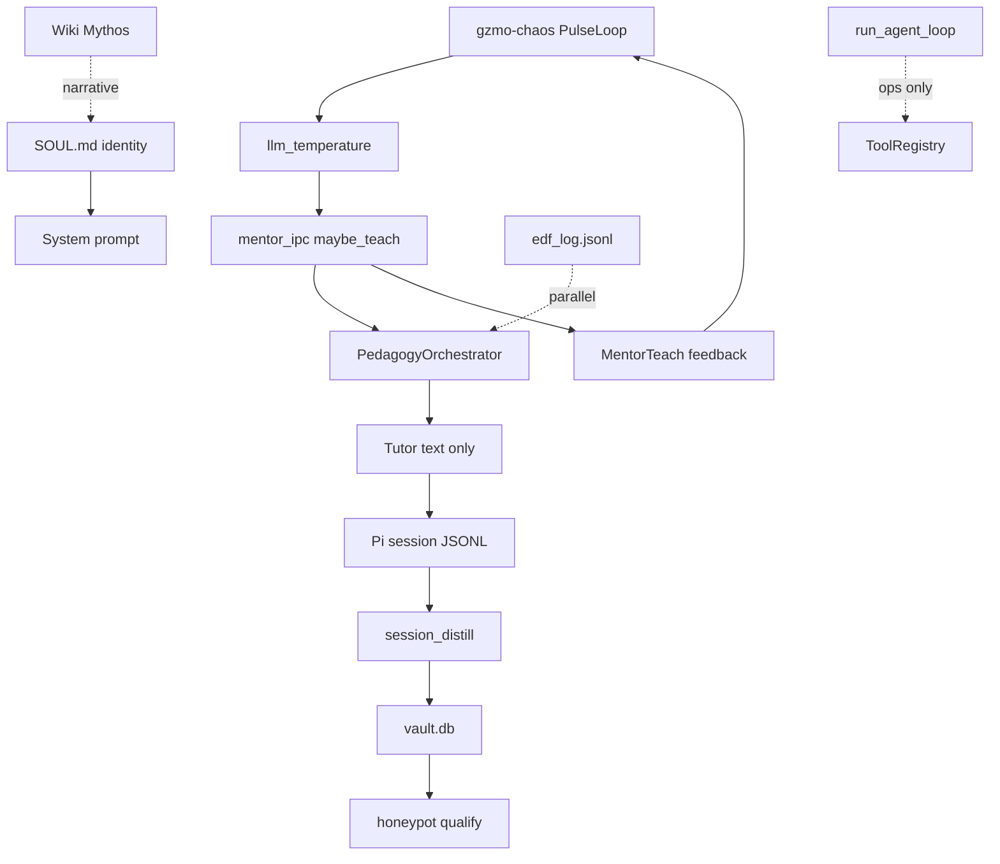

# Verified Findings — Mutual Discovery L1–L5

**Audited:** 2026-06-12 against `feat/context-compress-headroom`  
**Registry:** `~/.pi/agent/LOCKED_LINKS.md` (L1–L10 ADOPTED)  
**Use in future sessions:** L1–L10 are ground truth. Discover **L11+** only.

---

## L1 — Mythos → SOUL.md ✅ VERIFIED

| Claim | Evidence |
|-------|----------|
| SOUL.md is functional identity, hot-reload | `identity.rs`: `load_soul_from_disk`, `setup_hot_reload`, `notify` watcher |
| Feeds system prompt | `IdentityEngine::system_prompt()` |
| Mythos = wiki narrative layer | Wiki entities / sources (research ingest); SOUL = runtime `soul_path` in `config.rs` |

**Caveat:** "Mythos" is not a Rust module — it's documentary framing in wiki. Link is **conceptual + architectural**, correct.

---

## L2 — SOUL + chaos + MentorTeach ✅ VERIFIED

| Claim | Evidence |
|-------|----------|
| Chaos modulates mentor temperature | `mentor_ipc.rs` `apply_chaos_snapshot_to_tutor` → `set_chaos_overrides(snap.llm_temperature, …)` before `maybe_teach` |
| Mentor feeds chaos back | `emit_mentor_chaos_feedback_state` after teach response |
| PulseLoop / Lorenz | `gzmo-chaos/src/lib.rs` module docs |

**Caveat:** SOUL hot-reload is separate from chaos; both affect replies via **different paths** (persona text vs temperature). ✅

---

## L3 — Wiki honeypot ≠ runtime honeypot ✅ VERIFIED

| Claim | Evidence |
|-------|----------|
| Wiki "cascading honeypot theorem" = research ingest | `wiki/sources/the-cascading-honeypot-theorem-of-wisdom.md`, `gzmo_synthetic: true` |
| Runtime honeypot = vault pipeline | `PI_OPERATOR_GUIDE.md`: vault → qualify → SQLite honeypot → Qdrant `honeypot` |
| Legacy `knowledge` collection | Operator guide warns legacy read-only |

**Caveat:** Homonym is real — same word, different layers. ✅

---

## L4 — Pedagogy vs AgentLoop ✅ VERIFIED

| Claim | Evidence |
|-------|----------|
| Orchestrator = Diagnose → Plan → Affect → Tutor | `orchestrator.rs` `run()` lines 112–150 |
| No ToolRegistry in pedagogy path | `agent_call` → `gateway.complete(&messages, &[])` — empty tools; tool calls bail |
| `internal_agent_call` in orchestrator.rs | ✅ **Not** in `agent_loop.rs` (Pi mis-cited file once; claim still true) |
| Ops → agent loop | `pedagogy_bridge.rs`: `InteractionIntent::Ops => return Ok(None)` → caller runs `run_agent_loop` |

**Caveat:** "Brain vs hands" is metaphor; accurate for routing. Path A/B (orchestrator-as-tool) = **design fork**, not shipped.

---

## L5 — Transcript bridge closes tool gap ✅ VERIFIED (refined)

| Claim | Evidence |
|-------|----------|
| Tutor bypasses AgentLoop | `maybe_teach` → `orchestrator.run` only |
| Pi dialogue → JSONL → distill | `session_distill.rs` `distill_pi_jsonl` → `pi_session::parse_pi_jsonl_transcript` |
| Vault → honeypot qualify | `promote_truths_with_origin` + `qualifies_for_honeypot` in `vault.rs` / `honeypot.rs` |
| EDF parallel, not Pi distill input | `orchestrator.rs` appends `EdfRecord` to `EdfStore` / `edf_log.jsonl`; **not** read by `distill_pi_jsonl` |

**Core insight confirmed:** Pedagogical "action" is linguistic; durable "action" is **post-hoc distill** of transcript text.

---

## Cross-link graph (verified)

---

## L6 — Synapse telemetry vs vault ✅ VERIFIED

| Claim | Evidence |
|-------|----------|
| `events.jsonl` is append-only audit bus | `synapse.rs` module docs: writes only, no bus self-consumer |
| Vault is durable truth store | `vault.db` + qualify → honeypot |
| Daemon polls bus externally | `synapse_reader.rs` `poll_pi_synapse`; not contradicting bus write-only contract |
| Synapse ≠ recall | Honeypot/vault recall via `gzmo memory` / MCP search — separate path |

**Caveat:** `synapse_reader` **does** read the file for episodic ingest and distill triggers — that's daemon-side poll, not SynapseBus chemistry. ✅

---

## L7 — session_end → distill pi ✅ VERIFIED

| Claim | Evidence |
|-------|----------|
| Pi emits `session_end` with `targetSessionFile` | `synapse-notifier.ts` `session_shutdown` handler |
| Daemon polls and distills | `synapse_reader.rs` `session_end_distill_targets`; `gzmo.toml` `[synapse_pull] distill_on_session_end = true` |
| Dedup state | `data/synapse-pi-distill.state.json` exists on live system |
| CLI | `gzmo distill pi <path.jsonl>` in `distill_cmd.rs` |

**Caveat:** Pi notifier **also** spawns distill directly when `distillOnSessionEnd: true` — dual path (Pi immediate + daemon poll backup). ✅

---

## L8 — Qdrant hypothesis vs graph verify ✅ VERIFIED (architectural)

| Claim | Evidence |
|-------|----------|
| Qdrant `honeypot` = semantic recall | `PI_OPERATOR_GUIDE.md` pipeline diagram |
| Neo4j = optional graph MCP | Operator guide § architecture |
| Verify before formal link | Discovery dialogue beat 4 (semantic vs graph) — design rule, not auto-enforced in code |

**Caveat:** No automated "Qdrant hit → Neo4j edge" ship path; operator judgment required. ✅

---

## L9 — Synapse mentor_teach vs socket dialogue ✅ VERIFIED

| Claim | Evidence |
|-------|----------|
| Tool call maps to `mentor_teach` event | `synapse-notifier.ts` `TOOL_EVENT_MAP` lines 540–541 |
| Logs tool args + message slice | `data.message = msg.slice(0, 400)` on teach |
| Dialogue path | `mentor-client.ts` → `data/gzmo_mentor.sock` |
| Learn buffer | `MAX_LEARN_TURNS = 8`; `appendLearnTurn` on successful teach |

**Live check:** 16+ `mentor_teach` events in `data/Synapse/events.jsonl` (2026-06-12 learn session). ✅

---

## L10 — Chaos ear vs Pi learn cap ✅ VERIFIED

| Claim | Evidence |
|-------|----------|
| After teach → inbox append | `mentor_ipc.rs` `feedback_ipc::append_event` |
| Inbox drained each pulse tick | `chaos_bootstrap.rs` `drain_inbox` → `feedback_tx.send` |
| Before teach → snapshot applied | `apply_chaos_snapshot_to_tutor` → `set_chaos_overrides` |
| Learn cap slices history only | `mentor-client.ts` `slice(-MAX_LEARN_TURNS)` — does not block teaches or drop chaos events |

**Caveat:** Pi conflated these in exchange 3 — they are **orthogonal** anti-loop mechanisms. ✅

---

## Integration double-check (2026-06-12 closeout)

| Integration | Status | Evidence |
|-------------|--------|----------|
| Daemon active | ✅ | `systemctl --user is-active gzmo-daemon` → active |
| Mentor socket | ✅ | `gzmo mentor ping` → pong; `data/gzmo_mentor.sock` present |
| Mentor smoke | ✅ | `scripts/pi/test_mentor_dialog.sh` passed |
| Pi extension loaded | ✅ | `settings.json` → `gzmo-integration/index.ts`, `synapse-notifier.ts` |
| Mentor tools (skill) | ✅ | `gzmo_mentor_ping/status/reflect/teach/learn_start/learn_end` in `index.ts` |
| MCP mentor duplicate | ⚠️ | `mcp-cache.json` exposes `gzmo_mentor_*` — use **skill tools** for dialogue |
| Synapse bus path | ✅ | `settings.json` `synapseNotifier.busPath` → `data/Synapse/events.jsonl` |
| Session-end distill | ✅ | `distillOnSessionEnd: true` + `[synapse_pull]` |
| Topic-shift distill | ✅ | `topic_shift_enabled = true` in `gzmo.toml` |
| Distill state file | ✅ | `data/synapse-pi-distill.state.json` |
| Chaos on teach | ✅ | `emit_mentor_chaos_feedback` + `MentorTeach` tension delta in `feedback.rs` |
| Learn mode E2E | ✅ | `learn_end` cleared 8 turns (4 exchanges × user+assistant) |
| Pi bash sandbox | ✅ | Fixed: `.claude` was a 0-byte file; replaced with `.claude/commands/` directory |
| Release build | ✅ | `SkillContext` uses `dispatch::skill_context` in chat/TUI (2026-06-12) |

---

## Not verified / out of scope

- Distill **quality** — whether L1–L10 themes appear in vault after `gzmo_distill_pi` on discovery JSONL
- Whether distill extracts LINK relationship syntax vs generic summary bullets
- MCP vs skill tool confusion under load (operational discipline, not code bug)
