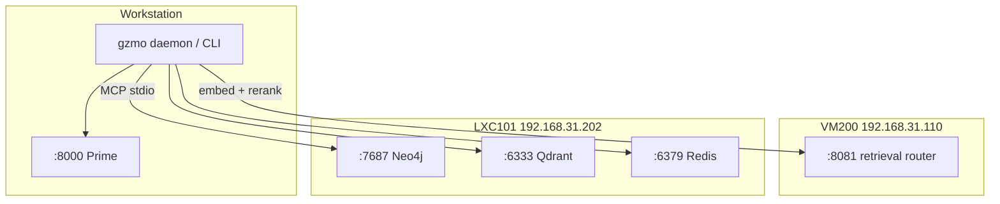

# GZMO Port Layout (Locked)

**Status:** Locked steady-state topology — 2026-06-09  
**Config authority:** `gzmo.toml` (URLs must match this map)  
**Health check:** `./scripts/auto-health-check.sh`

GZMO does not bind HTTP ports. The daemon/CLI calls out to these services.

---

## Steady-state dependencies

| Port | Host | Role | `gzmo.toml` |
|------|------|------|-------------|
| **:8000** | Workstation | Prime — chat, dream, spark, ingest, session distill | `[engine.local]`, `distill_* = local` |
| **:8081** | VM200 `192.168.31.110` | Retrieval router — `gzmo-embed` + `gzmo-rerank` | `[embeddings]`, `[rerank]` |
| **:6333** | LXC101 `192.168.31.202` | Qdrant — collection `honeypot` | `[qdrant]` |
| **:6379** | LXC101 `192.168.31.202` | Redis — scratch cache + `gzmo:distill:pending` | `[redis]` |
| **:7687** | LXC101 `192.168.31.202` | Neo4j — knowledge graph (MCP stdio, not HTTP) | `[[mcp_servers]]` env `NEO4J_URL` |

---

## Port numbering convention

| Range | Host | Purpose |
|-------|------|---------|
| **8000–8010** | Workstation | Heavy cognition (`llama-server`) |
| **8081** | VM200 | Unified retrieval router (embed + rerank presets) |
| **6333 / 6379 / 7687** | LXC101 | Persistence (vectors, scratch queue, graph) |

**Design intent:** Prime keeps workstation VRAM (2× RTX 5070 Ti). VM200 GTX 1070 runs always-on retrieval inference so embed/rerank traffic never competes with Prime.

---

## Optional / retired (not steady-state dependencies)

| Port | Host | Role | Notes |
|------|------|------|-------|
| ~~:8002~~ | Workstation | Local Pi KB embed | **Retired** — Pi KB uses VM200 `:8081` |
| ~~:8010~~ | Workstation | Sovereign FrankenMoE | **Retired** — removed from `gzmo.toml` |
| ~~:8082~~ | VM200 | Legacy standalone rerank | Retired — use router `:8081` |
| ~~:8083~~ | VM200 | Legacy librarian LLM | Retired — distill on Prime |

---

## Deploy / start references

| Service | Start / deploy |
|---------|----------------|
| Prime `:8000` | `~/Projects/llama.cpp/prime-bench/start-prime-gemma4-26b-a4b-256k.sh` or `gzmo-prime.service` |
| VM200 `:8081` router | `scripts/vm200/deploy-retrieval-router.sh` → `llama-retrieval-router.service` |
| GZMO daemon | `scripts/start-production.sh --daemon` or `gzmo-daemon.service` |
| LXC101 stack | Docker on `192.168.31.202` |
| Retrieval bench | `scripts/vm200/retrieval-bench/runner.py` — see `docs/VM200_RETRIEVAL_BENCH.md` |

**SSH (VM200):** `ssh -i ~/.ssh/id_sidecar_proxmox maximilian@192.168.31.110`

---

## Prime model (locked)

| Field | Value |
|-------|-------|
| Model | **Gemma 4 26B-A4B-it** MoE (QAT UD-Q4_K_XL) |
| Alias | `gemma-4-26b-a4b-it` |
| Context | **262144** (256K) |
| `gzmo.toml` | `[engine.local].model`, `[context_memory].context_length` |

---

## Topology

