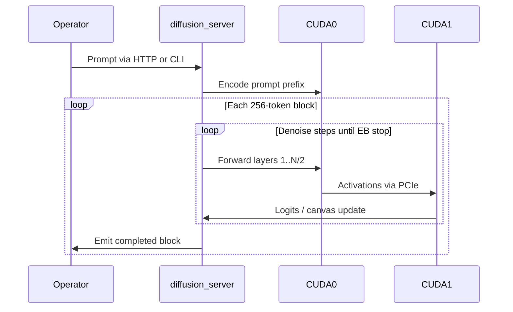

# Prime Handoff — DiffusionGemma 26B-A4B Evaluation & Cutover

**Audience:** Operator (maximilian-wruhs), Pi agent, GZMO daemon, and any subagent inheriting Prime context.  
**Workstation repo:** `~/Projects/_foundation-audit/survey_GZMO`  
**Bench repo:** `~/Projects/llama.cpp/prime-bench`  
**Last updated:** 2026-06-11  
**Status:** **NO-GO (2026-06-11)** — cutover rejected. Production Gemma 4 26B-A4B AR restored on `:8000`. Full report: `~/Projects/llama.cpp/prime-bench/results/diffusion-eval/DIFFUSIONGEMMA_EVAL.md`.

**Related docs:**
- Current production: [PRIME_HANDOFF_GEMMA4_26B.md](PRIME_HANDOFF_GEMMA4_26B.md)
- Bench numbers: `~/Projects/llama.cpp/prime-bench/GEMMA4_26B_PRIME.md`
- Hardware profile: `~/Projects/swap/docs/SYSTEM_PROFILE.md`
- Upstream: [llama.cpp PR #24423](https://github.com/ggml-org/llama.cpp/pull/24423), [PR #24427](https://github.com/ggml-org/llama.cpp/pull/24427)

**Execution log (this machine):**

| Step | Status | Notes |
|------|--------|-------|
| Worktrees + CUDA 13.1 build | **Done** | See §5 pinned commits |
| PR #24427 tensor patch | **Done** | `self_cond_pre_norm` mapping in `llama-arch.cpp` |
| Model download Q4_K_M | **Done** | 16 GB @ `~/Models/diffusiongemma-26B-A4B/` |
| Load gate / sweeps / benchmark | **Done** | 4 sweeps; max **23.05 tok/s** vs Prime **185.7 tok/s** |
| Production cutover | **NO-GO** | Prime restored; see eval report |

---

## 1. Mission

Evaluate whether **DiffusionGemma 26B-A4B** (block-diffusion variant of Gemma 4 MoE) can **replace** production Prime:

| Today (AR Prime) | Candidate (DiffusionGemma) |
|------------------|----------------------------|
| `gemma-4-26b-a4b-it` via `llama-server` | `diffusiongemma-26b-a4b-it` via diffusion runtime |
| ~185–212 tok/s @ 256K with MTP+ngram | Unknown on dual 5070 Ti — must benchmark |
| OpenAI `/v1` on `:8000` | PR #24427 HTTP server (preferred) |

**Do not cut over** until §15 go/no-go criteria pass on **this** hardware.

---

## 2. What DiffusionGemma is (and is not)

### Is

- Gemma 4 **26B-A4B MoE** trained for **block diffusion** text generation
- ~3.8B **active** params per forward (same MoE class as current Prime)
- Generates text in **256-token canvas blocks** via iterative denoising (many forward passes per block)
- Available as GGUF from `unsloth/diffusiongemma-26B-A4B-it-GGUF`

### Is not

- The production AR checkpoint (`gemma-4-26B-A4B-it-qat-UD-Q4_K_XL.gguf`)
- Compatible with **MTP speculative decoding** (`draft-mtp`, `ngram-mod`) — remove all spec flags on cutover
- Stable upstream yet — both PRs are **draft** (2026-06-11)
- Validated at **262144 context** on this box — must be stress-tested

### Inference model (mental picture)



---

## 3. Hardware constraints (non-negotiable)

| Component | Spec | Implication |
|-----------|------|-------------|
| CPU | AMD Ryzen 9950X | Host RAM for CPU MoE offload fallback |
| GPU | 2× RTX 5070 Ti, 16 GB each | **32 GB total**, no NVLink |
| Interconnect | PCIe Gen5 ×8 + ×8 | Layer-split serializes GPUs |
| RAM | ~59–60 GB | MoE expert CPU offload possible |
| CUDA | SM120 Blackwell | Build with `CMAKE_CUDA_ARCHITECTURES=120f` |
| GPU0 | Desktop compositor | Keep **< 15.5 GB** VRAM steady state |

**Weight size:** Q4_K_M ≈ **17 GB** → exceeds single 16 GB card → **must** use dual-GPU layer-split or CPU offload.

**Production Prime policy (comparison):**
- `-sm layer -dev CUDA0,CUDA1 -ts 1,1`
- `GGML_CUDA_DISABLE_GRAPHS=1` (AR Prime — corruption risk on this rig)

**DiffusionGemma:** PR #24427 is CUDA-graph-friendly; test graphs on/off per PR (§10.3).

---

## 4. Upstream PR decision tree

Both PRs are built on this machine. Pick winner by load + benchmark:

| | PR #24423 (danielhanchen) | PR #24427 (lnigam / NVIDIA) |
|---|---|---|
| Commit (pinned) | `15ad8f4` | `e1fc535` (+ local tensor patch) |
| CLI | `llama-diffusion-cli` | `llama-diffusion-gemma-cli` |
| Server | `llama-diffusion-gemma-server` (**IPC / logits**, not HTTP) | `llama-diffusion-gemma-server` (**OpenAI HTTP**) |
| Key flags | `--diffusion-gpu-sampling`, `--diffusion-eb-*` | Device-resident denoising, CUDA graphs |
| Unsloth GGUF | Works out of the box | Needs `self_cond_pre_norm` patch (applied) |
| GZMO cutover | Needs HTTP proxy — defer | **Preferred** |

**Note:** PR #24423's `examples/diffusion-gemma-server` is a small IPC binary (~26 KB), not an HTTP server. Do not confuse it with PR #24427's OpenAI-compatible server (~351 KB).

---

## 5. Directory layout

```
~/Projects/
├── llama.cpp/                              # PRODUCTION — do not modify for experiment
├── llama-diffusion-24423/                  # PR #24423 @ 15ad8f4
│   └── build/bin/llama-diffusion-cli
│   └── build/bin/llama-diffusion-gemma-server   # IPC only
├── llama-diffusion-24427/                  # PR #24427 @ e1fc535 + tensor patch
│   └── build/bin/llama-diffusion-gemma-cli
│   └── build/bin/llama-diffusion-gemma-server   # OpenAI HTTP
└── _foundation-audit/survey_GZMO/docs/
    └── PRIME_HANDOFF_DIFFUSIONGEMMA_26B.md       # this file

~/Models/
└── diffusiongemma-26B-A4B/
    └── diffusiongemma-26B-A4B-it-Q4_K_M.gguf      # ~17 GB

~/Projects/llama.cpp/prime-bench/results/diffusion-eval/
    ├── pr24423-commit.txt
    ├── pr24427-commit.txt
    └── smoke-*.log, sweep-*.log
```

### Pinned commits

```bash
# Recorded 2026-06-11
echo 15ad8f4201d05fee7be94e42ac73fc934ff20235 > ~/Projects/llama.cpp/prime-bench/results/diffusion-eval/pr24423-commit.txt
echo e1fc5359f452b122a73449750a8c1d67c75f9afb > ~/Projects/llama.cpp/prime-bench/results/diffusion-eval/pr24427-commit.txt
```

### Local patch (PR #24427 only)

File: `~/Projects/llama-diffusion-24427/src/llama-arch.cpp`

```cpp
{ LLM_TENSOR_SELF_COND_NORM, "self_cond_pre_norm" },  // was "self_cond_norm"
```

Unsloth GGUF ships `self_cond_pre_norm.weight`; upstream expected `self_cond_norm.weight`. Re-apply after rebasing the worktree.

---

## 6. Phase 0 — Pre-flight

### 6.1 Capture machine baseline

```bash
bash ~/Projects/swap/scripts/capture-machine-snapshot.sh
nvidia-smi
```

### 6.2 Record production Prime baseline (while Prime is running)

```bash
curl -s http://127.0.0.1:8000/v1/models | python3 -m json.tool
# Expect: gemma-4-26b-a4b-it, n_ctx 262144

cd ~/Projects/llama.cpp
bash prime-bench/run-mtp-bench-profile.sh \
  prime-bench/profiles/gemma4-26b/gemma4-26b-champion-256k.json \
  | tee prime-bench/results/diffusion-eval/prime-baseline-$(date +%F).log
```

### 6.3 Stop production Prime (required before diffusion tests)

```bash
systemctl --user stop gzmo-prime.service
curl -sf http://127.0.0.1:8000/v1/models && echo "STILL RUNNING" || echo "Port free"
watch -n1 nvidia-smi
```

**Current state:** `gzmo-prime.service` is **active** — stop before §9.

### 6.4 Verify CUDA toolchain

```bash
export CUDA_HOME=/usr/local/cuda-13.1
export PATH="${CUDA_HOME}/bin:${PATH}"
/usr/local/cuda-13.1/bin/nvcc --version   # 13.1 (not default /usr/bin/nvcc 12.4)
```

---

## 7. Phase 1 — Build worktrees (completed)

`gh` CLI is **not** installed. Use `git fetch` + worktrees:

```bash
cd ~/Projects/llama.cpp
git fetch origin pull/24423/head:diffusion-24423
git fetch origin pull/24427/head:diffusion-24427
git worktree add ../llama-diffusion-24423 diffusion-24423
git worktree add ../llama-diffusion-24427 diffusion-24427
```

### Build both (CUDA 13.1, SM120)

```bash
export CUDA_HOME=/usr/local/cuda-13.1
export CUDACXX="${CUDA_HOME}/bin/nvcc"
export PATH="${CUDA_HOME}/bin:${PATH}"

# PR #24423
cd ~/Projects/llama-diffusion-24423
cmake -B build -DCMAKE_BUILD_TYPE=Release \
  -DCMAKE_CUDA_COMPILER="${CUDA_HOME}/bin/nvcc" \
  -DCMAKE_CUDA_ARCHITECTURES=120f -DGGML_CUDA=ON
cmake --build build -j"$(nproc)" --target llama-diffusion-cli llama-diffusion-gemma-server

# PR #24427 (apply tensor patch first — §5)
cd ~/Projects/llama-diffusion-24427
cmake -B build -DCMAKE_BUILD_TYPE=Release \
  -DCMAKE_CUDA_COMPILER="${CUDA_HOME}/bin/nvcc" \
  -DCMAKE_CUDA_ARCHITECTURES=120f -DGGML_CUDA=ON
cmake --build build -j"$(nproc)" --target llama-diffusion-gemma-cli llama-diffusion-gemma-server
```

---

## 8. Phase 2 — Download model weights

System `pip` / `huggingface-cli` are unavailable. Use `sovereign-moe` venv:

```bash
mkdir -p ~/Models/diffusiongemma-26B-A4B

/home/maximilian-wruhs/Projects/sovereign-moe/.venv/bin/python -c '
from huggingface_hub import hf_hub_download
path = hf_hub_download(
    repo_id="unsloth/diffusiongemma-26B-A4B-it-GGUF",
    filename="diffusiongemma-26B-A4B-it-Q4_K_M.gguf",
    local_dir="/home/maximilian-wruhs/Models/diffusiongemma-26B-A4B",
)
print("Downloaded:", path)
'

ls -lh ~/Models/diffusiongemma-26B-A4B/
```

Or use the bench helper:

```bash
bash ~/Projects/llama.cpp/prime-bench/download-diffusiongemma.sh
```

**Do not** download Q8_0 (~27 GB) on this rig without heavy CPU offload.

---

## 9. Phase 3 — Load gate (smoke test)

```bash
export MODEL=~/Models/diffusiongemma-26B-A4B/diffusiongemma-26B-A4B-it-Q4_K_M.gguf
export TEMPLATE=~/Projects/llama.cpp/models/templates/google-gemma-4-31B-it-interleaved.jinja
mkdir -p ~/Projects/llama.cpp/prime-bench/results/diffusion-eval
```

### 9.1 PR #24423 CLI smoke

```bash
export GGML_CUDA_DISABLE_GRAPHS=1

~/Projects/llama-diffusion-24423/build/bin/llama-diffusion-cli \
  -m "$MODEL" \
  -sm layer -dev CUDA0,CUDA1 -ts 1,1 \
  -ngl 99 \
  -p "Reply with exactly: diffusion smoke ok" \
  -n 64 \
  --diffusion-gpu-sampling auto \
  --diffusion-eb auto \
  --diffusion-eb-max-steps 48 \
  --verbose 2>&1 | tee ~/Projects/llama.cpp/prime-bench/results/diffusion-eval/smoke-24423.log
```

**Pass:** loads, no CUDA abort, coherent output.  
**Fail:** `SOFT_MAX failed` / `cudaMalloc failed` → §10.4 offload.

### 9.2 PR #24427 CLI smoke (preferred path)

```bash
unset GGML_CUDA_DISABLE_GRAPHS

~/Projects/llama-diffusion-24427/build/bin/llama-diffusion-gemma-cli \
  -m "$MODEL" \
  -sm layer -dev CUDA0,CUDA1 -ts 1,1 \
  -ngl 99 \
  -p "Reply with exactly: diffusion smoke ok" \
  -n 4 2>&1 | tee ~/Projects/llama.cpp/prime-bench/results/diffusion-eval/smoke-24427.log
```

**Pass:** no `missing tensor self_cond_norm.weight` (patch applied).

### 9.3 VRAM during smoke

```bash
nvidia-smi --query-gpu=index,memory.used,memory.total --format=csv
```

Target: **< 15500 MiB per GPU** at steady state.

---

## 10. Phase 4 — Hardware tuning sweeps

All sweeps require Prime stopped. Run from `~/Projects/llama.cpp/prime-bench`.

### 10.1 PR #24423 — gpu-sampling sweep

```bash
cd ~/Projects/llama.cpp/prime-bench
for SAMPLING in auto off; do
  ~/Projects/llama-diffusion-24423/build/bin/llama-diffusion-cli \
    -m "$MODEL" -sm layer -dev CUDA0,CUDA1 -ts 1,1 -ngl 99 \
    -cnv -n 512 \
    --diffusion-gpu-sampling "$SAMPLING" \
    --diffusion-eb auto --diffusion-eb-max-steps 48 \
    --verbose 2>&1 | tee "results/diffusion-eval/sweep-gpu-sampling-${SAMPLING}.log"
done
```

Extract: `time per step`, `throughput: X tok/s`, `in-step parallel Y tok/s`. Expect `auto` ≈ 1.25× in-step vs `off`.

### 10.2 PR #24423 — EB max-steps sweep

```bash
for STEPS in 24 48 64; do
  ~/Projects/llama-diffusion-24423/build/bin/llama-diffusion-cli \
    -m "$MODEL" -sm layer -dev CUDA0,CUDA1 -ts 1,1 -ngl 99 \
    -cnv -n 512 \
    --diffusion-gpu-sampling auto \
    --diffusion-eb auto --diffusion-eb-max-steps "$STEPS" \
    --verbose 2>&1 | tee "results/diffusion-eval/sweep-eb-steps-${STEPS}.log"
done
```

### 10.3 CUDA graphs A/B

```bash
# PR #24423 — start with graphs OFF (matches AR Prime policy)
export GGML_CUDA_DISABLE_GRAPHS=1

# PR #24427 — try graphs ON first; set =1 if unstable
unset GGML_CUDA_DISABLE_GRAPHS
```

### 10.4 MoE offload (if OOM)

PR #24423 commit `9b4beb7+` honors `-ot` / `--n-cpu-moe`:

```bash
~/Projects/llama-diffusion-24423/build/bin/llama-diffusion-cli \
  -m "$MODEL" -sm layer -dev CUDA0,CUDA1 -ts 1,1 -ngl 99 \
  --n-cpu-moe 16 -cnv -n 256 --verbose

# or
~/Projects/llama-diffusion-24423/build/bin/llama-diffusion-cli \
  -m "$MODEL" -sm layer -dev CUDA0,CUDA1 -ts 1,1 -ngl 99 \
  -ot "exps=CPU" -cnv -n 256 --verbose
```

### 10.5 Dual-GPU vs single-GPU

Community: 2×3090 slower than 1×3090 for #24423. Validate on 5070 Ti:

```bash
# Dual (default)
-sm layer -dev CUDA0,CUDA1 -ts 1,1

# Single GPU + CPU MoE offload
-sm none -dev CUDA1 -ngl 99 --n-cpu-moe 20
```

### 10.6 Champion profile (fill after sweeps)

```bash
# Template — replace with measured winners
export DIFFUSION_GPU_SAMPLING=auto
export DIFFUSION_EB_MAX_STEPS=48
export GGML_CUDA_DISABLE_GRAPHS=1   # or 0 for #24427 if stable
```

---

## 11. Phase 5 — Benchmark vs production Prime

### 11.1 Metrics

| Metric | Source | Prime baseline | Pass threshold |
|--------|--------|----------------|----------------|
| mtp-bench mean tok/s | `run-mtp-bench-profile.sh` | **185.7** | ≥ 150 stretch; ≥ 120 acceptable |
| ms/step | `--verbose` logs | n/a | **< 200 ms** dual 5070 Ti |
| Effective tok/s | `throughput:` line (#24423) | n/a | record |
| VRAM/GPU | `nvidia-smi` | ~11.5+12.4 GB | < 15.5 GB/GPU |
| 256K context stress | long prompt test | validated | **Hard gate** |
| Quality (5 prompts) | manual | AR baseline | ≤ 1 marginal |

### 11.2 Quality gate prompts

1. Short factual: "What is 17×23? Reply with number only."
2. Code: "Write a Python function to merge two sorted lists."
3. Agent: "List steps to debug a systemd service that exits immediately."
4. Long-context: ~32K token paste + "Summarize in 5 bullets."
5. 256K stress: max context + single question (if supported)

**Two or more fails → no cutover.**

---

## 12. Phase 6 — Server eval (PR #24427)

Use **alternate port** while evaluating; do not bind `:8000` until cutover.

```bash
unset GGML_CUDA_DISABLE_GRAPHS

~/Projects/llama-diffusion-24427/build/bin/llama-diffusion-gemma-server \
  -m "$MODEL" \
  -sm layer -dev CUDA0,CUDA1 -ts 1,1 \
  -ngl 99 \
  --port 8011 \
  --alias diffusiongemma-26b-a4b-it \
  --jinja \
  --chat-template-file "$TEMPLATE"
```

### API smoke

```bash
curl -s http://127.0.0.1:8011/v1/models | python3 -m json.tool
curl -s http://127.0.0.1:8011/health

curl -s http://127.0.0.1:8011/v1/chat/completions \
  -H "Content-Type: application/json" \
  -d '{
    "model": "diffusiongemma-26b-a4b-it",
    "messages": [{"role":"user","content":"Say hello in one sentence."}],
    "max_tokens": 128
  }' | python3 -m json.tool
```

---

## 13. Phase 7 — Production cutover (conditional)

**Skip if §15 = NO-GO.**

### 13.1 Launcher

Target: `~/Projects/llama.cpp/prime-bench/start-prime-diffusiongemma-26b.sh`

```bash
#!/usr/bin/env bash
set -euo pipefail
SERVER="${HOME}/Projects/llama-diffusion-24427/build/bin/llama-diffusion-gemma-server"
CHAT_TEMPLATE_FILE="${PRIME_CHAT_TEMPLATE:-${HOME}/Projects/llama.cpp/models/templates/google-gemma-4-31B-it-interleaved.jinja}"
MODEL="${PRIME_MODEL:-${HOME}/Models/diffusiongemma-26B-A4B/diffusiongemma-26B-A4B-it-Q4_K_M.gguf}"
PORT="${PRIME_PORT:-8000}"
ALIAS="${PRIME_ALIAS:-diffusiongemma-26b-a4b-it}"
CTX="${PRIME_CTX:-4096}"   # raise only after 256K validated
NGL=999

export GGML_CUDA_DISABLE_GRAPHS="${GGML_CUDA_DISABLE_GRAPHS:-0}"

if curl -sf "http://127.0.0.1:${PORT}/v1/models" >/dev/null 2>&1; then
  echo "[OK] Port :${PORT} already in use"
  exec sleep infinity
fi

exec "${SERVER}" \
  -m "$MODEL" --alias "$ALIAS" -c "$CTX" \
  -sm layer -dev CUDA0,CUDA1 -ts 1,1 -ngl "$NGL" \
  --port "$PORT" --jinja \
  --chat-template-file "$CHAT_TEMPLATE_FILE"
```

No `--spec-type`, `-md`, or ngram flags.

### 13.2 systemd

Edit `~/.config/systemd/user/gzmo-prime.service`:

```ini
Description=GZMO Prime (DiffusionGemma 26B-A4B @ :8000)
ExecStart=%h/Projects/llama.cpp/prime-bench/start-prime-diffusiongemma-26b.sh
Environment=GGML_CUDA_DISABLE_GRAPHS=0
```

```bash
systemctl --user daemon-reload
systemctl --user restart gzmo-prime.service
journalctl --user -u gzmo-prime.service -f
```

### 13.3 GZMO + Pi config

`~/Projects/_foundation-audit/survey_GZMO/gzmo.toml`:

```toml
[engine.local]
url   = "http://localhost:8000/v1"
model = "diffusiongemma-26b-a4b-it"

[context_memory]
context_length = 262144   # only if validated in §11
```

Sync: `~/.pi/agent/models.json`, `~/.pi/agent/settings.json`.

```bash
cd ~/Projects/_foundation-audit/survey_GZMO
gzmo ingest docs/PRIME_HANDOFF_DIFFUSIONGEMMA_26B.md
```

---

## 14. Rollback

```bash
systemctl --user stop gzmo-prime.service
# Restore ExecStart=.../start-prime-gemma4-26b-a4b-256k.sh
# Environment=GGML_CUDA_DISABLE_GRAPHS=1
systemctl --user daemon-reload
systemctl --user start gzmo-prime.service
# Revert gzmo.toml model → gemma-4-26b-a4b-it
curl -s http://127.0.0.1:8000/v1/models | python3 -m json.tool
```

AR Prime weights and launcher are never deleted during evaluation.

---

## 15. Go / no-go decision table (filled 2026-06-11)

Full report: [`DIFFUSIONGEMMA_EVAL.md`](../../../llama.cpp/prime-bench/results/diffusion-eval/DIFFUSIONGEMMA_EVAL.md)

| # | Criterion | Result | Notes |
|---|-----------|--------|-------|
| 1 | Model loads on chosen PR | **Y** | #24427 with `self_cond_pre_norm` patch |
| 2 | VRAM < 15.5 GB/GPU | **Y** | With `DG_DEVICE_SELFCOND=0` |
| 3 | 256K context stress passes | **N** | Not validated; not pursued after throughput fail |
| 4 | Effective tok/s ≥ 120 | **N** | Best: **23.05 tok/s** (8× slower than Prime) |
| 5 | Quality gate ≤ 1 marginal | — | Not blocking; speed disqualified cutover |
| 6 | HTTP server API works (#24427) | **Y** | But `n_steps` hardcoded to 48 (CLI ignored) |
| 7 | 24h stability soak | **N** | Multi-GPU crashes with `DG_DEVICE_SELFCOND=1` |

**Verdict: NO-GO.** Production Prime (`gemma-4-26b-a4b-it` @ 262144) restored on `:8000`.

### Key workarounds discovered

- `DG_DEVICE_SELFCOND=0` — required on dual 5070 Ti layer-split to avoid `ggml_backend_buffer_is_host` assert
- CUDA graphs — no meaningful gain (~213 vs ~214 ms/step)
- PR #24427 server bug — `srv.n_steps` hardcoded to 48; patch needed to honor `--diffusion-steps`

---

## 16. Pitfalls

| Pitfall | Detail |
|---------|--------|
| Prime + Diffusion concurrent | Both need both GPUs — OOM |
| Editing stock `llama.cpp` | Breaks production `llama-server` |
| PR #24423 "server" binary | IPC logits server, not HTTP |
| Expecting MTP | No `draft-mtp` on diffusion path |
| `--fit` on #24423 | Not applied by diffusion runner |
| Q8_0 weights | Too large for 32 GB without offload |
| Rebasing #24427 | Re-apply `self_cond_pre_norm` patch |
| CUDA graphs on dual 5070 Ti | AR Prime disables; diffusion may differ |
| Config drift | Update `gzmo.toml` + Pi together |

---

## 17. Operator checklist

- [ ] §6.2 Prime baseline captured
- [x] §7 worktrees built (`15ad8f4`, `e1fc535` + patch)
- [x] §8 model downloaded (Q4_K_M)
- [ ] §6.3 Prime stopped for diffusion tests
- [x] §9 load gate passed
- [x] §10 tuning sweeps (4 configs)
- [x] §11 benchmarks vs Prime — **NO-GO**
- [x] §15 go/no-go in `DIFFUSIONGEMMA_EVAL.md`
- [x] Prime restored on `:8000` (cutover rejected)

---

## 18. One-paragraph self-summary (after cutover only)

I am **Prime**, `diffusiongemma-26b-a4b-it`, a Gemma 4 **26B-A4B MoE block-diffusion** model (~3.8B active params) on dual RTX 5070 Ti via **llama-diffusion-gemma-server** (PR #24427) at `http://localhost:8000/v1`. I generate text in **256-token canvas blocks** with entropy-bound denoising — not autoregressive + MTP. Trade-offs: [fill tok/s], [fill context], [fill quality]. Embeddings: VM200 `:8081`. Config: `gzmo.toml`. Rollback: `start-prime-gemma4-26b-a4b-256k.sh`.

---

*Generated for DiffusionGemma 26B-A4B evaluation on dual RTX 5070 Ti, 2026-06-11.*
