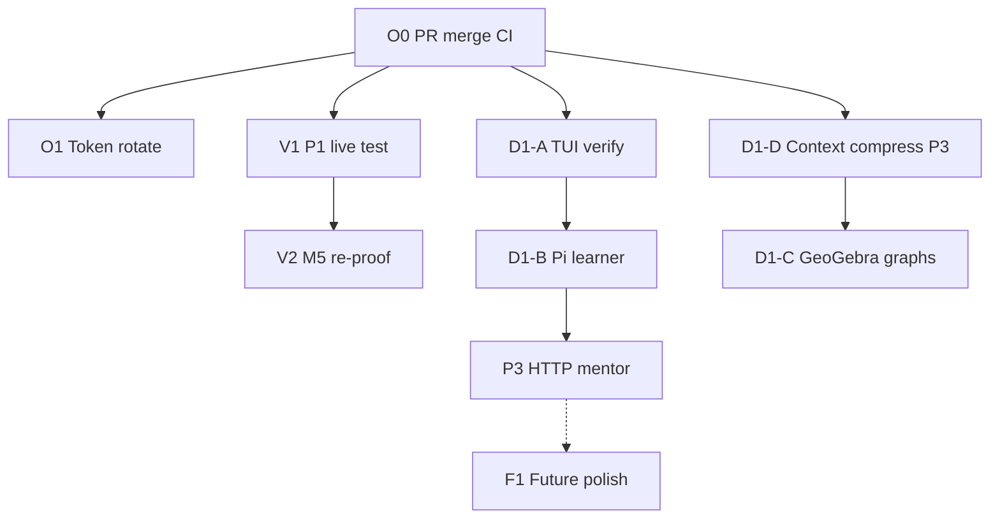

# GZMO Platform — Remaining Work Step-by-Step Guide

**Created:** 2026-06-12  
**Branch:** `feat/context-compress-headroom`  
**PR:** https://github.com/maximilianwruhs-cyber/GZMO/pull/23  
**Audience:** Operator (you) and implementation agents  

This is the **single master checklist** for everything not yet finished after the Pi mentor + distill session. Read §0 first so you do not re-implement shipped work.

**Companion docs:**

| Doc | Use when |
|-----|----------|
| [`PI_GZMO_PLATFORM_IMPLEMENTATION_HANDOFF.md`](./PI_GZMO_PLATFORM_IMPLEMENTATION_HANDOFF.md) | What shipped (architecture, paths) |
| [`PI_GZMO_REMAINING_TASKS_IMPLEMENTATION_GUIDE.md`](./PI_GZMO_REMAINING_TASKS_IMPLEMENTATION_GUIDE.md) | Historical task IDs (R0–P2); some status lines are stale |
| [`DEFERRED_WORK_HANDOFF.md`](./DEFERRED_WORK_HANDOFF.md) | Deep design for D1/F1 tracks |
| [`CONTEXT_COMPRESS_PHASE3_HANDOFF.md`](./CONTEXT_COMPRESS_PHASE3_HANDOFF.md) | D1-D implementation detail |
| [`GITHUB_PUSH.md`](./GITHUB_PUSH.md) | Token + push helper |
| `~/gzmo_skills/BRIDGE.md` | Operator bridge summary (outside git) |

---

## Table of contents

0. [Status at a glance](#0-status-at-a-glance)
1. [Priority order](#1-priority-order)
2. [O0 — PR merge and CI](#2-o0--pr-merge-and-ci)
3. [O1 — Security hygiene (token rotation)](#3-o1--security-hygiene-token-rotation)
4. [O2 — Pi-side files outside GZMO git](#4-o2--pi-side-files-outside-gzmo-git)
5. [V1 — P1 live topic-shift test](#5-v1--p1-live-topic-shift-test)
6. [V2 — M5 session_end distill re-proof](#6-v2--m5-session_end-distill-re-proof)
7. [P3 — HTTP mentor bridge (remote Pi)](#7-p3--http-mentor-bridge-remote-pi)
8. [D1-A — TUI pedagogy parity (verify + gaps)](#8-d1-a--tui-pedagogy-parity-verify--gaps)
9. [D1-B — Pi learner profile (`GZMO_LEARNER_ID=pi`)](#9-d1-b--pi-learner-profile-gzmo_learner_idpi)
10. [D1-C — Prerequisite graphs + GeoGebra (phase 6)](#10-d1-c--prerequisite-graphs--geogebra-phase-6)
11. [D1-D — Context-compress phase 3](#11-d1-d--context-compress-phase-3)
12. [F1 — Future / research backlog](#12-f1--future--research-backlog)
13. [G1 — Git hygiene (unrelated WIP on branch)](#13-g1--git-hygiene-unrelated-wip-on-branch)
14. [Verification matrix](#14-verification-matrix)
15. [Suggested agent prompts](#15-suggested-agent-prompts)

---

## 0. Status at a glance

### Shipped (do not re-implement)

| Area | Evidence |
|------|----------|
| Pi ↔ GZMO mentor (socket, tools, learn mode, chaos) | `mentor_ipc.rs`, `~/.pi/agent/skills/gzmo-integration/` |
| MCP mentor | `gzmo_mentor_ping` / `gzmo_mentor_teach` on `mcp-serve` |
| `session_end` → `gzmo distill pi` | Daemon poll + `synapse-notifier.ts` |
| Topic-shift distill (code + config) | `topic_shift_enabled = true`, `test_topic_shift_distill.sh` |
| P2 distill ergonomics | `gzmo_distill_pi`, `distill_latest_pi_session.sh` |
| Multi-learner core | `GZMO_LEARNER_ID`, `--learner`, `data/learner/<id>/` |
| Graph validate CLI | `gzmo pedagogy graph validate` |
| PR opened | [#23](https://github.com/maximilianwruhs-cyber/GZMO/pull/23) |

### Remaining (this guide)

| ID | Task | Type | Effort |
|----|------|------|--------|
| **O0** | Merge PR #23 / fix CI | Operator | 15–60 min |
| **O1** | Rotate GitHub token | Operator | 5 min |
| **O2** | Sync Pi files after agent edits | Operator | 5 min |
| **V1** | P1 live topic-shift in real Pi session | Manual test | 15 min |
| **V2** | M5 re-proof after substantive Pi session | Manual test | 10 min |
| **P3** | HTTP mentor for remote Pi | Implementation | 2+ days |
| **D1-A** | TUI parity acceptance | Verify + small fixes | 2–8 h |
| **D1-B** | Dedicated `pi` learner profile | Config + docs | 1–2 h |
| **D1-C** | Graphs / GeoGebra / sandbox | Multi-sprint research | days–weeks |
| **D1-D** | Context-compress phase 3 | Implementation | 1–3 days |
| **F1** | Unified `/help`, MCP extras, PR split | Polish | variable |
| **G1** | Clean unrelated WIP on branch | Git hygiene | 1–2 h |

---

## 1. Priority order



**Recommended order for you:**

1. **O0** — get #23 green and merged  
2. **O1** — rotate token (was in chat)  
3. **V1 + V2** — one real Pi session proves distill end-to-end  
4. **D1-A** — only if you use `gzmo --repl` for teaching  
5. **D1-B** — if Pi mentor history should not mix with `operator`  
6. **P3** — only when Pi runs on a different machine  
7. **D1-D / D1-C / F1** — separate sprints  

---

## 2. O0 — PR merge and CI

**Goal:** Land `feat/context-compress-headroom` on `main` with passing checks.

### Prerequisites

- Daemon running locally (for reviewer repro steps)
- `.env.local` with valid `GITHUB_TOKEN` (see [`GITHUB_PUSH.md`](./GITHUB_PUSH.md))

### Steps

1. **Check PR status**
   ```bash
   cd ~/Projects/_foundation-audit/survey_GZMO
   gh pr view 23 --json state,mergeable,statusCheckRollup
   gh pr checks 23
   ```

2. **If checks fail** — open the failing job log, fix only what blocks merge (use `fix-ci` skill or agent). Common issues:
   - `cargo test` / compile on CI vs local `CARGO_TARGET_DIR`
   - Missing fixture or doc-only drift

3. **Local smoke before merge** (reviewer repro)
   ```bash
   ./scripts/build-gzmo.sh
   systemctl --user restart gzmo-daemon
   ./target/release/gzmo mentor ping          # expect: pong
   ./scripts/pi/smoke.sh                      # expect: OK
   python3 scripts/pi/test_mcp_mentor.py      # expect: SUCCESS
   ./scripts/pi/test_topic_shift_distill.sh   # expect: OK
   ```

4. **Merge**
   ```bash
   gh pr merge 23 --squash   # or merge commit per team preference
   git checkout main && git pull
   systemctl --user restart gzmo-daemon
   ```

5. **Post-merge verify on `main`**
   ```bash
   ./scripts/pi/smoke.sh
   ```

### Acceptance

- [ ] PR #23 merged
- [ ] `main` builds and smoke passes on operator machine
- [ ] Daemon restarted on merged binary

### Pitfalls

| Pitfall | Mitigation |
|---------|------------|
| PR is huge (context-compress + Pi platform) | See **G1** to split follow-up PRs for unrelated WIP |
| Stale `target/release/gzmo` | Always `./scripts/build-gzmo.sh` before verify |
| Pi tools not in `settings.json` extensions | Mentor tools invisible to Pi until listed |

---

## 3. O1 — Security hygiene (token rotation)

**Goal:** Revoke the GitHub PAT that appeared in chat; keep push working.

### Steps

1. Open https://github.com/settings/tokens  
2. **Revoke** the token that was pasted in chat  
3. Create new PAT:
   - Fine-grained or classic
   - Repo: `maximilianwruhs-cyber/GZMO`
   - Scope: **Contents: Read and write** (and `pull_requests` if using `gh`)  
4. Update **only** local file (never commit, never paste in chat):
   ```bash
   nano ~/Projects/_foundation-audit/survey_GZMO/.env.local
   # GITHUB_TOKEN=ghp_NEW_TOKEN_HERE
   ```
5. Verify:
   ```bash
   cd ~/Projects/_foundation-audit/survey_GZMO
   set -a && source .env.local && set +a
   curl -s -H "Authorization: Bearer ${GITHUB_TOKEN}" https://api.github.com/user | python3 -c "import sys,json; print(json.load(sys.stdin).get('login'))"
   ```
6. Test push helper:
   ```bash
   ./scripts/push-github.sh HEAD
   ```

### Acceptance

- [ ] Old token revoked on GitHub
- [ ] `.env.local` updated; API returns your username
- [ ] `./scripts/push-github.sh` succeeds

---

## 4. O2 — Pi-side files outside GZMO git

**Goal:** Ensure Pi runtime matches what agents edited on disk.

These paths are **not** in the `survey_GZMO` repo. After any agent session, verify manually:

| Path | What to check |
|------|----------------|
| `~/.pi/agent/settings.json` | `extensions` includes `gzmo-integration/index.ts` (or path to skill) |
| `~/.pi/agent/skills/gzmo-integration/index.ts` | `gzmo_mentor_*`, `gzmo_distill_pi` tools present |
| `~/.pi/agent/skills/gzmo-integration/mentor-client.ts` | Socket client + CLI fallback |
| `~/.pi/agent/skills/gzmo-integration/SKILL.md` | Routing: Prime vs mentor, no bash loops |
| `~/.pi/agent/extensions/synapse-notifier.ts` | `checkTopicShift`, `session_end` distill |
| `~/.pi/agent/MEMORY_ACTIVE.md` | Ops notes for new Pi sessions |

### Steps

1. **Confirm extension registration**
   ```bash
   python3 -c "import json; d=json.load(open('$HOME/.pi/agent/settings.json')); print([e for e in d.get('extensions',[]) if 'gzmo' in str(e).lower()])"
   ```

2. **Start a new Pi session** (old sessions may not load new tools)

3. **Smoke from Pi's perspective** — ask Pi to run `gzmo_mentor_ping` (not `bash gzmo mentor`)

### Acceptance

- [ ] New Pi session sees `gzmo_mentor_*` and `gzmo_distill_pi`
- [ ] `gzmo_mentor_ping` returns pong without opening interactive chat

---

## 5. V1 — P1 live topic-shift test

**Goal:** Prove mid-session distill fires on a real topic change (not just `test_topic_shift_distill.sh`).

### Prerequisites

- `[session_distill] topic_shift_enabled = true` in `gzmo.toml` (already set)
- Embed endpoint reachable (`[embeddings] url` — VM200 `:8081`)
- **New Pi session** (extension reads `gzmo.toml` at startup)

### Steps

1. **Pre-flight**
   ```bash
   cd ~/Projects/_foundation-audit/survey_GZMO
   ./scripts/pi/test_topic_shift_distill.sh
   ```

2. **Start new Pi session**

3. **Topic A** — 4+ user turns on one subject (each turn substantial):
   - Example: Kubernetes pod scheduling, node affinity, resource limits
   - Baseline turn needs **≥100 chars**; later window needs **≥200 chars** total across last 3 user turns

4. **Topic B** — switch sharply to unrelated domain:
   - Example: sourdough fermentation, hydration ratios, oven steam

5. **Wait** — rate limit: min **3 turns** and **10 minutes** between topic-shift triggers

6. **Check synapse bus**
   ```bash
   tail -20 data/Synapse/events.jsonl | rg topic_shift_distill
   ```

7. **Check daemon logs**
   ```bash
   journalctl --user -u gzmo-daemon -n 50 --no-pager | rg -i 'distill|topic'
   ```

8. **Optional** — confirm partial range distill ran:
   ```bash
   ls -la data/synapse-topic-shift.state.json 2>/dev/null || echo "state file may not exist until first trigger"
   ```

### Acceptance

- [ ] `topic_shift_distill` event in `events.jsonl` with `distance`, `startTurn`, `maxTurns`
- [ ] Daemon or detached `gzmo distill pi … --from-turn N --max-turns M` in logs
- [ ] No duplicate trigger within 10 min / 3 turns (rate limit)

### Pitfalls

| Pitfall | Mitigation |
|---------|------------|
| Short user messages | Thresholds not met — write longer prompts |
| Same session before config change | Must start **new** Pi session after enabling |
| Embed down | `test_topic_shift_distill.sh` fails at embed step — fix VM200 first |

---

## 6. V2 — M5 session_end distill re-proof

**Goal:** Confirm automatic distill after a **real** Pi quit writes vault facts (not just synthetic bus append).

### Steps

1. **Baseline vault count** (pick one method):
   ```bash
   ./target/release/gzmo memory status
   # or inspect vault DB fact count via health / sqlite
   ```

2. **New Pi session** — substantive exchange (10+ turns, real decisions)

3. **End session** — `/exit` or quit Pi

4. **Within 90 seconds**, check:
   ```bash
   tail -5 data/Synapse/events.jsonl | rg session_end
   cat data/synapse-pi-distill.state.json    # should list distilled path after success
   journalctl --user -u gzmo-daemon -n 40 --no-pager | rg -i distill
   ```

5. **Optional live LLM path**
   ```bash
   GZMO_DISTILL_SMOKE=1 ./scripts/pi/test_distill_pi.sh
   ```

6. **Re-check vault** for new `SessionDistill` / `pi-{uuid}` facts

7. **Dedup** — end same session again (or re-run); should skip as duplicate

### Acceptance

- [ ] `session_end` with correct `targetSessionFile`
- [ ] Distill subprocess success before state file update
- [ ] Vault fact count increased (or explicit "distilled N truths" in log)
- [ ] Second run does not duplicate

### Manual override (if auto distill missed)

```bash
~/Projects/_foundation-audit/survey_GZMO/scripts/pi/distill_latest_pi_session.sh
# or in Pi: gzmo_distill_pi with no sessionPath
```

---

## 7. P3 — HTTP mentor bridge (remote Pi)

**Goal:** Pi on another host calls GZMO Socratic mentor without a shared Unix socket.

**Status:** Not started  
**Effort:** ~2+ days  
**Prerequisite:** Local socket mentor stable (shipped)

### Architecture

```
Remote Pi  →  HTTP POST /mentor  →  (SSH tunnel)  →  127.0.0.1:9137  →  same teach path as socket
```

### Phase P3-1 — Config and types

1. **Add to `gzmo-core/src/config.rs`** (`PedagogyConfig`):
   ```toml
   [pedagogy]
   mentor_http_enabled = false
   mentor_http_bind = "127.0.0.1:9137"
   mentor_http_token = ""   # generate: openssl rand -hex 32
   ```

2. **Mirror in `gzmo.toml.example`** with comments (default off)

3. **Reuse types** from `gzmo-core/src/mentor_client.rs`: `MentorRequest`, `MentorResponse`

### Phase P3-2 — HTTP server module

1. **Create** `gzmo-cli/src/mentor_http.rs`:
   - Use `axum` or `hyper` (match existing deps in `Cargo.toml`)
   - Routes:
     - `GET /health` → `{"ok":true}` (no auth)
     - `POST /mentor` → body JSON `MentorRequest`, response `MentorResponse`
   - **Auth:** `Authorization: Bearer <mentor_http_token>` — reject 401 if missing/wrong
   - **Bind:** only `mentor_http_bind` (default `127.0.0.1`, never `0.0.0.0` without explicit opt-in)

2. **Handler logic** — delegate to same code as `mentor_ipc.rs`:
   - `PedagogyRuntime::maybe_teach(...)` for `method: "teach"`
   - Ping/status/reload parity optional (socket already has these)

3. **Wire into daemon** (`daemon_cmd.rs`):
   - If `mentor_http_enabled`, spawn `run_mentor_http(state)` alongside unix socket server
   - Share `Arc<MentorServerState>` with socket handler

4. **Optional CLI subcommand** for debugging:
   ```bash
   gzmo mentor serve --http   # one-shot without full daemon
   ```

### Phase P3-3 — Pi client

1. **Edit** `~/.pi/agent/skills/gzmo-integration/mentor-client.ts`:
   - If `process.env.GZMO_MENTOR_HTTP` is set (e.g. `http://127.0.0.1:9137`):
     - `fetch(`${base}/mentor`, { method: 'POST', headers: { Authorization: Bearer …, Content-Type: application/json }, body })`
   - Else: existing unix socket path
   - Token from `GZMO_MENTOR_HTTP_TOKEN` env (never commit)

2. **Update** `scripts/pi/mentor.sh` — optional HTTP mode for shell bridge tests

### Phase P3-4 — Remote operator setup

1. **On GZMO host** — enable in `gzmo.toml`, set token, restart daemon:
   ```bash
   systemctl --user restart gzmo-daemon
   ```

2. **On Pi laptop** — SSH tunnel:
   ```bash
   ssh -N -L 9137:127.0.0.1:9137 user@gzmo-host
   export GZMO_MENTOR_HTTP=http://127.0.0.1:9137
   export GZMO_MENTOR_HTTP_TOKEN=<same as gzmo.toml>
   ```

3. **Test**
   ```bash
   curl -s -H "Authorization: Bearer $TOKEN" -H "Content-Type: application/json" \
     -d '{"method":"teach","message":"what is a symlink?"}' \
     http://127.0.0.1:9137/mentor
   ```

### Phase P3-5 — Tests and docs

1. **Add** `scripts/pi/test_mentor_http.py` (curl or requests, skip if disabled)
2. **Document** in `PI_OPERATOR_GUIDE.md` § remote Pi
3. **Update** `BRIDGE.md` and platform handoff § P3 status

### Acceptance

- [ ] HTTP teach returns Socratic JSON over tunnel
- [ ] Request without Bearer token → 401
- [ ] Server binds localhost only by default
- [ ] Pi `gzmo_mentor_teach` works with `GZMO_MENTOR_HTTP` set

### Pitfalls

| Pitfall | Mitigation |
|---------|------------|
| Open LAN bind | Default `127.0.0.1`; require explicit `0.0.0.0` + firewall |
| Token in git | `gzmo.toml` token gitignored or env-only |
| Duplicating teach logic | Share `MentorServerState` with socket path |

### Alternative (no new code)

**SSH + remote socket forward** (fragile):
```bash
ssh -R /remote/path/gzmo_mentor.sock:/path/on/host/gzmo_mentor.sock user@host
```
Not recommended — HTTP + tunnel is cleaner.

---

## 8. D1-A — TUI pedagogy parity (verify + gaps)

**Goal:** `gzmo --repl` matches `gzmo chat` for mentor vs ops routing.

**Status:** **Likely mostly shipped** — `tui/runner.rs` boots `PedagogyRuntime`; `agent.rs` calls `maybe_teach` before agent loop and `reload_from_disk` after slash. **Deferred handoff §1 may be stale.** This section is **verification-first**.

### Step 1 — Run acceptance script (manual)

```bash
cd ~/Projects/_foundation-audit/survey_GZMO
cargo run -p gzmo-cli --release -- --repl
```

| Step | Input | Expected |
|------|-------|----------|
| 1 | `what is a symlink?` | Socratic answer, **no** tool calls |
| 2 | `/ops` then `list files in /tmp` | Agent loop with tools |
| 3 | `/learn systemd` | Prep notes; follow-up Socratic on topic |
| 4 | Check files | `data/pedagogy/edf_log.jsonl` gains TUI teaching records |
| 5 | Check session | `data/learner/operator/session.json` reflects `/ops` toggle |

### Step 2 — If mentor path fails (gaps to implement)

| Gap | File | Fix |
|-----|------|-----|
| No `GatewayRouter` in TUI | `tui/runner.rs` | Mirror `chat.rs` boot |
| Agent loop runs despite mentor hit | `tui/components/agent.rs` | Early return on `Ok(Some(response))` |
| No learner suffix in prompt | `tui/runner.rs` | Append `learner_prompt_suffix()` |
| `/learn` prep differs from chat | `skills/learn.rs` vs `pedagogy_bridge` | Route prep through `PedagogyInternal` like chat |
| No pedagogy status line in UI | `agent.rs` | Emit dim "mentor mode" feedback |

### Step 3 — Optional refactor (reduce duplication)

1. Extract `pedagogy_bridge::try_mentor_response()` from `chat.rs` L543–576  
2. Call from both `chat.rs` and `tui/components/agent.rs`

### Acceptance

- [ ] All rows in Step 1 table pass
- [ ] `edf_log.jsonl` and `session.json` update from TUI
- [ ] Teachback fires after `teachback_interval` teaching turns in TUI

---

## 9. D1-B — Pi learner profile (`GZMO_LEARNER_ID=pi`)

**Goal:** Pi mentor teachback isolated from your main `operator` profile.

**Status:** Multi-learner **core is shipped** — this track is **configuration + Pi wiring**, not new Rust.

### Steps

1. **Create Pi learner store** (happens on first teach with that ID):
   ```bash
   export GZMO_LEARNER_ID=pi
   ./target/release/gzmo mentor teach "test pi learner isolation"
   ls -la data/learner/pi/
   ```

2. **Daemon** — set learner for socket teaches:
   - Edit `~/.config/systemd/user/gzmo-daemon.service`:
     ```ini
     Environment=GZMO_LEARNER_ID=pi
     ```
   - Or keep daemon on `operator` and only Pi on `pi` (document choice)

3. **Pi mentor client** — `mentor-client.ts` already passes `GZMO_LEARNER_ID` on CLI fallback; for socket, ensure env is set when Pi spawns tools:
   - Option A: `~/.pi/agent/settings.json` env block
   - Option B: `scripts/pi/mentor.sh` exports `GZMO_LEARNER_ID=pi`

4. **Verify isolation**
   ```bash
   # operator profile unchanged
   cat data/learner/operator/session.json
   cat data/learner/pi/session.json
   ```

5. **Document** in `PI_OPERATOR_GUIDE.md`:
   - Default shared `operator` for unified history
   - `GZMO_LEARNER_ID=pi` when Pi should not pollute operator teachback

### Acceptance

- [ ] `data/learner/pi/profile.json` exists after Pi mentor session
- [ ] `data/learner/operator/` unchanged when using `pi` ID
- [ ] Docs describe when to use which ID

---

## 10. D1-C — Prerequisite graphs + GeoGebra (phase 6)

**Goal:** Expand curriculum planner and research tooling — **not** Pi-bridge blockers.

See [`DEFERRED_WORK_HANDOFF.md`](./DEFERRED_WORK_HANDOFF.md) §2–3 for full design.

### Track C1 — Prerequisite graphs (highest value, lowest effort)

1. **Add YAML graphs**
   ```bash
   data/pedagogy/graphs/networking.yaml
   data/pedagogy/graphs/rust-basics.yaml
   ```
   Copy schema from `linux-basics.yaml`

2. **Validate**
   ```bash
   ./target/release/gzmo pedagogy graph validate data/pedagogy/graphs/
   ```

3. **Test planner picks up new graphs** — teach on topic covered by new graph; check planner context in logs / EDF

4. **Optional wiki ingest script** — emit YAML from `wiki/entities/*`

**Acceptance:** validate exits 0; planner references new concepts

### Track C2 — Graph editor (defer visual UI)

1. **Phase 1:** YAML + `$EDITOR` + validate CLI (already have validate)
2. **Phase 2:** TUI forms or web stub — only if power-user YAML is insufficient

### Track C3 — GeoGebra stub

1. **Decision doc** in `wiki/entities/geogebra.md` — stub vs deferred vs API
2. **Minimal tool** `geogebra_plot` — returns markdown link to worksheet URL (ops mode only)
3. **Gate:** not available in default mentor mode (solution leakage risk)

### Track C4 — Cognitive offloading sandbox

1. Restricted `PythonSandboxTool` or pedagogy-profile `ShellExecTool`
2. **Ops mode only** — mentor stays Socratic
3. Update `SOUL.md` / tutor prompts: sandbox returns intermediate values, not final answers

---

## 11. D1-D — Context-compress phase 3

**Goal:** Smarter log routing + scored in-window prune (less hard drop at ~212K tokens).

**Authority:** [`CONTEXT_COMPRESS_PHASE3_HANDOFF.md`](./CONTEXT_COMPRESS_PHASE3_HANDOFF.md)

### Prerequisites

- Phase 2 live: `[context_compress] enabled = true`
- CCR on Redis wired
- Benchmark baseline: `./scripts/compression-bench/run.sh`

### Workstream A — Smarter log routing (~1 day)

1. Read `gzmo-core/src/context_compress/mod.rs` `detect_route`
2. Extend `is_structured_log_line` for `tracing` ISO lines (see handoff §2.2 Step A1)
3. Add unit tests with fixture lines from `orchestrator_log.txt`
4. Re-run bench — target **>30%** savings on log fixture (vs ~5% today)

### Workstream B — Scored context prune (~1–2 days)

1. Read `gzmo-core/src/context.rs` `prune_with_archive`
2. Before hard drop, CCR-compress lower-scored messages in-place (handoff §3)
3. Preserve tool-call chain integrity (existing tests in `context.rs`)
4. Integration test: long agent session stays in window longer

### Acceptance

- [ ] `compression-bench` log route median savings improved
- [ ] Agent loop retains more history without orphan tool messages
- [ ] No compression of distill archives / vault writes (non-goals unchanged)

---

## 12. F1 — Future / research backlog

| Item | Steps (summary) | Priority |
|------|-----------------|----------|
| **Unified `/help`** | Drive help text from `skills.toml` + registry metadata; deprecate duplicate strings | Low |
| **MCP `gzmo_mentor_status` / `reload`** | Add to `mcp/serve.rs` if non-Pi clients need | Low |
| **On-demand distill API** | User-triggered mid-session distill without embed threshold | Low |
| **PR split** | See G1 — separate context-compress from Pi platform for review | Medium |
| **GeoGebra / sandbox** | See D1-C | Research |

---

## 13. G1 — Git hygiene (unrelated WIP on branch)

**Problem:** `feat/context-compress-headroom` contains Pi platform work **and** unrelated modified docs/chaos/wiki files.

### Steps

1. **Inventory**
   ```bash
   git status --short
   git diff --stat main...HEAD
   ```

2. **Decide per file cluster:**
   - **Land with #23** — Pi mentor, distill, synapse, pedagogy ops scripts
   - **New branch** — chaos experiments, wiki drafts, unrelated handoffs
   - **Discard** — accidental edits

3. **Split follow-up PR** (after #23 merges):
   ```bash
   git checkout main && git pull
   git checkout -b feat/context-compress-phase3
   git cherry-pick <commits>   # only compress-related
   ```

4. **Never** `git add -A` on this branch without reviewing — use path-specific adds

### Acceptance

- [ ] Reviewers can understand PR scope
- [ ] Unrelated WIP not blocking Pi platform merge

---

## 14. Verification matrix

| ID | Command | Pass criterion |
|----|---------|----------------|
| O0 | `gh pr checks 23` | All green |
| O0 | `./scripts/pi/smoke.sh` | exit 0 |
| O1 | `curl api.github.com/user` with new token | 200 + login |
| O2 | Pi `gzmo_mentor_ping` | pong, no chat banner |
| V1 | `rg topic_shift_distill data/Synapse/events.jsonl` | event after live test |
| V2 | `cat data/synapse-pi-distill.state.json` | path after real quit |
| P3 | `curl POST localhost:9137/mentor` | Socratic JSON + 401 without token |
| D1-A | TUI acceptance table §8 | all rows pass |
| D1-B | `ls data/learner/pi/` | profile after Pi teach |
| D1-C | `gzmo pedagogy graph validate` | exit 0 on new YAML |
| D1-D | `./scripts/compression-bench/run.sh` | improved log savings |
| G1 | `git diff --stat main` | scoped commits |

---

## 15. Suggested agent prompts

**PR CI fix (O0):**
> Triage failing checks on PR #23. Fix only what blocks merge. Re-run `./scripts/pi/smoke.sh` locally before push.

**P1 live (V1):**
> Walk me through V1 in `REMAINING_WORK_STEP_BY_STEP_GUIDE.md` §5. I will run Pi; you monitor `events.jsonl` and daemon logs.

**P3 implementation:**
> Implement P3 per `REMAINING_WORK_STEP_BY_STEP_GUIDE.md` §7 Phase P3-1 through P3-3. Reuse `MentorServerState` from `mentor_ipc.rs`. Default HTTP off. Add `test_mentor_http.py`.

**TUI parity verify (D1-A):**
> Run D1-A acceptance in §8. If any row fails, implement the gap table fixes only — do not rewrite working pedagogy.

**Pi learner (D1-B):**
> Wire `GZMO_LEARNER_ID=pi` for Pi mentor path per §9. Update `PI_OPERATOR_GUIDE.md`. Do not change default `operator` for chat/TUI.

**Context compress P3 (D1-D):**
> Implement Workstream A from `CONTEXT_COMPRESS_PHASE3_HANDOFF.md` §2. Extend `detect_route` for tracing logs. Add tests. Run compression bench.

**Git split (G1):**
> List unrelated WIP on `feat/context-compress-headroom` vs Pi platform commits. Propose cherry-pick plan for post-merge cleanup.

---

## One-line summary

**Merge #23 and rotate the token (O0–O1), prove distill live in Pi (V1–V2), then pick P3 only if Pi goes remote, D1-A only if you use TUI for teaching, and treat D1-C/D1-D/F1 as separate sprints.**
