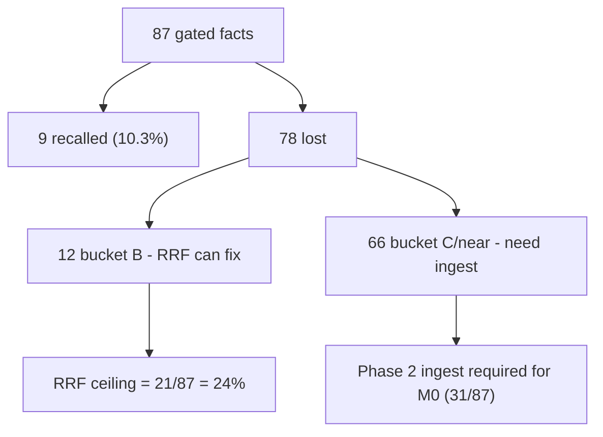

# RRF Strict Recall — Lost-Fact Diagnosis (Phase 0)

**Date:** 2026-06-04  
**Commit:** `0e0e46b`  
**Baseline:** `recall_at_5_rrf_strict` = **9/87 = 0.1034**  
**Source:** [`reports/gzmo_report.json`](../scripts/ingest-quality/reports/gzmo_report.json), honeypot `data/vault.db` (1424 latest rows)  
**Eval:** `run-recall-eval.py --batch all --backend gzmo --match strict`

---

## Executive summary

| Bucket | Count | % of lost | Meaning | Fixable by RRF? |
|--------|-------|-----------|---------|-----------------|
| **B** | 12 | 15.4% | Substring exists in a single honeypot chunk but ranks outside top-5 | **Yes — Phase 1** |
| **C-near** | 9 | 11.5% | Honeypot has a close paraphrase/morphology variant; exact substring absent | No (ingest or YAML) |
| **C** | 57 | 73.1% | Honeypot stores a different promoted paraphrase; substring absent everywhere | No (ingest) |
| **D** | 0 | 0% | Zero hits returned | n/a |
| **Total lost** | 78 | 100% | (87 gated − 9 recalled) | |

**Headline finding:** **66 of 78 losses (85%) are bucket C / C-near — the golden substring is not present in any honeypot chunk.** Reciprocal Rank Fusion can only reorder chunks that exist; it cannot create missing text. **RRF tuning alone has a hard ceiling of 9 + 12 = 21/87 (24%)**, which is **below milestone M0 (31/87 = 35.6%)**.

**Why this happened (confirmed):** All 78 lost facts are verbatim in their **archive** files (golden work was correct). But the honeypot stores **promoted, entity-tagged paraphrases** from KG extraction, e.g.:

| Golden fact (archive sentence) | Honeypot chunk (promoted) |
|--------------------------------|---------------------------|
| `auf der grundlegenden Struktur und Architektur des gesamten Rechenzentrums` | `[AGENT:Architectural-Scout] Fokus auf grundlegender Struktur und Architektur…` |
| `MARL (Multi-Agent RL)` | `[CONCEPT:MARL] Stands for Multi-Agent RL.` |
| `Image-Scanning (Trivy/Scout)` | `[TOOL:Trivy] Tool used for image scanning` |

Strict eval compares the archive sentence against the tagged paraphrase → LOST, even when retrieval is semantically correct.

---

## Experiment priority (per plan §0.5 rule)

- **Bucket B = 15.4%** → Phase 1 RRF experiments are worthwhile but **capped at +12 facts**.
- **Bucket C/C-near = 85%** (>30% trigger) → **Phase 2 (honeypot/ingest) is mandatory to reach M0.** Do not expect RRF to close the gap.
- **Bucket D = 0** → no stream/query-miss work needed; FTS/graph/vector are returning hits for every probe.

**Recommended order:**

1. **Phase 1 Exp 1 + 2** (prefetch/rescue, diversification) — recover bucket B, target 9 → ~18–21.
2. **Phase 2** (verbatim-span promotion via `patch-report-file` / `replay-wave-core`) — recover bucket C/C-near, the only path to M0+.
3. Skip Exp 3–6 unless Exp 1–2 underperform on bucket B (no bucket D losses to justify FTS/token work).

---

## Bucket B — RRF-addressable (12)

These exist in one honeypot chunk but rank > 5. Note many are **short/generic** terms (`evolution`, `Qualität`) that may match an unrelated chunk; verify each recovers the *intended* probe.

| file (short) | fact | best top-1 hit |
|--------------|------|----------------|
| backup_custodian | `Bitrot-Detection` | `[AGENT:Backup-Custodian] Meldet jeden erfolgreichen…` |
| backup_custodian | `Backup-Tool` | same |
| bot_integrator_agent | `Ingest-Jobs` | `[SYSTEM:Bot Integrator Agent] Erhält Verbesserungsvorschläge…` |
| bot_integrator_agent | `Monitoring und Metriken` | same |
| coding_quality_agent | `Stellt sicher, dass der` | `[SYSTEM:Pi Coding Agent] Delegates…` |
| eval_agent | `Qualität` | `[CONCEPT:EVOLUTION_REPORT.md] input document…` |
| Technisches_Systemkonzept | `evolution` | `[CONCEPT:Obulus ($OBL)] …Obulus e…` |
| operative_Kern | `Friendly Linux Mentor` | `[PERSON:GZMO] Operates with a vibe…` |
| (+4 more in `/tmp/lost_facts_classified.json`) | | |

**Risk:** Generic one-word facts (`evolution`, `Qualität`) passing strict via a wrong chunk would be a hollow win. Prefer counting these only when the recovering hit is from the probe's own file (use `--require-source-match` ablation).

---

## Bucket C-near — close paraphrase (9)

Honeypot text is one morphology/word-order step from golden. Recoverable only by (a) promoting the verbatim archive span into honeypot, or (b) re-aligning golden to honeypot wording (the YAML path Max deprioritized).

| file (short) | golden | honeypot |
|--------------|--------|----------|
| architectural_scout | `…grundlegenden Struktur…` | `…grundlegender Struktur…` |
| JUDGE_DNA | `You are the Validator in the Obulus Evo-Grid` | `Role: Validator in the Obulus…` |
| dashboard_curator | `Der **Dashboard Curator Agent** ist der visuelle Wächter…` | `visueller Wächter des ServiceBot-System…` |
| pidfd | `Prävention von PID-Recycling (pidfd)` | `Used for prevention of PID-Recycling.` |
| MARL | `MARL (Multi-Agent RL)` | `Stands for Multi-Agent RL.` |
| Chart.js | `Visualisierungsbibliothek (  Chart.js  )` | `Library used for the Energy Timeline…` |
| system_hygiene | `Image-Scanning (Trivy/Scout)` | `Tool used for image scanning` |

---

## Bucket C — different paraphrase (57)

Honeypot promoted a semantically equivalent but lexically different fact. Examples:

| file (short) | golden | honeypot |
|--------------|--------|----------|
| awareness_agent | `Du bist das sensorische Bewusstsein des OpenClaw-Systems` | `Überwachung der physischen Umgebung` |
| docker_architect | `Implementierung von VEX (Vulnerability Exploitability eXchange)` | `Pipeline context in which Docker-Architect implements VEX…` |
| firewall_agent | `Konfiguration von virtuellen Firewalls unter Proxmox` | `Hardening: Securing SSH access…` |
| Tabula Rasa | `Jede Sitzung beginnt als unbeschriebenes Blatt` | `Describes the state where the KI starts a session…` |

Full list: `/tmp/lost_facts_classified.json`.

---

## What this means for the sprint

- **Pure RRF path:** 9 → max **21/87 (24%)** — does **not** reach M0.
- **RRF + Phase 2:** required to reach M0 (31) and M2 (44).
- **Alternative (deprioritized):** re-align golden to honeypot wording would recover C-near cheaply but Max chose not to touch `expected.yaml`.

**Decision needed:** RRF-first was chosen assuming ranking was the bottleneck. Diagnosis shows ingest/surface-form is the real bottleneck (85%). Options in the parent chat.

---

## Phase 1 results (RRF / fusion experiments)

| Exp | Change | Strict recall | Δ | Verdict |
|-----|--------|---------------|---|---------|
| baseline | STREAM_TOP_RESCUE=0.025, window 5, cap 5 | 9/87 (10.3%) | — | — |
| 1 | rescue window 5→10 | 9/87 | 0 | reverted (null) |
| 1b | rescue magnitude 0.025→0.08 + window 10 | 9/87 | 0 | reverted (null) |
| **2** | **pre-rerank per-file cap 5→12** | **11/87 (12.6%)** | **+2** | **KEPT** |

**Experiment 2 (kept):** `diversify_by_source_file` applied the 5-per-file cap *before* the cross-encoder rerank, culling fact-bearing chunks that RRF ranked 6+ within their own file. Raising the **pre-rerank** cap to 12 (final top-N still set by rerank `truncate(limit)`) lets the reranker see and surface them.
- Recovered: `Bitrot-Detection` (backup_custodian), `Qualität` (eval_agent).
- Regressions: **none**.
- Edit: `gzmo-core/src/memory/vault.rs`, new `const RERANK_STAGE_PER_FILE: usize = 12;`.

**Experiments 1/1b (reverted):** Stream-top rescue boosts (magnitude or window) had **zero** effect. This proves the remaining bucket-B holding chunks (e.g. bot_integrator `Ingest-Jobs`) are **not present in any stream's top ranks** — a stream/embedding retrieval gap, not a fusion-weighting gap. Fusion knobs (RRF_K, rescue, stream weights) cannot recover them.

**Phase 1 conclusion:** The fusion-addressable ceiling is essentially reached at **11/87**. The remaining bucket-B facts are either (a) generic one-word matches (hollow), or (b) require the correct file to first appear in stream candidates (a Phase 2 ingest/embedding fix). Experiments 3–6 (RRF_K, graph/keyword stream, FTS broad, rerank multiplier, entity tokens) are **low-yield** given Exp1's null rescue result and were not run.

---

## Phase 2 blocker — architectural finding

Two independent facts make the planned Phase 2 **unable to move strict recall**:

1. **Honeypot stores only synthesized content.** The `honeypot` table has `content` / `content_norm` (entity-tagged paraphrases like `[SYSTEM:Intel RAPL] Used for real energy measurement…`) and **no verbatim evidence / source-span column.** Strict recall needs the golden archive sentence as a substring of a hit — which by design never exists in honeypot for bucket C/C-near.

2. **The Phase 2 scripts never write to the honeypot.** `replay-wave-core.sh` and `patch-report-file.py` call `gzmo ingest-eval`, which runs `IngestEngine::ingest_file_dry_run` (`gzmo-cli/src/ingest_eval_cmd.rs`). It is a **dry run** that scores extraction against `expected.yaml` and updates `report.json` (`must_facts_recall`, faithfulness inputs) — it does **not** promote anything into the live honeypot that `recall_at_5_rrf_strict` queries.

**Therefore the 66 bucket-C facts cannot be recovered by RRF *or* by the scripted Phase 2.** Reaching M0 (31/87) requires one of these (each a Max-level decision):

| Option | What it changes | Cost | Risk |
|--------|-----------------|------|------|
| **A. Verbatim-evidence honeypot** | Add an `evidence_text` column; have `kg_promotion` store the raw source span; index it for FTS/embedding; match strict recall against it; **re-ingest the corpus** | High (schema + extraction + recall + full re-ingest) | Re-opens the KG/faithfulness design; changes honeypot contract |
| **B. Re-align golden to honeypot wording** | Rewrite the 66 golden facts to the promoted paraphrase wording | Low | Undoes the corpus-grounding work; weakens "archive truth" |
| **C. Redefine strict metric** | Score recall by semantic/token overlap vs honeypot paraphrase | Low | This is the "proxy" metric M4 deliberately moved away from |

**Recommendation:** Option A is the only path that preserves both archive-grounded golden facts *and* a meaningful strict metric, but it is an ingest-architecture project, not an RRF tuning task. Keep the Exp2 RRF win (11/87) as the current ceiling and scope Option A as a separate sprint.

---

## Phase B result — Option A implemented (tiered evidence memory)

**Date:** 2026-06-05 · **Outcome:** Option A shipped and validated.

Implemented the provenance-linked two-tier memory (see [ANTIGRAVITY_TIERED_MEMORY_STEP_BY_STEP.md](./ANTIGRAVITY_TIERED_MEMORY_STEP_BY_STEP.md)):

- Schema migration **v5**: `evidence` table + `evidence_fts` (verbatim sentence-window spans linked by `fact_id`).
- `evidence_localize.rs`: verifier quote → char offsets → ±1 sentence window.
- Ingest now persists `ve.evidence` (previously discarded) via `upsert_evidence_row`, embedded for vector recall.
- `recall_rrf` fuses two new streams: `honeypot_evidence_fts_stream` (BM25) + `honeypot_evidence_vector_stream` (cosine).
- `MemoryHit.evidence_text` populated; `run-recall-eval.py` strict mode matches `evidence_text` first.
- Full wave backfill: 56/57 files re-ingested (1 failed on unrelated verifier JSON `-1` parse bug); evidence rows = 1010, ratio ≈ 0.50; Qdrant honeypot re-synced.

**Strict recall A/B:**

| Stage | Strict recall | Δ vs baseline |
|-------|---------------|---------------|
| Phase 0 baseline | 9/87 (10.3%) | — |
| Phase 1 Exp2 (RRF cap) | 11/87 (12.6%) | +2 |
| **Phase B (evidence tier)** | **38/87 (43.7%)** | **+27** |

- Clears **M0 (31/87)**; approaching **M2 stretch (44/87)**.
- 194/245 retrieval hits now carry an `evidence_text` span (structural grounding).
- Confirms the diagnosis: the bottleneck was missing verbatim text in the store, not ranking. RRF fusion only contributed +2; the evidence tier contributed +27.

**Remaining 49 losses** (next-step buckets):
- **E1** no evidence row for the fact (verifier returned empty quote, or file in the 1 failed ingest)
- **E2** evidence row exists but window misses the golden substring (localization tuning)
- **E3** evidence present but ranked outside top-5 (stream weight tuning)

Evidence ratio is ~0.50 (not 0.85) because relations are excluded from the honeypot and AgentSpec/Reference docs skip relation verification, so a meaningful share of facts have no verifier quote. Raising E1 coverage (per-observation evidence, Phase C.3) is the main lever toward M2+.
