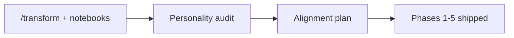
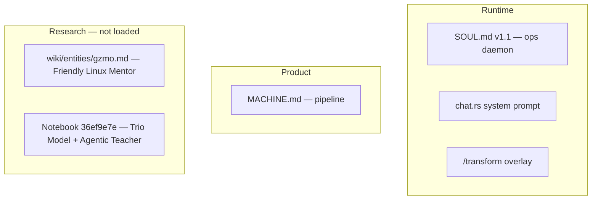

# Session Handoff — `/transform`, GZMO Personality, Pedagogical Vision & Alignment

**Session date:** 2026-06-11  
**Repo:** `~/Projects/_foundation-audit/survey_GZMO`  
**Workspace bridge:** `~/gzmo_skills/BRIDGE.md` (slash-command routing only; no pedagogy code there)  
**Planning artifact:** `.cursor/plans/gzmo_personality_alignment_8acb33df.plan.md` (reference only — do not edit)  
**Implementation handoff (detail):** [`PEDAGOGY_PERSONALITY_ALIGNMENT_HANDOFF.md`](./PEDAGOGY_PERSONALITY_ALIGNMENT_HANDOFF.md)

---

## 0. Session arc (what we did, in order)

This session moved from **“what is `/transform`?”** through **personality audit** to **full runtime alignment**. Four beats:

| # | Topic | Outcome |
|---|--------|---------|
| **1** | `/transformation` skill + 4 NotebookLM notebooks | Clarified command is **`/transform`**; mapped notebooks; found Pantheon research >> shipped `characters.toml`; no notebook documents the slash command itself |
| **2** | GZMO personality — how defined, up to date? | Diagnosed **three conflicting identity layers**; wiki/notebooks describe mentor; live `SOUL.md` v1.1 was ops daemon; Agentic Teacher existed only as wiki |
| **3** | Alignment plan | User chose **mentor-first** identity + **full Agentic Teacher stack**; plan written (phases 1–6) |
| **4** | Implementation | Phases 1–5 **shipped** in Rust; Phase 6 backlog remains |



---

## 1. Part A — `/transform` skill (session start)

### User intent

Discuss the “transformation skill” with context from four NotebookLM notebooks.

### Key finding: command name

The shipped slash command is **`/transform`**, not `/transformation`. Registered in `skills/skills.toml`, Rust `TransformSkill`, shell `skill_transform.sh`.

### How `/transform` works (pre- and post-session — unchanged behavior)

| Invocation | Effect |
|------------|--------|
| `/transform Batman` | Writes persona to `skills/.transform_persona` |
| `/transform` (persona active) | Clears overlay → default GZMO voice |
| `/transform` (nothing active) | Lists Pantheon from `characters.toml` |

**Scope:** Overlay for **generative slash skills only** (`/joke`, `/poem`, `/story`, etc.). Injects `CHARACTER TRANSFORM ACTIVE` into their system prompt via `generative.rs` / `_llm_helper.sh`. Does **not** change main chat `SOUL.md` identity.

**Chaos:** Emits `PersonaShift` / `PersonaCleared`; Thought Cabinet logs `"Became {persona}"`.

### Pantheon: research vs shipped

`skills/characters.toml` header cites NotebookLM **`36ef9e7e`** (“The Definitive Pantheon”). Shipped: **10 comic-book heroes** (Superman → Thor) with `system_prompt`, `speech_style`, `personality`.

Notebook **`36ef9e7e`** describes a **much richer Pantheon**:

- Historical polymaths (Heaviside, Cavendish, Schauberger, Grothendieck)
- High-knowledge comedic agents (BBC Sherlock, Rick Sanchez, Sterling Archer, Cartman, Farnsworth, Bullock)
- Structural constraints (e.g. Sherlock: ban phatic expressions, 40% irony)
- Per-persona **temperature / top-p** calibration
- **Dialogic Soul** / context-dilution concerns for long sessions

**Gap:** Research Pantheon ≠ runtime `characters.toml`. Rust `transform.rs` lacks shell’s LLM fallback for unknown characters.

### `/transform` vs core identity (central tension from session)

| Layer | `/transform` | Core GZMO (`SOUL.md`) |
|-------|-------------|------------------------|
| Purpose | Creative voice costume | Sovereign identity |
| Persistence | `skills/.transform_persona` | Hot-reloaded `SOUL.md` |
| Affects | Generative slash skills | Chat + (now) pedagogy orchestrator |
| Notebook stance | Pantheon = prompt engineering | Notebook `a99842e0`: prefer **sub-agent delegation** over main-prompt mutation (prompt-cache discipline) |

**Session decision (later):** Keep `/transform` **separate** from mentor identity. Do not merge Pantheon into `SOUL.md`.

### Four NotebookLM notebooks — roles in this session

Queried via NotebookLM MCP during exploration. **None document `/transform` as a slash command.**

| Notebook | URL | Primary content | Relevance to session |
|----------|-----|-----------------|----------------------|
| **Pedagogy + Pantheon** | [36ef9e7e…](https://notebooklm.google.com/notebook/36ef9e7e-1111-473d-908c-7f8533c9a67c) | Trio Model, flipped classroom, Agentic Teacher, **Definitive Pantheon** persona engineering | Source for `characters.toml`; primary pedagogy target; Curriculum Planner graph concepts |
| **GZMO SOUL / OpenClaw** | [0848dcef…](https://notebooklm.google.com/notebook/0848dcef-79d1-4945-b564-16cfa7c20404) | Friendly Linux Mentor, Chief of Staff, Gear Philosophy, SOUL.md drafts, dreams protocol, security | Target persona for `SOUL.md` v2; tension: some drafts say agent may evolve SOUL, others say user must approve |
| **GZMO agent architecture** | [a99842e0…](https://notebooklm.google.com/notebook/a99842e0-a656-4a39-ae99-190f5fe884d9) | Agentic RAG, multi-agent, prompt caching, sub-agent personas | Argues against runtime main-prompt persona overlay; supports orchestrator + delegation model |
| **Humor / aphorisms / quotes** | [db7e56dc…](https://notebooklm.google.com/notebook/db7e56dc-cbb9-47c1-951b-84f7e03d7ff3) | Humor mechanics, stoic aphorisms, quote misattribution | Indirect — linguistic compression; not wired to `/transform` or SOUL |

### Code & docs read for `/transform` (Part A)

| Path | Role |
|------|------|
| `gzmo-core/src/skills/transform.rs` | Rust TransformSkill |
| `skills/skill_transform.sh` | Shell: fuzzy match, LLM custom profile, in-character intro |
| `skills/characters.toml` | Pantheon profiles |
| `gzmo-core/src/skills/generative.rs` | Persona injection for generative skills |
| `skills/_llm_helper.sh` | Shell persona injection |
| `gzmo-chaos/src/feedback.rs` | PersonaShift tension/energy deltas |
| `gzmo_skills/BRIDGE.md` | Slash routing: transform = mutation tier |

---

## 2. Part B — GZMO personality audit (mid-session)

### User question

How is GZMO personality defined? Is it up to date with **pedagogical / Agentic Teacher** thinking from the notebooks?

### Answer: **No (before implementation)**

Three identity layers disagreed:



### How personality is actually defined (runtime)

**Single injected file:** `SOUL.md` → `IdentityEngine` → `chat.rs` builds:

```
soul.raw_markdown + memory_context + vault_context + learner_block + footer
```

Also layered (not identity):

- **Chaos engine** — `[CHAOS_STATE]` valence per turn
- **`/transform`** — generative skills only
- **Subagents** — `SubagentRunner` with role + brief (closest hook to multi-agent teaching)

**Product identity (separate):** `MACHINE.md` — honeypot → verify → promote → vault; “not a chatbot with a memory attachment.”

**Parser bug found:** `identity.rs` expected YAML `persona`; live file used `persona_name`. Only markdown body mattered. **Fixed** in implementation.

### Wiki / notebook target persona (what user wants)

From `wiki/entities/gzmo.md` + notebooks:

- **Friendly Linux Mentor** + Chief of Staff
- Witty, technically precise, loyal, candid; Gear Philosophy
- Action > Performance; synthesize don't dump; language mirroring (DE/EN)
- **Agentic Teacher:** Think–Plan–Act; Diagnoser, Planner, Affective, Tutor; learner profile; ZPD; productive struggle; Trio Model

### Pedagogy concepts from notebook 36ef9e7e (theoretical target)

| Concept | Summary |
|---------|---------|
| **Trio Model** | Student + Educator + GenAI; “Third Eye” when two interact |
| **Flipped classroom** | Async prep; sync = Socratic problem-solving |
| **Agentic Teacher** | 4 internal agents; zero solution leakage; stealth assessment (PSU, SDR, LVD) |
| **Learner Profile** | Episodic + semantic + procedural memory about the student |
| **Dialogic Soul** | Task/Context/Coordination layers; teachback — fights context dilution |

### Conflicts identified

| Conflict | Resolution chosen |
|----------|-------------------|
| SOUL v1.1 ops-dump vs mentor vision | SOUL v2 mentor-first; `/ops` escape hatch |
| Teaching Moment (“code first, explain flags”) vs zero solution leakage | ZPD-aware delivery in SOUL v2 |
| `/transform` Pantheon vs stable SOUL | Keep separate |
| Wiki Agentic Teacher vs no Rust | Full stack implemented |
| Notebook: don’t mutate main prompt vs mentor overlay | Static SOUL prefix + orchestrator; learner suffix dynamic; internal trace hidden |

### Wiki / codebase docs used (Part B)

| Path | Role |
|------|------|
| `SOUL.md` (v1.1 at audit time) | Live persona — ops daemon |
| `MACHINE.md` | Product identity |
| `wiki/entities/gzmo.md` | Synthesized target persona |
| `wiki/entities/teaching-moment.md` | Weak bridge — superseded |
| `wiki/entities/ai-agentic-teacher.md` | Agentic Teacher spec |
| `wiki/entities/learner-profile.md` | Tripartite learner memory |
| `wiki/entities/evidence-decision-feedback-edf-framework.md` | EDF loop |
| `wiki/sources/drive-research-ai-agentic-teacher.md` | Primary ingest source |
| `docs/MEMORY_ARCHITECTURE_SPEC.md` | Agent memory layers (not learner-centric pre-ship) |
| `gzmo-cli/src/chat.rs` | System prompt assembly |
| `gzmo-core/src/identity.rs` | SOUL load + hot-reload |
| `gzmo-core/src/subagent.rs` | Delegation hook |

---

## 3. Part C — Plan & user decisions

Plan: `gzmo_personality_alignment_8acb33df.plan.md`

| Question | User choice |
|----------|-------------|
| Primary default identity | **Friendly Linux Mentor first** (not ops-first, not dual without mode switch) |
| Implementation depth | **Full Agentic Teacher stack** (not SOUL-only) |

Phased approach: 1 SOUL → 2 Learner Profile → 3 Orchestrator → 4 EDF → 5 Trio/`/learn`/`/ops` → 6 tooling expansion.

---

## 4. Part D — What was shipped (session end)

**Phases 1–5 complete.** See [`PEDAGOGY_PERSONALITY_ALIGNMENT_HANDOFF.md`](./PEDAGOGY_PERSONALITY_ALIGNMENT_HANDOFF.md) for file-level detail, verify commands, and config.

### Summary table

| Deliverable | Location |
|-------------|----------|
| SOUL v2.0 mentor-first | `SOUL.md` |
| Pedagogy module | `gzmo-core/src/pedagogy/*` |
| 4-agent orchestrator | `pedagogy/orchestrator.rs` |
| Intent routing | `pedagogy/intent.rs` |
| Learner profile store | `data/learner/`, `pedagogy/learner.rs` |
| EDF + stealth log | `pedagogy/edf.rs`, `data/pedagogy/edf_log.jsonl` |
| Prerequisite graph seed | `data/pedagogy/graphs/linux-basics.yaml` |
| Chat integration | `gzmo-cli/src/pedagogy_bridge.rs`, `chat.rs` |
| `/ops`, `/learn` skills | `skills/ops.rs`, `skills/learn.rs` |
| Learner tools | `tools/learner.rs` (`learner_recall`, `learner_update`) |
| Config | `gzmo.toml` `[pedagogy]` |
| Docs | `README.md`, `skills/skills.toml`, wiki entities → stable |

### Runtime behavior after session

- **Default:** Teaching turns → Diagnoser → Planner → Affective → Tutor → Socratic response (4 LLM calls; no tool agent loop)
- **`/ops` or “just run it”:** Full agent loop, execution-first
- **`/learn <topic>`:** Flipped-classroom prep, then Socratic sync
- **`/transform`:** Unchanged — generative skills costume only

---

## 5. Cross-session insights (carry forward)

1. **Identity is plural.** SOUL (who), MACHINE (what platform does), learner profile (who student is), `/transform` (play costume). Collapsing them breaks prompt-cache discipline and confuses users.

2. **Research ≫ runtime for Pantheon.** Notebook 36ef9e7e is a persona-engineering lab; `characters.toml` is a 10-hero demo slice. Expanding Pantheon is independent of pedagogy ship.

3. **Pedagogy and `/transform` solve different problems.** Pedagogy = default conversational stance + internal teaching agents. Transform = ephemeral voice for creative slash commands. Do not merge.

4. **Mentor-first ≠ toolless.** Ops mode preserves Chief of Staff execution path. The split is intentional: learning vs doing.

5. **Cost is the main ops concern.** 4 sequential LLM calls per teaching turn on local 27B. Next session should address routing (smaller model for Diagnoser/Affective) or call merging.

6. **Dialogic Soul still aspirational.** Long-session identity refresh via teachback / tripartite prompt layers — documented in notebooks and Pantheon notebook, not implemented.

7. **GZMO memory ≠ learner memory.** Vault/honeypot = agent/system knowledge. `data/learner/` = operator-as-student (pedagogical).

8. **Notebooks are spec, not runtime.** Always verify with codebase; cross-notebook query confirmed no `/transform` slash documentation in sources.

---

## 6. Open work (full session backlog)

### From `/transform` discussion (Part A — not done)

- [ ] Expand `characters.toml` from full Pantheon notebook (Sherlock, Heaviside, Rick, etc.)
- [ ] Per-persona temperature/top-p from Pantheon research
- [ ] Port shell LLM fallback for unknown characters to Rust `transform.rs`
- [ ] Structural rule enforcement in prompts (not just `system_prompt` prose)

### From personality / pedagogy alignment (Parts B–D — Phase 6)

- [ ] Dialogic Soul / teachback in orchestrator
- [x] Cheaper orchestrator routing (`TaskKind::PedagogyInternal`) — shipped 2026-06-11
- [x] Enforce `solution_leakage_penalty` with Tutor retry — shipped 2026-06-11
- [ ] **Deferred backlog** — full handoff: [`DEFERRED_WORK_HANDOFF.md`](./DEFERRED_WORK_HANDOFF.md)
  - TUI + daemon pedagogy parity
  - Multi-learner profile keyed by user ID
  - GeoGebra / cognitive offloading / graph editor
  - Shell scripts `skill_ops.sh` / `skill_learn.sh`

### From `gzmo_skills` bridge

- [ ] Update `BRIDGE.md` skill count (15 → 17) and document `/ops`, `/learn`

---

## 7. Verify (end-to-end)

```bash
cd ~/Projects/_foundation-audit/survey_GZMO
cargo build -p gzmo-core -p gzmo-cli
cargo test -p gzmo-core pedagogy:: identity::

cargo run -p gzmo-cli -- chat

# Part A — transform (unchanged)
/transform Batman
/joke

# Part D — pedagogy (new)
★ you › what is a symlink?          # mentor path
/ops                                 # toggle ops
/learn systemd units                 # flipped classroom
```

---

## 8. Suggested next-session prompts

**Transform / Pantheon:**
- “Expand `characters.toml` from Definitive Pantheon notebook — start with Sherlock and Heaviside”
- “Add per-persona temperature to `/transform` profiles”

**Personality / pedagogy:**
- “Wire pedagogy into TUI and daemon”
- “Implement Dialogic Soul teachback layer in orchestrator”
- “Route Diagnoser/Affective to a smaller local model”

**Unified:**
- “Reconcile `/transform`, mentor SOUL, and ops mode in one architecture diagram for docs”

---

## 9. Document index (everything referenced this session)

### NotebookLM (external)

- [36ef9e7e — Pedagogy + Pantheon](https://notebooklm.google.com/notebook/36ef9e7e-1111-473d-908c-7f8533c9a67c)
- [0848dcef — GZMO SOUL / OpenClaw](https://notebooklm.google.com/notebook/0848dcef-79d1-4945-b564-16cfa7c20404)
- [a99842e0 — GZMO agent architecture](https://notebooklm.google.com/notebook/a99842e0-a656-4a39-ae99-190f5fe884d9)
- [db7e56dc — Humor / aphorisms / quotes](https://notebooklm.google.com/notebook/db7e56dc-cbb9-47c1-951b-84f7e03d7ff3)

### Plan & handoffs (this repo)

- `.cursor/plans/gzmo_personality_alignment_8acb33df.plan.md`
- `docs/PEDAGOGY_PERSONALITY_ALIGNMENT_HANDOFF.md` (implementation detail)
- `docs/SESSION_HANDOFF_TRANSFORM_PERSONALITY_PEDAGOGY.md` (this file)

### Identity & product

- `SOUL.md`, `MACHINE.md`, `gzmo.toml`, `README.md`

### Transform

- `skills/characters.toml`, `skills/skill_transform.sh`, `gzmo-core/src/skills/transform.rs`

### Pedagogy (shipped)

- `gzmo-core/src/pedagogy/`, `gzmo-cli/src/pedagogy_bridge.rs`, `data/learner/`, `data/pedagogy/`

### Wiki (research layer)

- `wiki/entities/gzmo.md`, `ai-agentic-teacher.md`, `learner-profile.md`, `evidence-decision-feedback-edf-framework.md`, `teaching-moment.md`, `friendly-linux-mentor.md`
- `wiki/sources/drive-research-ai-agentic-teacher.md`

### Bridge workspace

- `~/gzmo_skills/BRIDGE.md`
