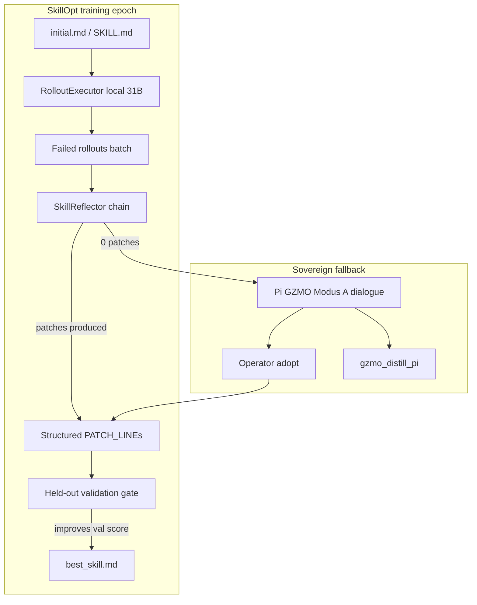
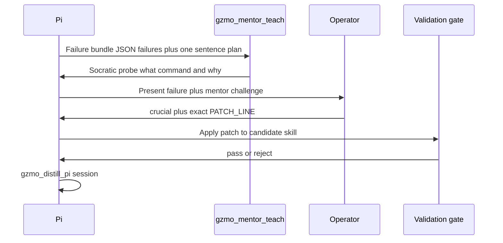

# SkillReflector — Pedagogy-Gated Skill Evolution

## Concept name and one-liner

**SkillReflector** — the missing reflection organ for sovereign skill training.

> A local executor can *run* a skill document; only a decomposed pedagogy chain (or a Socratic dialogue with the operator) can *repair* it — under the same validation gate SkillOpt already provides.

This is not a replacement for [SkillOpt](https://github.com/microsoft/SkillOpt). It is the **Reflector role** your stack lacks, wired into the existing [`gzmo_skills/scripts/skillopt/`](../gzmo_skills/scripts/skillopt/) harness from `attempt_001.md`.

---

## Problem (validated by attempt_001 live run)

| Layer | Result | Root cause |
|-------|--------|------------|
| Rollout (executor) | 3/4 test (75%); 0/8 without skill | Local Gemma 31B **can** follow SKILL.md for command selection |
| Reflect (analyst) | 16 rounds, **0 patches** | Open-ended meta prompt (`analyst_error.md`) exceeds local model capacity |
| Pipeline mechanics | Flawless | Integration is sound; reflection contract is wrong |

Additional structural issue discovered in code review: `gzmo-integration/SKILL.md` documents **Pi tool JSON** (`gzmo_wiki({ action: "search" })`) while `rollout.py` benchmarks **CLI strings** (`gzmo wiki search memory`). The `wiki_search_01` miss may be doc/harness skew, not just model weakness — the Reflector must detect and fix **surface mismatch**, not only wrong commands.

---

## Design principles

1. **Narrow loops stay narrow** — rollout + gate unchanged; only replace `reflect()`.
2. **Strictly local** — all Reflector agents route via internal call → Prime (`:8000`). No cloud analyst fallback.
3. **Decompose, don't meta-prompt** — mirror pedagogy patterns: rigid line schemas, 512-token cap per internal call.
4. **Gate before deploy** — SkillOpt `use_gate: true` remains authoritative; pedagogy proposes, gate decides.
5. **Socratic escalation is first-class** — 0 patches after Reflector chain → Modus A dialogue → operator adopt → re-gate. Not a failure mode; the sovereign path.

---

## Architecture



### Role mapping

| SkillOpt role | GZMO component | Model | Contract |
|---------------|----------------|-------|----------|
| **Executor** | `rollout.py` → `chat_target` | Prime / `qwen_chat` | Extract `gzmo ...` command |
| **Reflector** | `pedagogy_reflect.py` | Prime / internal | 3-step structured lines |
| **Gate** | SkillOpt `use_gate` + `evaluator.py` | Deterministic | `hard` pass on held-out |
| **Dialogue** | `gzmo_mentor_teach` + operator | Mentor socket + Prime internal | Human adopt `PATCH_LINE` |

---

## SkillReflector: the 3-agent chain

Replace monolithic `analyst_error.md` with three sequential calls, modeled on Diagnoser → Planner → Patcher:

### Agent 1 — Diagnoser

**Input:** task description, `expected_command`, `actual_command`, `fail_reason`, relevant SKILL.md excerpt (tool section only).

**Output (ONLY these lines):**
```
FAILURE_CLASS: [wrong_command|missing_section|surface_mismatch|wrong_flags|other]
EXPECTED: <exact expected command>
ACTUAL: <exact actual command or empty>
MISCONCEPTION: <one sentence>
EVIDENCE: <two sentences max>
```

`surface_mismatch` is a first-class class — e.g. skill documents `gzmo_wiki` JSON tool but benchmark expects `gzmo wiki search` CLI.

### Agent 2 — Planner

**Input:** Diagnoser output + SKILL.md section headers (outline only, not full doc).

**Output:**
```
TARGET_SECTION: <markdown heading e.g. "### gzmo_wiki" or new "### CLI quick reference">
ACTION: [add_line|replace_line|add_section]
RATIONALE: <one sentence>
```

### Agent 3 — Patcher

**Input:** Planner output + TARGET_SECTION body from skill + failure context.

**Output:**
```
PATCH_LINE: <single exact markdown line to add or replace-with>
```

If `FAILURE_CLASS=surface_mismatch`, Patcher may emit a **CLI quick-reference line** under a dedicated `### CLI equivalents (benchmark / bash)` section — keeps Pi tool docs intact while fixing rollout harness alignment.

**Hard rules (enforced in code, not prompt):**
- Reject empty `PATCH_LINE`
- Reject patches > 200 chars (SkillOpt `edit_budget` alignment)
- Reject patches that don't start with valid markdown (`#`, `-`, `*`, `` ` ``, alphanum)
- Max 3 retries per agent with temperature decay (mirror pedagogy leakage guard pattern)

### Wiring into SkillOpt

Override `GZMOOperatorAdapter.reflect()` to call new module instead of `run_minibatch_reflect` for the analyst step:

```python
# pedagogy_reflect.py (new)
def run_pedagogy_reflect(results, skill_content, ...) -> list[dict | None]:
    failures = [r for r in results if not r.get("hard")]
    patches = []
    for batch in chunk(failures, minibatch_size):
        for item in batch:
            patch = diagnoser → planner → patcher(item, skill_content)
            if patch: patches.append(to_skillopt_patch(patch))
    return patches
```

Map `PATCH_LINE` → SkillOpt patch format (add/replace ops) in a thin translator. Keep `run_minibatch_reflect` as fallback behind `reflect_mode: pedagogy|legacy` config flag.

---

## Dual-surface contract (fixes wiki_search class of bugs)

Add a normative section to the skill optimization target doc:

```markdown
### CLI equivalents (bash / SkillOpt rollout)
| Pi tool call | CLI equivalent |
|--------------|----------------|
| gzmo_wiki({ action: "search", query: "memory" }) | gzmo wiki search memory |
| gzmo_wiki({ action: "status" }) | gzmo wiki status |
| ... | ... |
```

- **Seeded manually** in `initial.md` before first training run (known gaps from `tasks.json`)
- **Maintained by Reflector** when `FAILURE_CLASS=surface_mismatch`
- **Validated by** extending `evaluator.py` to accept either surface when `check_mode: command_match` (optional Phase 2)

This separates *operator truth* (Pi tools) from *harness truth* (CLI benchmark) without collapsing them.

---

## Socratic escalation protocol (0 patches)

When Reflector returns 0 patches after all failure items:



**Trigger file:** `failures_pending_dialogue.json` written by training run.

**Prompt template:** adapt `PI_GZMO_SOCRATIC_KNOWLEDGE_DIALOGUE.md` §2 for skill-fix beats:

1. Pi states: task, expected, actual, fail_reason
2. `gzmo_mentor_teach` — one probe, not a lecture
3. Operator: `crucial` + approves `PATCH_LINE`
4. Re-run gate on val split only
5. `gzmo_distill_pi` — institutional memory, not auto-skill-write

**No automation past operator adopt** — preserves sovereignty.

---

## Learn-prep hook (optional pre-epoch)

Before epoch 1, run existing `gzmo chaos skill learn` prep via:

```bash
gzmo chaos skill learn "gzmo CLI command selection for wiki search, health, dream"
```

`run_learn_prep` output → `prep_notes.json` injected into Diagnoser context. Surfaces known misconceptions cheaply without editing the skill yet.

---

## File layout (concept → implementation map)

```
gzmo_skills/scripts/skillopt/
├── gzmo_operator_config.yaml          # add: reflect_mode: pedagogy
├── pedagogy_reflect.py                # NEW — 3-agent chain
├── patch_translator.py                # NEW — PATCH_LINE → SkillOpt patch ops
├── dialogue_escalation.md             # NEW — Modus A prompt for 0-patch runs
├── gzmo_operator/
│   ├── adapter.py                     # reflect() branches to pedagogy_reflect
│   ├── evaluator.py                   # optional dual-surface scoring (Phase 2)
│   ├── prompts/
│   │   ├── diagnoser.md               # NEW (replaces analyst_error.md)
│   │   ├── planner.md                 # NEW
│   │   ├── patcher.md                 # NEW
│   │   └── analyst_*.md             # kept as legacy fallback
│   └── data/
│       ├── tasks.json                 # unchanged
│       └── skill_baseline.json        # NEW — held-out scores per run
└── run_skill_training.sh              # NEW — orchestrates learn-prep → train → dialogue?

survey_GZMO/docs/
└── SKILL_REFLECTOR.md                 # NEW — canonical concept doc (this design)
```

Gateway routing (already exists — no Rust changes required for v1):

```toml
# gzmo.toml — pedagogy_internal already maps to local Prime
[routing.mappings]
pedagogy_internal = "local"
```

Reflector calls Prime via OpenAI-compatible HTTP (same as current `optimizer_qwen_chat_*` in config), but with **pedagogy internal prompts** and **512 max_tokens** per step.

---

## Config changes

`gzmo_operator_config.yaml`:

```yaml
reflect_mode: pedagogy          # pedagogy | legacy
reflect_max_tokens: 512         # per internal agent
reflect_temperature: 0.35
dialogue_on_zero_patches: true  # write failures_pending_dialogue.json
learn_prep_topic: "gzmo operator CLI command selection"
```

Keep executor and reflector on **same model** (Gemma 31B) — the bet is structured decomposition, not model upgrade.

---

## Success criteria

| Metric | Baseline (attempt_001) | Target (SkillReflector v1) |
|--------|------------------------|----------------------------|
| `patches_generated` | 0 | >= 1 on wiki_search failure |
| Test accuracy (best) | 3/4 (no improvement) | 4/4 on held-out |
| Analyst API calls | 44 wasted | <= 15 structured (3 per failure max) |
| Sovereignty | local | local throughout |
| Human involvement | none | only if 0 patches after Reflector |

**Regression artifact:** `data/eval/skill-baseline-YYYY-MM-DD.json` alongside M3 baseline.

---

## What this concept explicitly does NOT do

- Optimize Rust pantheon skills (`gzmo-core/src/skills/`) — markdown only
- Replace Cursor continual-learning (`AGENTS.md` preferences)
- Replace GZMO dream/distill memory loops
- Auto-deploy `best_skill.md` without gate pass + operator review on dialogue path
- Use cloud APIs for reflection (per sovereignty choice)

---

## Implementation phases

### Phase 1 — Reflector chain (core concept proof)
- Add `diagnoser.md`, `planner.md`, `patcher.md`
- Implement `pedagogy_reflect.py` + `patch_translator.py`
- Branch `adapter.reflect()` on `reflect_mode`
- Re-run training on same 4-task held-out set; measure `patches_generated`

### Phase 2 — Dual-surface contract
- Seed `### CLI equivalents` in skill init
- Teach Diagnoser `surface_mismatch` class
- Optionally relax `evaluator.py` for tool-vs-CLI equivalence

### Phase 3 — Dialogue escalation + eval spine
- `dialogue_escalation.md` + `failures_pending_dialogue.json` writer
- `SKILL_REFLECTOR.md` canonical doc in survey_GZMO
- `skill_baseline.json` nightly hook next to `M3_LOCAL_BASELINE.md`

### Phase 4 — Learn-prep + task mining refresh
- Wire `/learn` prep into `run_skill_training.sh`
- Re-mine Pi sessions via `mine_tasks.py` for new task types

---

## Verdict

Yes — this is a properly scoped concept. **SkillReflector** names the missing organ, reuses pedagogy patterns you already ship, respects strict local sovereignty, and explains both the 0-patch failure (wrong analyst contract) and the wiki_search miss (surface mismatch). The existing SkillOpt harness from attempt_001 is the right substrate; only `reflect()` and skill doc structure need to change.
