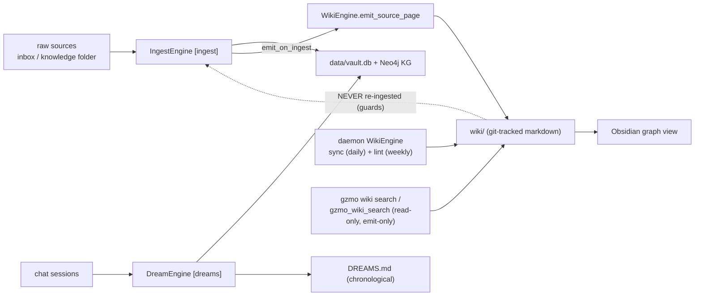

# Wiki Layer — Architecture and Integration

The wiki layer is a git-tracked, Obsidian-browsable markdown synthesis layer in
`wiki/`. It sits between raw RAG retrieval (`gzmo_memory_search`, Qdrant) and the
chronological `DREAMS.md` consolidation. Conventions live in
[`../WIKI.md`](../WIKI.md); runtime config in `gzmo.toml [wiki]`.

**Status: Phase 2 implemented.** A deterministic Rust `WikiEngine` emits pages on
ingest and runs daemon "Knowledge Gardener" sync/lint loops. Retrieval is
**emit-only** (grep over `wiki/*.md`; never re-ingested). The legacy prompt jobs
`wiki_sync` / `wiki_lint` are retired (`disabled` in `gzmo.toml`).

## Why a markdown layer on top of the vault

`data/vault.db` (SQLite) and the Neo4j KG are the source of truth, but they are
neither git-diffable nor graph-viewable. The wiki is the **persistent,
compounding artifact** the operator browses: entity/concept/source pages with
`[[wikilinks]]`, version history via git, and Obsidian's graph view. The agent
owns it; the operator reviews it.

## Operations and where they run (Phase 2)

| Operation | Implementation | Surface |
|-----------|----------------|---------|
| Ingest -> page | `WikiEngine::emit_source_page`, called from `finish_ingest` in [`../gzmo-core/src/ingest.rs`](../gzmo-core/src/ingest.rs) when `[wiki].emit_on_ingest` | automatic on ingest |
| Sync (rebuild `index.md`) | `WikiEngine::sync` | daemon loop `[wiki].sync_cron_*`; `gzmo wiki sync` |
| Lint (structural report) | `WikiEngine::lint` | daemon loop `[wiki].lint_cron_*`; `gzmo wiki lint` |
| Query -> file-back | `WikiEngine::file_back` | `gzmo wiki file-back <title>` |
| Search (emit-only) | `WikiEngine::search` / `wiki_md::search` | `gzmo wiki search`; `gzmo_wiki_search` (MCP, read-only) |

The engine lives in [`../gzmo-core/src/wiki.rs`](../gzmo-core/src/wiki.rs) with
markdown helpers in [`../gzmo-core/src/wiki_md.rs`](../gzmo-core/src/wiki_md.rs),
modeled on [`../gzmo-core/src/dreams_md.rs`](../gzmo-core/src/dreams_md.rs).

## Query file-back convention

Notable synthesized answers must not vanish into chat history or Redis scratch
(`[redis].distill_queue`). Per `WIKI.md`, when a query produces a comparison,
analysis, or discovered connection worth keeping, the agent files it back as a
new `wiki/concepts/` page and appends a `## [DATE] query | <title>` line to
`wiki/log.md`. This is how explorations compound, the same way ingested sources
do.

## Feedback-loop guards

Wiki pages are *derived* from already-verified vault facts. Re-ingesting them
would create circular, duplicate facts, so three guards keep `wiki/` out of the
ingest pipeline:

1. **Path guard** — `IngestEngine::is_wiki_source` skips any path with a `wiki`
   component (`ingest_file` / `ingest_file_dry_run` return a "skipped wiki"
   report).
2. **Frontmatter guard** — `load_document` refuses any file whose frontmatter
   carries `gzmo_synthetic: true` (every engine-emitted page has this flag).
3. **Watcher guard** — `path_matches_watcher` in
   [`../gzmo-core/src/watcher.rs`](../gzmo-core/src/watcher.rs) excludes the
   `wiki` component, so a watcher pointed near `wiki/` never enqueues a page.

This matters because the honeypot's `qualifies_for_honeypot` filter excludes
only by **basename**, so the `wiki/` path/frontmatter guards — not the existing
`*sources*` name filter — are the real protection.

## Retrieval — emit-only

Wiki retrieval is deliberately **emit-only**: `gzmo wiki search` and the
read-only `gzmo_wiki_search` MCP tool grep over `wiki/*.md` (title/headings
weighted), with `index.md` as the cheap navigation layer. The wiki is **not**
indexed into Qdrant and its facts are **not** written back into the honeypot —
that stack (`honeypot` collection + `bge-reranker-v2-m3`) indexes the *vault*,
which is the source the wiki is derived from. Keeping them separate avoids a
derived-fact feedback loop and keeps the honeypot pure. (This supersedes the
earlier "facts flow into honeypot" framing.)

## No PARA

The wiki layout is `entities/` · `concepts/` · `sources/`, not PARA (Projects /
Areas / Resources / Archives). PARA appears in the honeypot only as an *ingested
concept the operator once read about* — it was never a live structural
convention in this filesystem, and adding it would fragment the entity/concept
graph the `[[wikilinks]]` depend on.
