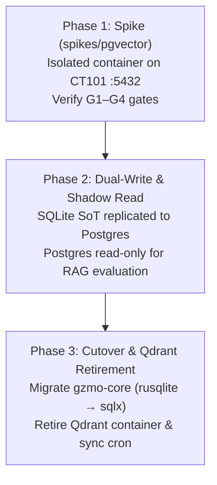

# ADR-0009 — pgvector Vault Consolidation (SQLite SoT + Qdrant Mirror → PostgreSQL+pgvector)

**Status:** Proposed (2026-08-22, gated)  
**Related:** [ADR-0003](./ADR-0003-one-instance-metabolism.md), [ADR-0004](./ADR-0004-airgap-living-usp.md), [ADR-0005](./ADR-0005-flywheel-over-frozen-topology.md), [ADR-0007](./ADR-0007-one-product-living.md), [ADR-0008](./ADR-0008-edge-ssm-memory.md), [CT101_BOUNDARY.md](../ops/CT101_BOUNDARY.md), [INFRASTRUCTURE_MAP.md](../INFRASTRUCTURE_MAP.md), [SOTA_FIXES_BACKLOG.md](../SOTA_FIXES_BACKLOG.md)  
**Decision date / owner:** Max, after spike results (spike in `spikes/pgvector/`)

---

## Context

GZMO's memory architecture ([INFRASTRUCTURE_MAP.md](../INFRASTRUCTURE_MAP.md) §3) currently operates with split persistence:
- **Relational / Full-Text SoT:** Local SQLite database (`data/vault.db`, schema v7, 37 MB) storing 1870 verified facts (`semantic_vault`), 1774 honeypot rows (478 active with `is_latest=1`), and 1747 grounding evidence rows (`evidence`), indexed via SQLite FTS5 (`honeypot_fts`, `evidence_fts`).
- **Vector Mirror:** Qdrant instance running as a sidecar on CT101 (LXC container `192.168.31.202:6333`, collection `honeypot`), populated via a nightly batch mirror script (`sync-vault-to-qdrant.sh` triggered at 01:45 UTC).
- **Graph Tier:** Neo4j on CT101 (`192.168.31.202:7687`) queried via MCP for entity/relation triplets.

### The Problem: Documented Drift Failure Mode (Measured Live)

The split architecture introduces a fundamental distributed state vulnerability documented in [INFRASTRUCTURE_MAP.md](../INFRASTRUCTURE_MAP.md) §9 (Line 308):
> *"Qdrant upsert without supersede delete → stale `is_latest=0` points linger"*

Because SQLite updates and Qdrant upserts occur asynchronously across separate systems without distributed transactions:
1. When a fact is superseded in SQLite (`is_latest` set to 0), the vector in Qdrant is not atomically deleted or invalidated.
2. Nightly batch sync runs at 01:45 UTC, while subsequent distill cycles (e.g. SessionDistill at 02:15 UTC) write new facts that remain un-mirrored until the next night.
3. **Live drift measurement (2026-08-22 18:25):**
   - SQLite `honeypot` (`is_latest=1`): **478 rows**
   - Qdrant `honeypot` collection: **433 points**
   - **Net drift:** **45 points** of live divergence between the Source of Truth and the vector retrieval plane.

Furthermore, retrieval today requires **three separate network/process roundtrips** (SQLite FTS5 + Qdrant vector search + Neo4j graph traversal) merged at the application level via Reciprocal Rank Fusion (RRF) in `gzmo-core`.

### CT101 Environment Status

The CT101 data plane (LXC container at `192.168.31.202`) currently hosts 4 sidecars:
- Neo4j (`:7687`) — Knowledge Graph
- Qdrant (`:6333`) — Vector store
- Redis (`:6379`) — Scratch cache & distill queue
- LiteLLM + Phoenix / OTel — LLM proxy & telemetry

Port `5432` is currently free. CT101 has outbound Internet access available during maintenance windows for one-time base image staging (`pgvector/pgvector:pg16`), after which it operates strictly airgapped.

---

## Motivation

Consolidating the SQLite vault SoT and Qdrant vector mirror into a single PostgreSQL 16 instance with the `pgvector` extension provides four architectural advantages:

1. **Atomic Supersede & Invalidation (ACID):**  
   Fact updates, vector embeddings, and supersede-invalidation (`is_latest=0`) execute within a single ACID transaction. The 45-point split-brain drift is eliminated by construction.
2. **Sidecar & Cron Reduction (4 → 3):**  
   Retires the Qdrant container and eliminates the nightly `sync-vault-to-qdrant.sh` cron job (01:45 UTC), reducing operational moving parts on CT101 (4 sidecars → 3 sidecars: Neo4j, Redis, LiteLLM + Phoenix/OTel, with Postgres replacing Qdrant).
3. **Unified Single-Query Hybrid Retrieval:**  
   Combines vector cosine similarity (`pgvector` HNSW index), full-text search (`tsvector` / GIN index), and recency weighting via native SQL RRF in a single database roundtrip, replacing multi-store app-level stitching.
4. **Enterprise Backup & Point-in-Time Recovery (PITR):**  
   Replaces file-copy snapshots of `vault.db` + WAL with standard PostgreSQL continuous WAL archiving and PITR capabilities.

---

## Counter-Point & Honest Appraisal

> [!IMPORTANT]
> **Scale Reality:** At **478 active vectors** (dimension 1024), vector search is computationally trivial. Flat in-memory scan takes <1 ms. HNSW indexing yields **zero scale or speed advantage** at this volume; SQLite handles this data size effortlessly.
> 
> The sole justification for this architectural migration is **transactional atomicity, eliminating silent data drift, and reducing infrastructure complexity (retiring a sidecar + sync cron)**. It is **not** a performance or throughput optimization.

---

## Options Considered

### Option A — Status Quo (SQLite SoT + Qdrant Mirror)
- **Architecture:** Keep SQLite `vault.db` on host and Qdrant on CT101 `:6333` with 01:45 UTC sync script.
- **Pros:** Zero implementation effort, zero migration risk.
- **Cons:** Persistent split-brain drift (45 points measured), dual-store maintenance, multi-roundtrip retrieval.

### Option B — PostgreSQL 16 + pgvector Unified Vault (Proposed)
- **Architecture:** Deploy `pgvector/pgvector:pg16` on CT101 `:5432`. Migrate `semantic_vault`, `honeypot`, and `evidence` tables. Retire Qdrant after dual-write verification.
- **Pros:** Full ACID atomicity on fact updates/supersedes, zero drift, unified SQL hybrid retrieval, sidecar reduction (4→3), eliminates sync cron.
- **Cons:** Migration effort across `gzmo-core/src/memory/*.rs` (`rusqlite` → `sqlx`), requires careful backup/restore setup on CT101.

### Option C — NeuronDB PostgreSQL Extension (Rejected)
- **Reference:** SOTA scan `data-next/research-sota/research-sota-20260821T140901Z.md` (TRL 8).
- **Pros:** Native ML in SQL.
- **Cons:** Overkill custom C extension, complex airgapped build and packaging requirements, unproven long-term maintenance compared to standard `pgvector`, zero recall benefit over `pgvector` at current scale.
- **Verdict:** **REJECTED.**

---

## Decision (Proposed, Gated)

Adopt **Option B (PostgreSQL 16 + pgvector)** as the target architecture for the GZMO living vault, **Proposed and strictly gated**.

**Zero runtime code changes, zero service modifications, and zero CT101 production reconfigurations** will occur under this ADR. Implementation will proceed only after the isolated spike (`spikes/pgvector`) satisfies all four hard gates.

### Hard Gates Before GO

| Gate | Criterion | Target / Verification |
|------|-----------|------------------------|
| **G1** | **Recall Parity** | `recall@10` on the `memoryarena-12q` evaluation set ≥ 95% of the current 3-way RRF path |
| **G2** | **Latency Bound** | p50 retrieval latency ≤ 1.5× current path |
| **G3** | **Lossless Import** | Row counts match exactly (1870 `semantic_vault`, 1774 `honeypot` with 478 `is_latest=1`, 1747 `evidence`) and embedding dimension 1024 preserved |
| **G4** | **Clean Teardown** | Spike container cleanly removed, all existing CT101 sidecars (Neo4j, Qdrant, Redis, LiteLLM) healthy, port 5432 returned to clean state |

---

## Phasing Roadmap (Separate Future ADRs / PRs)

- **Phase 1 (Spike):** Stand up sandbox container on CT101 port 5432, import snapshot of `vault.db`, run `memoryarena-12q` benchmark, verify G1–G4, tear down.
- **Phase 2 (Dual-Write):** Replicate SQLite writes to PostgreSQL in shadow mode; evaluate read stability without making PostgreSQL the primary SoT.
- **Phase 3 (Cutover):** Complete `rusqlite` → `sqlx` migration across `gzmo-core/src/memory/*.rs`, switch primary connection to PostgreSQL, retire Qdrant sidecar and `sync-vault-to-qdrant.sh`.

---

## Risks & Mitigations

1. **Rust Codebase Migration Surface:**  
   *Risk:* `gzmo-core` has synchronous `rusqlite` calls embedded in `vault.rs`, `honeypot.rs`, and `evidence.rs`.  
   *Mitigation:* Introduce async `sqlx` repository traits in Phase 2; run shadow writes before cutover.
2. **Single-Instance Concentration on CT101:**  
   *Risk:* Consolidating relational and vector data into one PostgreSQL instance increases blast radius if CT101 fails.  
   *Mitigation:* Mandatory automated `pg_dump` daily backups and WAL archiving prior to Phase 3 cutover.
3. **Airgapped Image Staging:**  
   *Risk:* CT101 is airgapped during normal operations.  
   *Mitigation:* One-time pull and local image caching of official `pgvector/pgvector:pg16` image during an approved maintenance window.

---

## Out of Scope / Non-Goals

- Any runtime code, configuration, or daemon modifications in this ADR.
- Touching CT101 overnight distillation or TinyFolder ingestion pipelines.
- Adopting NeuronDB or experimental database extensions.
- Schema changes to Neo4j knowledge graph or Redis caching infrastructure.

---

## Consequences (if Proposed → Accepted after Spike)

- Eliminates the documented L308 Qdrant drift failure mode by establishing single-transaction ACID consistency.
- Simplifies infrastructure footprint on CT101 from 4 sidecars + 1 sync cron to 3 sidecars and 0 sync crons.
- Enables single-query hybrid search (vector + full-text + recency).
- Requires gated validation via `spikes/pgvector` prior to any code or infrastructure changes.

---

*Proposed: GZMO operator surface (OpenClaw) · 2026-08-22 · Documentation only · No runtime code changed · Spike tracked in `spikes/pgvector/`*
