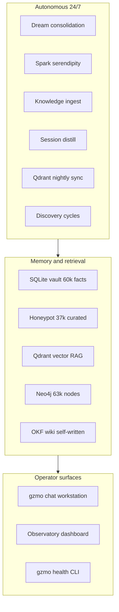
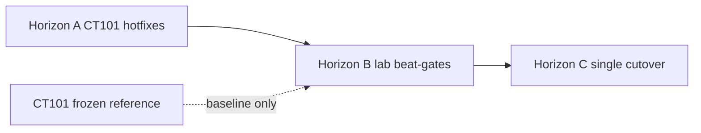

# CT101 Capabilities Overview

**Status:** Canonical capability map  
**Generated:** 2026-07-14  
**Parent infrastructure report:** [CT101_INFRASTRUCTURE_REPORT.md](../reports/CT101_INFRASTRUCTURE_REPORT.md)  
**Report tree index:** [INDEX.md](./INDEX.md)

This document answers three questions for the CT101 production stack:

1. **What can it do today?** — capability matrix by system  
2. **How do you advance it?** — staged roadmap respecting the frozen-legacy boundary  
3. **How do you enhance it?** — cross-cutting themes and prioritized backlog  

Every system and subsystem has a dedicated report with code walkthroughs and **THINKING** nodes. Start at [INDEX.md](./INDEX.md).

> **THINKING — CT101_INFRASTRUCTURE_REPORT.md:executive-summary**
> - *Reviewed:* Live probe snapshot (2026-07-14): 60k vault, 37k honeypot, 488k synapse events, cloud GLM 5.2, discovery unpublished cycles.
> - *Insight:* The stack is **operationally mature** (6-day sidecar uptime, green health) but **quality-gated** at discovery publish and vector drift boundaries.
> - *Risk / limitation:* Capabilities depend on OpenRouter uptime + VM200 embed; workstation sleep only affects fallback Prime, not primary cloud path.
> - *Enhancement:* Treat capability maturity as **per-subsystem**, not binary — see matrix below.

---

## 1. What the stack offers (capability matrix)

| System | Primary capabilities | Maturity | Live status (2026-07-14) | Report |
|--------|---------------------|----------|---------------------------|--------|
| **10 Host & Runtime** | 24/7 LXC host, systemd daemon, Docker sidecars (Redis/Qdrant/Neo4j) | Production | Sidecars up 6 days; 487 MiB daemon; 4 GiB cap | [SYSTEM](./10-host-runtime/SYSTEM.md) |
| **20 Daemon Core** | Heartbeat triage, cron orchestrator, health probes, file watchers | Production | Active 1.5h+ at probe; gate-pre-deploy OK | [SYSTEM](./20-daemon-core/SYSTEM.md) |
| **30 Cognition Engines** | Dream, spark, ingest, session distill, wiki, KG reconcile | Production | DREAMS 23k lines; vault 60k facts | [SYSTEM](./30-cognition-engines/SYSTEM.md) |
| **40 LLM Gateway** | Cloud-first routing, Obolus task→engine map, Prime fallback | Production | `active_mode=cloud`, GLM 5.2 xhigh | [SYSTEM](./40-llm-gateway/SYSTEM.md) |
| **50 Memory Data Plane** | SQLite vault, honeypot, evidence, Qdrant sync, Redis scratch | Production | 664 MiB vault; 24k Qdrant points green | [SYSTEM](./50-memory-data-plane/SYSTEM.md) |
| **60 Chaos Engine** | Lorenz pulse, thought cabinet, low-tension discovery triggers | Production | Drives auto-socratic cycles live | [SYSTEM](./60-chaos-engine/SYSTEM.md) |
| **70 MCP Layer** | Neo4j KG via stdio MCP; Pi vault bridge via mcp-serve | Production | MCP read_graph OK; 13k entity summary | [SYSTEM](./70-mcp-layer/SYSTEM.md) |
| **80 Synapse Bus** | Append-only event log; Pi session pull into episodic | Production | 488,944 events | [SYSTEM](./80-synapse-bus/SYSTEM.md) |
| **90 Tools & Skills** | fs, shell, web, memory_search, sysadmin; dice/poker skills | Production | Registered in daemon tool registry | [SYSTEM](./90-tools-skills/SYSTEM.md) |
| **100 Discovery Automation** | Auto-socratic Pi cycles, sidecar-only remediation queue | Degraded | Cycles run; publish blocked by eval placeholder | [SYSTEM](./100-discovery-automation/SYSTEM.md) |
| **110 External Nodes** | VM200 embed/rerank, Prime fallback, Observatory, Pi | Production | VM200 + Prime reachable from WS | [SYSTEM](./110-external-nodes/SYSTEM.md) |
| **120 Two-Stack Boundary** | Inline-only on CT101; GZMO-next lab assembly on workstation | Policy | `assembly.rs` guard enforced | [SYSTEM](./120-two-stack-boundary/SYSTEM.md) |

### Capability clusters (what operators get)

| Cluster | You can… | Key subsystems |
|---------|----------|----------------|
| **Autonomous cognition** | Run nightly dream/spark without human input; watch knowledge folders; distill chat sessions | [dream-engine](./30-cognition-engines/dream-engine.md), [spark-engine](./30-cognition-engines/spark-engine.md), [ingest-engine](./30-cognition-engines/ingest-engine.md), [session-distill](./30-cognition-engines/session-distill.md) |
| **Memory & RAG** | Store 60k+ facts, promote to honeypot, sync vectors, query via memory_search + rerank | [vault](./50-memory-data-plane/vault.md), [honeypot](./50-memory-data-plane/honeypot.md), [qdrant-sync-recall](./50-memory-data-plane/qdrant-sync-recall.md), [embeddings-rerank](./50-memory-data-plane/embeddings-rerank.md) |
| **Knowledge graph** | Write verified entities/relations from dreams/spark/ingest via MCP | [neo4j-memory-server](./70-mcp-layer/neo4j-memory-server.md), [kg-reconcile](./30-cognition-engines/kg-reconcile.md) |
| **Observability** | Tail 488k synapse events; 8-view Observatory; heartbeat checks | [synapse-writer](./80-synapse-bus/synapse-writer.md), [observatory](./110-external-nodes/observatory.md), [heartbeat-cheapcheck](./20-daemon-core/heartbeat-cheapcheck.md) |
| **Self-improvement** | Trigger Pi discovery on low chaos tension; queue sidecar remediations | [auto-socratic-cycle](./100-discovery-automation/auto-socratic-cycle.md), [implementation-queue](./100-discovery-automation/implementation-queue.md) |
| **Dual-stack dev** | Build GZMO-next on workstation without touching CT101 loops | [assembly-guard](./120-two-stack-boundary/assembly-guard.md), [beat-gates](./120-two-stack-boundary/beat-gates.md) |

---

## 2. How to advance the stack

Advancement respects [CT101_BOUNDARY.md](../ops/CT101_BOUNDARY.md): **no loop-by-loop graft onto CT101**. Progress happens in three horizons.

### Horizon A — CT101-safe hotfixes (now)

Changes allowed on frozen legacy: config tweaks, script path fixes, eval gates, observability, sidecar ops.

| Priority | Action | System | Report |
|----------|--------|--------|--------|
| P0 | Fix discovery publish eval (template placeholder leakage) | 100 | [auto-socratic-cycle](./100-discovery-automation/auto-socratic-cycle.md) |
| P0 | Ensure all discovery entry scripts hardcode `GZMO_ROOT=/opt/gzmo/survey_GZMO` | 100 | [pi-mentor-cycle](./100-discovery-automation/pi-mentor-cycle.md) |
| P1 | Synapse JSONL rotation at 500k+ lines | 80 | [synapse-writer](./80-synapse-bus/synapse-writer.md) |
| P1 | MCP Neo4j child retry on crash | 70 | [mcp-manager-bridge](./70-mcp-layer/mcp-manager-bridge.md) |
| P1 | VM200 embed health in daemon heartbeat | 110 | [vm200-retrieval](./110-external-nodes/vm200-retrieval.md) |
| P2 | Honeypot REM tuning for 60k vault scale | 30 | [dream-engine](./30-cognition-engines/dream-engine.md) |
| P2 | Token/cost ledger → Obolus integration | 40 | [obolus-metering](./40-llm-gateway/obolus-metering.md) |

### Horizon B — GZMO-next lab parity (workstation)

Develop replacement loops as Little Tools Lab recipes; prove with `beat-gate.sh`.

| Loop | Lab recipe | Beat-gate compares | Report |
|------|------------|-------------------|--------|
| Cognition | `cognition-smoke.sh` | Dream/spark output vs CT101 baseline | [30-cognition-engines](./30-cognition-engines/SYSTEM.md) |
| Knowledge | `knowledge-smoke.sh` | Vault promote + Qdrant drift | [50-memory-data-plane](./50-memory-data-plane/SYSTEM.md) |
| Ops | `ops-smoke.sh` | Health probe parity | [20-daemon-core](./20-daemon-core/SYSTEM.md) |
| Config | `config-handoff` | Fused TOML calibration | [40-llm-gateway](./40-llm-gateway/SYSTEM.md) |

Run under `GZMO_INSTANCE=next` with [gzmo-next-scheduler](./120-two-stack-boundary/gzmo-next-scheduler.md) — **never** on CT101 daemon.

### Horizon C — Single cutover (S3)

When all beat-gates green as one unit:

1. Document composed runtime (scheduler + lab recipes + data migration)
2. Migrate `/opt/gzmo/data/` → GZMO-next data root in one maintenance window
3. Decommission CT101 daemon; keep sidecars or co-migrate Docker stack
4. Update Observatory + Pi endpoints

See [beat-gates](./120-two-stack-boundary/beat-gates.md) and [GZMO_NEXT_RUNBOOK.md](../GZMO_NEXT_RUNBOOK.md).

---

## 3. How to enhance the stack (cross-cutting themes)

### Theme 1 — Discovery publish rate

**Problem:** Live probe showed cycles completing but **unpublished** due to session-final eval detecting template placeholder text.

**Enhancements:**
- [CT101-safe] Harden Pi report prompts; auto-retry rewrite once on placeholder fail
- [GZMO-next] Discovery findings → honeypot promotion pipeline

**Reports:** [100-discovery-automation](./100-discovery-automation/SYSTEM.md)

### Theme 2 — Memory quality at scale

**Problem:** 60k vault / 37k honeypot with ~22k Qdrant drift vs honeypot count suggests sync cadence and promotion tuning matter.

**Enhancements:**
- [CT101-safe] Honeypot REM chunk tuning; nightly sync health in Synapse
- [GZMO-next] Incremental Qdrant sync on promote; cross-engine dedup registry

**Reports:** [50-memory-data-plane](./50-memory-data-plane/SYSTEM.md), [30-cognition-engines](./30-cognition-engines/SYSTEM.md)

### Theme 3 — Cost and energy routing

**Problem:** Cloud-primary daemon (`z-ai/glm-5.2` xhigh) runs 24/7 scheduled cognition; Obolus ledger exists but integration is partial.

**Enhancements:**
- [CT101-safe] Full token/cost write-through to `data/Obolus/ledger.jsonl`
- [CT101-safe] Per-task latency metrics in Synapse
- [GZMO-next] Dynamic routing by queue depth / energy budget

**Reports:** [40-llm-gateway](./40-llm-gateway/SYSTEM.md), [obolus-metering](./40-llm-gateway/obolus-metering.md)

### Theme 4 — Resilience and observability

**Problem:** Single VM200 embed SPOF; 488k-line Synapse file; MCP child can crash silently until next health check.

**Enhancements:**
- [CT101-safe] VM200 + Prime circuit breakers in gateway
- [CT101-safe] Observatory stale-snapshot alert
- [CT101-safe] Synapse rotation/compress
- [GZMO-next] Per-loop panic isolation in daemon (don't kill all tasks on one panic)

**Reports:** [110-external-nodes](./110-external-nodes/SYSTEM.md), [80-synapse-bus](./80-synapse-bus/SYSTEM.md), [20-daemon-core](./20-daemon-core/SYSTEM.md)

### Theme 5 — Security and sandboxing

**Problem:** `shell_exec` and `sys_kill` run on CT101 host with real privileges.

**Enhancements:**
- [GZMO-next] gVisor/Docker sandbox for shell tool
- [GZMO-next] mTLS on VM200 llama-server LAN binding

**Reports:** [90-tools-skills/tools.md](./90-tools-skills/tools.md)

---

## 4. Consolidated enhancement backlog (top 20)

Ranked across all system reports. Tags: **[CT101-safe]** = allowed on frozen legacy; **[GZMO-next]** = lab/workstation only.

| Rank | Enhancement | Tag | System |
|------|-------------|-----|--------|
| 1 | Fix discovery template placeholder eval blocking publish | [CT101-safe] | 100 |
| 2 | Hardcode/portable `GZMO_ROOT` across all discovery scripts | [CT101-safe] | 100 |
| 3 | Synapse JSONL rotation at 500k+ lines | [CT101-safe] | 80 |
| 4 | MCP Neo4j child retry/backoff on crash | [CT101-safe] | 70 |
| 5 | VM200 embed health in daemon heartbeat | [CT101-safe] | 110 |
| 6 | Token/cost ledger integration with Obolus | [CT101-safe] | 40 |
| 7 | Honeypot REM tuning for 60k vault | [CT101-safe] | 30 |
| 8 | Unified cognition schedule events in Synapse | [CT101-safe] | 30 |
| 9 | Heartbeat structured rows in HEARTBEAT.md | [CT101-safe] | 20 |
| 10 | Orchestrator job metrics → Synapse | [CT101-safe] | 20 |
| 11 | PulseLoop + RunSkill wired in daemon agent loop | [CT101-safe] | 60 |
| 12 | CI beat-gate on all four loops | [GZMO-next] | 120 |
| 13 | Incremental Qdrant sync on honeypot promote | [GZMO-next] | 50 |
| 14 | Cross-engine dedup registry | [GZMO-next] | 30 |
| 15 | Per-loop panic isolation in daemon | [GZMO-next] | 20 |
| 16 | Shell tool Docker/gVisor sandbox | [GZMO-next] | 90 |
| 17 | Discovery findings → honeypot promotion | [GZMO-next] | 100 |
| 18 | MCP server hot-reload | [GZMO-next] | 70 |
| 19 | Dynamic LLM routing by queue depth | [GZMO-next] | 40 |
| 20 | S3 cutover checklist + vault diff automation | [GZMO-next] | 120 |

Subsystem-specific backlogs with THINKING nodes: see each leaf report under [INDEX.md](./INDEX.md).

---

## 5. Subsystem index (quick reference)

| System folder | Subsystem reports |
|---------------|-------------------|
| [10-host-runtime/](./10-host-runtime/SYSTEM.md) | lxc-host, systemd-unit, sidecar-redis, sidecar-qdrant, sidecar-neo4j |
| [20-daemon-core/](./20-daemon-core/SYSTEM.md) | heartbeat-cheapcheck, orchestrator, agent-loop, watcher, health |
| [30-cognition-engines/](./30-cognition-engines/SYSTEM.md) | dream-engine, spark-engine, ingest-engine, session-distill, wiki-engine, kg-reconcile |
| [40-llm-gateway/](./40-llm-gateway/SYSTEM.md) | gateway-router, engine-profiles, obolus-metering |
| [50-memory-data-plane/](./50-memory-data-plane/SYSTEM.md) | vault, honeypot, evidence, episodic, embeddings-rerank, qdrant-sync-recall, scratch-redis, lifecycle-ripen |
| [60-chaos-engine/](./60-chaos-engine/SYSTEM.md) | pulse-loop, lorenz-physics, thought-cabinet, feedback-triggers |
| [70-mcp-layer/](./70-mcp-layer/SYSTEM.md) | mcp-manager-bridge, neo4j-memory-server, mcp-serve |
| [80-synapse-bus/](./80-synapse-bus/SYSTEM.md) | synapse-writer, synapse-pull |
| [90-tools-skills/](./90-tools-skills/SYSTEM.md) | tools, skills, subagent-delegate |
| [100-discovery-automation/](./100-discovery-automation/SYSTEM.md) | auto-socratic-cycle, pi-mentor-cycle, implementation-queue |
| [110-external-nodes/](./110-external-nodes/SYSTEM.md) | vm200-retrieval, workstation-prime, observatory, pi-agent |
| [120-two-stack-boundary/](./120-two-stack-boundary/SYSTEM.md) | assembly-guard, gzmo-next-scheduler, beat-gates |

**Total:** 12 systems · 44 subsystems · 58 documents (including this overview and INDEX).

---

## 6. Reading guide

| If you want to… | Start here |
|-----------------|------------|
| Understand what runs where | [CT101_INFRASTRUCTURE_REPORT.md](../reports/CT101_INFRASTRUCTURE_REPORT.md) |
| See what the stack *can do* | This document, §1 capability matrix |
| Fix production issues on CT101 | §2 Horizon A + subsystem [CT101-safe] backlogs |
| Build the replacement | §2 Horizon B + [120-two-stack-boundary/](./120-two-stack-boundary/SYSTEM.md) |
| Deep-dive one component | [INDEX.md](./INDEX.md) → subsystem report → THINKING nodes |

---

*Generated 2026-07-14. Re-run live probes from infrastructure report Appendix A after infra changes; update §1 maturity column accordingly.*
