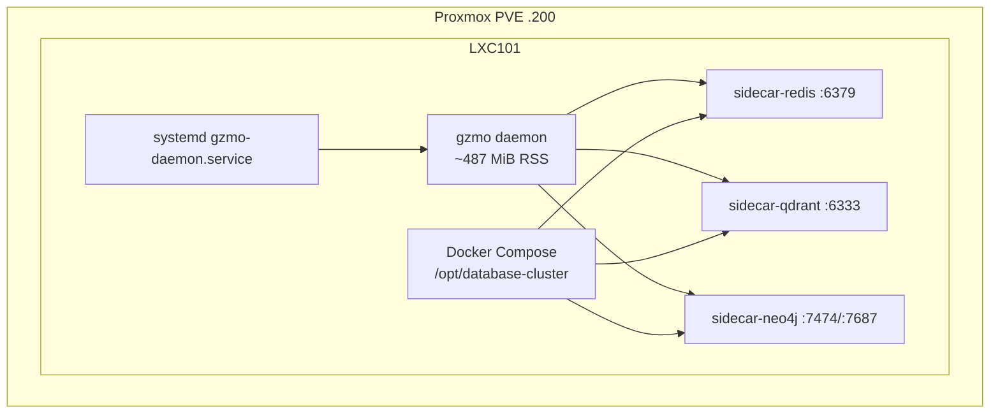

# System 10 — Host & Runtime

**Role:** Provisioning and process supervision for CT101 (LXC 101, `192.168.31.202`). Provides the bare-metal container, Docker sidecars (Redis, Qdrant, Neo4j), and systemd unit that keep `gzmo daemon` running 24/7.

**Live probe (2026-07-14):** Daemon RSS ~487 MiB, sidecars up 6 days, ports 6379 / 6333 / 7474 / 7687 on LAN.

---

## Capability table

| Subsystem | Capability | Report |
|-----------|------------|--------|
| **lxc-host** | Provisions Docker CE + database cluster inside LXC 101 via Proxmox `pct exec` | [lxc-host.md](./lxc-host.md) |
| **systemd-unit** | Supervises `gzmo daemon`; restart-on-failure; network ordering | [systemd-unit.md](./systemd-unit.md) |
| **sidecar-redis** | Scratch buffer, distill queue, LRU-bounded hot memory | [sidecar-redis.md](./sidecar-redis.md) |
| **sidecar-qdrant** | Vector mirror of honeypot facts for hybrid recall | [sidecar-qdrant.md](./sidecar-qdrant.md) |
| **sidecar-neo4j** | Shared knowledge graph; MCP memory server backend | [sidecar-neo4j.md](./sidecar-neo4j.md) |

---

## Architecture

---

## Cross-dependencies

| Consumer | Depends on |
|----------|------------|
| **20-daemon-core** | systemd unit, sidecar TCP reachability |
| **50-memory-data-plane** | Redis scratch, Qdrant sync, vault on `/opt/gzmo/data/` |
| **70-mcp-layer** | Neo4j Bolt for `mcp-neo4j-memory-gzmo` |
| **40-llm-gateway** | Network to OpenRouter (cloud) and workstation Prime fallback |

**Upstream:** Proxmox LXC template, `swap/scripts/setup_lxc101.sh`, `swap/templates/database-cluster-compose.yml`.

**Downstream:** All cognition engines (30), health probes (20), MCP tools (70).

---

## Consolidated enhancements

| Rank | Enhancement | Tag |
|------|-------------|-----|
| 1 | Parameterize systemd `WorkingDirectory` / `ExecStart` for `/opt/gzmo/survey_GZMO` (production path) | [CT101-safe] |
| 2 | Add `MemoryMax=4G` and `LimitNOFILE` to unit file matching live CT101 cgroup | [CT101-safe] |
| 3 | Healthcheck blocks in compose for Redis/Qdrant/Neo4j | [CT101-safe] |
| 4 | Move Neo4j credentials to `.env` (not inline in compose template) | [CT101-safe] |
| 5 | Replace hardcoded markitdown path with config-driven binary | [GZMO-next] |
| 6 | Kubernetes or Nomad — out of scope for CT101 frozen stack | [GZMO-next] |

---

*Parent:* [INDEX.md](../INDEX.md) · *Authority:* [CT101_INFRASTRUCTURE_REPORT.md](../../reports/CT101_INFRASTRUCTURE_REPORT.md)
