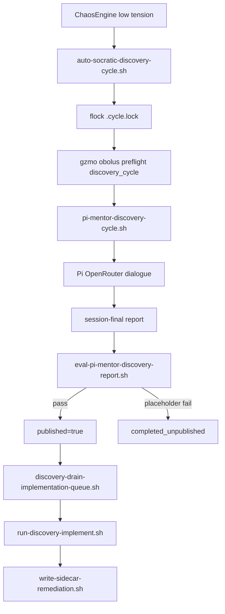

# System 100 — Discovery Automation

**Parent:** [CT101 Capability Index](../INDEX.md)  
**Infrastructure:** [CT101_INFRASTRUCTURE_REPORT.md](../../CT101_INFRASTRUCTURE_REPORT.md) §9  
**Live path:** `/home/maximilian/gzmo_skills/` (repo mirror: `github-clone/gzmo_skills/`)

---

## Role

Autonomous **infrastructure discovery** on frozen CT101: chaos low-tension triggers spawn Pi↔GZMO mentor sessions that probe pillars, publish findings, and enqueue **sidecar-only** remediations — without modifying `gzmo-core/` on production.

**Live probe (2026-07-14):** Auto-socratic cycles active; 14:18 UTC cycle **published**; 14:54 UTC cycle **unpublished** (session-final eval: template placeholder text in report).

---

## Capability matrix

| Subsystem | Report | CT101 capability |
|-----------|--------|------------------|
| **Auto-socratic trigger** | [auto-socratic-cycle.md](./auto-socratic-cycle.md) | Daemon chaos watcher → lock/queue → Pi cycle; OBOLUS preflight |
| **Pi mentor cycle** | [pi-mentor-cycle.md](./pi-mentor-cycle.md) | ~60 min arc sessions, pillar probes, session-final eval + publish gate |
| **Implementation queue** | [implementation-queue.md](./implementation-queue.md) | Post-report probes → plan agent → sidecar remediation scripts |

---

## Pipeline

---

## Cross-dependencies

| System | Relationship |
|--------|--------------|
| [60-chaos-engine](../60-chaos-engine/SYSTEM.md) | Low-tension watcher invokes auto-socratic entry |
| [40-llm-gateway](../40-llm-gateway/SYSTEM.md) | OBOLUS metering on `discovery_cycle`, `discovery_plan`, fixer spawn |
| [80-synapse-bus](../80-synapse-bus/SYSTEM.md) | Remediation scripts append `events.jsonl`; Pi `session_end` optional |
| [120-two-stack-boundary](../120-two-stack-boundary/SYSTEM.md) | `DISCOVERY_PLAN_SIDECAR_ONLY=1` — no gzmo-core workstreams on CT101 |

---

## Policy constraints (CT101 frozen)

| Rule | Enforcement |
|------|-------------|
| No `gzmo-core/` edits | `DISCOVERY_PLAN_SIDECAR_ONLY=1`, plan-agent prompt paths |
| Canonical `GZMO_ROOT` | `/opt/gzmo/survey_GZMO` (Jul 10 fix — ignore workstation path pollution) |
| Remediation scope | `gzmo_skills/scripts/`, config TOML, sidecar hooks only |

---

## Consolidated enhancement backlog

| Rank | Enhancement | Tag |
|------|-------------|-----|
| 1 | Harden Pi report prompt to eliminate template placeholder leakage | [CT101-safe] |
| 2 | Auto-retry session-final on placeholder eval fail (1 rewrite) | [CT101-safe] |
| 3 | Prometheus-style metrics from `auto-triggers.jsonl` / `cycle-metrics.jsonl` | [GZMO-next] |
| 4 | Discovery findings → vault honeypot promotion pipeline | [GZMO-next] |
| 5 | Consolidate timer + daemon trigger into single scheduler view | [CT101-safe] |

---

*Generated 2026-07-14 from `gzmo_skills/scripts/`.*
