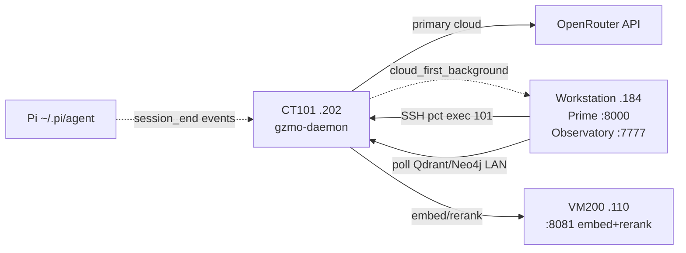

# System 110 — External Nodes

**Parent:** [CT101 Capability Index](../INDEX.md)  
**Infrastructure:** [CT101_INFRASTRUCTURE_REPORT.md](../../CT101_INFRASTRUCTURE_REPORT.md) §10  
**LAN:** `192.168.31.0/24`

---

## Role

CT101 is not isolated — it depends on **satellite nodes** for GPU retrieval, LLM fallback, operator visualization, and optional Pi frontend telemetry. This system documents read/write boundaries: what CT101 consumes outbound vs what nodes poll CT101 read-only.

**Live probe (2026-07-14):** VM200 `:8081` embed+rerank up; workstation Prime `:8000` ornith-35b fallback; Observatory `:7777` polling CT101 via PVE SSH.

---

## Capability matrix

| Subsystem | Report | Relationship to CT101 |
|-----------|--------|----------------------|
| **VM200 retrieval** | [vm200-retrieval.md](./vm200-retrieval.md) | Outbound embed + rerank `@ 192.168.31.110:8081` |
| **Workstation Prime** | [workstation-prime.md](./workstation-prime.md) | Cloud fallback LLM `@ 192.168.31.184:8000` |
| **Observatory** | [observatory.md](./observatory.md) | Read-only telemetry `@ :7777` (workstation) |
| **Pi agent** | [pi-agent.md](./pi-agent.md) | Optional frontend `~/.pi/agent/` → Synapse `session_end` |

---

## Ecosystem map

---

## Cross-dependencies

| System | Link |
|--------|------|
| [40-llm-gateway](../40-llm-gateway/SYSTEM.md) | `[engine.local]` → Prime; `[engine.cloud]` → OpenRouter |
| [50-memory-data-plane](../50-memory-data-plane/SYSTEM.md) | `[embeddings]`, `[rerank]` → VM200 |
| [80-synapse-bus](../80-synapse-bus/SYSTEM.md) | Pi events → `events.jsonl` → distill pull |
| [100-discovery-automation](../100-discovery-automation/SYSTEM.md) | Pi mentor cycles on CT101; operator on workstation |

---

## Consolidated enhancement backlog

| Rank | Enhancement | Tag |
|------|-------------|-----|
| 1 | Health probe for VM200 `:8081` in daemon heartbeat | [CT101-safe] |
| 2 | Observatory alert when SSH snapshot stale > 60s | [CT101-safe] |
| 3 | Prime fallback circuit breaker when cloud recovers | [CT101-safe] |
| 4 | Consolidate Pi Synapse path documentation in one runbook | [CT101-safe] |
| 5 | mTLS or API token on VM200 llama-server LAN binding | [GZMO-next] |

---

*Generated 2026-07-14.*
