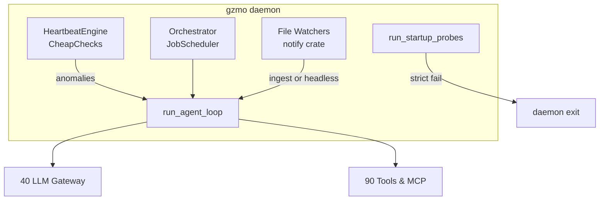

# System 20 — Daemon Core

**Role:** The always-on runtime inside `gzmo daemon`: cheap heartbeat checks, cron orchestrator, reactive watchers, startup health probes, and the shared agent loop that powers headless background tasks.

**Live probe (2026-07-14):** `gzmo-daemon` active, ~487 MiB RSS; heartbeat writes `data/HEARTBEAT.md`.

---

## Capability table

| Subsystem | Capability | Report |
|-----------|------------|--------|
| **heartbeat-cheapcheck** | Deterministic triage before LLM wake; cron catch-up helpers | [heartbeat-cheapcheck.md](./heartbeat-cheapcheck.md) |
| **orchestrator** | Cron jobs as simple or pipeline agent loops | [orchestrator.md](./orchestrator.md) |
| **agent-loop** | Prompt → LLM → tool dispatch cycle with context pruning | [agent-loop.md](./agent-loop.md) |
| **watcher** | Debounced file ingest on directory events | [watcher.md](./watcher.md) |
| **health** | Startup probes for LLM, Redis, Qdrant, Neo4j, MCP | [health.md](./health.md) |

---

## Architecture

---

## Cross-dependencies

| Dependency | Direction |
|------------|-----------|
| **10-host-runtime** | systemd keeps process alive |
| **40-llm-gateway** | All orchestrator/watcher LLM calls |
| **30-cognition-engines** | Dream/spark/ingest loops spawned alongside core |
| **50-memory-data-plane** | Vault, scratch, episodic for persist/log |
| **80-synapse-bus** | DaemonTick, HealthTick events |

---

## Consolidated enhancements

| Rank | Enhancement | Tag |
|------|-------------|-----|
| 1 | Heartbeat writes structured rows to `HEARTBEAT.md` | [CT101-safe] |
| 2 | Per-loop panic isolation (don't kill daemon on one task exit) | [GZMO-next] |
| 3 | Watcher markitdown path from config not hardcoded home dir | [CT101-safe] |
| 4 | Orchestrator job metrics export to Synapse | [CT101-safe] |
| 5 | Distributed cron leader election for multi-instance | [GZMO-next] |

---

*Parent:* [INDEX.md](../INDEX.md)
