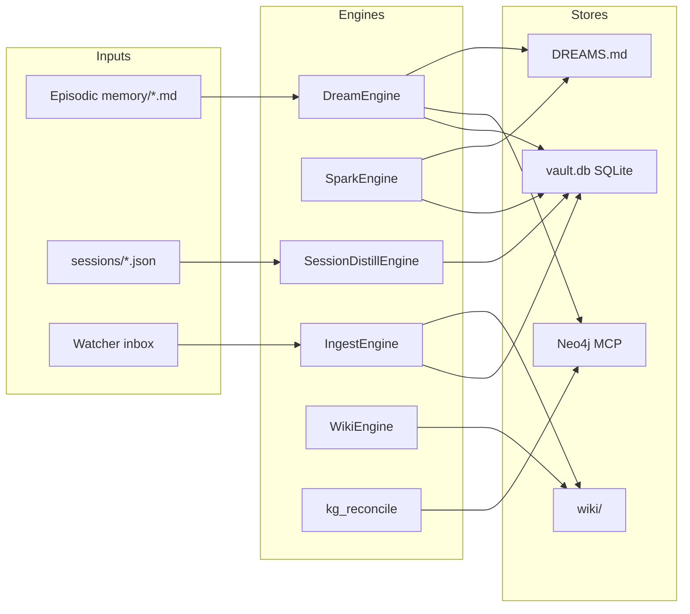

# System 30 — Cognition Engines

**Role:** Scheduled and reactive knowledge extraction pipelines — dream consolidation, spark serendipity, gated ingest, session distill, wiki gardening, and Neo4j ontology reconcile. All run inside `gzmo daemon` on independent 60s cron loops.

**Live probe (2026-07-14):** Vault **60,031** facts; `DREAMS.md` 23,496 lines; cloud GLM 5.2 for background tasks.

---

## Capability table

| Subsystem | Schedule (UTC default) | Report |
|-----------|------------------------|--------|
| **dream-engine** | 01:00 — prior day episodic → vault + KG | [dream-engine.md](./dream-engine.md) |
| **spark-engine** | 03:30 / dice mode — stale fact linking | [spark-engine.md](./spark-engine.md) |
| **ingest-engine** | On file event (watcher) | [ingest-engine.md](./ingest-engine.md) |
| **session-distill** | 02:15 + archive worker | [session-distill.md](./session-distill.md) |
| **wiki-engine** | 02:00 sync, Sun 06:00 lint | [wiki-engine.md](./wiki-engine.md) |
| **kg-reconcile** | Daily — Neo4j ontology fix | [kg-reconcile.md](./kg-reconcile.md) |

---

## Architecture

---

## Cross-dependencies

| Engine | Requires |
|--------|----------|
| All extract/verify | **40-llm-gateway** TaskKind routing |
| Dream/Spark/Ingest/Distill | **50-memory** vault, KgPromoter, embeddings |
| Wiki emit | Ingest promotion + `[wiki] emit_on_ingest` |
| KG reconcile | **70-mcp-layer** Neo4j memory server |

---

## Consolidated enhancements

| Rank | Enhancement | Tag |
|------|-------------|-----|
| 1 | Unified cognition schedule dashboard in Synapse | [CT101-safe] |
| 2 | Incremental Qdrant sync on promote (not just nightly) | [GZMO-next] |
| 3 | Honeypot REM tuning for 60k vault scale | [CT101-safe] |
| 4 | Cross-engine dedup registry (ingest vs distill vs dream) | [GZMO-next] |

---

*Parent:* [INDEX.md](../INDEX.md)
