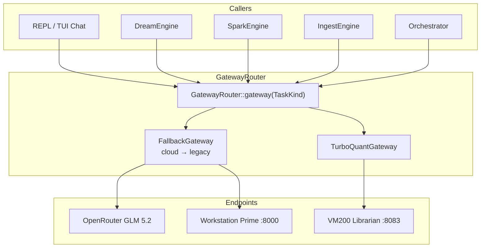

# System 40 — LLM Gateway

**Role:** Obolus routing layer — maps each cognitive **TaskKind** to an OpenAI-compatible gateway (`TurboQuantGateway`), with cloud-first fallback chains for background work. CT101 live: `active_mode=cloud`, OpenRouter `z-ai/glm-5.2`, `reasoning_effort=xhigh`.

---

## Capability table

| Subsystem | Capability | Report |
|-----------|------------|--------|
| **gateway-router** | TaskKind → cached `Arc<dyn LlmGateway>` with FallbackGateway | [gateway-router.md](./gateway-router.md) |
| **engine-profiles** | `[engine]`, `[routing]` profile resolution | [engine-profiles.md](./engine-profiles.md) |
| **obolus-metering** | Background vs chat routing; cloud-first economy | [obolus-metering.md](./obolus-metering.md) |

---

## Architecture

---

## Cross-dependencies

| Consumer | TaskKinds used |
|----------|----------------|
| Dream | `DreamExtract`, `DreamVerify` |
| Spark | `SparkHypothesis`, `SparkVerify` |
| Ingest | `IngestExtract`, `IngestVerify` |
| Distill | `DistillExtract`, `DistillVerify`, `DistillSummary` |
| Orchestrator | `Daemon` |
| Chat | `Chat` (never cloud-first forced) |

**Secrets:** API keys in `/opt/gzmo/.env` — never in reports or git.

---

## Consolidated enhancements

| Rank | Enhancement | Tag |
|------|-------------|-----|
| 1 | Token/cost ledger integration with `data/Obolus/` | [CT101-safe] |
| 2 | Per-task latency metrics in Synapse | [CT101-safe] |
| 3 | Dynamic routing by vault queue depth | [GZMO-next] |
| 4 | Local GGUF sovereign profile when built | [GZMO-next] |

---

*Parent:* [INDEX.md](../INDEX.md)
