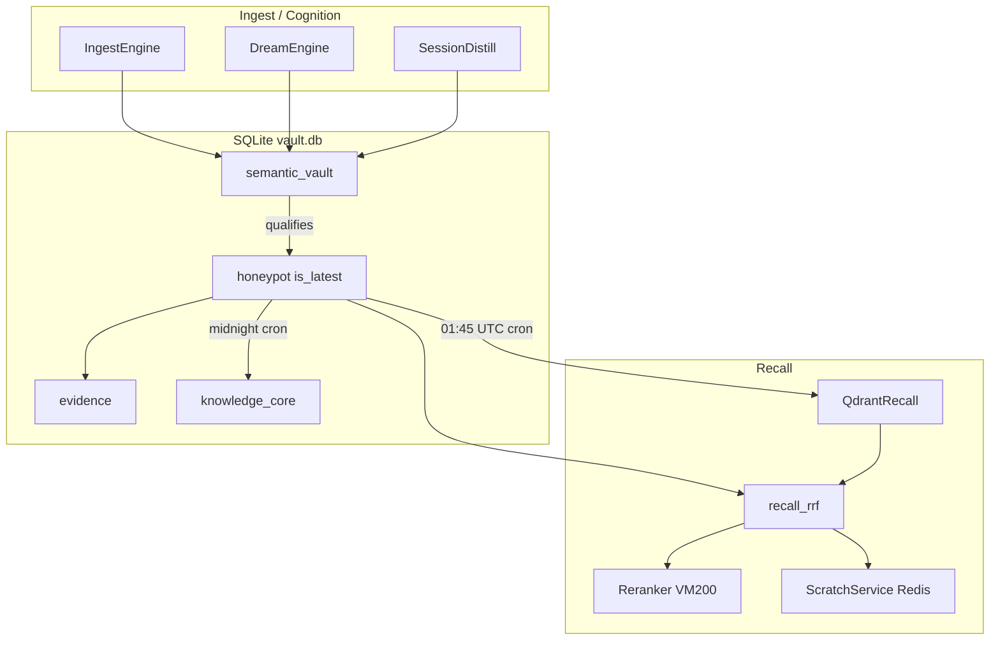

# System 50 — Memory Data Plane

**Parent:** [INDEX.md](../INDEX.md) · [CT101_INFRASTRUCTURE_REPORT.md](../../reports/CT101_INFRASTRUCTURE_REPORT.md)

The memory data plane is GZMO's authoritative storage and recall stack on CT101: SQLite vault as source of truth, honeypot as curated recall layer, Qdrant as vector mirror, Redis for scratch/embed cache, and VM200 for embeddings/rerank.

---

## Role in the ecosystem

| Layer | Store | Live count (2026-07-14) |
|-------|-------|-------------------------|
| Ops vault | `data/vault.db` → `semantic_vault` | **60,031** facts |
| Curated crystal | same DB → `honeypot` (`is_latest=1`) | **37,807** rows |
| Vector mirror | Qdrant `:6333` collection `honeypot` | **24,322** points |
| Provenance graph | Neo4j sidecar | **63,572** nodes |
| Ephemeral context | Redis scratch + embed cache | sidecar `:6379` |

North star: **vault = ops soup**, **honeypot = curated crystal**, **Qdrant = association field**, **Neo4j = provenance graph**. Design reference: [MEMORY_ARCHITECTURE_SPEC.md](../../MEMORY_ARCHITECTURE_SPEC.md).

---

## Capability summary

| Subsystem | Report | Primary capability |
|-----------|--------|-------------------|
| Vault | [vault.md](./vault.md) | SQLite CRUD, schema migrations, hybrid search, promote pipeline |
| Honeypot | [honeypot.md](./honeypot.md) | Qualification gate, FTS sync, curated recall substrate |
| Evidence | [evidence.md](./evidence.md) | Quote localization, evidence tier, FTS/vector recall streams |
| Episodic | [episodic.md](./episodic.md) | Daily `memory/YYYY-MM-DD.md` ledger, NO_REPLY filter |
| Embeddings & rerank | [embeddings-rerank.md](./embeddings-rerank.md) | VM200 embed client, Redis cache, cross-encoder rerank |
| Qdrant sync & recall | [qdrant-sync-recall.md](./qdrant-sync-recall.md) | Nightly honeypot→Qdrant sync, RRF vector stream |
| Scratch & Redis | [scratch-redis.md](./scratch-redis.md) | Session recall scratch, distill job queue |
| Lifecycle & ripen | [lifecycle-ripen.md](./lifecycle-ripen.md) | Contradiction/extends, KG promotion helpers, M5 ripen |

---

## Internal data flow

---

## Cross-system dependencies

| Consumer | Uses |
|----------|------|
| **20-daemon-core** | `open_vault_with_embeddings()` at boot; orchestrator `honeypot_ripen`, `qdrant_sync` crons |
| **30-cognition-engines** | `promote_truths`, honeypot lifecycle, evidence localize, `kg_promotion` |
| **40-llm-gateway** | Recall snippets injected via scratch; embed/rerank HTTP to VM200 |
| **70-mcp-layer** | `PlatformMemory` → `recall_rrf`, profile, wiki search |
| **80-synapse-bus** | Pi pull → episodic + distill enqueue (not vault writes) |
| **110-external-nodes** | VM200 embeddings/rerank; sidecar Qdrant/Redis/Neo4j on CT101 |

---

## Consolidated enhancement summary

| Priority | Item | Tag |
|----------|------|-----|
| 1 | Qdrant drift alarm when point count diverges from honeypot `is_latest` | [CT101-safe] |
| 2 | Evidence backfill for honeypot rows missing localized spans | [CT101-safe] |
| 3 | Ripen job metrics in `gzmo health` (cards exported vs entity groups) | [CT101-safe] |
| 4 | Implement `QdrantVault` backend or remove dead config path | [GZMO-next] |
| 5 | Document-layer table + explicit vault→honeypot promotion audit | [GZMO-next] |

---

*Subsystem reports: [vault](./vault.md) · [honeypot](./honeypot.md) · [evidence](./evidence.md) · [episodic](./episodic.md) · [embeddings-rerank](./embeddings-rerank.md) · [qdrant-sync-recall](./qdrant-sync-recall.md) · [scratch-redis](./scratch-redis.md) · [lifecycle-ripen](./lifecycle-ripen.md)*
