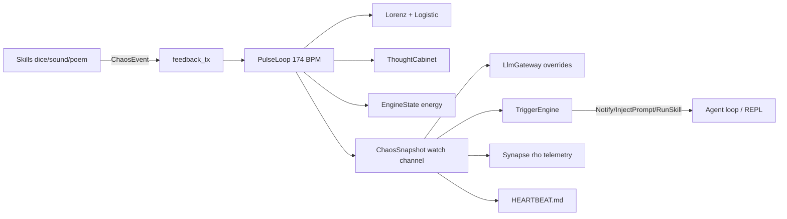

# System 60 — Chaos Engine

**Parent:** [INDEX.md](../INDEX.md) · [CT101_INFRASTRUCTURE_REPORT.md](../../reports/CT101_INFRASTRUCTURE_REPORT.md)

The chaos engine is GZMO's **internal physiology**: a 174 BPM pulse loop driving Lorenz/logistic dynamics, a Thought Cabinet for incubation/crystallization, skill feedback, autonomous triggers, and derived LLM parameters (temperature, max_tokens, valence). It runs in chat/TUI today; daemon pins `PulseHandle` for full process lifetime.

---

## Role in the ecosystem

Chaos is **decoupled from memory stores** (no direct vault writes). It modulates cognition via:
- `LlmGateway::set_chaos_overrides` (temperature, max_tokens)
- `CHAOS_STATE.json` + `HEARTBEAT.md` telemetry files
- Synapse `chaos.rho_telemetry` events (output-only)
- Autonomous trigger injections into REPL/agent loop

---

## Capability summary

| Subsystem | Report | Primary capability |
|-----------|--------|-------------------|
| Pulse loop | [pulse-loop.md](./pulse-loop.md) | 344ms tick, snapshot broadcast, lore absorption |
| Lorenz physics | [lorenz-physics.md](./lorenz-physics.md) | RK4 attractor, engine energy/death/rebirth |
| Thought cabinet | [thought-cabinet.md](./thought-cabinet.md) | Incubation, crystallization, permanent mutations |
| Feedback & triggers | [feedback-triggers.md](./feedback-triggers.md) | Skill events, threshold triggers, bootstrap bridge |

---

## Internal data flow

---

## Cross-system dependencies

| System | Link |
|--------|------|
| **40-llm-gateway** | Chaos overrides temperature/max_tokens per tick |
| **80-synapse-bus** | `SenseChaosRho` append-only telemetry every 15 ticks |
| **20-daemon-core** | `chaos_bootstrap` in daemon/chat startup |
| **90-tools-skills** | Skills emit `ChaosEvent` after execution |

---

## Consolidated enhancement summary

| Priority | Item | Tag |
|----------|------|-----|
| 1 | PulseLoop always-on in daemon (not chat-only) | [CT101-safe] |
| 2 | Trigger `RunSkill` wired in daemon agent loop | [CT101-safe] |
| 3 | Persist Thought Cabinet mutations across restart | [GZMO-next] |
| 4 | Chaos-free spark path uses `VaultBackend::stale_candidates` | [GZMO-next] |

---

*Subsystem reports: [pulse-loop](./pulse-loop.md) · [lorenz-physics](./lorenz-physics.md) · [thought-cabinet](./thought-cabinet.md) · [feedback-triggers](./feedback-triggers.md)*
