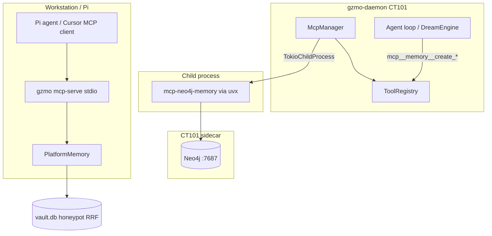

# System 70 — MCP Layer

**Parent:** [INDEX.md](../INDEX.md) · [CT101_INFRASTRUCTURE_REPORT.md](../../CT101_INFRASTRUCTURE_REPORT.md)

The MCP layer connects GZMO to external tool servers via **Model Context Protocol** (stdio JSON-RPC): inbound **client** connections (`McpManager` + tool bridges for Neo4j memory) and outbound **server** mode (`gzmo mcp-serve` for Pi/workstation memory access).

---

## Role in the ecosystem

| Direction | Component | Purpose |
|-----------|-----------|---------|
| **Inbound (client)** | `McpManager` | Daemon spawns `[[mcp_servers]]` children; registers `mcp__memory__*` tools |
| **Outbound (server)** | `GzmoMemoryMcpServer` | Pi/Cursor calls `gzmo_memory_*` against live vault/recall |
| **Graph** | Neo4j via uvx | Dream deep-phase KG writes — **63k** nodes live on CT101 sidecar |

MCP failures degrade KG writes; vault ingest/recall continue on SQLite.

---

## Capability summary

| Subsystem | Report | Primary capability |
|-----------|--------|-------------------|
| Manager & bridge | [mcp-manager-bridge.md](./mcp-manager-bridge.md) | Spawn, handshake, tool discovery, ToolHandler bridge |
| Neo4j memory server | [neo4j-memory-server.md](./neo4j-memory-server.md) | uvx spawn, bolt sidecar, dream integration |
| MCP serve | [mcp-serve.md](./mcp-serve.md) | stdio server exposing platform memory tools |

---

## Internal data flow

---

## Cross-system dependencies

| System | Link |
|--------|------|
| **50-memory-data-plane** | `PlatformMemory` → vault recall, scratch, profile |
| **30-cognition-engines** | `dreams.rs` calls `mcp__memory__*` for KG phase |
| **10-host-runtime** | Neo4j Docker sidecar on CT101 |
| **110-external-nodes** | Pi agent uses `gzmo mcp-serve` on workstation |

---

## Consolidated enhancement summary

| Priority | Item | Tag |
|----------|------|-----|
| 1 | MCP spawn health in `gzmo health` (server count, last handshake) | [CT101-safe] |
| 2 | Retry/backoff on Neo4j MCP child crash | [CT101-safe] |
| 3 | Secrets via env file not inline TOML | [CT101-safe] |
| 4 | MCP server hot-reload without daemon restart | [GZMO-next] |

---

*Subsystem reports: [mcp-manager-bridge](./mcp-manager-bridge.md) · [neo4j-memory-server](./neo4j-memory-server.md) · [mcp-serve](./mcp-serve.md)*
