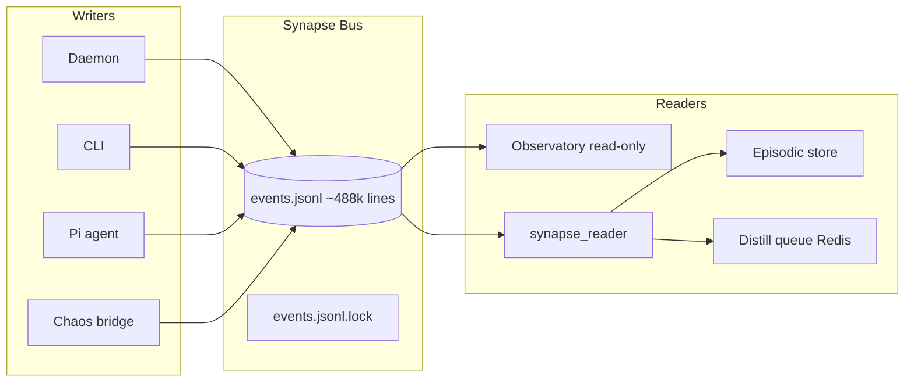

# System 80 — Synapse Bus

**Parent:** [INDEX.md](../INDEX.md) · [CT101_INFRASTRUCTURE_REPORT.md](../../CT101_INFRASTRUCTURE_REPORT.md)

The Synapse bus is GZMO's **append-only observability log**: JSONL events at `data/Synapse/events.jsonl` with advisory file locking. **~488k events** live on CT101. It follows the Prime Directive — **write only, never consume for automated state transitions** — except the dedicated read-only `synapse_reader` for Pi handoff.

---

## Role in the ecosystem

| Writer | EventSource | Examples |
|--------|-------------|----------|
| gzmo-daemon | `gzmo_daemon` | daemon_tick, job_complete, health_tick, dream_complete |
| gzmo CLI | `gzmo_cli` | distill, ingest, spark one-shots |
| Pi agent | `pi_agent` | quest_complete, session_start, session_end |
| Chaos bridge | `gzmo_daemon` | `chaos.rho_telemetry` (HSP output-only) |

Readers: Observatory, manual audit, **`synapse_reader`** (Pi pull → episodic + distill queue).

---

## Capability summary

| Subsystem | Report | Primary capability |
|-----------|--------|-------------------|
| Synapse writer | [synapse-writer.md](./synapse-writer.md) | Append-only JSONL, fs2 lock, event schema |
| Synapse pull | [synapse-pull.md](./synapse-pull.md) | Pi event tail, session_end → distill, episodic log |

---

## Internal data flow

---

## Cross-system dependencies

| System | Link |
|--------|------|
| **50-memory-data-plane** | Pull → episodic append; session_end → scratch distill enqueue |
| **60-chaos-engine** | rho telemetry append (no feedback from bus) |
| **20-daemon-core** | Orchestrator/dream/spark emit completion events |
| **110-external-nodes** | Pi agent primary writer of `pi_agent` source events |

---

## Consolidated enhancement summary

| Priority | Item | Tag |
|----------|------|-----|
| 1 | JSONL rotation/compress at 500k+ lines | [CT101-safe] |
| 2 | Event schema version field | [GZMO-next] |
| 3 | Never add daemon consumer loop (firewall) | policy |
| 4 | Observatory live tail API | [GZMO-next] |

---

*Subsystem reports: [synapse-writer](./synapse-writer.md) · [synapse-pull](./synapse-pull.md)*
