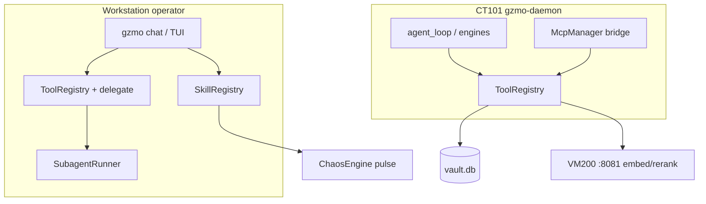

# System 90 — Tools & Skills

**Parent:** [CT101 Capability Index](../INDEX.md)  
**Infrastructure:** [CT101_INFRASTRUCTURE_REPORT.md](../../CT101_INFRASTRUCTURE_REPORT.md) §5  
**Live probe (2026-07-14):** CT101 daemon active (~487 MiB), `active_mode=cloud`, cognition via OpenRouter GLM 5.2

---

## Role

System 90 is GZMO's **action surface**: pluggable LLM tools for agentic loops (daemon cognition, orchestrator jobs, chat) and Rust-native slash **skills** for operator REPL chaos feedback. On CT101, tools power Dream/Spark/Ingest/Orchestrator agent rounds; skills are primarily exercised via workstation `gzmo chat` / TUI, not the headless daemon.

---

## Capability matrix

| Subsystem | Report | CT101 capability |
|-----------|--------|------------------|
| **Tool registry** | [tools.md](./tools.md) | FS, shell (allowlist), web, sysadmin, memory, MCP bridge tools in daemon `ToolRegistry` |
| **Skill engine** | [skills.md](./skills.md) | Chaos-coupled `/dice`, `/sound`, `/poker`, etc. — REPL slash commands with `ChaosEvent` feedback |
| **Subagent delegate** | [subagent-delegate.md](./subagent-delegate.md) | `delegate_task` tool + `SubagentRunner` — governed child agents (chat/TUI; optional in daemon paths) |

---

## Architecture

---

## Cross-dependencies

| Upstream | Relationship |
|----------|--------------|
| [40-llm-gateway](../40-llm-gateway/SYSTEM.md) | `LlmGateway` invokes tools via `agent_loop` |
| [50-memory-data-plane](../50-memory-data-plane/SYSTEM.md) | `memory_record` / `memory_search` bind `SqliteVault` + scratch |
| [70-mcp-layer](../70-mcp-layer/SYSTEM.md) | MCP tools registered into same `ToolRegistry` |
| [60-chaos-engine](../60-chaos-engine/SYSTEM.md) | Skills emit `ChaosEvent` into pulse loop |
| [20-daemon-core](../20-daemon-core/SYSTEM.md) | `daemon_cmd.rs` builds production tool set for engines |

---

## Consolidated enhancement backlog

| Rank | Enhancement | Tag |
|------|-------------|-----|
| 1 | Docker/gVisor sandbox for `shell_exec` instead of host `/bin/sh` | [GZMO-next] |
| 2 | Path allowlist for `file_write` on CT101 (restrict to `/opt/gzmo/`, `gzmo_skills/`) | [CT101-safe] |
| 3 | Port remaining shell skills (`/card`, `/poem`, …) to Rust `Skill` trait | [GZMO-next] |
| 4 | Subagent tool surface parity with parent (web, MCP) for reviewer roles | [GZMO-next] |
| 5 | SerpAPI key wiring on CT101 daemon `WebSearchTool` (currently DDG-only default) | [CT101-safe] |
| 6 | Unified tool audit log in Synapse (`tool_call` events with redacted args) | [GZMO-next] |

---

*Generated 2026-07-14 from `gzmo-core/src/tools/`, `gzmo-core/src/skills/`, `gzmo-cli/src/daemon_cmd.rs`.*
