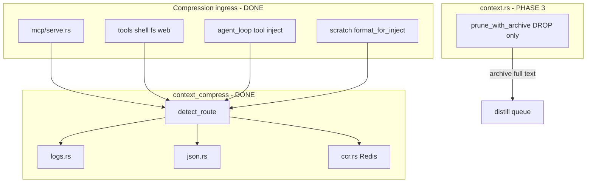
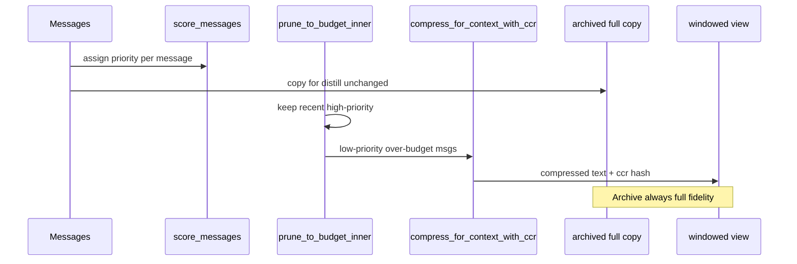

# Phase 3 Handoff — Smarter Log Routing & Scored Context Prune

> **ARCHIVAL (recovered 2026-07-19).** Copied from `origin/feat/context-compress-headroom`.  
> Living `main` does **not** include `gzmo-core/src/context_compress/`. See [HEADROOM_CCR.md](../HEADROOM_CCR.md) and [PI_LIVING_STACK.md](../ops/PI_LIVING_STACK.md).

**Status:** Optional — not started  
**Branch:** `feat/context-compress-headroom` (Phase 0–2 merged locally; commits `a373d33` → `c909277`)  
**Prerequisite:** Phase 2 live (`[context_compress] enabled = true`, CCR on Redis, MCP + tools wired)  
**Authority:** [INFRASTRUCTURE_MAP.md](../INFRASTRUCTURE_MAP.md) · [PI_OPERATOR_GUIDE.md](../ops/PI_OPERATOR_GUIDE.md) §4.1a · headroom plan (author-local plan; not in this repo)

---

## 0. Mission

Phase 3 improves **two gaps** left after Phase 2:

| Gap | Symptom today | Phase 3 target |
|-----|---------------|----------------|
| **Log routing** | `orchestrator_log.txt` benchmark saves only **~5%** — ISO `tracing` lines (`2026-06-01T07:53:45Z INFO …`) miss `detect_route` heuristics and fall through to `Plain` truncation | Recognize structured daemon/GZMO logs; collapse stack traces, summarize ingest lines |
| **Context prune** | `context.rs` **drops** old messages at ~212K tokens (~81% of 262K ctx); tool chains may lose orphans | **Compress-in-place** lower-scored messages before hard drop; keep more history in-window via CCR |

**Non-goals (unchanged from Phase 2):**

- Do not compress `prune.archived` / `DistillJob.transcript` payloads
- Do not compress ingest source, vault writes, or honeypot promotion
- Do not add Kompress HF model or `headroom proxy` in production
- Do not replace Qdrant rerank / RRF recall

---

## 1. What Phase 2 already provides (baseline)



**Key files (read before coding):**

| File | Role |
|------|------|
| [`gzmo-core/src/context_compress/mod.rs`](../gzmo-core/src/context_compress/mod.rs) | `detect_route`, `compress_for_context`, `compress_for_context_with_ccr` |
| [`gzmo-core/src/context_compress/logs.rs`](../gzmo-core/src/context_compress/logs.rs) | ANSI strip, dedup, base64/HTML, per-line cap |
| [`gzmo-core/src/context.rs`](../../gzmo-core/src/context.rs) | `prune_with_archive`, `prune_to_budget_inner`, tool-chain integrity |
| [`gzmo-core/src/agent_loop.rs`](../../gzmo-core/src/agent_loop.rs) | `build_windowed_messages` — archive **then** window; distill safety |
| [`gzmo-core/src/config.rs`](../gzmo-core/src/config/) | `ContextCompressConfig`, `ContextMemoryConfig` |

**Benchmark baseline (Rust, `enabled = true`):**

```bash
./scripts/compression-bench/run.sh
# Median ~62%, probes 12/12 — but orchestrator_log.txt ~5% savings
```

---

## 2. Workstream A — Smarter log routing

### 2.1 Problem diagnosis

Current `detect_route` in `mod.rs` counts a line as “log-like” if:

- starts with `[`, or contains `INFO`/`WARN`/…, or
- first 4 chars are digits **and** line contains `T` (ISO date heuristic)

**GZMO `tracing` output looks like:**

```text
2026-06-01T07:53:45.096783Z  INFO Starting spark cycle date=2026-06-01
```

The digit+`T` rule matches, but only when **>60%** of lines match. Mixed content (long `summary=` fields, file paths) dilutes the ratio → route falls to `Plain` → weak savings.

### 2.2 Implementation plan

#### Step A1 — Extend `detect_route` (`mod.rs`)

Add explicit patterns (no new deps):

```rust
fn is_structured_log_line(line: &str) -> bool {
    let t = line.trim();
    // tracing: 2026-06-01T12:00:00.123456Z  INFO ...
    if t.len() >= 20
        && t.as_bytes().get(4) == Some(&b'-')
        && t.as_bytes().get(7) == Some(&b'-')
        && t.contains('T')
        && t.contains(" INFO ")
        || t.contains(" WARN ")
        || t.contains(" ERROR ")
        || t.contains(" DEBUG ")
        || t.contains(" TRACE ")
    {
        return true;
    }
    // shell tool wrappers
    if t.starts_with("--- stdout ---") || t.starts_with("--- stderr ---") {
        return true;
    }
    // existing bracket / level checks ...
    false
}
```

Lower the log threshold from `0.6` to `0.4` when **any** line matches structured tracing, or add a `CompressRoute::Logs` fast-path when the first non-empty line matches.

#### Step A2 — Enhance `compress_logs` (`logs.rs`)

Port Headroom-inspired rules:

| Rule | Behavior |
|------|----------|
| **Tracing field collapse** | `file=/long/path/foo.md kg_entities=12 …` → keep keys, truncate values > 80 chars |
| **Stack trace fold** | Lines matching `at path.rs:NNN` — keep first 2 + last 1, omit middle with count |
| **Ingest summary lines** | Lines with `Gated ingest complete` — extract `file=`, `promoted_entities=`, drop rest |
| **Level filter (optional)** | Under extreme budget, drop `DEBUG`/`TRACE`, keep `WARN`/`ERROR` |

Add fixture test using [`scripts/compression-bench/fixtures/orchestrator_log.txt`](../scripts/compression-bench/fixtures/orchestrator_log.txt).

**Gate:** `orchestrator_log.txt` savings **≥ 40%** at 30% token budget in `test_run_benchmarks`.

#### Step A3 — Optional `CompressRoute::Code` (defer if time-boxed)

Headroom `CodeCompressor` uses tree-sitter (Rust/TS/Python). Only add if log routing gate passes early.

- New dep: `tree-sitter` + grammar crates — **heavy**; skip unless `read_file`/`grep` fixtures regress
- Stub approach: fenced-block detection in `detect_route`; strip function bodies heuristically (brace counting) without AST

#### Step A4 — Config knobs (`config.rs` + `gzmo.toml`)

```toml
[context_compress]
# existing fields...
log_route_threshold = 0.4      # detect_route ratio (default 0.4 after Phase 3)
log_collapse_field_values = 80 # max chars per key=value in tracing lines
```

Wire through `ContextCompressConfig`; default to sensible values so `enabled = true` without new keys still works.

### 2.3 Tests

| Test | File | Assert |
|------|------|--------|
| `detect_route_tracing_log` | `mod.rs` | `orchestrator_log.txt` → `Logs` |
| `compress_logs_tracing` | `logs.rs` | output shorter; retains `WARN`/`ERROR` lines |
| `benchmark_orchestrator_log` | `mod.rs` `test_run_benchmarks` | savings ≥ 40% for that fixture |
| Regression | all fixtures | median savings still ≥ 55% (allow small drop from 62%) |

---

## 3. Workstream B — Scored rolling prune in `context.rs`

### 3.1 Problem diagnosis

Today when `estimated_before > archive_trigger_tokens` (~212336):

1. `prune_to_budget_inner` walks **backward**, keeps recent messages until budget full
2. Older messages go to `archived` **verbatim** → distill queue (correct)
3. **Dropped from window** = lost to the model entirely (no compression attempt)

Phase 2 compresses **new** tool output at ingress, but **historical** tool results already in the message list can still blow the window during long sessions.

### 3.2 Design — compress-before-drop



**Invariant:** `prune_with_archive` must still set `archived` from **original** messages (`messages_not_in_window`), never from compressed view.

### 3.3 Scoring function

Add `context_score(msg: &Message, index: usize, total: usize) -> f64` in `context.rs` (or `context_compress/scoring.rs`):

| Signal | Weight | Notes |
|--------|--------|-------|
| Recency | `index / total` | 0.0 oldest → 1.0 newest |
| Role: `User` | +0.15 | user intent |
| Role: `Assistant` (non-meta) | +0.10 | |
| Role: `Tool` | +0.05 | large but compressible |
| Role: `System` | +0.20 | except index 0 (always kept) |
| `is_meta == true` | −0.10 | tool plumbing |
| Content has `[RECALL]` | +0.25 | injected memory |
| Content has `[ccr:` | +0.15 | already compressed |
| Token size | `−0.1 * min(tokens/4000, 1.0)` | penalize huge blobs |

Messages sorted by **ascending score** are compression candidates when over budget.

### 3.4 Algorithm sketch

New function: `prune_with_archive_scored` (or extend existing with feature flag):

```text
1. If under archive_trigger → return all (unchanged)
2. archived ← messages_not_in_window from REVERSE-CHRONOLOGICAL drop (same as today)
3. For windowed candidates from prune_to_budget_inner:
   a. If estimated_tokens(windowed) <= max_tokens → done
   b. Build compressible list = non-system messages sorted by score ascending
   c. For each candidate (lowest score first):
      - If role Tool: require parent Assistant in window (existing integrity)
      - Replace message.content with compress_for_context_with_ccr(
            original, budget=800, store_full=true).text
      - Re-estimate tokens; stop when <= max_tokens
4. Never mutate `archived` slice
```

**Budget for in-window compression:** use `tool_output_max_tokens / 4` (~1000 tokens) per message — configurable:

```toml
[context_compress]
prune_compress_budget = 800   # per-message target when scoring prune fires
scored_prune_enabled = false  # ship behind flag; default false until validated
```

### 3.5 Integration points

| File | Change |
|------|--------|
| [`context.rs`](../../gzmo-core/src/context.rs) | `prune_with_archive` calls scored path when `scored_prune_enabled` |
| [`agent_loop.rs`](../../gzmo-core/src/agent_loop.rs) | Pass `compress_cfg` + `ccr` + `session_id` into prune (extend `ContextConfig` or new `PruneContext` struct) |
| [`config.rs`](../gzmo-core/src/config/) | `scored_prune_enabled`, `prune_compress_budget` |

**`ContextConfig` today has no compress settings.** Prefer a small struct to avoid coupling:

```rust
pub struct PruneOptions {
    pub config: ContextConfig,
    pub compress: Option<(ContextCompressConfig, CcrStore, String)>, // cfg, ccr, session_id
}
```

`build_windowed_messages` already has `AgentMemoryContext` — thread into `prune_with_archive(&messages, &opts)`.

### 3.6 Tests

| Test | Assert |
|------|--------|
| `scored_prune_compresses_old_tool` | Long old `Tool` message compressed; recent `User` untouched |
| `scored_prune_archive_full_fidelity` | `archived[0].content` == original, not compressed |
| `scored_prune_tool_chain_integrity` | existing `test_tool_chain_integrity` still passes |
| `scored_prune_disabled_passthrough` | `scored_prune_enabled = false` → byte-identical to Phase 2 |

### 3.7 Manual validation

1. Start `gzmo chat` or Pi session with `[context_compress] scored_prune_enabled = true`
2. Run 15+ tool calls (shell grep, file reads) until near archive threshold
3. Confirm: model still answers questions about **early** tool results (via CCR retrieve or compressed summary)
4. Confirm: distill queue receives full transcripts (`logs/distill` or Redis `gzmo:distill:pending`)

---

## 4. Config summary (Phase 3 additions)

```toml
[context_compress]
enabled = true
# Phase 2 (existing)
ccr_ttl_secs = 3600
tool_output_max_tokens = 4000
recall_compress_budget = 2000
json_array_row_cap = 20
log_line_cap = 500
# Phase 3 (new)
log_route_threshold = 0.4
log_collapse_field_values = 80
scored_prune_enabled = false      # flip after gates
prune_compress_budget = 800
```

Update [`gzmo.toml.example`](../../gzmo.toml.example) and [`PI_OPERATOR_GUIDE.md`](../ops/PI_OPERATOR_GUIDE.md) when shipped.

---

## 5. Execution order

```text
A1  detect_route tracing patterns + tests
A2  compress_logs enhancements + orchestrator_log gate
A3  (optional) code route stub
B1  PruneOptions + scoring function + unit tests
B2  compress-before-drop in prune_with_archive (flag off)
B3  Wire agent_loop → prune with CCR
B4  Enable scored_prune in dev; manual long-session test
Eval  compression-bench + verify-production + recall-eval unchanged
Docs  INFRASTRUCTURE_MAP § hot tier, this handoff → archive
```

**Estimated effort:** 3–5 days (A only: 1–2 days; B only: 2–3 days; both: full week with soak testing).

---

## 6. Gates (Definition of Done)

| Gate | Command / check | Pass |
|------|-----------------|------|
| Unit | `cargo test -p gzmo-core context_compress context::` | all green |
| Bench | `./scripts/compression-bench/run.sh` | median ≥ 55%; orchestrator_log ≥ 40% |
| Prod | `./scripts/verify-production.sh` | all green |
| Recall | `python3 scripts/ingest-quality/run-recall-eval.py --match strict` | no regression vs pre-Phase-3 baseline |
| Faithfulness | `python3 scripts/ingest-quality/faithfulness-judge.py --gate` | ≥ 0.90 |
| Distill safety | Unit: `archived` content equals pre-prune originals | required |
| Scored prune | Long-session manual or integration test | early tool facts retrievable |

---

## 7. Pitfalls

| Pitfall | Prevention |
|---------|------------|
| Compressing `archived` | Only compress **windowed** copy; archive from `messages` before mutation |
| Double CCR on same content | Reuse `[ccr:` guard in `compress_for_context_with_ccr` |
| Breaking tool-chain integrity | Run `test_tool_chain_integrity` after every prune change |
| Scored prune hides errors | Never compress `ERROR`/`WARN` tracing lines in log route; keep last N errors |
| Regressing MCP path | MCP compress is independent — rerun MCP smoke after `detect_route` changes |

---

## 8. Quick commands

```bash
cd ~/Projects/_foundation-audit/survey_GZMO
git checkout feat/context-compress-headroom

# Baseline before Phase 3
./scripts/compression-bench/run.sh
cargo test -p gzmo-core context_compress context::
./scripts/verify-production.sh

# During dev
cargo test -p gzmo-core context_compress::tests::test_run_benchmarks -- --nocapture
cargo test -p gzmo-core context::tests::

# After scored prune enabled
cargo build -p gzmo-cli --release
systemctl --user restart gzmo-daemon.service
```

---

## 9. References

- Headroom log compression: https://headroom-docs.vercel.app/docs/text-and-logs  
- Headroom IntelligentContext (scoring inspiration): https://headroom-docs.vercel.app/docs/how-compression-works  
- GZMO Phase 0–2 plan: `~/.cursor/plans/headroom_ideas_for_gzmo_b349ab4c.plan.md`  
- Antigravity artifacts: `~/.gemini/antigravity/brain/94507c61-7e55-4354-864e-80a5d03df068/`

---

*End of Phase 3 handoff.*
