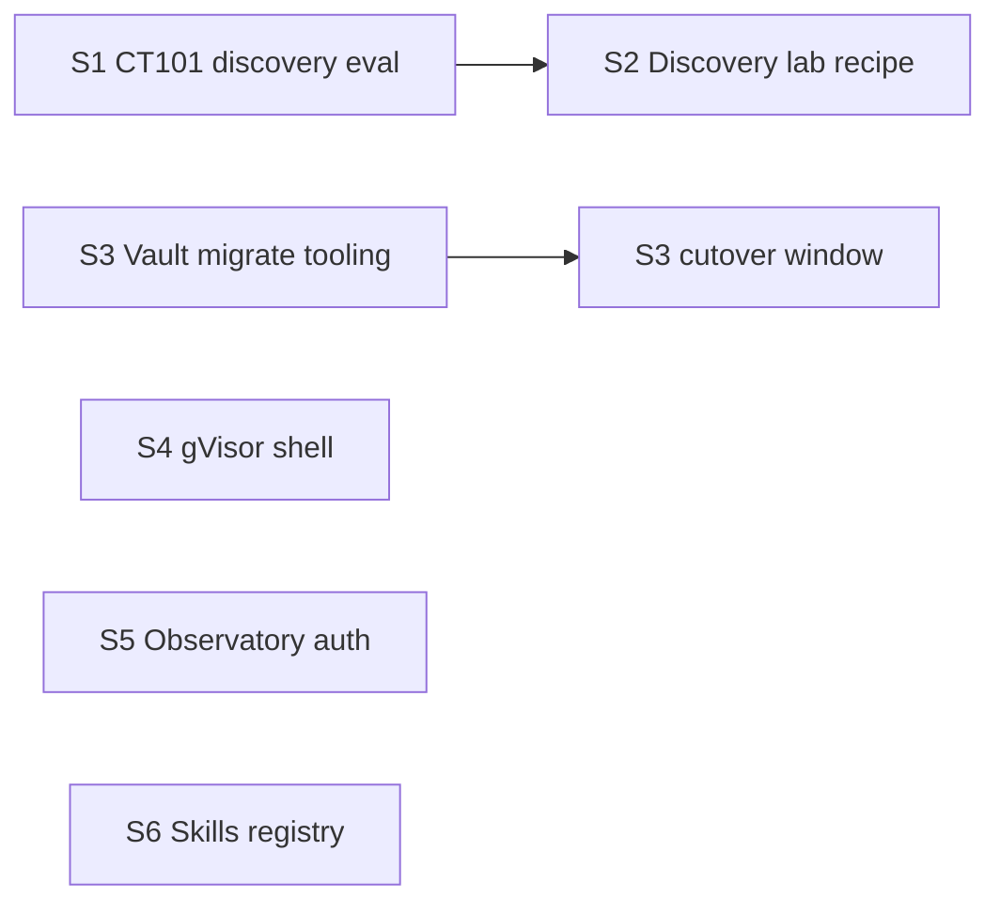

# Stretch Items Handoff — GZMO-next / Little Tools Lab

**Status:** Partial (S1–S3, S5–S6 done 2026-07-15; S4 gVisor open)  
**Date:** 2026-07-15  
**Audience:** Implementation agent (or human) picking up **after** enhancement audit P0–P2  
**Parent:** [`../../little-tools-lab/docs/ENHANCEMENT_AUDIT_2026-07.md`](../../little-tools-lab/docs/ENHANCEMENT_AUDIT_2026-07.md)  
**Policy:** [`CT101_BOUNDARY.md`](../ops/CT101_BOUNDARY.md), [`LAB_TREATMENT.md`](../../little-tools-lab/docs/LAB_TREATMENT.md), [ADR-0001](../../little-tools-lab/docs/adr/0001-two-stack-lab-not-ct101-graft.md), [ADR-0002](../../little-tools-lab/docs/adr/0002-pedagogy-chaos-scheduler-lab-only.md)

---

## Session opener (paste to agent)

```
You are implementing STRETCH items only from:

  GZMO/docs/STRETCH_ITEMS_HANDOFF.md

P0–P2 of the enhancement audit are DONE. Do not re-open mature piece extraction,
runbook memory-plane sync, instance status, promote-fused, scheduler-runs,
ops live metrics, CONTEXT scaffolds, ADR-0002 decisions, incremental Qdrant
--ids/--since, or basic shell strict / GZMO_SHELL_DOCKER=1.

Rules:
- Never graft lab loops into CT101 (ADR-0001 / CT101_BOUNDARY).
- Pedagogy/chaos/dice-scheduler stay lab-only unless ADR-0002 is amended.
- Prefer thin gzmo-scheduler + lab recipes for new overnight work.
- Ship PR-sized commits; update this handoff checklist when a workstream closes.
- Build: export CARGO_TARGET_DIR=/home/gzmo/github-clone/temp-bench/target

Env for next:
  export GZMO_CLONE_ROOT=/home/gzmo/github-clone
  export GZMO_INSTANCE=next
  export GZMO_CONFIG=$GZMO_CLONE_ROOT/GZMO/config/gzmo-next.toml
  export LITTLE_TOOLS_LAB_ROOT=$GZMO_CLONE_ROOT/little-tools-lab
```

---

## 0. What is already shipped (do not redo)

| Area | Location / proof |
|------|------------------|
| Runbook memory plane | `docs/GZMO_NEXT_RUNBOOK.md` required-services match `config/gzmo-next.toml` |
| Orchestrator purity | `ltl-common` bins: `json-field`, `dream-append`, `vault-promote-distill`, `batch-distill-meta` |
| Deep libs | `spark-link`, `verify-suite`; escape-loop detector fix; context-prune archive identity |
| Operator CLI | `gzmo instance status`, `gzmo config promote-fused --diff\|--apply` |
| Scheduler telemetry | `data-next/scheduler-runs/`; Observatory `scheduler_runs` |
| Ops live metrics | `ops-smoke.sh --live` → Redis/Qdrant/Neo4j + queue depth |
| Beat-gates CI | `little-tools-lab/.github/workflows/beat-gates.yml` + `scripts/ci/beat-gates-fixture.sh` |
| CONTEXT / pre-commit | 46 scaffolds + flagship deepens; meta `.pre-commit-config.yaml` |
| Product placement | ADR-0002 pedagogy/chaos/scheduler research ≠ production cron |
| Shell baseline | Strict when `GZMO_INSTANCE=next`; `bash -c` blocked; optional `GZMO_SHELL_DOCKER=1` |
| Incremental Qdrant | `sync-vault-to-qdrant.py --ids/--since`; post-promote hook in `vault.rs` |

Canonical write-up: enhancement audit **Implementation log**.

---

## 1. Stretch workstreams (ordered)

Priority is **dependency order**, not vanity.



| ID | Workstream | Tag | Depends on | Status |
|----|------------|-----|------------|--------|
| **S1** | CT101 discovery publish eval (placeholder) | CT101-safe | — | **done** 2026-07-15 |
| **S2** | Discovery → honeypot as lab recipe on next | GZMO-next | S1 | **done** (fixture + beat-gate) |
| **S3** | Vault migrate / vault-diff automation | GZMO-next | operator decision to import CT101 scale | **done** (tooling; keep fresh vault) |
| **S4** | gVisor (or equivalent) shell sandbox | GZMO-next | optional; Docker isolate already exists | open |
| **S5** | Observatory auth + recipe last-run UI | GZMO-next | scheduler-runs already written | **done** |
| **S6** | Single skills registry for next | GZMO-next | — | **done** |

---

## 2. S1 — CT101 discovery eval (blocker for S2)

### Problem

Pi mentor cycles complete but **do not publish** when the report still contains template placeholder text. Live mode (2026-07-14): `eval-pi-mentor-discovery-report.sh` fails → `published=false`.

Also historically: wrong `GZMO_ROOT` pollution from workstation paths (see `/home/gzmo/handoff-2026-07-10-ct101-discovery-fix.md`) — hardcode `/opt/gzmo/survey_GZMO` on CT101 scripts.

### Primary sources

| Asset | Path |
|-------|------|
| System report | `docs/ct101-systems/100-discovery-automation/pi-mentor-cycle.md` |
| Capabilities backlog #1–2 | `docs/ct101-systems/00-CAPABILITIES_OVERVIEW.md` |
| Eval script (on CT101 / gzmo_skills) | `eval-pi-mentor-discovery-report.sh` |
| Cycle scripts | `auto-socratic-discovery-cycle.sh`, `pi-mentor-discovery-cycle.sh` |
| Skills tree (workstation copy) | `/home/gzmo/github-clone/gzmo_skills/` |

### Implementation sketch

1. Scope placeholder regex to **Findings / Executive summary** sections only (not the whole report).
2. Harden Pi report prompts: forbid echoing instruction parentheses.
3. Keep one auto-rewrite retry on `final_eval_failed`.
4. Ensure every discovery entry script hardcodes `GZMO_ROOT=/opt/gzmo/survey_GZMO` (no `${GZMO_ROOT:-…}` inherit).
5. Verify: one manual cycle publishes; `auto-triggers.jsonl` shows `published: true`.

### Acceptance

- [x] Manual CT101 cycle publishes without placeholder fail. (2026-07-15: evening `session-final-2026-07-15T18-32-48Z.md` eval `pass` + actionability `publish=true` after S1 gate fixes; trigger `s1-stretch-gate-recovery`. Native publish earlier same day `07:57`.)
- [x] At least one automatic daemon-spawned cycle publishes within 24h. (2026-07-15 `07:57` `pi-session-final` published=true; timer re-enabled.)
- [x] No script reintroduces workstation absolute paths for `GZMO_BIN` / `GZMO_ROOT`. (`resolve_gzmo_root` ignores polluted env on CT101.)

### Anti-goals

- Do **not** patch CT101 to call Little Tools Lab recipes.
- Do **not** “fix” by disabling the eval gate.

---

## 3. S2 — Discovery → honeypot (GZMO-next lab recipe)

### Problem

Next has no native discovery. Copying CT101 cycles wholesale would import the broken publish gate and fat-daemon assumptions.

### Design (ADR-0001 compliant)

```
chaos/ops trigger (optional)
  → lab recipe discovery-smoke.sh (fixture + live)
    → Pi or local Prime dialogue (piece or script)
    → findings.md / findings.jsonl
    → honeypot-gate check
    → session-distill / vault promote (existing)
    → incremental Qdrant (already shipped)
```

### Touch points

| Piece | Role |
|-------|------|
| New recipe | `little-tools-lab/scripts/discovery-smoke.sh` |
| New schema | `little-tools-lab/schemas/discovery-smoke-meta.json` |
| Meta bin | optional `ltl-common` `discovery-pipeline-meta` |
| Gate | reuse `honeypot-gate` |
| Promote | existing `vault-promote-distill` / gzmo-core promote |
| Scheduler | **only after** S2 beat-gate green — new cron slot or weekly; do not overcrowd spark/dream |

### Docs to update when shipping

- `catalog/ASSEMBLIES.md`
- `docs/SHELL_SANDBOX_AND_DISCOVERY.md` (mark recipe live)
- `GZMO_NEXT_RUNBOOK.md` scheduler table if cron-enabled
- ADR-0002 amendment if discovery becomes production-facing

### Acceptance

- [x] Fixture discovery-smoke produces schema-valid meta.
- [x] Live mode gates findings through honeypot-gate before vault write.
- [x] Beat-gate or live-smoke proof vs “no unpublished garbage” invariant. (`beat-gate --loop discovery`)
- [x] CT101 untouched. (lab recipe only; no DiscoveryEngine in scheduler)

### Anti-goals

- No inline DiscoveryEngine back into `gzmo-scheduler`.
- No publishing findings that fail placeholder/eval on lab fixture corpus.

---

## 4. S3 — Vault migrate / vault-diff tooling

### Problem

GZMO-next production cutover (2026-07-15) used a **fresh** `data-next/` vault. Behavioral S2 beat-gates passed without CT101’s ~60k-fact memory. Importing CT101 vault is optional scale, not correctness of the lab assembly.

Runbook still describes a future “single cutover” window (`GZMO_NEXT_RUNBOOK.md` §CT101 cutover).

### What to build

| Tool | Behavior |
|------|----------|
| `scripts/vault-diff.py` (or Rust bin) | Compare two vaults: fact counts, honeypot counts, sample content Jaccard / id overlap |
| `scripts/vault-migrate.sh` | Offline: stop consumers → copy `vault.db` (+ WAL/SHM) → optional Qdrant full sync → verify |
| Checklist markdown | Freeze CT101 → snapshot → copy → S2 suite → ownership cut |

### Proposed migrate checklist (encode in script `--dry-run` then `--apply`)

1. `systemctl stop` CT101 daemon; snapshot LXC/volume.
2. Workstation: stop `gzmo-scheduler` (and any `gzmo daemon` next).
3. Backup `data-next/vault.db` → `vault.db.bak-$(date -u +%Y%m%dT%H%M%SZ)`.
4. Copy `/opt/gzmo/data/vault.db` (and `-wal`/`-shm` if hot) → `data-next/vault.db`.
5. Full Qdrant rebuild: `scripts/qdrant-vault-sync.sh` + `qdrant-post-sync-verify.sh`.
6. `bash little-tools-lab/scripts/ci/beat-gates-fixture.sh` then live S2 four loops.
7. Restart scheduler; watch `data-next/scheduler-runs/latest.json`.

### Acceptance

- [x] `vault-diff` reports counts for next-only vs CT101 snapshot without writing.
- [x] Dry-run migrate prints steps and refuses if scheduler PID lock present.
- [x] Apply path creates backup + verifies Qdrant sample after sync. (implemented behind `--apply --yes`; **not run** — keep fresh vault)
- [x] Doc in runbook links to the tooling (not prose-only).

### Anti-goals

- No online bidirectional sync CT101 ↔ next.
- No silent overwrite of `data-next` without `.bak`.

### Decision gate (ask operator before apply)

> Import CT101 vault only if product needs historical depth. Fresh organic growth remains valid.

---

## 5. S4 — gVisor / hard shell sandbox

### Current baseline (shipped)

| Knob | Effect |
|------|--------|
| `GZMO_INSTANCE=next` | Strict denylist (`systemctl`, `sudo`, `kill`, …) |
| Allowlist | First-token + `.sh` + `bash script.sh` (not `bash -c`) |
| `GZMO_SHELL_DOCKER=1` | `docker run --rm --network none -v $cwd:/work:ro alpine:3.20 sh -c …` |

Code: `gzmo-core/src/tools/shell.rs`  
Doc: `docs/SHELL_SANDBOX_AND_DISCOVERY.md`

### Stretch target

Replace / upgrade Docker Alpine with a **gVisor runtime** (`runsc`) or a purpose-built image that:

1. No host network (or egress allowlist to Prime `:8000` + VM200 `:8081` only).
2. Read-write only under an explicit workspace bind (not whole `$HOME`).
3. Drop `bash` host allowlist when sandbox mode is on — only sandboxed shell.
4. Config flag in `gzmo-next.toml`, e.g. `[agent] shell_sandbox = "off"|"docker"|"gvisor"`.

### Implementation sketch

1. Add `[agent].shell_sandbox` to config; wire `ShellExecTool` from chat/daemon construction.
2. Prefer `docker run --runtime=runsc …` when gVisor installed; fall back with clear error.
3. Integration test: allowlisted `echo` works; `rm -rf /` and `bash -c` fail closed.
4. Skills that need network: either escape hatch allowlist or run outside tool.

### Acceptance

- [ ] Toml-selectable sandbox mode for next.
- [ ] Document runtime install (`runsc`) in runbook.
- [ ] Chat smoke: `/status` works; `shell_exec` cannot touch host systemd.

### Anti-goals

- Do not break overnight lab recipes (they are host bash by design — only chat `shell_exec`).

---

## 6. S5 — Observatory auth + scheduler UX

### Current

- Observatory `:7777`, `OBSERVATORY_MODE=local`, no auth.
- Snapshot now includes `scheduler_runs` from `data-next/scheduler-runs/`.

Paths: `/home/gzmo/gzmo-observatory/`, `scripts/workstation-snapshot.py`.

### Stretch

1. Bind `127.0.0.1` only **or** basic auth / reverse-proxy token.
2. UI panel: latest job from `scheduler_runs.latest`, ok/fail, script name, timestamp.
3. Optional “calibration pending” when `gzmo-next-fused.toml` newer than live (pair with `gzmo config promote-fused`).
4. Stale snapshot alert if collector mtime > N minutes.

### Acceptance

- [x] External LAN clients cannot read Observatory without credentials (or cannot reach it). (bind `127.0.0.1`; optional `OBSERVATORY_BASIC_AUTH`)
- [x] Dashboard shows last scheduler job without reading logs by hand. (Body view last-run panel + collector `scheduler_runs`)

---

## 7. S6 — Skills registry unification

### Problem

Split discovery:

- In-tree `GZMO/skills/`
- Bridge repo `gzmo_skills/` (`BRIDGE.md`)

Operators and agents load different surfaces.

### Stretch

1. Single registry document: which tree is authoritative for `GZMO_INSTANCE=next`.
2. Chat skill loader reads one path; other becomes symlink or documented auxiliary.
3. Avoid dual `skill_card.sh` versions.

### Acceptance

- [x] `gzmo instance status` or runbook states one skills root.
- [x] Chat `/skills` (or equivalent) lists only that root. (dispatch uses `config.skills.directory` = `GZMO/skills/`; `gzmo_skills` documented as auxiliary)

---

## 8. Environment cheat sheet

```bash
export GZMO_CLONE_ROOT=/home/gzmo/github-clone
export GZMO_INSTANCE=next
export GZMO_CONFIG=$GZMO_CLONE_ROOT/GZMO/config/gzmo-next.toml
export LITTLE_TOOLS_LAB_ROOT=$GZMO_CLONE_ROOT/little-tools-lab
export CARGO_TARGET_DIR=$GZMO_CLONE_ROOT/temp-bench/target
export LLM_URL=http://127.0.0.1:8000
# optional stretch knobs
# export GZMO_SHELL_DOCKER=1
# export GZMO_SHELL_STRICT=1   # redundant when INSTANCE=next
```

Sidecars: `cd ~/database-cluster && docker compose up -d` only (not user `gzmo-sidecar-*`).

---

## 9. Suggested commit / PR sequence

1. **S1** — CT101-only discovery eval (separate PR; touch only gzmo_skills / CT101 scripts).
2. **S2** — lab discovery recipe + schema + fixture (no scheduler cron yet).
3. **S2b** — beat-gate + optional weekly scheduler job.
4. **S3** — vault-diff + migrate dry-run (apply behind explicit flag).
5. **S4** — config-driven gVisor/docker sandbox.
6. **S5 / S6** — can parallelize after S2.

---

## 10. Exit criteria for “stretch complete”

All boxes in §§2–7 acceptance lists checked, and:

- [ ] This handoff’s workstream table marked **done** per ID (edit in place).
- [ ] Enhancement audit Implementation log gains a **Stretch** subsection with dates.
- [ ] Runbook links S3 tooling and S4 sandbox modes.
- [ ] No CT101 loop graft; ADR-0001 still holds.

---

## 11. Quick reference — files to open first

| Workstream | Start here |
|------------|------------|
| S1 | `docs/ct101-systems/100-discovery-automation/pi-mentor-cycle.md` |
| S2 | `docs/SHELL_SANDBOX_AND_DISCOVERY.md` + `catalog/ASSEMBLIES.md` |
| S3 | `docs/GZMO_NEXT_RUNBOOK.md` §CT101 cutover + `scripts/qdrant-vault-sync.sh` |
| S4 | `gzmo-core/src/tools/shell.rs` |
| S5 | `gzmo-observatory/scripts/workstation-snapshot.py` |
| S6 | `gzmo_skills/BRIDGE.md` + `GZMO/skills/` |

---

## 12. Explicitly out of stretch scope

- Re-litigating 46-piece maturity labels vs depth (P0 nesting depth still has residual Amber repos — track under portfolio curation, not this handoff).
- Turning pedagogy into nightly cron without ADR-0002 amendment.
- Replacing `gzmo-scheduler` with `dice-scheduler`.
- Merging CT101 and next into one process.
