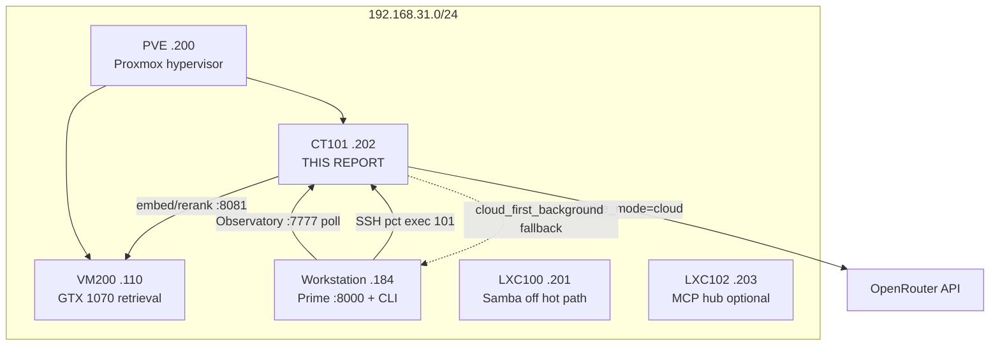
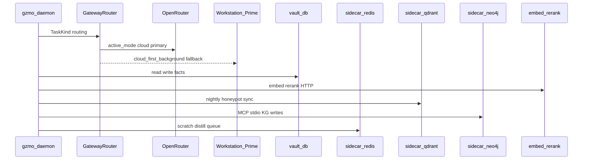
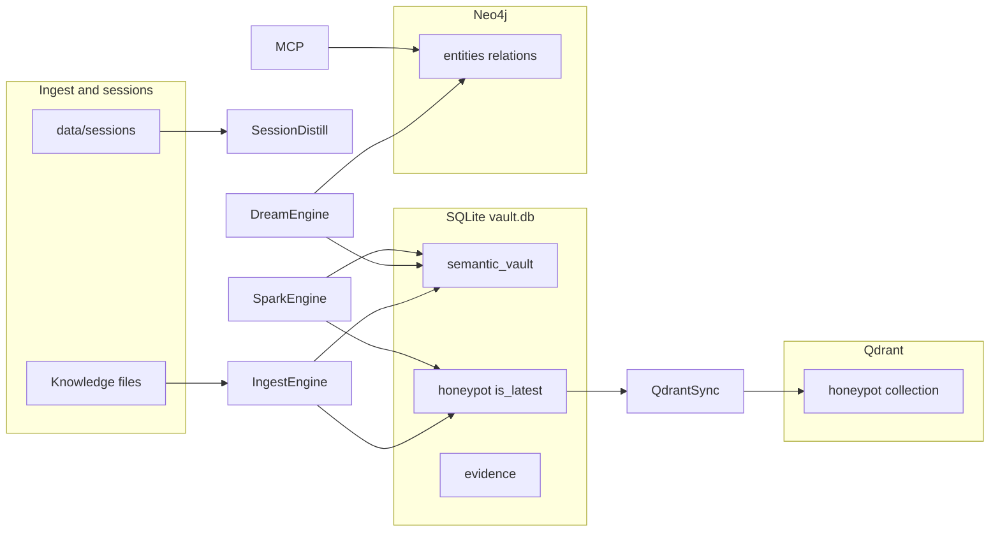
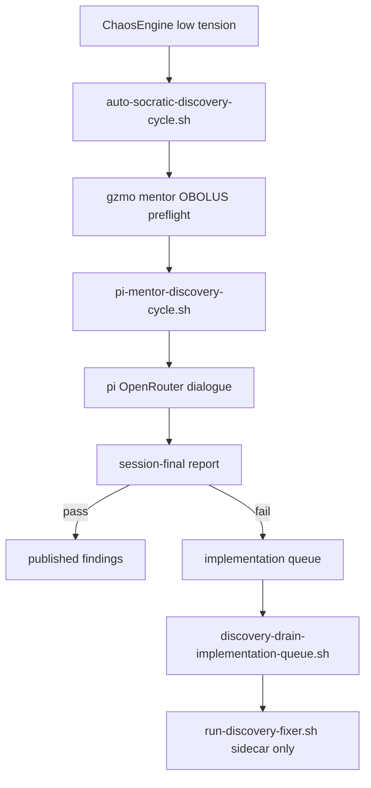

# CT101 Ecosystem Infrastructure Report

**Status:** Historical reference (CT101 legacy) — **superseded for production ops by GZMO-next on workstation (2026-07-15)**  
**Generated:** 2026-07-14  
**Live probe timestamp:** 2026-07-14 15:11 UTC (via `ssh pve "pct exec 101 -- …"`)  
**Authority order (legacy CT101):** live CT101 state → `/opt/gzmo/gzmo.toml` → this document  
**Authority order (production):** [GZMO_NEXT_RUNBOOK.md](../GZMO_NEXT_RUNBOOK.md) → `config/gzmo-next.toml` → `data-next/`

> **NOTE — Production ops moved to workstation (2026-07-15)**
> - *Purpose:* This report remains the CT101 legacy map for reference and comparison.
> - *Production:* GZMO-next on `192.168.31.184` — see [PLACEMENT_DECISION.md](../PLACEMENT_DECISION.md) amendment.
> - *CT101:* Leave untouched; not the ops target for new work.

**Capability tree:** [ct101-systems/00-CAPABILITIES_OVERVIEW.md](../ct101-systems/00-CAPABILITIES_OVERVIEW.md) — per-system and per-subsystem reports with advancement/enhancement guidance and THINKING nodes on reviewed code.

> **NOTE — Document scope**
> - *Purpose:* Single map of every layer, subsystem, and source file in the CT101 production ecosystem.
> - *Boundary:* CT101 is **frozen legacy** ([CT101_BOUNDARY.md](../ops/CT101_BOUNDARY.md)). GZMO-next on the workstation is the replacement target — not a parallel edit surface for CT101 loops.
> - *Failure mode:* Treating the workstation clone config as production truth will mis-route cognition and memory endpoints.
> - *Code home:* This doc; enforcement in `gzmo-core/src/assembly.rs`.

---

## Table of contents

0. [Capability report tree](../ct101-systems/00-CAPABILITIES_OVERVIEW.md) — what the stack can do, how to advance/enhance it (58 reports)
1. [Executive summary](#1-executive-summary)
2. [Homelab ecosystem map](#2-homelab-ecosystem-map)
3. [CT101 host layer (LXC 101)](#3-ct101-host-layer-lxc-101)
4. [Runtime layer — systemd and Docker](#4-runtime-layer--systemd-and-docker)
5. [Application architecture — Rust workspace](#5-application-architecture--rust-workspace)
6. [Configuration layer — `/opt/gzmo/gzmo.toml`](#6-configuration-layer--optgzmogzmo-toml)
7. [Memory and data plane](#7-memory-and-data-plane)
8. [Scheduled cognition timeline (UTC)](#8-scheduled-cognition-timeline-utc)
9. [Discovery automation (`gzmo_skills`)](#9-discovery-automation-gzmo_skills)
10. [External ecosystem nodes](#10-external-ecosystem-nodes)
11. [Port and endpoint matrix](#11-port-and-endpoint-matrix)
12. [Two-stack boundary (CT101 vs GZMO-next)](#12-two-stack-boundary-ct101-vs-gzmo-next)
13. [Operations runbook (CT101-specific)](#13-operations-runbook-ct101-specific)
14. [Appendices](#14-appendices)

---

## 1. Executive summary

**CT101** is Proxmox LXC container **101** (hostname `CT101`, LAN IP **192.168.31.202**). It runs the **frozen legacy GZMO production stack**: a headless Rust `gzmo-daemon` under systemd, colocated with SQLite vault, Docker sidecars (Redis, Qdrant, Neo4j), and autonomous discovery scripts. The workstation (`.184`) provides operator UI, Prime LLM fallback, and read-only telemetry (Observatory). VM200 (`.110`) provides embeddings and reranking.

### Live snapshot (2026-07-14 15:11 UTC)

| Metric | Value |
|--------|-------|
| Host RAM | 8 GiB total, ~487 MiB daemon RSS, 4 GiB MemoryMax |
| Disk `/` | 125 GiB, 16 GiB used (13%) |
| `gzmo-daemon` | **active**, running since 13:41 UTC (~1.5 h at probe) |
| Docker sidecars | redis, qdrant, neo4j — **Up 6 days** |
| `vault.db` | **664 MiB**, 60,031 semantic facts, 37,807 honeypot (`is_latest=1`) |
| `DREAMS.md` | 23,496 lines |
| Synapse events | 488,944 lines in `events.jsonl` |
| Qdrant `honeypot` | 24,322 points (health: green) |
| Neo4j | 63,572 nodes, 64,224 relations (MCP read_graph: 13,432 entity summary) |
| Cognition | `active_mode=cloud`, OpenRouter `z-ai/glm-5.2` + `reasoning_effort=xhigh` |
| Discovery | Auto-socratic cycles active; latest cycle unpublished (template placeholder eval fail) |

> **NOTE — Why CT101 exists separately from the workstation**
> - *Purpose:* 24/7 autonomous pipelines (dream, spark, ingest, Qdrant sync, discovery) without depending on workstation uptime.
> - *Boundary:* Do not migrate individual lab loops onto CT101; full cutover only when GZMO-next is stack-ready.
> - *Failure mode:* Moving the daemon to the workstation stops nightly cognition when the machine sleeps; split-brain if vault and Prime diverge without ops discipline.
> - *Code home:* [PLACEMENT_DECISION.md](../PLACEMENT_DECISION.md), [PI_FRONTEND_SPLIT.md](../ops/PI_FRONTEND_SPLIT.md).

---

## 2. Homelab ecosystem map



### Per-node inventory

| Node | IP | Compute | Ports / services | Relationship to CT101 |
|------|-----|---------|------------------|------------------------|
| **CT101** | `.202` | LXC, 8 GiB RAM | 6379, 6333, 7474, 7687 | **Production daemon + data plane** |
| **PVE** | `.200` | i7-6770HQ | SSH, `pct exec 101` | Hypervisor; ops entry |
| **Workstation** | `.184` | 2× RTX 5070 Ti | Prime `:8000`, Observatory `:7777` | Fallback LLM, operator CLI, telemetry |
| **VM200** | `.110` | GTX 1070 eGPU | `:8081` embed+rerank, `:8083` librarian (optional) | Remote retrieval for CT101 daemon |
| **LXC100** | `.201` | — | Samba | File share; not on hot path |
| **LXC102** | `.203` | — | Optional MCP hub | Pi-era optional; not required for CT101 daemon |

> **NOTE — Document lineage**
> - *Purpose:* Clarify which docs describe **current** CT101 placement vs historical workstation-centric layout.
> - *Boundary:* [INFRASTRUCTURE_OVERVIEW.md](../INFRASTRUCTURE_OVERVIEW.md) (2026-06-05) places the daemon on the workstation — **superseded** by [PLACEMENT_DECISION.md](../PLACEMENT_DECISION.md) (2026-07-08).
> - *Failure mode:* Following the June overview for ops will look for `vault.db` and daemon on the wrong host.
> - *Code home:* N/A (documentation only).

---

## 3. CT101 host layer (LXC 101)

### 3.1 Provisioning

CT101 was provisioned with Docker CE and the GraphRAG sidecar stack via [`swap/scripts/setup_lxc101.sh`](../../swap/scripts/setup_lxc101.sh):

1. Install Docker inside LXC 101 (`pct exec 101`)
2. Deploy compose template [`swap/templates/database-cluster-compose.yml`](../../swap/templates/database-cluster-compose.yml) → `/opt/database-cluster/docker-compose.yml`
3. `docker compose up -d` for Redis, Qdrant, Neo4j

There is **no** nginx, Kubernetes, Ansible, or Terraform on the CT101 hot path — only Proxmox LXC + systemd + Docker Compose.

### 3.2 Filesystem layout (`/opt/gzmo/`)

| Path | Purpose |
|------|---------|
| `/opt/gzmo/survey_GZMO/` | GZMO Rust source tree + release binary |
| `/opt/gzmo/gzmo.toml` | **Production runtime config** (authoritative) |
| `/opt/gzmo/.env` | Secrets (`GZMO_OPENROUTER_KEY`, Neo4j password, etc.) — never commit |
| `/opt/gzmo/data/vault.db` | SQLite source of truth (~664 MiB live) |
| `/opt/gzmo/data/CHAOS_STATE.json` | Lorenz chaos telemetry for Observatory |
| `/opt/gzmo/data/HEARTBEAT.md` | Daemon heartbeat table |
| `/opt/gzmo/data/Synapse/events.jsonl` | Append-only internal event bus |
| `/opt/gzmo/data/Obolus/` | Power + token ledger JSONL |
| `/opt/gzmo/data/sessions/` | Session distill input |
| `/opt/gzmo/data/distill-queue/` | File fallback for Redis distill queue |
| `/opt/gzmo/data/pedagogy/` | Pedagogy graphs, EDF log (discovery substrate) |
| `/opt/gzmo/DREAMS.md` | Nightly dream + spark narrative artifact |
| `/opt/gzmo/SOUL.md` | Agent identity |
| `/opt/gzmo/wiki/` | Self-written OKF wiki |
| `/opt/gzmo/memory/` | Episodic daily markdown logs |
| `/opt/gzmo/mcp-neo4j-memory-gzmo/` | Local MCP server package for Neo4j |
| `/opt/gzmo/scripts` → `survey_GZMO/scripts` | Symlink to deploy/quality scripts |

### 3.3 Users and paths

| User | Role |
|------|------|
| `maximilian` | Runs `gzmo-daemon.service`, owns `/opt/gzmo/`, MCP `uvx` cache |
| `root` | Provisioning, `pct exec` ops |

Discovery automation lives under **`/home/maximilian/gzmo_skills/`** (not under `/opt/gzmo/`).

### 3.4 SSH access

From the workstation:

```bash
ssh pve                                    # → 192.168.31.200
ssh -J pve ct101                           # → 192.168.31.202 (if configured)
ssh pve "pct exec 101 -- <cmd>"            # Preferred ops path
```

Key: `~/.ssh/id_sidecar_proxmox`. See [SIDECAR_SSH_SETUP.md](../ops/SIDECAR_SSH_SETUP.md).

> **NOTE — Host layer**
> - *Purpose:* Stable, always-on LXC isolated from workstation reboots; colocate daemon with databases.
> - *Boundary:* Sidecar-only discovery remediations; no `gzmo-core/` grafts from Little Tools Lab.
> - *Failure mode:* Filling `/` stops SQLite writes and Docker volumes; 4 GiB MemoryMax OOM-kills daemon under runaway ingest.
> - *Code home:* `swap/scripts/setup_lxc101.sh`, `swap/templates/database-cluster-compose.yml`.

---

## 4. Runtime layer — systemd and Docker

### 4.1 `gzmo-daemon.service`

**Live unit** (`/etc/systemd/system/gzmo-daemon.service`):

```ini
[Unit]
Description=GZMO background daemon (vault, dreams, watchers)
After=network-online.target
Wants=network-online.target

[Service]
Type=simple
User=maximilian
Group=maximilian
WorkingDirectory=/opt/gzmo
EnvironmentFile=-/opt/gzmo/.env
Environment=GZMO_CONFIG=/opt/gzmo/gzmo.toml
ExecStartPre=/opt/gzmo/survey_GZMO/scripts/ingest-quality/gate-pre-deploy.sh
ExecStart=/opt/gzmo/survey_GZMO/target/release/gzmo daemon
Restart=on-failure
RestartSec=30

[Install]
WantedBy=multi-user.target
```

**Drop-ins** (`/etc/systemd/system/gzmo-daemon.service.d/`):

| File | Effect |
|------|--------|
| `limits.conf` | `MemoryMax=4G`, `CPUQuota=80%`, `TimeoutStopSec=30` |
| `xdg-runtime.conf` | `XDG_RUNTIME_DIR=/run/user/1000` (for user-scoped tools) |

**Process tree at probe:** Main `gzmo daemon` + MCP child (`uvx mcp-neo4j-memory`) + multiple discovery scripts (`auto-socratic-discovery-cycle.sh`, `discovery-drain-implementation-queue.sh`, `run-discovery-fixer.sh`).

**Entry point:** `gzmo-cli/src/main.rs` → `Command::Daemon` → `gzmo-cli/src/daemon_cmd.rs::run()`.

Repo template (historical paths): [`scripts/systemd/gzmo-daemon.service`](../../scripts/systemd/gzmo-daemon.service).

> **NOTE — Daemon is not an HTTP server**
> - *Purpose:* Background cron engines, watchers, MCP stdio, chaos pulse — no inbound API.
> - *Boundary:* Operator chat runs on workstation via `gzmo chat`, not on CT101.
> - *Failure mode:* `gate-pre-deploy.sh` failure blocks restart; MCP spawn failure degrades KG writes but vault ingest may continue.
> - *Code home:* `gzmo-cli/src/daemon_cmd.rs`, `scripts/ingest-quality/gate-pre-deploy.sh`.

### 4.2 Docker sidecars

Compose source: [`swap/templates/database-cluster-compose.yml`](../../swap/templates/database-cluster-compose.yml)  
Live path: `/opt/database-cluster/docker-compose.yml`

| Container | Image | Ports (LAN) | GZMO consumer |
|-----------|-------|-------------|---------------|
| `sidecar-redis` | `redis:7-alpine` | **6379** | Scratch cache, distill queue `gzmo:distill:pending` |
| `sidecar-qdrant` | `qdrant/qdrant:latest` | **6333** HTTP, **6334** gRPC | Collection `honeypot` (production RAG vectors) |
| `sidecar-neo4j` | `neo4j:5-community` | **7474** HTTP, **7687** bolt | KG via MCP stdio (`mcp__memory__*`) |

All containers: `restart: always`. Live status: **Up 6 days** (probe 2026-07-14).

Production `gzmo.toml` uses `localhost` for Qdrant/Redis (sidecars on same LXC); MCP env may still reference `192.168.31.202` for bolt from other hosts.

> **NOTE — Sidecar colocation**
> - *Purpose:* Low-latency vector sync and MCP bolt; LAN-exposed for Observatory and Pi.
> - *Boundary:* Do not delete Qdrant `knowledge` legacy collection without checklist + approval.
> - *Failure mode:* Neo4j down → dream/spark KG writes fail; Qdrant down → vector recall degraded; Redis down → scratch falls back to file distill queue.
> - *Code home:* `gzmo-core/src/memory/qdrant_sync.rs`, `gzmo-core/src/memory/scratch.rs`, `gzmo-core/src/mcp/manager.rs`.

---

## 5. Application architecture — Rust workspace

### 5.1 Crate map

| Crate | Path | CT101 role |
|-------|------|------------|
| **`gzmo-cli`** | `gzmo-cli/` | Binary shell; `gzmo daemon` boots production on CT101 |
| **`gzmo-core`** | `gzmo-core/` | All cognitive engines, memory, gateway, MCP |
| **`gzmo-chaos`** | `gzmo-chaos/` | Lorenz attractor, thought cabinet, pulse loop |
| **`gzmo-scheduler`** | `gzmo-scheduler/` | **Not on CT101** — GZMO-next thin cron runner only |

**Workspace binary:** `/opt/gzmo/survey_GZMO/target/release/gzmo`

### 5.2 `gzmo-cli` command modules

| File | Command / role | CT101 |
|------|----------------|-------|
| `main.rs` | CLI router | Daemon subcommand only (via systemd) |
| `daemon_cmd.rs` | `gzmo daemon` — full boot + main loop | **Production spine** |
| `chaos_bootstrap.rs` | Starts PulseLoop + snapshot bridge | Integrated in daemon |
| `health_cmd.rs` | `gzmo health` | Ops probes |
| `dream_cmd.rs` / `spark_cmd.rs` | One-shot engines | Manual ops only |
| `distill_cmd.rs` | Session distill | Manual / queue drain |
| `ingest_cmd.rs` / `ingest_dir_cmd.rs` | Knowledge ingest | Manual; daemon uses IngestEngine |
| `memory_cmd.rs` | Vault dump/embed/search | Ops |
| `mcp_serve_cmd.rs` | `gzmo mcp-serve` | Pi bridge to vault (workstation) |
| `wiki_cmd.rs` | Wiki sync/lint/search | Manual; daemon runs WikiEngine |
| `chat.rs` + `tui/*` | Interactive REPL/TUI | **Workstation only** (not CT101 product UI) |
| `assemble_cmd.rs` | Lab recipes | **GZMO-next only** (`GZMO_INSTANCE=next`) |

### 5.3 `gzmo-core` top-level modules

| Module | File(s) | Responsibility on CT101 |
|--------|---------|-------------------------|
| `assembly` | `assembly.rs` | Lab recipe dispatch — **forced Inline** when `GZMO_INSTANCE != next` |
| `config` | `config.rs` | Parses full `gzmo.toml` into typed structs |
| `types` | `types.rs` | Shared message/role types |
| `gateway` | `gateway.rs` | `LlmGateway`, `GatewayRouter`, Obolus task routing |
| `agent_loop` | `agent_loop.rs` | Headless LLM + tool loop for orchestrator jobs |
| `agent_session` | `agent_session.rs` | Session state for agent loops |
| `context` | `context.rs` | Context window budget from `[context_memory]` |
| `session` | `session.rs` | Chat session persistence |
| `identity` | `identity.rs` | Loads `SOUL.md` persona |
| `daemon` | `daemon.rs` | HeartbeatEngine, CheapCheck triage, cron helpers |
| `orchestrator` | `orchestrator.rs` | Cron jobs (sys_janitor, honeypot_ripen); pipeline mode |
| `dreams` / `dreams_md` | `dreams.rs`, `dreams_md.rs` | DreamEngine — episodic → vault + Neo4j + DREAMS.md |
| `spark` / `spark_schedule` | `spark.rs`, `spark_schedule.rs` | SparkEngine — serendipity hypothesis + verify |
| `session_distill` | `session_distill.rs` | Session → vault; Redis distill worker |
| `ingest` / `ingest_prep` | `ingest.rs`, `ingest_prep.rs` | Gated knowledge-folder ingest + doc classification |
| `wiki` / `wiki_md` | `wiki.rs`, `wiki_md.rs` | OKF wiki sync/lint |
| `watcher` | `watcher.rs` | Filesystem watchers (legacy orchestration path) |
| `synapse` / `synapse_reader` | `synapse.rs`, `synapse_reader.rs` | Event bus + pull into episodic |
| `kg_reconcile` | `kg_reconcile.rs` | Neo4j ↔ vault reconciliation cron |
| `health` | `health.rs` | Aggregates startup + CLI health probes |
| `mcp` | `mcp/mod.rs`, `manager.rs`, `bridge.rs`, `serve.rs` | MCP client + `mcp-serve` for Pi |
| `platform_memory` | `platform_memory.rs` | Cross-platform memory helpers |
| `platform_search` | `platform_search.rs` | Platform search integration |
| `subagent` | `subagent.rs` | Delegated sub-agent spawning |
| `stealth` / `scanner` | `stealth.rs`, `scanner.rs` | Discovery/scan utilities |
| `text_util` | `text_util.rs` | Shared text helpers |
| `tools` | `tools/mod.rs` + submodules | fs, shell, web, memory, sysadmin, delegate |
| `skills` | `skills/mod.rs` + submodules | Dice, poker, quote, help — chaos feedback hooks |

### 5.4 `gzmo-core/src/memory/` submodule map

| Submodule | File | Role |
|-----------|------|------|
| `vault` | `vault.rs` | SQLite semantic vault CRUD, FTS |
| `vault_backend` | `vault_backend.rs` | Backend abstraction (`sqlite` vs future) |
| `honeypot` | `honeypot.rs` | Curated crystal layer atop vault |
| `evidence_localize` | `evidence_localize.rs` | Tier-2 evidence spans |
| `lifecycle` | `lifecycle.rs` | Decay classes, promotion lifecycle |
| `profile` | `profile.rs` | Memory profile metadata |
| `ripen` | `ripen.rs` | M5 honeypot ripen export |
| `filter` | `filter.rs` | Episodic noise filter (dream substrate) |
| `episodic` | `episodic.rs` | Daily markdown episodic store |
| `embeddings` | `embeddings.rs` | VM200 embed client + vault open helper |
| `rerank` | `rerank.rs` | VM200 rerank post-filter |
| `qdrant_sync` | `qdrant_sync.rs` | Nightly honeypot → Qdrant sync |
| `qdrant_recall` | `qdrant_recall.rs` | Vector recall path |
| `recall_rrf` | `recall_rrf.rs` | Reciprocal rank fusion for memory_search |
| `kg_promotion` / `kg_extract` | `kg_promotion.rs`, `kg_extract.rs` | Vault ↔ graph promotion helpers |
| `scratch` | `scratch.rs` | Redis hot memory + distill queue |

### 5.5 `gzmo-chaos` modules

| Module | File | Role on CT101 |
|--------|------|---------------|
| `pulse` | `pulse.rs` | 174 BPM PulseLoop, snapshot broadcast |
| `chaos` / `engine` | `chaos.rs`, `engine.rs` | Lorenz + logistic map physics |
| `thoughts` | `thoughts.rs` | Thought cabinet internalization |
| `feedback` | `feedback.rs` | Skill → chaos feedback channel |
| `triggers` | `triggers.rs` | Low-tension discovery spawn triggers |

> **NOTE — CT101 boundary in code**
> - *Purpose:* `assembly.rs` `effective()` forces **Inline** backends unless `GZMO_INSTANCE=next`.
> - *Boundary:* Never set `[assembly] = lab` on CT101 expecting lab scripts to run from daemon.
> - *Failure mode:* Lab script paths on CT101 → `bail!("lab script not found")` at runtime.
> - *Code home:* `gzmo-core/src/assembly.rs` lines 62–70.

### 5.6 Daemon boot sequence

Numbered flow from `gzmo-cli/src/daemon_cmd.rs::run()`:

1. **Load config** — `GZMO_CONFIG=/opt/gzmo/gzmo.toml`, identity from `SOUL.md`
2. **Resolve assembly backends** — all **Inline** on CT101 (`instance=legacy`)
3. **Open vault** — `embeddings::open_vault_with_embeddings()` (SQLite + embed + rerank + redis + qdrant clients)
4. **Scratch service** — Redis-backed hot memory + distill queue worker spawn
5. **Build tool registry** — fs, shell, web, memory_record, memory_search, sysadmin
6. **Connect MCP** — spawn `uvx mcp-neo4j-memory` stdio child; register `mcp__memory__*` tools
7. **GatewayRouter** — Obolus `[routing.mappings]` per `TaskKind` (dream, spark, ingest, distill)
8. **SessionDistillEngine** + **distill worker** — Redis/file queue consumer
9. **Startup health probes** — `health::run_startup_probes()` unless lab ops backend
10. **Engines** — DreamEngine, SparkEngine, IngestEngine (+ wiki), WikiEngine cron
11. **Chaos runtime** — `chaos_bootstrap::start_chaos_runtime()` + snapshot bridge → `CHAOS_STATE.json`
12. **Orchestrator** — sys_janitor, honeypot_ripen (legacy spark/auto_dream jobs stripped)
13. **Watchers** — ingest watcher if enabled in orchestration config
14. **Main loop tasks** — heartbeat, dream cron, spark cron, qdrant sync, session distill, synapse pull, wiki sync/lint, kg reconcile, ingest watcher, chaos-driven discovery spawn



---

## 6. Configuration layer — `/opt/gzmo/gzmo.toml`

Secrets live in `/opt/gzmo/.env`. **Never document raw credentials.**

### Section → consumer map (production CT101)

| Section | Consumer | Live value (2026-07-14) |
|---------|----------|-------------------------|
| `[identity]` | `identity.rs` | `soul_path = SOUL.md` |
| `[memory]` | vault, episodic | `vault_db = data/vault.db` |
| `[skills]` | skills, dreams | `dreams_path = DREAMS.md` |
| `[dreams]` | `dreams.rs` | enabled; cron **01:00 UTC** |
| `[session_distill]` | `session_distill.rs` | enabled; cron **02:15 UTC** |
| `[spark]` | `spark.rs` | enabled; cron **03:30, 22:30 UTC** |
| `[embeddings]` | `memory/embeddings.rs` | `http://192.168.31.110:8081/v1` |
| `[rerank]` | `memory/rerank.rs` | same host `:8081`, model `gzmo-rerank` |
| `[librarian]` | session_distill | **disabled** on CT101 |
| `[qdrant]` | `memory/qdrant_sync.rs` | `localhost:6333`, collection `honeypot`, sync **01:45 UTC** |
| `[ingest]` | `ingest.rs` | enabled, verify + strict_kg |
| `[engine]` | `gateway.rs` | **`active_mode = cloud`** |
| `[engine.cloud]` | `gateway.rs` | OpenRouter `z-ai/glm-5.2`, `reasoning_effort = xhigh` |
| `[engine.local]` | `gateway.rs` | Fallback `http://192.168.31.184:8000/v1` (ornith-35b) |
| `[routing]` | `gateway.rs` | `default_engine = cloud`; task→profile mappings |
| `[routing.mappings]` | Obolus | Per TaskKind engine profiles |
| `cloud_first_background` | `gateway.rs` | **true** — dream/spark/ingest try cloud first |
| `[redis]` | `memory/scratch.rs` | `redis://localhost:6379`, queue `gzmo:distill:pending` |
| `[context_memory]` | `context.rs`, scratch | 131072 ctx, archive at 90% |
| `[subagent]` | `subagent.rs` | max 2 concurrent, depth 2 |
| `[[mcp_servers]]` | `mcp/manager.rs` | Neo4j bolt (stdio MCP) |
| `[chaos]` | `gzmo-chaos` | Lorenz params, lore path |
| `[pedagogy]` | discovery triggers | low_tension_dialogue, discovery_queue limits |
| `[synapse_pull]` | `synapse_reader.rs` | cron **02:45 UTC** |
| `[wiki]` | `wiki.rs` | sync/lint crons (if enabled in config) |
| `[kg_reconcile]` | `kg_reconcile.rs` | graph↔vault reconcile cron |
| `[orchestration.jobs.sys_janitor]` | `orchestrator.rs` | **every 6 h** (was 30 min; quality fix) |
| `[orchestration.jobs.honeypot_ripen]` | orchestrator | daily midnight UTC |
| `[orchestration.jobs.auto_dream]` | — | **disabled** (DreamEngine owns schedule) |
| `[orchestration.jobs.spark]` | — | **disabled** (SparkEngine owns schedule) |
| `[health]` | `health.rs` | `strict_startup = false` |

> **NOTE — Clone vs production config**
> - *Purpose:* Workstation `github-clone/GZMO/gzmo.toml` is for dev (`active_mode=local`, remote CT101 URLs).
> - *Boundary:* Production edits go to `/opt/gzmo/gzmo.toml` on CT101 only.
> - *Failure mode:* Pushing workstation paths (e.g. `/home/gzmo/...`) into CT101 discovery scripts breaks `GZMO_BIN` resolution — see [handoff-2026-07-10-ct101-discovery-fix.md](../../../handoff-2026-07-10-ct101-discovery-fix.md).
> - *Code home:* `gzmo-core/src/config.rs` (`GzmoConfig` struct).

---

## 7. Memory and data plane

North star: **vault = ops soup**, **honeypot = curated crystal**, **Qdrant honeypot = association field**, **Neo4j = provenance graph**. Deep design: [MEMORY_ARCHITECTURE_SPEC.md](../MEMORY_ARCHITECTURE_SPEC.md).



| Store | Path / endpoint | Schema | Writer engines |
|-------|-----------------|--------|----------------|
| Episodic | `memory/YYYY-MM-DD.md` | Markdown sections | Chat (WS), orchestrator, synapse_pull |
| Vault | `data/vault.db` | `semantic_vault`, quarantine | ingest, dream, spark, session_distill |
| Honeypot | same DB | `honeypot` where `is_latest=1` | ingest qualify, spark promote |
| Evidence | same DB | `evidence` + FTS | ingest Tier-2 |
| Vectors | Qdrant `:6333` | `honeypot`, 1024-dim | `qdrant_sync` cron |
| Graph | Neo4j `:7687` | entities, relations, observations | MCP from dream/spark/ingest |
| Synapse | `data/Synapse/events.jsonl` | append-only JSONL | all engines, Pi session_end |
| Obolus | `data/Obolus/*.jsonl` | power + token ledger | gateway metering |
| Wiki | `wiki/` | OKF entity pages | WikiEngine |
| Dreams artifact | `DREAMS.md` | narrative markdown | DreamEngine, SparkEngine append |
| Chaos state | `data/CHAOS_STATE.json` | Lorenz snapshot | chaos pulse bridge |
| Pedagogy | `data/pedagogy/` | graphs, EDF log | discovery cycles |

**Live counts (2026-07-14):** 60,031 vault facts · 37,807 honeypot · 24,322 Qdrant points · 63,572 Neo4j nodes · 488,944 Synapse lines.

> **NOTE — Source of truth**
> - *Purpose:* SQLite vault is authoritative; Qdrant is a synced mirror for vector recall.
> - *Boundary:* Do not treat Qdrant point counts as canonical without SQLite honeypot drift check (`gzmo health`).
> - *Failure mode:* Vault corruption loses all curated memory; Qdrant-only recovery is incomplete.
> - *Code home:* `gzmo-core/src/memory/vault.rs`, `gzmo-core/src/memory/qdrant_sync.rs`.

---

## 8. Scheduled cognition timeline (UTC)

| Time | Engine | Code module | Output |
|------|--------|-------------|--------|
| **01:00** | DreamEngine | `dreams.rs` | vault + Neo4j + `DREAMS.md` |
| **01:45** | Qdrant sync | `memory/qdrant_sync.rs` | honeypot vectors on CT101 |
| **02:15** | SessionDistill | `session_distill.rs` | vault facts from `data/sessions/` |
| **02:45** | Synapse pull | `synapse_reader.rs` | Pi/GZMO events → episodic |
| **03:30, 22:30** | SparkEngine | `spark.rs` | hypothesis + verify → vault/DREAMS |
| **04:00, 12:00, 20:00** | Tension oscillation | `[pedagogy.tension_oscillation]` | pedagogical probe cadence |
| **Every 6 h** | sys_janitor | `orchestrator.rs` | host metrics, optional sys_kill |
| **Daily 00:00** | honeypot_ripen | orchestrator prompt | export-knowledge-core ripen |
| **Continuous** | IngestEngine | `ingest.rs` + watcher | knowledge folder |
| **Continuous** | Distill worker | `session_distill.rs` | Redis queue `gzmo:distill:pending` |
| **Continuous** | Chaos pulse | `gzmo-chaos/pulse.rs` | CHAOS_STATE, discovery triggers |
| **~30 min / low tension** | Discovery | `gzmo_skills` scripts | auto-socratic cycle |

Legacy orchestrator jobs `auto_dream` and `spark` remain in TOML but **`disabled = true`** — dedicated engines own those schedules.

> **NOTE — Cron catch-up**
> - *Purpose:* `daemon.rs` `cron_due_today()` fires missed jobs after daemon restart (not exact minute-only match).
> - *Boundary:* Do not re-enable legacy `[orchestration.jobs.spark]` — duplicates SparkEngine.
> - *Failure mode:* OpenRouter outage at dream hour → fallback to Prime if `cloud_first_background`; both down → engine skips with logged error.
> - *Code home:* `gzmo-core/src/daemon.rs`, `gzmo-cli/src/daemon_cmd.rs` dream/spark task blocks.

---

## 9. Discovery automation (`gzmo_skills`)

**Live path:** `/home/maximilian/gzmo_skills/`  
**Repo mirror:** [`github-clone/gzmo_skills/`](../../gzmo_skills/)

### Pipeline



| Script | Role | Trigger |
|--------|------|---------|
| `auto-socratic-discovery-cycle.sh` | Daemon entry; pillar rotation | Chaos low-tension watcher |
| `pi-mentor-discovery-cycle.sh` | Pi dialogue + pillar probe | auto-socratic |
| `run-discovery-implement.sh` | Sidecar remediation queue | Post-report |
| `write-sidecar-remediation.sh` | Applies CT101-sidecar fixes | Implement pipeline |
| `discovery-drain-implementation-queue.sh` | Queue processor | Timer / post-cycle |
| `run-discovery-fixer.sh` | Parallel fixer batches | Queue drain |

**Policy:** `DISCOVERY_PLAN_SIDECAR_ONLY=1` — plans must not target `gzmo-core/` on frozen CT101.

**Live log excerpt (2026-07-14):** Cycle at 14:18 UTC **published**; cycle at 14:54 UTC **unpublished** (session-final eval: template placeholder text). Daemon child processes visible in systemd status.

**Known fix (2026-07-10):** Entry scripts hardcode `GZMO_ROOT=/opt/gzmo/survey_GZMO` to ignore workstation path pollution. See [handoff-2026-07-10-ct101-discovery-fix.md](../../../handoff-2026-07-10-ct101-discovery-fix.md).

> **NOTE — Discovery on frozen legacy**
> - *Purpose:* Self-improvement probes without modifying gzmo-core on CT101.
> - *Boundary:* Remediations limited to sidecar paths, config, scripts — not lab graft.
> - *Failure mode:* Wrong `GZMO_ROOT` → OBOLUS skip → mentor ping hang → zero published cycles.
> - *Code home:* `gzmo_skills/scripts/auto-socratic-discovery-cycle.sh`, `[pedagogy]` in `gzmo.toml`.

---

## 10. External ecosystem nodes

| Node | Project path | Connection to CT101 |
|------|--------------|---------------------|
| **Workstation Prime** | `~/Projects/llama.cpp/prime-bench/` or local models | Fallback LLM `@ 192.168.31.184:8000` (ornith-35b live) |
| **Workstation CLI** | `github-clone/GZMO/gzmo-cli` | Operator `gzmo chat`; does **not** run production daemon |
| **GZMO Observatory** | `gzmo-observatory/` | Read-only `:7777`; polls via `pct exec 101` + LAN Qdrant/Neo4j |
| **VM200 retrieval** | `GZMO/scripts/vm200/` | Embed+rerank `@ :8081` (live: gzmo-embed + gzmo-rerank) |
| **Pi agent** | `~/.pi/agent/` | Optional; Synapse `session_end` → CT101 distill path |
| **Little Tools Lab** | `little-tools-lab/` | Replacement stack; `beat-gate.sh` compares vs CT101 baseline |
| **MCP Neo4j package** | `mcp-neo4j-memory-gzmo` | Spawned by daemon via `uvx` on CT101 |
| **OpenRouter** | Cloud API | Primary daemon cognition (`z-ai/glm-5.2` xhigh) |

### Observatory architecture (workstation)

| File | Role |
|------|------|
| `observatory/main.py` | FastAPI + WebSocket broadcast |
| `observatory/collector.py` | 5 s poll bundle |
| `observatory/remote.py` | On-demand vault/dreams/synapse/wiki queries |
| `observatory/config.py` | `PVE_SSH`, `QDRANT_URL=192.168.31.202:6333`, `PORT=7777` |
| `scripts/ct101-snapshot.py` | Single SSH round-trip JSON snapshot |

> **NOTE — Split frontend**
> - *Purpose:* CT101 = headless spine; workstation = human operator + visualization.
> - *Boundary:* Pi REPL is optional auxiliary; canonical operator UI is `gzmo chat` on workstation ([OPERATOR_FRONTEND_DECISION.md](../OPERATOR_FRONTEND_DECISION.md)).
> - *Failure mode:* Observatory SSH failure → stale dashboard; does not affect daemon.
> - *Code home:* [PI_FRONTEND_SPLIT.md](../ops/PI_FRONTEND_SPLIT.md), `gzmo-observatory/`.

---

## 11. Port and endpoint matrix

| Port | Service | Host | Direction | Consumer |
|------|---------|------|-----------|----------|
| — | `gzmo daemon` | CT101 | — | No inbound HTTP |
| **6379** | Redis | CT101 Docker | Inbound LAN | daemon scratch/distill |
| **6333** | Qdrant HTTP | CT101 Docker | Inbound LAN | daemon sync, Observatory, Pi |
| **6334** | Qdrant gRPC | CT101 Docker | Internal | Qdrant clients |
| **7474** | Neo4j HTTP | CT101 Docker | Inbound LAN | Browser, Observatory |
| **7687** | Neo4j bolt | CT101 Docker | Inbound LAN | MCP, Pi probes |
| **8081** | llama-server embed+rerank | VM200 | Outbound from CT101 | `[embeddings]`, `[rerank]` |
| **8083** | Librarian | VM200 | Outbound (disabled) | `[librarian]` off on CT101 |
| **8000** | Prime LLM | Workstation | Outbound fallback | `[engine.local]` |
| **7777** | Observatory | Workstation | Inbound local | Operator browser |
| **443** | OpenRouter | Internet | Outbound | `[engine.cloud]` |

---

## 12. Two-stack boundary (CT101 vs GZMO-next)

| | **CT101 (legacy)** | **GZMO-next (workstation)** |
|--|-------------------|----------------------------|
| Process | `gzmo daemon` (full inline stack) | `gzmo-scheduler` (thin lab recipe runner) |
| Config | `/opt/gzmo/gzmo.toml` | `GZMO/config/gzmo-next.toml` |
| Data | `/opt/gzmo/data/` | `GZMO/data-next/` |
| Assembly | All loops **Inline** | `[assembly]=lab` when `GZMO_INSTANCE=next` |
| Change policy | Frozen — legacy hotfixes only | Active development |
| Replacement | Single cutover when S3 stack-ready | Target of lab + beat-gates |

See [CT101_BOUNDARY.md](../ops/CT101_BOUNDARY.md), [GZMO_NEXT_RUNBOOK.md](../GZMO_NEXT_RUNBOOK.md), [little-tools-lab/docs/adr/0001-two-stack-lab-not-ct101-graft.md](../../little-tools-lab/docs/adr/0001-two-stack-lab-not-ct101-graft.md).

> **NOTE — Cutover model**
> - *Purpose:* Avoid loop-by-loop graft that destabilizes production reference baseline.
> - *Boundary:* `beat-gate.sh` compares lab vs legacy; it does **not** authorize CT101 changes.
> - *Failure mode:* Partial graft → mixed Inline/lab state impossible to reason about or roll back.
> - *Code home:* `gzmo-core/src/assembly.rs`, `gzmo-scheduler/src/main.rs`.

---

## 13. Operations runbook (CT101-specific)

### Health checks

```bash
ssh pve "pct exec 101 -- systemctl is-active gzmo-daemon"
ssh pve "pct exec 101 -- /opt/gzmo/survey_GZMO/target/release/gzmo health"
ssh pve "pct exec 101 -- docker ps"
```

### Logs

```bash
ssh pve "pct exec 101 -- journalctl -u gzmo-daemon -f"
ssh pve "pct exec 101 -- tail -f /home/maximilian/gzmo_skills/data/pi-mentor-discovery/logs/auto-socratic.log"
```

### Config change policy

1. Edit `/opt/gzmo/gzmo.toml` on CT101 (or hotfix scripts in `gzmo_skills` for discovery only)
2. `systemctl restart gzmo-daemon` — **only** for legacy issues; never for lab promotion
3. Verify: `journalctl -u gzmo-daemon --since '2 min ago' | grep mode=cloud`

### Backup targets

- `/opt/gzmo/data/vault.db` (+ WAL if present)
- `/opt/gzmo/wiki/`
- `/opt/gzmo/DREAMS.md`, `/opt/gzmo/memory/`
- Docker volumes: `redis_data`, `qdrant_data`, `neo4j_data`

### Do not without explicit approval

- `[assembly]=lab` on CT101
- Full vault purge or Qdrant collection delete
- Loop-by-loop Little Tools Lab graft ([CT101_BOUNDARY.md](../ops/CT101_BOUNDARY.md))

---

## 14. Appendices

### Appendix A — Live probe transcript (2026-07-14 15:11 UTC)

Commands run from workstation via `ssh pve "pct exec 101 -- …"`.

<details>
<summary>Host, systemd, docker, ports</summary>

```
hostname: CT101
kernel: Linux 7.0.2-6-pve x86_64
Mem: 8.0Gi total, 1.6Gi used, 6.4Gi available
Disk /: 125G total, 16G used (13%)

systemctl: active (running) since Tue 2026-07-14 13:41:34 UTC
Memory: 487.0M (max: 4.0G)
Tasks: 32
ExecStartPre: gate-pre-deploy.sh SUCCESS

Docker:
  sidecar-redis   Up 6 days   0.0.0.0:6379
  sidecar-qdrant  Up 6 days   0.0.0.0:6333-6334
  sidecar-neo4j   Up 6 days   0.0.0.0:7474, 7687

Config grep:
  active_mode = "cloud"
  cloud_first_background = true
  engine.local url = http://192.168.31.184:8000/v1
  embeddings url = http://192.168.31.110:8081/v1
```

</details>

<details>
<summary>Health report (tail)</summary>

```
[OK] llm — anthropic/claude-sonnet-4 → https://openrouter.ai/api/v1/models
[OK] embeddings — 1024 dims @ http://192.168.31.110:8081/v1
[OK] qdrant — honeypot → 24322 points (green)
[OK] rerank — gzmo-rerank @ http://192.168.31.110:8081/v1
[OK] librarian — disabled in config
[OK] redis — PONG @ redis://localhost:6379
[OK] neo4j — bolt reachable 192.168.31.202:7687
[OK] mcp_memory — read_graph OK (entity_count: 13432, relation_count: 64224)
```

</details>

<details>
<summary>Data counts</summary>

```
semantic_vault: 60031
honeypot (is_latest=1): 37807
vault.db size: 664M
DREAMS.md lines: 23496
Synapse events.jsonl lines: 488944
Neo4j: 63572 nodes, 64224 relations
```

</details>

<details>
<summary>Remote deps (workstation curl)</summary>

```
VM200 :8081/models — gzmo-embed (sleeping), gzmo-rerank (loaded)
Prime :8000/models — ornith-35b-Q4_K_M.gguf (131072 ctx)
```

</details>

### Appendix B — Complete file inventory (CT101-relevant workspace paths)

#### GZMO repo (`github-clone/GZMO/`)

| Path | Purpose |
|------|---------|
| `gzmo-cli/src/main.rs` | CLI router; dispatches `daemon` to production |
| `gzmo-cli/src/daemon_cmd.rs` | Daemon boot, main loop, engine cron tasks |
| `gzmo-cli/src/chaos_bootstrap.rs` | Chaos PulseLoop integration |
| `gzmo-cli/src/chat.rs` | Workstation operator chat (not CT101 daemon) |
| `gzmo-cli/src/health_cmd.rs` | `gzmo health` |
| `gzmo-cli/src/distill_cmd.rs` | Manual distill |
| `gzmo-cli/src/mcp_serve_cmd.rs` | Pi MCP bridge |
| `gzmo-core/src/lib.rs` | Module exports |
| `gzmo-core/src/assembly.rs` | CT101-safe Inline guard |
| `gzmo-core/src/config.rs` | TOML → `GzmoConfig` |
| `gzmo-core/src/gateway.rs` | LLM routing, Obolus |
| `gzmo-core/src/daemon.rs` | Heartbeat, cron helpers |
| `gzmo-core/src/orchestrator.rs` | sys_janitor, pipeline jobs |
| `gzmo-core/src/dreams.rs` | DreamEngine |
| `gzmo-core/src/spark.rs` | SparkEngine |
| `gzmo-core/src/session_distill.rs` | SessionDistill + queue worker |
| `gzmo-core/src/ingest.rs` | IngestEngine |
| `gzmo-core/src/wiki.rs` | WikiEngine |
| `gzmo-core/src/synapse.rs` | SynapseBus |
| `gzmo-core/src/synapse_reader.rs` | Synapse pull cron |
| `gzmo-core/src/kg_reconcile.rs` | Graph reconcile |
| `gzmo-core/src/health.rs` | Health aggregation |
| `gzmo-core/src/mcp/*.rs` | MCP client/server |
| `gzmo-core/src/memory/*.rs` | Full memory subsystem (17 files) |
| `gzmo-core/src/tools/*.rs` | Agent tools |
| `gzmo-chaos/src/*.rs` | Lorenz chaos (7 files) |
| `scripts/systemd/gzmo-daemon.service` | Unit template |
| `scripts/ingest-quality/gate-pre-deploy.sh` | Pre-start gate on CT101 |
| `scripts/vm200/*.sh` | VM200 retrieval deploy |
| `docs/CT101_BOUNDARY.md` | Frozen legacy policy |
| `docs/PLACEMENT_DECISION.md` | Daemon-on-CT101 decision |
| `docs/PI_FRONTEND_SPLIT.md` | Workstation vs CT101 split |
| `docs/MEMORY_ARCHITECTURE_SPEC.md` | Memory layer design |
| `docs/ENABLE_TRUE_POTENTIAL.md` | Prior live probe snapshot |

#### swap (`github-clone/swap/`)

| Path | Purpose |
|------|---------|
| `scripts/setup_lxc101.sh` | Docker + DB stack provisioning |
| `templates/database-cluster-compose.yml` | Sidecar compose source |

#### gzmo_skills (`github-clone/gzmo_skills/`)

| Path | Purpose |
|------|---------|
| `scripts/auto-socratic-discovery-cycle.sh` | Daemon-triggered discovery entry |
| `scripts/pi-mentor-discovery-cycle.sh` | Pi dialogue cycle |
| `scripts/run-discovery-implement.sh` | Implementation queue |
| `scripts/write-sidecar-remediation.sh` | Sidecar-only fixes |
| `prompts/discovery-implementation/plan-agent.md` | Plan agent prompt |

#### gzmo-observatory (`gzmo-observatory/`)

| Path | Purpose |
|------|---------|
| `observatory/main.py` | FastAPI app |
| `observatory/collector.py` | Live poll |
| `observatory/remote.py` | CT101 on-demand queries |
| `observatory/config.py` | SSH + LAN endpoints |
| `scripts/ct101-snapshot.py` | Snapshot bundle |

#### little-tools-lab (`github-clone/little-tools-lab/`)

| Path | Purpose |
|------|---------|
| `docs/adr/0001-two-stack-lab-not-ct101-graft.md` | Two-stack ADR |
| `scripts/beat-gate.sh` | Legacy baseline comparison (read-only vs CT101) |

### Appendix C — Glossary

| Term | Meaning |
|------|---------|
| **Vault** | SQLite `semantic_vault` — all promoted/quarantine facts |
| **Honeypot** | Curated subset of vault (`is_latest=1`) — production RAG source |
| **Evidence** | Tier-2 quotable spans linked to honeypot facts |
| **Synapse** | Append-only `events.jsonl` bus — observability, not state store |
| **Obolus** | Token/energy metering + static task→engine routing table |
| **OKF wiki** | Self-written entity pages under `wiki/` |
| **Sidecar** | Docker Redis/Qdrant/Neo4j on CT101 |
| **Prime** | Workstation local LLM (`:8000`) — fallback for CT101 daemon |
| **OBOLUS preflight** | Discovery gate checking energy/token budget before Pi dialogue |
| **Inline backend** | Engine runs inside gzmo-core (vs lab bash recipe) |

### Appendix D — Document lineage

| Document | Status relative to this report |
|----------|-------------------------------|
| **CT101_INFRASTRUCTURE_REPORT.md** (this file) | **Canonical** for CT101 ecosystem map |
| [PLACEMENT_DECISION.md](../PLACEMENT_DECISION.md) | Authoritative for daemon placement |
| [PI_FRONTEND_SPLIT.md](../ops/PI_FRONTEND_SPLIT.md) | Authoritative for frontend split |
| [CT101_BOUNDARY.md](../ops/CT101_BOUNDARY.md) | Authoritative for change policy |
| [INFRASTRUCTURE_OVERVIEW.md](../INFRASTRUCTURE_OVERVIEW.md) | **Partially superseded** — daemon-on-workstation model outdated |
| [CT101_PROMOTION.md](../ops/CT101_PROMOTION.md) | **Retired** — per-loop promotion rejected |
| [ENABLE_TRUE_POTENTIAL.md](../ENABLE_TRUE_POTENTIAL.md) | Historical probe (Jul 8); use Appendix A for latest |

---

*End of report. Re-run Appendix A probes after any infra change; update §1 live snapshot accordingly.*
