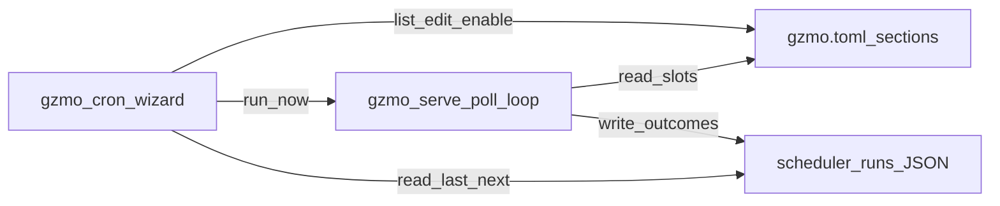

# Cron job wizard research — options for GZMO (Jul 2026)

Research date: 2026-07-17  
Question: How to easily manage cronjobs via a cron job wizard — what exists on the internet, and what fits GZMO?

## Sources

| Source | Role |
|--------|------|
| [CronTUI](https://github.com/meru143/crontui) / [merup.me/crontui](https://merup.me/crontui/) | Host crontab (+ Windows Task Scheduler) TUI + CLI |
| [lazycron](https://github.com/mc7h/lazycron) | Unified TUI for cron + systemd timers + launchd |
| [Cronboard](https://github.com/antoniorodr/Cronboard) | Textual TUI for local/remote crontabs |
| [RECATOOLS Cron Builder](https://recatools.com/cron-builder/) | Web visual builder → crontab / systemd / k8s / GHA |
| [systemd timers vs cron](https://unix.stackexchange.com/questions/278564/cron-vs-systemd-timers) | Trade-offs |
| [DEV: cron → systemd migration](https://dev.to/lyraalishaikh/cron-to-systemd-timers-a-practical-migration-guide-for-linux-5g2k) | Persistent timers, journald |
| GZMO `serve_cmd.rs`, `config.rs`, ADR-0003 | Living scheduler reality |
| [docs/AUTONOMOUS_CRON_IMPLEMENTATION.md](../AUTONOMOUS_CRON_IMPLEMENTATION.md) | Draft job ecosystem (not fully implemented) |

## Two different problems

| Problem | What “wizard” means | Fits GZMO? |
|---------|---------------------|------------|
| **A. Host OS schedules** | Edit `crontab` / systemd user timers / `gzmo-serve.service` | Secondary — only for “keep serve alive” |
| **B. App-level overnight jobs** | Edit dream/distill/promote/embed/spark/wiki times in TOML + see next run / enable / run-now | **Primary** — this is where operator pain is |

ADR-0003: living overnight authority is **`gzmo serve`**, not a zoo of host crontab lines and not `gzmo-scheduler` as the production brain.

Host crontab wizards (CronTUI, Cronboard) do **not** see or edit `[dreams].cron_hour` inside `gzmo.toml`. Using them as the “GZMO cron wizard” would fight the architecture.

## Internet landscape (host / general)

### CronTUI ([meru143/crontui](https://github.com/meru143/crontui))

- Bubble Tea TUI + CLI parity (`list`, `add`, `enable`, `preview`, `backup`, `export`).
- Live validation + next-run preview + schedule presets.
- Manages **system crontab** (and Windows Task Scheduler for its own folder).
- Best for: workstation script schedules, WSL crontab UX.
- **Not** a GZMO metabolism editor.

### lazycron ([mc7h/lazycron](https://github.com/mc7h/lazycron))

- Lazygit-inspired TUI over **cron + systemd timers + launchd**.
- Natural language → cron (“every day at 2am”).
- Run now, enable/disable (systemd), history heatmap from logs.
- Best for: operator who already uses `systemctl --user` timers.
- **Useful companion** for managing `gzmo-serve.service` / any user timers — still not TOML job fields.

### Cronboard ([antoniorodr/Cronboard](https://github.com/antoniorodr/Cronboard))

- Textual dashboard; local + SSH remote crontabs; pause/resume; path autocomplete.
- Best for: multi-host crontab ops.
- Same limitation vs GZMO app jobs.

### Web cron builders (e.g. RECATOOLS Cron Builder)

- Dropdown → expression; emit crontab / systemd OnCalendar / k8s CronJob / GHA.
- Best as a **helper** when authoring expressions, not as the control plane.

### systemd timers (pattern, not a product)

- Preferable to raw cron for **service** jobs: journald, `Persistent=true`, run-now via `systemctl start`, dependencies.
- Cost: two unit files + enable dance.
- GZMO already uses a **user systemd unit** for `gzmo serve`; internal jobs stay in-process.

## GZMO today (app-level)

| Surface | Role |
|---------|------|
| `gzmo serve` | 60s poll; UTC hour/minute slots; in-memory day dedupe; `scheduler-runs/` JSON |
| Config knobs | `[dreams]`, `[session_distill]`, `[metabolism]`, `[spark]`, `[wiki]`, plus lab-only ingest/KG/… |
| `gzmo metabolism` | Read-only TUI board — **no edit / enable / run-now** |
| `gzmo status` | Read-only overnight summary |
| Legacy `[[orchestration.jobs]]` | Six-field cron via daemon — mostly disabled |
| `gzmo-scheduler` | Lab/beat-gate — not living authority |

**Wizard gaps (from codebase map):** no unified job registry UI; edit = hand-edit TOML + restart; no durable next-run/retry state; config/runtime drift (fields that serve never honors); status omits full job set.

## Recommendation for GZMO

### Do this: native `gzmo cron` / Cron Wizard (app-level)

Build a **GZMO Cron Wizard** that manages the **canonical job registry** (TOML-backed, serve-owned), not host crontab.

**Wizard UX (minimum viable):**

1. **List** — all serve jobs (+ mark lab-only as non-editable or “lab”).
2. **Show** — schedule (human + next 3 UTC runs), enabled, last run from `scheduler-runs/`.
3. **Edit** — guided prompts: preset (nightly 01:00…) or hour/minute (and spark multi-hour); write TOML via existing persist helpers; warn “restart `gzmo-serve` to apply”.
4. **Enable / disable** — flip `enabled` / `daemon_scheduled` flags.
5. **Run now** — invoke the same typed job path serve uses (one-shot), without waiting for the slot.
6. **Preview** — next runs before save (pure calendar math; no crontab rewrite).

**Surfaces:**

- CLI: `gzmo cron` / `gzmo cron wizard` (interactive) + `gzmo cron list|set|enable|run`.
- TUI: extend `gzmo metabolism` board with edit keys, or a dedicated Cron Wizard panel in `--repl` Observatory.

**Non-goals for v1:**

- Editing host crontab / inventing parallel systemd timers per dream/spark job.
- Replacing ADR-0003 with `gzmo-scheduler` as production brain.
- Mass-importing AUTONOMOUS_CRON’s 12-job draft before GREEN metabolism holds.

### Optional companion: lazycron / CronTUI (host-level)

Install only if you want a pleasant UI for **user systemd timers** and ad-hoc host scripts. Keep a hard line: “host wizard ≠ GZMO job wizard.”

## Suggested architecture (wizard → config → serve)

Persist edits through a small `CronJobRegistry` in `gzmo-core` that:

- Enumerates known job ids (`dream`, `distill`, `promote`, `embed`, `spark`, `wiki_push`, …).
- Maps each id → config fields + runner.
- Validates schedules (UTC, no overlapping critical write windows if desired).
- Optionally writes a sidecar `data-next/cron-state.json` later (next-run, last-success) — draft AUTONOMOUS_CRON territory.

## Decision table

| Approach | Effort | Matches ADR-0003 | Easy for operator |
|----------|--------|------------------|-------------------|
| Install CronTUI / Cronboard only | Low | No | Easy for host; wrong for GZMO jobs |
| Install lazycron for systemd user timers | Low | Partial (serve unit only) | Good host companion |
| Native `gzmo cron` wizard over TOML + serve | Medium | Yes | Best long-term |
| Full AUTONOMOUS_CRON draft (12 jobs + state bus) | High | Only after GREEN | Overbuild now |

**Verdict:** Research says the valuable wizard for GZMO is **native app-level** (`gzmo cron` / metabolism board with edit), optionally **plus lazycron** for host systemd. Do not make host crontab the source of truth for dream/distill/spark.

## Next implementation slice (when approved)

1. `CronJobRegistry` in `gzmo-core` (read-only list + next-run preview first).
2. `gzmo cron list` / `gzmo cron preview`.
3. Interactive wizard: edit time → persist TOML → print restart hint.
4. `gzmo cron run <id>` one-shot.
5. Wire enable/disable + metabolism TUI keybindings.
