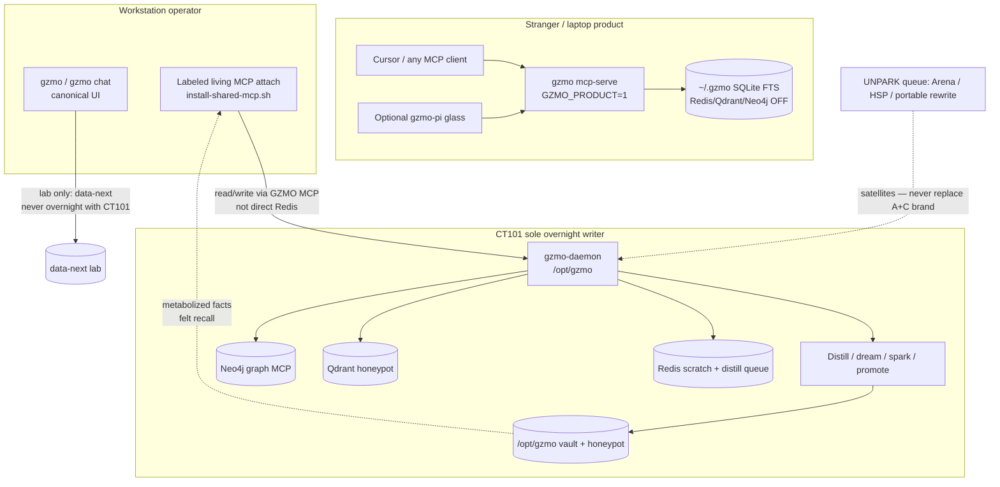

# CT101 living stack — future architecture (Jul 2026)

**Research date:** 2026-07-19  
**Question:** What should the future of the CT101 GZMO living stack be?  
**Axes considered:** (A) MCP as product surface · (B) Pi extensions as primary UX · (C) Fully preconfigured appliance · (D) Something completely different  
**Method:** Primary repo doctrine first; industry MCP memory stacks second; option scoring against demability, ops burden, uniqueness, and scars already lived.

---

## Executive thesis

**Operator lock (2026-07-19): co-primary goals are A + C.**

| Goal | Meaning |
|------|---------|
| **A** | Memory MCP as the stranger product surface (`~/.gzmo`, sidecars off) |
| **C** | Full living appliance: `gzmo` + Redis + Qdrant + Neo4j — preconfigured, demable, one overnight writer |

**B (Pi primary UX)** stays non-primary (optional glass). **D (Park zoo)** is no longer a freeze — it is the **Unpark queue** after A+C GREEN ([`UNPARK_ROADMAP.md`](../UNPARK_ROADMAP.md)); satellites must not replace A+C as the brand.

Boundary that makes A+C compatible: **A never requires C’s sidecars; C never becomes the stranger default install.** Product MCP and living appliance are two ship shapes, not one blurred home. Doctrine: [`docs/SPINE_FOCUS.md`](../SPINE_FOCUS.md).

---

## Operator decision (locked)

Recorded 2026-07-19 after futures research.

1. **Living attach audience:** Document a **labeled** living MCP profile for operators; strangers stay on A only.  
2. **Compose pin timing:** **Now on the Keep lane for C** — in-repo living sidecar compose that pins what CT101 already runs; do not wait for AOS CE.  
3. **Product metabolism ceiling:** A stays **FTS attach-only** by default (no overnight `gzmo serve` as product path) to protect ADR-0003 muscle memory.  
4. **localmem pressure:** Answer with better **A** install UX + metabolized demos; living felt-recall stays the uniqueness proof on **C**.  
5. **Wiki appliance:** Secondary to A+C; may follow once both stay green.  
6. **Prime / stranger bar:** A demable bar = MCP attach + status/search; first-fact/promote remains soft HOLD when no engine (existing gate).

---

## Current stack facts

### Two Keep pillars (non-negotiable)

| Pillar | Owner | Evidence |
|--------|-------|----------|
| Living overnight metabolism | CT101 `/opt/gzmo/` + `gzmo-daemon` | [`SPINE_FOCUS.md`](../SPINE_FOCUS.md), [`CT101_BOUNDARY.md`](../CT101_BOUNDARY.md), [`ADR-0003`](../ADR-0003-one-instance-metabolism.md) |
| Product Memory MCP | Laptop `~/.gzmo` + `gzmo mcp-serve` / `gzmo memory mcp` | [`PRODUCT_MCP.md`](../PRODUCT_MCP.md), [`STACK_OPPORTUNITY_MAP.md`](../STACK_OPPORTUNITY_MAP.md) m2 |

Identity sentence: honeypot + verify + promote — a distillation pipeline, not a chatbot with a vector attachment ([`CORE_INSIGHT.md`](../CORE_INSIGHT.md), [`UNIQUENESS_THESIS.md`](../UNIQUENESS_THESIS.md)).

### ADR-0003 / CT101 boundary

1. **One living instance only** — never two overnight writers ([`ADR-0003`](../ADR-0003-one-instance-metabolism.md)).
2. **Living host = CT101** (`gzmo-daemon` under `/opt/gzmo/`); workstation `data-next/` is lab scratch ([`CT101_BOUNDARY.md`](../CT101_BOUNDARY.md), [`CT101_DEPLOY.md`](../CT101_DEPLOY.md)).
3. **Product ≠ living vault** — attach rule: `GZMO_CONFIG=~/.gzmo/gzmo.toml` + `GZMO_PRODUCT=1`; never point laptop product MCP at CT101 `/opt/gzmo` or `data-next/` ([`PRODUCT_MCP.md`](../PRODUCT_MCP.md)).

### Product v1 non-goals (must stay non-goals)

From [`PRODUCT_MCP.md`](../PRODUCT_MCP.md):

- Multi-host living topology and operator discovery timers as install requirements
- Overnight dream/spark/distill as a required product install step
- Competing with Mem0 cloud “connect in minutes”

Default product home: SQLite + FTS; Redis / Qdrant / Neo4j **off** ([`PRODUCT_MCP.md`](../PRODUCT_MCP.md)).

### Pi is optional frontend

[`OPERATOR_FRONTEND_DECISION.md`](../OPERATOR_FRONTEND_DECISION.md): canonical operator UI is `gzmo` / `gzmo chat`. Pi may call `gzmo memory *` / MCP but must not own distill authority or invent parallel Redis/vault clients. [`PI_LIVING_STACK.md`](../PI_LIVING_STACK.md) recovers why “supreme Pi” broke: dual config (`settings.json` vs `mcp.json`), product-vs-living collision, path drift, upgrade fragility.

### Living topology (ops reality, not product packaging)

Steady-state ports ([`PORTS.md`](../PORTS.md)):

| Service | Role on living path |
|---------|---------------------|
| SQLite vault | SoT facts / honeypot |
| Redis `:6379` | Scratch + `gzmo:distill:pending` (**wired** — docs once lied; corrected in [`LOST_KNOWLEDGE_INVENTORY.md`](../LOST_KNOWLEDGE_INVENTORY.md) / [`PORTS.md`](../PORTS.md)) |
| Qdrant `:6333` | Vector `honeypot` collection |
| Neo4j `:7687` | Graph MCP (stdio), not required for product attach |
| Prime / retrieval | Cognition + embed/rerank (homelab split) |

**Evidence: GZMO does not ship a full `docker-compose` appliance in-tree.** Repo root has no compose file (verified 2026-07-19). Sidecar compose is an **ops template** referenced from CT101 systems docs (`swap/templates/database-cluster-compose.yml` → live `/opt/database-cluster/docker-compose.yml` on LXC101 — see [`CT101_INFRASTRUCTURE_REPORT.md`](../CT101_INFRASTRUCTURE_REPORT.md), [`ct101-systems/10-host-runtime/`](../ct101-systems/10-host-runtime/SYSTEM.md)). That is host ops, not a stranger one-curl product.

Opportunity map items that sound like appliances:

| Map item | Status in map | Honest read |
|----------|---------------|-------------|
| Memory MCP appliance (m2) | `near` · exists | **Ships today** as install script + `~/.gzmo` + MCP attach ([`PRODUCT_MCP.md`](../PRODUCT_MCP.md)) |
| Living wiki appliance (f1) | `near` · exists | Ship *shape* includes “Compose install” — **aspiration**, not a GZMO-root compose product |
| AOS Customer Edition (p1) | `later` · spike | Explicitly deferred until Keep pillars stay boring ([`STACK_OPPORTUNITY_MAP.md`](../STACK_OPPORTUNITY_MAP.md)) |

### Unpark after A+C GREEN (2026-07-19)

Arena / HSP / portable rewrite / AOS zoo move into the sequenced **Unpark queue** — strengthen Keep first, then ship satellites without making them the brand ([`UNPARK_ROADMAP.md`](../UNPARK_ROADMAP.md), [`SPINE_FOCUS.md`](../SPINE_FOCUS.md), [`STACK_OPPORTUNITY_MAP.md`](../STACK_OPPORTUNITY_MAP.md), [`PANTHEON_THEATER_PACKAGING_PARK.md`](../PANTHEON_THEATER_PACKAGING_PARK.md)). Discovery stays scout-vs-implement, not maximal inline implement ([`DISCOVERY_LIFECYCLE.md`](../DISCOVERY_LIFECYCLE.md)).

### Failure modes already seen

| Scar | What happened | Source |
|------|---------------|--------|
| Dual-writer cutover | Workstation briefly became living (2026-07-15); restored CT101 2026-07-17 | [`ADR-0003`](../ADR-0003-one-instance-metabolism.md), [`CT101_BOUNDARY.md`](../CT101_BOUNDARY.md) |
| Path drift | Hardcoded homes / `survey_GZMO` vs `/opt/gzmo/current` | [`PI_LIVING_STACK.md`](../PI_LIVING_STACK.md), [`CT101_DEPLOY.md`](../CT101_DEPLOY.md), [`PORTABILITY_REFACTORING.md`](../PORTABILITY_REFACTORING.md) |
| Pi upgrade break | Custom attach in agent home + wrappers, not stable API | [`PI_LIVING_STACK.md`](../PI_LIVING_STACK.md) |
| Product vs living collision | Same Pi home pointing at empty `~/.gzmo` while believing CT101 | [`PI_LIVING_STACK.md`](../PI_LIVING_STACK.md) |
| Redis “not wired” lie | Docs claimed Redis unwired while living path used it | [`LOST_KNOWLEDGE_INVENTORY.md`](../LOST_KNOWLEDGE_INVENTORY.md), [`PORTS.md`](../PORTS.md) |

---

## Industry contrast

External memory MCP products optimize for **attach latency and cross-client recall**. GZMO’s Keep claim is **overnight curated metabolism** (distill → honeypot → promote → felt recall). Overlap on MCP as transport does not erase the identity gap ([`UNIQUENESS_THESIS.md`](../UNIQUENESS_THESIS.md), [`PRODUCT_MCP.md`](../PRODUCT_MCP.md)).

| Project | Primary source | Optimizes for | vs GZMO metabolism |
|---------|----------------|---------------|--------------------|
| **Mem0 OpenMemory MCP** | [Introducing OpenMemory MCP](https://mem0.ai/blog/introducing-openmemory-mcp); [State of AI Agent Memory 2026](https://mem0.ai/blog/state-of-ai-agent-memory-2026); [OpenMemory product](https://mem0.ai/openmemory) | Local-first MCP memory across Cursor/Claude/Windsurf; add/search/list/delete; optional Docker + Postgres + Qdrant path | Commodity “remember across tools.” No honeypot verify/promote overnight compiler; PRODUCT_MCP explicitly declines Mem0 cloud race |
| **MemoryMCP (gashel01)** | [github.com/gashel01/memorymcp](https://github.com/gashel01/memorymcp) | Tiered cognitive memory (facts/episodes), decay/consolidation, pluggable Redis/SQLite/Neo4j/pgvector, 16 MCP tools | Closer *vocabulary* (decay, backends) but library/MCP product — not a living daemon + CT101 one-writer doctrine |
| **memorium** | [pypi.org/project/memorium](https://pypi.org/project/memorium/) | `uvx memorium` MCP: remember/search/retrieve; auto-extract; local DB | Stranger demability via PyPI — store/retrieve loop, not distill→honeypot nights |
| **localmem** | [localmem.org](https://localmem.org/); [npm localmem-mcp](https://www.npmjs.com/package/localmem-mcp) | One Rust binary + event log (`events.jsonl`); hybrid recall; one-command client wire; LongMemEval-oriented | Strong competitor on **stranger demability** and portable file SoT. Still not GZMO’s overnight honeypot metabolism + ADR-0003 living host |
| **Qdrant + Neo4j MCP stacks** | e.g. [BjornMelin/qdrant-neo4j-crawl4ai-mcp](https://github.com/bjornmelin/qdrant-neo4j-crawl4ai-mcp); [yoyoerx/engram](https://github.com/yoyoerx/engram); [forgetmenot](https://github.com/djroxx2000/forgetmenot) | Compose up vectors+graph; hybrid RAG/MCP tools | Same **sidecar shape** CT101 already runs as ops — but identity is retrieval appliance, not GZMO’s extract→verify→promote pipeline |

**Industry lesson for GZMO:** the market will keep winning on “MCP memory in five minutes.” GZMO should not try to out-Mem0 Mem0. It should win on **metabolized overnight memory you can feel**, with MCP as the attach port for that curated vault ([`STACK_OPPORTUNITY_MAP.md`](../STACK_OPPORTUNITY_MAP.md) felt-recall + m2).

---

## Option evaluation

Scoring axes: stranger demability · ops burden · uniqueness (metabolism vs commodity RAG MCP) · scar risk (path drift, Pi break, dual-writer, Redis honesty).

### A) MCP server as the product surface (laptop + living attach)

| Axis | Score | Notes |
|------|-------|-------|
| Demability | **High** | `install-gzmo.sh` → `product-stranger-path` / `mcp-attach-check` ([`SPINE_FOCUS.md`](../SPINE_FOCUS.md), [`PRODUCT_MCP.md`](../PRODUCT_MCP.md)) |
| Ops burden | **Low** (product) / **medium** (living attach scripts) | Product is SQLite-only; living uses `install-shared-mcp.sh` ([`PI_LIVING_STACK.md`](../PI_LIVING_STACK.md)) |
| Uniqueness | **High if metabolism behind it** | MCP alone is commodity; metabolized vault is not ([`UNIQUENESS_THESIS.md`](../UNIQUENESS_THESIS.md)) |
| Scar risk | **Medium** | Product↔living collision if attach labels blur ([`PI_LIVING_STACK.md`](../PI_LIVING_STACK.md)) |

**Verdict:** **Primary product thesis.** Matches Keep pillars and v1 non-goals.

### B) Pi extensions as primary UX

| Axis | Score | Notes |
|------|-------|-------|
| Demability | Medium for Pi users; **low for strangers** | Pi package path exists ([`PRODUCT_MCP.md`](../PRODUCT_MCP.md)) but Pi upgrades break custom attach ([`PI_LIVING_STACK.md`](../PI_LIVING_STACK.md)) |
| Ops burden | **High** | Dual config, path drift, package double-list |
| Uniqueness | Low | Frontend theater, not metabolism |
| Scar risk | **Very high** | Explicitly demoted by [`OPERATOR_FRONTEND_DECISION.md`](../OPERATOR_FRONTEND_DECISION.md) |

**Verdict:** **Refuse as primary.** Keep as optional auxiliary + upgrade runbook discipline.

### C) Fully preconfigured appliance: gzmo + Redis + Qdrant + Neo4j

| Axis | Score | Notes |
|------|-------|-------|
| Demability | High *if* it existed as one-curl | Industry peers already ship this ([OpenMemory compose](https://mem0.ai/blog/how-to-make-your-clients-more-context-aware-with-openmemory-mcp), Engram, etc.) |
| Ops burden | **High** | Homelab ports, secrets, dual-writer temptation |
| Uniqueness | Medium→low | Sidecar stack is commodity; metabolism is not |
| Scar risk | High if sold as product v1 | Violates PRODUCT_MCP non-goals (multi-host living, overnight required); invents a compose product GZMO **does not ship today** |

**Verdict:** **Later living-ops packaging only** — document/pin the existing CT101 sidecar compose + daemon, never make Redis/Neo4j/Qdrant required for stranger `~/.gzmo`. Do not claim a full GZMO-root appliance exists until an in-repo compose + gate ships.

### D) Something completely different

Candidates already in the map (Arena energy, HSP sonification, portable rewrite, Cognis, edge fleet) are **Park/Later** satellites ([`STACK_OPPORTUNITY_MAP.md`](../STACK_OPPORTUNITY_MAP.md)). Choosing them as the CT101 future repeats the zoo that [`SPINE_FOCUS.md`](../SPINE_FOCUS.md) killed.

**Verdict:** **Refuse as primary.** Nightburst spikes allowed; not the brand.

---

## Recommended future (post operator lock)

### Co-primary thesis (restated)

**A = stranger Memory MCP. C = living Redis/Qdrant/Neo4j appliance around one overnight writer. Never merge the homes.**

### Near (now → weeks): A green + C compose pin

1. Keep **PRODUCT GREEN** (A) — `scripts/product-readiness-gate.sh`, stranger path, attach check.  
2. Keep **LIVING GREEN** — `scripts/living-readiness-gate.sh`, takeaway→recall, dual-writer probe.  
3. **Ship in-repo living appliance compose (C)** — pin Redis/Qdrant/Neo4j (+ config sketch) matching CT101 `/opt/database-cluster` + `gzmo-daemon`; gate script that proves sidecars Up without claiming stranger product.  
4. Harden **labeled profiles**: `gzmo-memory` (A) vs `gzmo-living` (C attach).  
5. Release hygiene for A — tagged `install-gzmo.sh`.

### Mid: C demable + living attach polish

1. One-command living appliance bring-up (compose + binary path + `GZMO_CONFIG`) for a clean host / CT101 restore.  
2. Pi upgrade runbook only — no UX parity ([`OPERATOR_FRONTEND_DECISION.md`](../OPERATOR_FRONTEND_DECISION.md)).  
3. Discovery stays scout + human drain ([`DISCOVERY_LIFECYCLE.md`](../DISCOVERY_LIFECYCLE.md)).

### Later (after A+C stay boring)

1. Wiki / Observatory demable mind.  
2. AOS CE / broader one-curl sovereign stack (Prime + OKForge) — **on top of** C, not instead of it.

### Recommended end-state topology

---

## Refusal list

Do **not**:

1. Make **Pi the primary UX** or invest in Pi MCP parity as a product gate ([`OPERATOR_FRONTEND_DECISION.md`](../OPERATOR_FRONTEND_DECISION.md)).
2. Run **two overnight writers** (workstation `gzmo serve` + CT101 daemon) ([`ADR-0003`](../ADR-0003-one-instance-metabolism.md)).
3. Point **product MCP** at CT101 `/opt/gzmo` or `data-next/` ([`PRODUCT_MCP.md`](../PRODUCT_MCP.md)).
4. Require **Redis / Qdrant / Neo4j / overnight distill** for stranger product install ([`PRODUCT_MCP.md`](../PRODUCT_MCP.md) non-goals).
5. Claim GZMO already ships a **full compose one-box appliance** before the in-repo pin lands — C is a Keep *goal*, not yet a shipped artifact ([`LIVING_APPLIANCE.md`](../LIVING_APPLIANCE.md)).
6. Unpark **Arena / HSP / portable rewrite / AOS zoo / pantheon feat code** as the CT101 future ([`SPINE_FOCUS.md`](../SPINE_FOCUS.md), [`PANTHEON_THEATER_PACKAGING_PARK.md`](../PANTHEON_THEATER_PACKAGING_PARK.md)).
7. Compete on Mem0’s “connect in minutes” cloud story ([`PRODUCT_MCP.md`](../PRODUCT_MCP.md), [Mem0 State of Memory 2026](https://mem0.ai/blog/state-of-ai-agent-memory-2026)).
8. Revive **inline discovery implement** as the health KPI ([`DISCOVERY_LIFECYCLE.md`](../DISCOVERY_LIFECYCLE.md)).
9. Big-bang **gzmo-core portable rewrite** while nights are still proving ([`STACK_OPPORTUNITY_MAP.md`](../STACK_OPPORTUNITY_MAP.md) p3 / “What not to spawn yet”).
10. Reintroduce the Redis “not wired” narrative — Redis **is** wired on living ([`PORTS.md`](../PORTS.md)).

---

## Open questions

**Resolved** — see [Operator decision (locked)](#operator-decision-locked) above.

---

## Sources (index)

### Repo (primary)

- [`docs/SPINE_FOCUS.md`](../SPINE_FOCUS.md)
- [`docs/STACK_OPPORTUNITY_MAP.md`](../STACK_OPPORTUNITY_MAP.md)
- [`docs/ADR-0003-one-instance-metabolism.md`](../ADR-0003-one-instance-metabolism.md)
- [`docs/CT101_BOUNDARY.md`](../CT101_BOUNDARY.md)
- [`docs/CT101_DEPLOY.md`](../CT101_DEPLOY.md)
- [`docs/PRODUCT_MCP.md`](../PRODUCT_MCP.md)
- [`docs/OPERATOR_FRONTEND_DECISION.md`](../OPERATOR_FRONTEND_DECISION.md)
- [`docs/PI_LIVING_STACK.md`](../PI_LIVING_STACK.md)
- [`docs/PORTS.md`](../PORTS.md)
- [`docs/DISCOVERY_LIFECYCLE.md`](../DISCOVERY_LIFECYCLE.md)
- [`docs/CORE_INSIGHT.md`](../CORE_INSIGHT.md)
- [`docs/UNIQUENESS_THESIS.md`](../UNIQUENESS_THESIS.md)
- [`docs/LOST_KNOWLEDGE_INVENTORY.md`](../LOST_KNOWLEDGE_INVENTORY.md)
- [`docs/PORTABILITY_REFACTORING.md`](../PORTABILITY_REFACTORING.md)
- [`docs/PANTHEON_THEATER_PACKAGING_PARK.md`](../PANTHEON_THEATER_PACKAGING_PARK.md)

### External (primary URLs)

- https://mem0.ai/blog/introducing-openmemory-mcp
- https://mem0.ai/blog/state-of-ai-agent-memory-2026
- https://mem0.ai/openmemory
- https://mem0.ai/blog/how-to-make-your-clients-more-context-aware-with-openmemory-mcp
- https://github.com/gashel01/memorymcp
- https://pypi.org/project/memorium/
- https://localmem.org/
- https://github.com/bjornmelin/qdrant-neo4j-crawl4ai-mcp
- https://github.com/yoyoerx/engram
