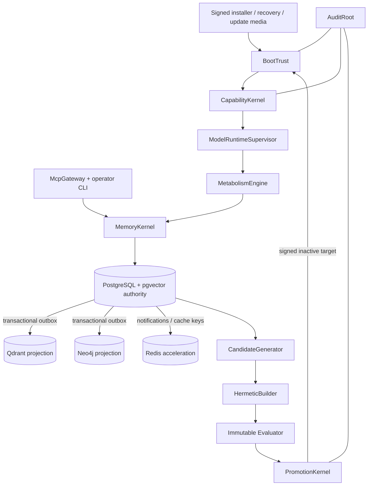

# Self-developing Living Database — North Star Design

**Date:** 2026-08-31  
**Status:** Architecture approved; written specification awaiting operator review  
**Scope:** Product architecture and ADR migration. This document is not an implementation plan.

## 1. Decision

GZMO becomes a **Self-developing Living Database**: an air-gapped appliance that is complete on one physical edge node, discovers and qualifies its hardware and local models, maintains evidence-grounded memory, and develops candidate improvements without acquiring authority over its own production safeguards.

The product uses a **Constitutional Spine**:

- a small immutable trust plane controls boot, capability policy, promotion, audit integrity, and rollback;
- a mutable Living runtime owns memory, cognition, model serving, and the agent-facing MCP interface;
- PostgreSQL with pgvector is the sole durable authority;
- Qdrant, Neo4j, and Redis remain mandatory performance accelerators for a fully qualified Living profile, but are derived, versioned, rebuildable, and correctness-neutral;
- an isolated candidate plane may generate and evaluate changes but cannot authorize or install them;
- memory evolution is autonomous, bounded tunables may self-promote inside operator-signed envelopes, and code/schema/model/security/capability changes require an operator signature.

The initial release-reference target is NVIDIA Jetson AGX Thor 128 GB. Jetson AGX Orin 64 GB is the minimum full-Living target. Raspberry Pi and Jetson Orin Nano are scout targets, not a second or reduced product.

## 2. Problem

Current GZMO contains the right product insight—verify and promote memories into a living, air-gapped Keep—but its implementation and decisions accumulated around changing topologies:

- SQLite is authoritative while Qdrant and Neo4j hold asynchronously updated views.
- Redis is used for fast scratch and queues despite not being durable.
- daemon and serve paths overlap.
- model selection depends on host-specific scripts and filenames.
- quality gates report important properties but do not establish a complete evolution authority model.
- ADR-0003–0010 mix invariants, topology, product positioning, research, and implementation plans.
- active documents depend on ADR-0001/0002 from an inaccessible sibling repository.

The North Star must preserve GZMO’s memory domain knowledge while replacing accidental operational complexity with explicit authority, measurable adaptation, and deterministic recovery.

## 3. Domain language

### Self-developing Living Database

A single-node system that observes real outcomes, improves memory autonomously, evaluates system-change candidates in isolation, and promotes changes only within explicit authority.

### Constitutional Spine

The immutable trust plane that verifies boot and artifacts, compiles allowed capabilities, protects evaluation policy, authorizes production promotion, anchors audit history, and performs rollback. The mutable agent cannot write this plane.

### Living

A node that has passed all mandatory trust, hardware, model, storage, memory, and recovery floors. “Degraded” is a runtime state of a previously qualified Living node, not a separate SKU.

### Scout

A bootable development/recovery target that cannot satisfy all Living roles. Pi-class and 8 GB devices may be Scouts. They must never be marketed or reported as a reduced Living product.

### Capability envelope

An operator-signed set of tunable keys, value ranges, resource budgets, required evidence, and expiry. The system may optimize within it but cannot widen it.

### Candidate

An untrusted proposed change to code, schema, models, runtime, security policy, evaluator, or configuration. A candidate has no production authority.

### Projection

A rebuildable representation derived from authoritative PostgreSQL state. Qdrant vectors, Neo4j graph data, Redis caches, and wiki exports are projections or ephemeral acceleration—not truth.

## 4. Constitutional invariants

These are conjunctive hard floors. No score or performance gain may compensate for violating one.

1. **One physical node.** Each installation is complete without a cloud service, remote inference host, or second database host. Local containers are allowed.
2. **One authoritative writer.** One owner runtime mediates all durable state transitions. Other processes submit intents or consume committed events.
3. **Runtime airgap.** Core boot, search, recall, extract, verify, promote, consolidate, evolve, evaluate, and recover paths require no public network.
4. **Evidence before memory.** Assertions reach durable memory only through extraction, verification, evidence binding, lifecycle classification, and promotion.
5. **No self-issued authority.** Candidates cannot modify or sign their evaluator, fitness floors, trust roots, capability envelopes, promotion verifier, audit root, or last-known-good state.
6. **Operator authority for high-blast changes.** Code, schemas, model binaries, security policy, and capability expansion require a detached operator signature.
7. **Reversible production changes.** Every production update has a verified last-known-good target and an exercised rollback path.
8. **Honest capability.** Missing hardware, model, trust, or accelerator capability is explicit. The appliance never silently falls back to cloud or claims a profile it did not qualify.
9. **Audit continuity.** Every candidate, evaluation, promotion, rejection, envelope change, slot change, and rollback is append-only and integrity-linked.
10. **One product.** Scout and degraded states do not create Lite editions or independent brains.

## 5. Hardware capability ladder

Hardware claims are earned by measured qualification. Model names, advertised TOPS, RAM size, or SKU alone never establish a profile.

| Profile | Reference hardware | Required behavior |
|---|---|---|
| **Scout — not product** | Raspberry Pi 5 16 GB or Jetson Orin Nano 8 GB with NVMe | Boot/recovery, inventory, storage/search, and bounded experiments. Cannot claim Living unless every Living role passes. |
| **Living-Min** | Jetson AGX Orin 64 GB class | Local embedding, reranking, extract/verify, conversation, overnight metabolism, encrypted durable state, one writer, full accelerator stack, and explicit degradation. Code-candidate generation is optional. |
| **Living-Reference** | Jetson AGX Thor 128 GB | Release qualification target. Adds local code-candidate generation, isolated evaluation headroom, complete telemetry, and the full staged-autonomy loop. |
| **Forge / portability** | x86-64, at least 128 GB host RAM, one CUDA GPU with at least 24–32 GB VRAM | High-throughput candidate evaluation and proof that stable interfaces are not ARM-only. Still one physical node. |

AGX Thor is provisional until real qualification proves firmware trust, offline JetPack/runtime packaging, storage endurance, thermals, role quality, throughput, and energy floors. AGX Orin 64 GB is the fallback full-Living reference. DGX Spark and 96–128 GB Strix Halo remain evidence-backed alternatives, not release targets.

Every release exercises the reference node and a CPU fallback path. Numeric performance/resource thresholds are signed profile policy produced by qualification; they are not hard-coded assumptions in product logic and cannot be lowered by the agent.

## 6. Boot, trust, and persistent layout

### 6.1 Portable media

Portable media is a signed **installer, recovery environment, and offline update courier**.

A single medium may contain separate ARM64 and x86-64 boot payloads. It is not one cross-architecture kernel or executable image. Firmware chooses the native payload; each installed appliance is architecture-specific.

Portable media contains public trust roots and signed metadata. It never contains the sole copy of operator root keys, recovery keys, or living state. Arbitrary hot-plug autorun on an unenrolled operating system is forbidden.

### 6.2 Installed layout

The internal NVMe contains:

- immutable measured `system-A` and `system-B` slots;
- encrypted `data` for PostgreSQL authority and audit;
- encrypted content-addressed `models`;
- encrypted, quota-bound, wipeable `candidates`;
- last-known-good state snapshots and restore receipts.

Durable data and audit survive OS rollback. Model and system artifacts are referred to by digest from authoritative records; binaries do not live inside database rows.

### 6.3 BootTrust interface

`BootTrust` is a small stable seam with platform-specific adapters for generic UEFI/x86 and NVIDIA Jetson:

- `verify_boot`
- `unlock_state`
- `stage_bundle`
- `activate_inactive`
- `mark_success`
- `rollback`

Implementations must provide Secure/Measured Boot, immutable image verification, inactive-slot updates, automatic boot assessment, and last-known-good fallback. Generic UEFI may use UKI, dm-verity or composefs, systemd-repart/sysupdate, and TPM2-bound LUKS2. Jetson uses its vendor boot and security chain while satisfying the same interface.

TPM/fTPM unlock always has a separately stored recovery key. Hardware that lacks the selected trust roots is a reduced-assurance Scout and cannot silently claim Living.

### 6.4 Offline updates

A TUF-shaped trust model uses role-separated, threshold-capable metadata:

- offline root establishes trust and delegates roles;
- signed targets bind artifact digest, purpose, compatible profile, and authorization class;
- snapshot metadata prevents mix-and-match;
- version and expiry plus a local monotonic watermark prevent rollback and freeze.

A verified bundle stages only into an inactive target. Hard health checks run before success is marked. Failure restores the prior signed slot automatically. Break-glass recovery remains signed and audited.

## 7. Constitutional Spine architecture



### 7.1 Trusted modules

- **BootTrust** verifies and changes system slots and unlocks state.
- **CapabilityKernel** converts measured hardware plus signed policy/catalog into a qualified runtime plan.
- **PromotionKernel** verifies signed authority and evidence before binding a candidate to production.
- **AuditRoot** protects monotonic, hash-linked history and operator-signed checkpoints.

These modules are immutable from the candidate plane. Their interfaces are smaller than their implementations and are the primary security/test seams.

### 7.2 Living runtime modules

- **MemoryKernel** exposes enqueue, commit-verified-memory, recall-under-consistency-policy, record-outcome, and status. It hides all database/projection choreography.
- **MetabolismEngine** schedules ingest, distill, verify, promote, embed, dream, spark, ripen, reconciliation, and maintenance through MemoryKernel; it never bypasses authority.
- **ModelRuntimeSupervisor** starts only role-qualified local models and publishes their actual capability/degradation state.
- **McpGateway** is the sole agent-facing product interface. The operator CLI controls install, inspect, update, sign, recover, and diagnose workflows.

### 7.3 Candidate plane

- **CandidateGenerator** proposes bounded changes from immutable observation snapshots.
- **HermeticBuilder** builds without network, production credentials, raw storage, trust keys, or mutable production mounts.
- **Evaluator** runs signed public and private suites against cloned/synthetic state. Candidate code cannot alter evaluator binaries, fixtures, or scoring policy.

## 8. Hardware discovery and local model selection

The stable pipeline is:

```text
BootDiscovery
  → Hardware Inventory Record (HIR)
  → CapabilityCompiler(HIR, signed appliance policy)
  → Capability Manifest (CM)
  → ModelSelector(CM, signed offline catalog)
  → cold role qualification
  → pinned Qualification Record
  → RuntimeSupervisor
```

HIR records firmware and driver facts, ISA, available RAM/VRAM, storage, device identities, backend binary probes, thermals, and available power/energy telemetry. Marketing labels are not capabilities.

The CM records enabled and explicitly unavailable backends, memory/context budgets, energy meters, profile claim, required roles, and policy-envelope signature.

Every model-catalog entry binds:

- artifact digest and signature;
- license and permission to redistribute on media;
- architecture, runtime, backend, and quantization compatibility;
- memory/context estimates;
- task role;
- qualification suite and hard floor;
- minimum capability profile;
- explicit degradation peer.

Roles are independent contracts: `embed`, `rerank`, `extract_verify`, `conversational`, and `code_candidate`. Sharing weights never waives independent qualification. Embedding dimensionality is a durable-store contract; changing it requires an operator-signed reindex and requalification.

The default runtime family is pinned llama.cpp/GGUF across CPU, CUDA, and qualified Vulkan/HIP backends. Vendor-specific runtimes are optional accelerator lanes proven by the CM. Selection uses a static compatibility/resource filter followed by mandatory cold qualification. Continuous quality/energy routing may select only among previously qualified pins inside a signed tunable envelope.

No qualified `extract_verify` model means no overnight writer and no Living claim. Missing embed becomes explicit FTS-only recall. Hash, signature, license, runtime, or resource failure rejects the artifact. No cloud fallback exists.

## 9. Authoritative full-stack data plane

### 9.1 Ownership

PostgreSQL 16 with pgvector is the sole durable authority for:

- facts, quarantine, evidence, and bi-temporal supersession;
- utility and outcome observations;
- durable ingest and work claims;
- entities and relations;
- model qualifications and active pins;
- candidates, evaluations, promotions, and rollbacks;
- energy and resource observations;
- transactional outbox and hash-linked audit events.

PostgreSQL FTS and pgvector form the complete correctness fallback. Exact vector search is the baseline. HNSW is enabled only when measured corpus/latency evidence justifies it.

Qdrant is the high-throughput vector projection. Neo4j is the graph-reasoning projection. Redis is hot cache, scratch, and queue notification/acceleration. All three are mandatory for a fully qualified Living profile, but none owns durable truth or accepts direct product writes.

### 9.2 Consistency

The one owner commits domain changes and monotonic outbox events in the same PostgreSQL transaction. Projection workers consume at least once and apply idempotently. Each projected record carries authoritative entity version, event sequence, and source digest.

Each projection publishes a durable watermark. A fast read may use a projection only when its consistency policy accepts that watermark. Otherwise it falls back to PostgreSQL. Every Qdrant or Neo4j result is revalidated against PostgreSQL validity, evidence, and authorization before recall.

Reconciliation compares IDs, versions, and digests—not aggregate counts. Qdrant, Neo4j, and Redis can be discarded and rebuilt from a PostgreSQL snapshot and ordered outbox. Their snapshots may speed recovery but are never required for correctness.

### 9.3 Write and read paths

```text
input
→ PostgreSQL durable queue
→ extract
→ verify
→ one transaction: facts + evidence + lifecycle + outbox + audit
→ idempotent Qdrant / Neo4j / Redis projection
→ watermarks
```

```text
query
→ PostgreSQL FTS + pgvector
→ fresh Qdrant ANN + Neo4j graph candidates in parallel
→ fuse / rerank / utility select
→ PostgreSQL revalidation
→ cited result + freshness metadata
→ outcome observation
```

Redis may wake workers and cache immutable result fragments keyed by authoritative versions. Durable claims remain in PostgreSQL.

## 10. Constitutional self-development

The control loop is:

```text
Observe → Hypothesize → Build → Evaluate → Archive
                                      │
                         bounded tunable or signed artifact
                                      ▼
                              Promote → Soak
                                      ▼
                               Keep | Roll back
```

### Authority tiers

| Tier | Scope | Production authority |
|---|---|---|
| **M — Memory** | Verified facts, evidence, supersession, consolidation, derived indexes, outcome learning | Autonomous within fixed memory floors |
| **T — Tunables** | Signed allowlisted numeric/enum parameters | Autonomous only inside the envelope after shadow evaluation and all hard floors |
| **C — Candidates** | Code, schemas, models, runtimes, security/evaluator changes | Generate/build/evaluate only; no production authority |
| **P — Promotion** | Bind approved artifact to inactive production target | Operator signature over artifact, evaluation, policy, target, and expiry |
| **A — Authority** | Roots, floors, evaluators, envelopes, allowed capabilities | Operator-only, out of agent write set |

Production, builder, evaluator, audit sink, and promoter use separate OS identities or equivalent capability domains. The proposing process cannot score authoritatively, sign, widen its envelope, mark success, remove last-known-good, or rewrite audit.

One-node canarying uses deterministic replay, shadow evaluation, and time-bounded live soak. The candidate is compared with last-known-good on private hold-outs and captured real workloads. A code/image candidate writes only an inactive system slot. A schema candidate uses an isolated PostgreSQL clone, signed backup receipt, compatibility test, and paired rollback plan.

## 11. Fitness constitution

Promotion first evaluates hard floors as a conjunction:

- evidence and faithfulness;
- one-writer integrity;
- runtime airgap and artifact provenance;
- no capability escalation;
- storage integrity and projection correctness;
- bounded CPU, memory, disk, thermal, and energy use;
- audit continuity;
- demonstrated rollback and last-known-good availability.

Any hard-floor failure rejects the candidate. Only then may the system compare:

- real-use task success and useful recall;
- contradiction/supersession correctness;
- consolidation yield;
- retrieval quality;
- latency and throughput;
- joules per useful operation;
- unattended recovery and operator burden.

Metrics, fixtures, and evaluators are signed immutable inputs. A candidate cannot change them in the same proposal. Evolving the evaluator or constitution is an Authority-tier proposal requiring separate operator review.

## 12. Threat model

The trust model has nested zones:

1. operator ceremony and offline roots;
2. firmware, Secure/Measured Boot, and TPM;
3. immutable system and signed runtime;
4. encrypted durable state and audit;
5. untrusted ingest;
6. candidate sandbox;
7. least-privilege recall/MCP surface.

Untrusted content crosses into durable memory only through verify and honeypot gates. Candidate artifacts cross into system/state only through signed promotion. Runtime processes never hold offline root keys.

Offline media is treated as hostile transport. Signatures, target hashes/sizes, complete snapshots, expiry/version, and monotonic last-seen watermarks defend against substitution, rollback, freeze, and mix-and-match. Models and adapters are signed and bound to exact base/runtime digests; unsafe executable loaders and unknown/non-permitted licenses fail closed.

Prompt injection and model backdoors cannot be eliminated. The design bounds their impact with provenance, quarantine, least privilege, immutable evaluators, no production credentials in candidate/ingest zones, resource caps, and operator control over authority expansion.

Recovery assumes separately stored known-good boot media, recovery keys, and root-key material. Suspected root compromise halts metabolism, re-establishes identity from known-good media, restores verified PostgreSQL state, and rebuilds every accelerator.

## 13. Failure and degradation

### Fail closed

The node loses its Living claim and exposes status/recovery only when:

- boot, catalog, bundle, or audit integrity fails;
- PostgreSQL authority is unavailable or corrupt;
- another writer owns the state;
- no qualified local `extract_verify` model exists;
- production and last-known-good cannot be distinguished;
- candidate isolation or authority separation fails;
- any non-compensable floor fails.

### Explicit degradation

| Failure | Behavior |
|---|---|
| Qdrant stale/down | PostgreSQL FTS+pgvector; schedule projection rebuild |
| Neo4j stale/down | PostgreSQL entity/relation queries; schedule rebuild |
| Redis down | PostgreSQL durable queue and bounded process cache |
| Reranker down | Preserve fused ranking; report `degraded.no_rerank` |
| Embed unavailable | FTS-only recall; pause vector projection |
| Code-candidate role unavailable | Living memory continues; code evolution unavailable |
| Thermal/resource pressure | Stop candidate work first, then defer heavy metabolism; preserve recall and owner |

Every status and relevant result includes capability state and projection freshness. The agent cannot acknowledge or suppress its own failure state.

## 14. Operator experience

Installation is: boot signed media, select the destructive target disk, enroll identity/recovery, inspect proposed capability profile, approve, then let qualification and provisioning run automatically.

The product state machine is:

```text
INSTALLING
→ DISCOVERING
→ QUALIFYING
→ LIVING
↔ DEGRADED
→ EVOLVING
→ PROMOTION_PENDING
→ SOAKING
→ LIVING | ROLLED_BACK
→ RECOVERY_REQUIRED
```

`gzmo status` and `gzmo_memory_status` expose one consistent view:

- boot slot and trust verdict;
- hardware profile and resource headroom;
- selected model per role and qualification digest;
- PostgreSQL authority and one-writer state;
- projection watermarks, lag, and rebuild progress;
- active degradation and exact capability loss;
- last metabolism and evolution outcomes;
- pending candidate and required authority;
- last-known-good and recovery readiness.

The operator never needs to reason about database ports, container topology, or cron scripts during normal use. A future dashboard may consume this interface but is not part of correctness.

## 15. Verification

Release qualification must exercise observable behavior through module interfaces:

1. **Boot/trust:** clean install, tampered image/catalog rejection, wrong-architecture refusal, PCR mismatch recovery, interrupted update, and automatic failed-slot rollback.
2. **Capability:** Thor reference plus CPU fallback; independent role qualification; explicit unsupported roles; no behavior change when networking is physically absent.
3. **Memory:** evidence-linked promotion, lifecycle transitions, bi-temporal reads, forget/purge, utility learning, durable queue, and outbox atomicity.
4. **Projection chaos:** kill, corrupt, lag, and rebuild Qdrant, Neo4j, and Redis independently; PostgreSQL fallback remains correct.
5. **Evolution:** attempt network access, production write, evaluator modification, key access, envelope widening, audit deletion, and false success marking from a candidate; all fail structurally.
6. **Recovery:** power loss during ingest/update/projection, PostgreSQL restore, complete projection rebuild, bad tunable restore, schema-candidate rollback, and lost TPM recovery-key path.
7. **Fitness:** candidate-vs-baseline comparison on private hold-outs and captured real workloads; all hard floors plus explicit quality, latency, energy, and resource deltas.
8. **Soak:** at least one complete metabolism/evolution cycle under signed release policy before promotion is eligible.

Profile-specific numeric thresholds live in signed policy produced by qualification. A release cannot claim a profile until those values exist and pass; the agent cannot lower them.

## 16. Current GZMO reuse and clean cutover

### Reuse

- verification and honeypot qualification semantics;
- duplicate/extend/contradict lifecycle and supersession chains;
- evidence localization and provenance behavior;
- RRF, reranking, utility/felt-use, and ripen domain behavior;
- one-writer and local MCP semantics;
- existing behavior-focused tests, corpora, and quality-gate evidence.

### Replace or delete

- SQLite as production authority;
- `VaultBackend` and dead `QdrantVault` paths;
- direct Qdrant/Neo4j writes and count-ratio-only drift checks;
- Redis-owned durable queue assumptions;
- duplicate `serve`/`daemon` owner and scheduler behavior;
- hard-coded model filenames and GPU thresholds in boot scripts;
- legacy Lite/product paths and inaccessible LTL ADR dependencies;
- scripts that duplicate core scheduler, health, trust, promotion, or recovery logic. Thin operator adapters may remain.

Cutover has no permanent compatibility product and no dual authoritative write. Import SQLite offline, validate rows/evidence/chains, acquire the one-writer claim, atomically switch authority, and retain the source SQLite database as a signed read-only archive until the acceptance policy expires.

## 17. ADR migration

Create `docs/ADR-INDEX.md` with separate decision and implementation states, explicit authority order, and a full lineage table. Record that ADR-0001/0002 were never issued in GZMO; their inaccessible sibling-repository links are non-authoritative.

Create four focused records:

1. **ADR-0011 — Self-developing Living Database Constitution**
2. **ADR-0012 — Hardware-adaptive immutable appliance**
3. **ADR-0013 — Authoritative full-stack data plane**
4. **ADR-0014 — Constitutional evolution and promotion**

Existing disposition:

| ADR | Disposition |
|---|---|
| 0003 | Superseded by 0011; one-writer invariant retained |
| 0004 | Superseded by 0011; airgap/one-box invariant retained |
| 0005 | Superseded by 0014; continuous improvement retained under capability envelopes |
| 0006 | Accepted/Implemented for current runtime until target successor ships |
| 0007 | Superseded by 0011; one-product invariant retained |
| 0008 | Superseded Proposal; SSM remains a catalog candidate, MemoryLake not selected |
| 0009 | Superseded by 0013; pgvector spike retained as evidence |
| 0010 | Superseded before implementation by 0011–0014; phases move to implementation plan |

Historical bodies remain intact. Only status/lineage headers change. Active documents move from external ADR-0001/0002 references to the new GZMO constitution; historical documents may retain a clearly labeled provenance note.

## 18. Scope boundary

This design deliberately does not:

- purchase hardware;
- build boot images;
- migrate production data;
- start a second writer;
- implement a cloud or cluster control plane;
- let code, schema, model, security, evaluator, or capability changes self-promote;
- make dashboards, personalities, or visual theater part of self-development;
- specify implementation task order. That belongs to the implementation plan after written approval.

## 19. Research basis

Repository research:

- [`research/north-star/01-edge-hardware-pareto.md`](../../../research/north-star/01-edge-hardware-pareto.md)
- [`research/north-star/02-boot-appliance.md`](../../../research/north-star/02-boot-appliance.md)
- [`research/north-star/03-hardware-aware-model-runtime.md`](../../../research/north-star/03-hardware-aware-model-runtime.md)
- [`research/north-star/04-gated-autonomous-evolution.md`](../../../research/north-star/04-gated-autonomous-evolution.md)
- [`research/north-star/05-agentic-storage.md`](../../../research/north-star/05-agentic-storage.md)
- [`research/north-star/06-airgap-evolution-threat-model.md`](../../../research/north-star/06-airgap-evolution-threat-model.md)
- [`research/essential-living-diagnosis/`](../../../research/essential-living-diagnosis/)

Primary external standards and sources are cited inside those briefs. The core source families are systemd/UAPI/kernel boot specifications, TUF, in-toto/SLSA/DSSE, NIST SP 800-193 and AI 100-2e2025, OWASP LLM risks, NVIDIA/Raspberry Pi/AMD/Intel hardware documentation, llama.cpp/GGUF and model cards, PostgreSQL/pgvector, and SQLite.
